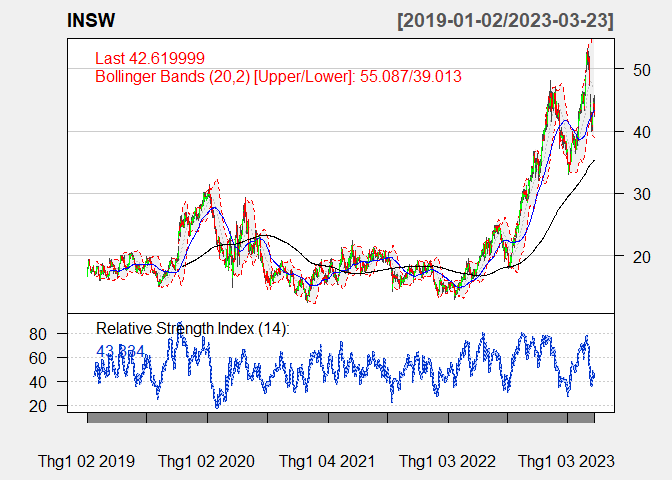
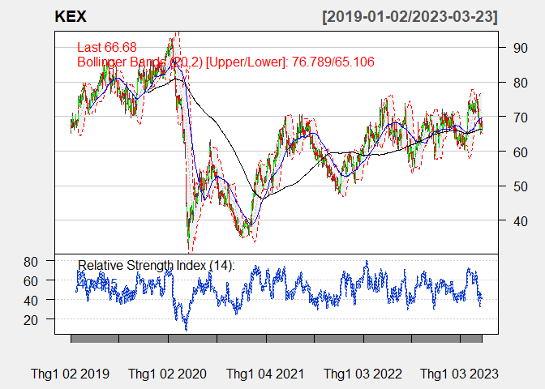
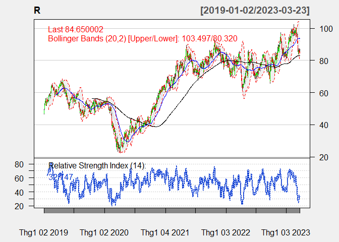
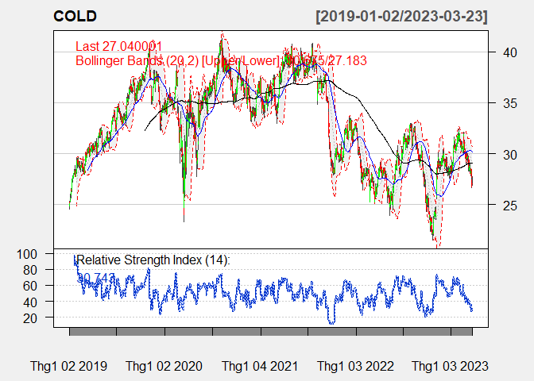
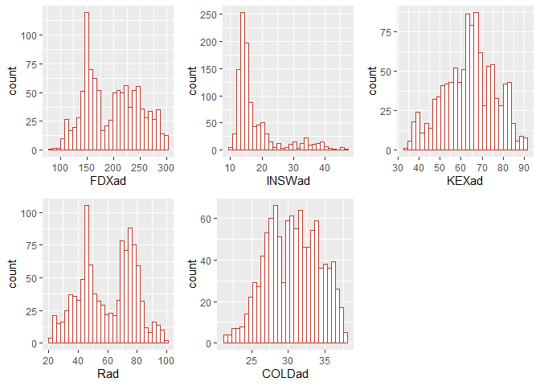

<style>
#main {
  text-align: justify;
  font-family: Sans-Serif;
}
</style>

------------------------------------------------------------------------

# A. INTRODUCTION ABOUT THE DATA

<div align="justify">

The transportation industry is responsible for moving goods and people
from one place to another, and it plays a vital role in the global
economy. We take the stocks from the website [Money
CNN](https://money.cnn.com/data/sectors/transportation/), this website
provides information on the transportation industry, with a focus on the
sub-industry of airlines, the total number of stocks in the
transportation sector is 115 stocks.

Then, we take the transportation and warehousing stock data from [Yahoo
Finance](https://finance.yahoo.com/), using R. For the transportation
stock, there are five main sub-sectors: Air Freight/Couriers, Airlines,
Marine Shipping, Railroads and Trucking. The time-frame that we take the
stock data is from 01/01/2019 to 03/24/2023

# B. BUILDING THE PORTFOLIO

## 1 Filtering by market cap

<div align="justify">

First of all, for the method of choosing stocks, we don’t choose penny
stocks. The reason we do this is due to some recent challenges
associated with investing in low-market cap stocks. More specifically,

-   **Market Instability**: In recent times, the stock market has
    experienced significant volatility due to a variety of factors,
    including geopolitical tensions, economic uncertainty, and
    pandemic-related disruptions.

-   **Social Media Influence**: The rise of social media has created new
    challenges for investors, as online platforms can quickly spread
    rumors, misinformation, and hype surrounding penny stocks. This can
    lead to inflated share prices and increased volatility, as well as a
    heightened risk of fraud and scams.

-   **Pandemic-Related Disruptions**: The COVID-19 pandemic has caused
    significant disruptions to the economy, affecting many small and
    mid-sized companies that often make up the penny stock market. As a
    result, some penny stocks may be more vulnerable to bankruptcy or
    other financial difficulties.

-   **Economic Uncertainty**: The global economy has faced significant
    challenges in recent times, with ongoing uncertainty surrounding
    issues such as trade policy, inflation, and interest rates. This has
    created a challenging environment for investors, particularly those
    who are investing in riskier assets such as penny stocks.

Overall, investing in penny stocks can be challenging, particularly in
the current economic and regulatory environment. Investors must
carefully assess the risks associated with penny stocks and conduct
thorough due diligence before making any investment decisions.

As a result, we decided to take the list of five stocks that have the
highest market capitalization in each sub sector of the transportation
industry. Choosing the top 5 market cap from each sub sector instead of
choosing directly the top 30 from the entire data in the industry is
because we want to make the portfolio more diversified.

``` r
# Sorting firms by market cap ####
afc <- read.delim('D:/quang/doc/AFC Transporting.txt', 
                       header=FALSE)
a <- read.delim('D:/quang/doc/Airline Transporting.txt', 
                  header=FALSE)
ms <- read.delim('D:/quang/doc/MS Transporting.txt', 
                  header=FALSE)
rr <- read.delim('D:/quang/doc/RR Transporting.txt', 
                  header=FALSE)
t <- read.delim('D:/quang/doc/Trucking Transporting.txt', 
                  header=FALSE)
## define custom function to convert market cap string to number
convert_market_cap <- function(x) {
  if (substr(x, nchar(x), nchar(x)) == "T") {
    return(as.numeric(substr(x, 2, nchar(x)-1)) * 1000000000000)
  } else if (substr(x, nchar(x), nchar(x)) == "B") {
    return(as.numeric(substr(x, 2, nchar(x)-1)) * 1000000000)
  } else if (substr(x, nchar(x), nchar(x)) == "M") {
    return(as.numeric(substr(x, 2, nchar(x)-1)) * 1000000)
  } else if (substr(x, nchar(x), nchar(x)) == "K") {
    return(as.numeric(substr(x, 2, nchar(x)-1)) * 1000)
  } else {
    return(NA)
  }
}
top_5_market_cap <- function(x) {
  x$V2 <- sapply(x$V2, convert_market_cap)
  x <- x[order(-x$V2), ][1:5, c("V1", "V2")]
  colnames(x) <- c("Tickers", "Market Cap")
  return(x)
}
```

``` r
top_5_market_cap(a)
```

    ##                      Tickers  Market Cap
    ## 9        DAL Delta Air Lines 20300000000
    ## 18    LUV Southwest Airlines 17600000000
    ## 4      AAL American Airlines  8900000000
    ## 2   ALK Alaska Air Group Inc  4900000000
    ## 14 JBLU JetBlue Airways Corp  2200000000

``` r
top_5_market_cap(afc)
```

    ##                                            Tickers   Market Cap
    ## 19                                         UPS UPS 134500000000
    ## 5                                        FDX FedEx  54700000000
    ## 4  EXPD Expeditors International of Washington Inc  16100000000
    ## 2                   CHRW CH Robinson Worldwide Inc  11000000000
    ## 6                               HUBG Hub Group Inc   2700000000

``` r
top_5_market_cap(ms)
```

    ##                           Tickers Market Cap
    ## 6                  KEX Kirby Corp 4000000000
    ## 5  INSW International Seaways Inc 2100000000
    ## 7                 MATX Matson Inc 2100000000
    ## 11              TDW Tidewater Inc 2000000000
    ## 1              LPG Dorian LPG Ltd  834000000

``` r
top_5_market_cap(t)
```

    ##                                         Tickers  Market Cap
    ## 17           ODFL Old Dominion Freight Line Inc 36300000000
    ## 11         JBHT J B Hunt Transport Services Inc 17200000000
    ## 12 KNX Knight-Swift Transportation Holdings Inc  8900000000
    ## 13                     LSTR Landstar System Inc  6200000000
    ## 8                         FWRD Forward Air Corp  3000000000

``` r
top_5_market_cap(rr)
```

    ##                                 Tickers   Market Cap
    ## 4                     UNP Union Pacific 115300000000
    ## 1                          CSX CSX Corp  58300000000
    ## 3                  NSC Norfolk Southern  45600000000
    ## 2                        GATX GATX Corp   3700000000
    ## 5 AWRY Allegheny and Western Railway Co      2700000

Therefore,

-   the top 5 market cap stocks in Airline are: DAL, LUV, AAL, ALK, JBLU

-   the top 5 market cap stocks in Air-Fright Courier are: UPS, FDX,
    EXPD, CHRW, HUBG

-   the top 5 market cap stocks in Marine-Shipping are: KEX, INSWL,
    MATX, TDW, LPG

-   the top 5 market cap stocks in Trucking are: ODFL, JBHT, KNX, LSTR,
    FWRD

-   the top 5 market cap stocks in Railroad are: UNP, CSX, NSC, GATX,
    AWRY

Stocks whose correlation is **less than 0.6** will be kept, to ensure
the diversity of the portfolio. In the case of stocks in highly
correlated sub-sectors, we take the stock with the highest market cap.

## 2 Filtering by correlation

### Airline Stock

the top 5 market cap stocks in Airline: ***DAL, LUV, AAL, ALK, JBLU***

``` r
symbolsA=c('DAL','LUV','AAL',
          'ALK','JBLU')

getSymbols(symbolsA, src = "yahoo", 
           from = "2019-01-01", to = "2023-03-24")
```

    ## [1] "DAL"  "LUV"  "AAL"  "ALK"  "JBLU"

``` r
dataA <- merge(DAL$DAL.Adjusted, LUV$LUV.Adjusted,AAL$AAL.Adjusted, ALK$ALK.Adjusted, 
              JBLU$JBLU.Adjusted)

chart.Correlation(dataA,
                  histogram = FALSE,
                  pch = "+")
```


After examination, these stocks are highly correlated, so we take one of
them. We will take the one with the highest market cap. ***DAL*** is
chosen

### Air Freight/ Couriers stocks testing

the top 5 market cap stocks in Air-Fright Courier are: ***UPS, FDX,
EXPD, CHRW, HUBG***

``` r
symbolsAFC=c('UPS','FDX','EXPD','CHRW','HUBG')

getSymbols(symbolsAFC, src = "yahoo", 
           from = "2019-01-01", to = "2023-03-24")
```

    ## [1] "UPS"  "FDX"  "EXPD" "CHRW" "HUBG"

``` r
dataAFC <- merge(UPS$UPS.Adjusted, FDX$FDX.Adjusted, EXPD$EXPD.Adjusted,
                 CHRW$CHRW.Adjusted, HUBG$HUBG.Adjusted)

chart.Correlation(dataAFC,
                  histogram = FALSE,
                  pch = "+")
```


Since all stocks have high correlation, only correlation between FDX and
HUBG is 0.49 smaller than 0.6. So, we take ***FDX, HUBG***.

### Marine Shipping stocks testing

The top 5 market cap stocks in Marine-Shipping: **KEX, INSWL, MATX, TDW,
LPG **

``` r
symbolsMS=c('KEX','INSW', 'MATX','TDW','LPG')

getSymbols(symbolsMS, src = "yahoo", 
           from = "2019-01-01", to = "2023-03-24")
```

    ## [1] "KEX"  "INSW" "MATX" "TDW"  "LPG"

``` r
dataMS <- merge(LPG$LPG.Adjusted,INSW$INSW.Adjusted, KEX$KEX.Adjusted, 
                MATX$MATX.Adjusted,TDW$TDW.Adjusted )

chart.Correlation(dataMS,
                  histogram = FALSE,
                  pch = "+")
```


After filtering the stocks by its correlation, only three stocks INSW,
KEX, MATX are not highly correlated. Then, stocks that we choose are
***INSW, KEX, MATX***.

### Trucking stock testing

The top 5 market cap stocks in Trucking: ***ODFL, JBHT, KNX, LSTR,
FWRD***

``` r
symbolT=c('ODFL','JBHT','KNX', 'LSTR','FWRD')

getSymbols(symbolT, src = "yahoo", 
           from = "2019-01-01", to = "2023-03-24")
```

    ## [1] "ODFL" "JBHT" "KNX"  "LSTR" "FWRD"

``` r
dataT=merge(ODFL$ODFL.Adjusted, JBHT$JBHT.Adjusted, KNX$KNX.Adjusted,
            LSTR$LSTR.Adjusted, FWRD$FWRD.Adjusted)

chart.Correlation(dataT,histogram = FALSE, pch="+")
```


All stocks in this sub sector are highly correlated. The one with the
highest market cap should be chosen so we take ***ODFL***.

### Railroad stock testing

The top 5 market cap stocks in Railroad: ***UNP, CSX, NSC, GATX,
AWRY***. However, since AWRY lacks a lot of data, we remove it from the
list.

``` r
symbolRR=c('UNP', 'CSX', 'NSC', 'GATX')
getSymbols(symbolRR, src = "yahoo", 
           from = "2019-01-01", to = "2023-03-24")
```

    ## [1] "UNP"  "CSX"  "NSC"  "GATX"

``` r
dataRR=merge(UNP$UNP.Adjusted, CSX$CSX.Adjusted, GATX$GATX.Adjusted,
                NSC$NSC.Adjusted)

chart.Correlation(dataRR, histogram = FALSE, pch = "+")
```


After filtering the stocks by its correlation, all stocks are highly
correlated, so we choose the one with highest market cap. Therefore,
***UNP*** is chosen.

### Warehousing stocks testing

``` r
symbolW=c('R','CEVA','COLD','ILPT')
getSymbols(symbolW, src = "yahoo", 
           from = "2019-01-01", to = "2023-03-24")
```

    ## [1] "R"    "CEVA" "COLD" "ILPT"

``` r
dataW=merge(R$R.Adjusted,
            CEVA$CEVA.Adjusted,COLD$COLD.Adjusted,
            ILPT$ILPT.Adjusted)

chart.Correlation(dataW, histogram = FALSE, pch="+")
```


After filtering the stocks, except for stock DPW.DE having correlation
with R and CEVA higher than 0.6, the rest stocks have weak correlations
with each other, so we can take ***R, CEVA, COLD, ILPT***.

### **Total tickers correlation testing**

``` r
g1 = merge(DAL$DAL.Adjusted,FDX$FDX.Adjusted,HUBG$HUBG.Adjusted, 
         ODFL$ODFL.Adjusted,UNP$UNP.Adjusted,
         INSW$INSW.Adjusted,KEX$KEX.Adjusted,MATX$MATX.Adjusted,
         R$R.Adjusted, CEVA$CEVA.Adjusted, COLD$COLD.Adjusted,
         ILPT$ILPT.Adjusted)

chart.Correlation(g1,histogram = FALSE, pch="+")
```


After filtering the stocks by its correlation, we remove DAL, HUBG,
ODFL, UNP, MATX, ILPT, KEX, CEVA.

Finally, we have our portfolio to optimize: ***FDX, INSW, KEX, R,
COLD***.

``` r
final_tickers =merge(FDX$FDX.Adjusted,INSW$INSW.Adjusted,KEX$KEX.Adjusted,
             R$R.Adjusted, COLD$COLD.Adjusted)

chart.Correlation(final_tickers,histogram = FALSE, pch="+")
```


> FINAL DATA: FDX, INSW, KEX, R, COLD

# C. EXPLORATORY DATA ANALYSIS

## 1. ChartSeries Analysis

***ChartSeries Explanation***

**The relative strength index (RSI)** is a momentum indicator used in
technical analysis. RSI measures the speed and magnitude of a security’s
recent price changes to evaluate overvalued or undervalued conditions in
the price of that security. The RSI is displayed as an oscillator (a
line graph) on a scale of zero to 100. The indicator was developed by J.
Welles Wilder Jr. and introduced in his seminal 1978 book, New Concepts
in Technical Trading Systems. The RSI can do more than point to
overbought and oversold securities. It can also indicate securities that
may be primed for a trend reversal or corrective pullback in price. It
can signal when to buy and sell. Traditionally, an RSI reading of 70 or
above indicates an overbought situation. A reading of 30 or below
indicates an oversold condition.

**Moving averages** are one of the core indicators in technical
analysis, and there are a variety of different versions. **SMA(Simple
Moving Average)** is the easiest moving average to construct. It is
simply the average price over the specified period. The average is
called “moving” because it is plotted on the chart bar by bar, forming a
line that moves along the chart as the average value changes.

SMAs are often used to determine trend direction. If the SMA is moving
up, the trend is up. If the SMA is moving down, the trend is down. A
200-bar SMA is common proxy for the long term trend. 50-bar SMAs are
typically used to gauge the intermediate trend. Shorter period SMAs can
be used to determine shorter term trends. SMAs are commonly used to
smooth price data and technical indicators. The longer the period of the
SMA, the smoother the result, but the more lag that is introduced
between the SMA and the source. Price crossing SMA is often used to
trigger trading signals. When prices cross above the SMA, you might want
to go long or cover short; when they cross below the SMA, you might want
to go short or exit long. SMA Crossing SMA is another common trading
signal. When a short period SMA crosses above a long period SMA, you may
want to go long. You may want to go short when the short-term SMA
crosses back below the long-term SMA

### a. FDI

``` r
chartSeries(FDX,
            theme=chartTheme('white',up.col='green',dn.col='red'),
            TA=c(addBBands(n=20,sd=2,),
                 addSMA(n=50,col="blue"),
                 addSMA(n=200,col="black"),
                 addRSI(n=14)))
```


``` r
FDXc <- FDX[,c(1:4)] # Remove Volume and Adjusted
FDXc$SMA50 <- SMA(Cl(FDXc), n = 50) #create SMA50 line
FDXc$SMA200 <- SMA(Cl(FDXc), n = 200)

dygraph(FDXc, xlab = "Date", ylab = "Price", main = "FDX Price") %>%
dySeries("FDX.Open", label = "Open", color = "#FFE15D" ) %>%
dySeries("FDX.Low", label = "Low", color = "#F49D1A") %>%
dySeries("FDX.High", label = "High", color = "#DC3535") %>%
dySeries("FDX.Close", label = "Close", color = "#B01E68") %>%
dySeries("SMA50", label = "SMA50", color = "blue") %>%
dySeries("SMA200", label = "SMA200", color = "purple") %>%
dyRangeSelector() %>%
dyCandlestick()%>%
dyCrosshair(direction = "vertical") %>%
dyHighlight(highlightCircleSize = 3, highlightSeriesBackgroundAlpha = 0.2, hideOnMouseOut = T)  %>%
dyRoller(rollPeriod = 1)
```


Through the use of the Bollinger band, we can clearly see that the FDX
stock has undergone brief periods of sharp fluctuations between 2019 and
the present. Investors who plan to hold this stock for a long time
should therefore carefully consider. If the stock experienced a narrow
Bollinger band in 2019 indicating an explosive period with fast and
significant price fluctuations, then the candlestick chart line has
documented the phenomenon of breaking the band in 2020. Prices increased
as a result in 2020 and 21. Going into 2022, FDX observed a downward
trend in its stock price, which peaked in the middle of the year.
However, when looking at the chart, the candlestick chart of the most
recent period has shown signs of crossing the SMA50 and SMA200 lines
above, showing the stock price is gradually increasing. The stock price
has also shown signs of recovering immediately after the bottom.

Investors should invest in the stock now because it is moving strongly
and the bullish candlestick chart has frequently been close to the upper
border of the Bollinger Band, followed by a period of the chart that was
close to the lower border of the Bollinger Band. Investors can profit
with their fixed profit variation during the oversold period, as
indicated by the Bollinger Band, which signals a cycle of overbought and
oversold conditions. In addition, the chart shows that the SMA50 line
rises and crosses the SMA200 line in the first quarter of 2023, which is
a positive sign that investors should purchase FDX stock.

### b. INSW

``` r
chartSeries(INSW,
            theme=chartTheme('white',up.col='green',dn.col='red'),
            TA=c(addBBands(n=20,sd=2,),
                 addSMA(n=50,col="blue"),
                 addSMA(n=200,col="black"),
                 addRSI(n=14)))
```



``` r
INSWc <- INSW[,c(1:4)] # Remove Volume and Adjusted
INSWc$SMA50 <- SMA(Cl(INSWc), n = 50) #create SMA50 line
INSWc$SMA200 <- SMA(Cl(INSWc), n = 200)

dygraph(INSWc, xlab = "Date", ylab = "Price", main = "INSW Price") %>%
dySeries("INSW.Open", label = "Open", color = "#FFE15D" ) %>%
dySeries("INSW.Low", label = "Low", color = "#F49D1A") %>%
dySeries("INSW.High", label = "High", color = "#DC3535") %>%
dySeries("INSW.Close", label = "Close", color = "#B01E68") %>%
dySeries("SMA50", label = "SMA50", color = "blue") %>%
dySeries("SMA200", label = "SMA200", color = "purple") %>%
dyRangeSelector() %>%
dyCandlestick()%>%
dyCrosshair(direction = "vertical") %>%
dyHighlight(highlightCircleSize = 3, highlightSeriesBackgroundAlpha = 0.2, hideOnMouseOut = T)  %>%
dyRoller(rollPeriod = 1)
```

Given that the price of the stock has been rising steadily, the INSW
stock index ticker can be regarded as a top option for investors.
Looking at the chart, we can see that the candlestick chart has a
propensity to breach the upper Bollinger Band, indicating the potential
for INSW’s stock price to increase rapidly. When the SMA50 and SMA200
lines were added, the share price of INSW stock showed a decline during
the year 2020, but it quickly bounced back in early 2021 and maintained
a steady uptrend until the present.

In addition, given that the short-term SMA is rising and crossing the
long-term SMA, it is advisable for investors to think about purchasing
INSW stocks at this time. As a result, we can say that the company is
performing well and offers a good long-term investment. When deciding
whether to invest in INSW, we should also take the RSI into
consideration.We can see from the chart that this stock’s RSI fluctuates
quite a bit. Overbought and oversold market cycles have been common in
the past and could happen again today. From there, during the stock’s
oversold period, short-term investors can fully profit with a fixed
profit margin.

### c. KEX

``` r
chartSeries(KEX,
            theme=chartTheme('white',up.col='green',dn.col='red'),
            TA=c(addBBands(n=20,sd=2,),
                 addSMA(n=50,col="blue"),
                 addSMA(n=200,col="black"),
                 addRSI(n=14)))
```



``` r
KEXc <- KEX[,c(1:4)] # Remove Volume and Adjusted
KEXc$SMA50 <- SMA(Cl(KEXc), n = 50) #create SMA50 line
KEXc$SMA200 <- SMA(Cl(KEXc), n = 200)

dygraph(KEXc, xlab = "Date", ylab = "Price", main = "KEX Price") %>%
dySeries("KEX.Open", label = "Open", color = "#FFE15D" ) %>%
dySeries("KEX.Low", label = "Low", color = "#F49D1A") %>%
dySeries("KEX.High", label = "High", color = "#DC3535") %>%
dySeries("KEX.Close", label = "Close", color = "#B01E68") %>%
dySeries("SMA50", label = "SMA50", color = "blue") %>%
dySeries("SMA200", label = "SMA200", color = "purple") %>%
dyRangeSelector() %>%
dyCandlestick()%>%
dyCrosshair(direction = "vertical") %>%
dyHighlight(highlightCircleSize = 3, highlightSeriesBackgroundAlpha = 0.2, hideOnMouseOut = T)  %>%
dyRoller(rollPeriod = 1)
```


Despite its subtle fluctuations from 2019 to the present, the stock
ticker KEX is also a stock worth investing in. The candlestick chart
crossing above the two SMA50 and SMA200 lines typically signals a
significant increase in the stock price from 2019 to the beginning of
2020. However, in the middle of 2020, as a result of the pandemic
situation and the impact of the economy, the price of KEX stock abruptly
decreased in the second half of 2020. Notably, this is the period when
the index declined.

The RSI also abruptly dropped to 7.33 in March 2020, indicating that the
stock is oversold, the price has bottomed out, and a price correction is
necessary before the price can rise once more. Because of this, the
stock’s price started to recover strongly at the beginning of 2021 and
has continued to grow steadily ever since. This is encouraging news for
investors who plan to hold onto this stock for a while. In addition,
buying KEX stock could be a wise move when in the current period, the
SMA50 rising and maintaining the trend above the SMA200 . Furthermore,
when examining the chart, we can see that the candlestick chart line
frequently crosses the border in the current period, indicating a period
of explosive price growth for the KEX stock. As a result, this is
another option worth noting for investors with immediate investment
needs because they can take into account modifying their trading in
order to generate profits for themselves.

### d. R

``` r
chartSeries(R,
            theme=chartTheme('white',up.col='green',dn.col='red'),
            TA=c(addBBands(n=20,sd=2,),
                 addSMA(n=50,col="blue"),
                 addSMA(n=200,col="black"),
                 addRSI(n=14)))
```



``` r
Ra <- R[,c(1:4)] # Remove Volume and Adjusted
Ra$SMA50 <- SMA(Cl(Ra), n = 50) #create SMA50 line
Ra$SMA200 <- SMA(Cl(Ra), n = 200)

dygraph(Ra, xlab = "Date", ylab = "Price", main = "R Price") %>%
dySeries("R.Open", label = "Open", color = "#FFE15D" ) %>%
dySeries("R.Low", label = "Low", color = "#F49D1A") %>%
dySeries("R.High", label = "High", color = "#DC3535") %>%
dySeries("R.Close", label = "Close", color = "#B01E68") %>%
dySeries("SMA50", label = "SMA50", color = "blue") %>%
dySeries("SMA200", label = "SMA200", color = "purple") %>%
dyRangeSelector() %>%
dyCandlestick()%>%
dyCrosshair(direction = "vertical") %>%
dyHighlight(highlightCircleSize = 3, highlightSeriesBackgroundAlpha = 0.2, hideOnMouseOut = T)  %>%
dyRoller(rollPeriod = 1)
```

As mentioned, SMA is the most basic tool for technical analysis of
stocks. By analyzing SMA, we can consider what time is the best for
going long or short. The behavior of an indicator is unique in all
uptrend market conditions. For the case of R price, with data collected
in a 4 year period, it is important to evaluate the SMA200 which tells
more about the long-term position of the stock. We start our evaluation
from Q4 of 2019: SMA50 remained below SMA200 in October 2019, as the
price opened at 52.19 and closed at 48.44.

SMA50 was 50.72 and SMA200 was 56.27, according to the data. In this
situation, you could take a short position to be safe. The long-term SMA
was higher than the short-term SMA at that time, and it also had a
slightly negative trend. The price point went above two SMA lines at
that precise instant. In fact, it was forecast to see a consistent
upward trend until the globe experienced COVID19 in the first quarter of
2020, which caused the price to halve in just two months. It dropped to
23.4 in March 2020 from a peak of 56.7 in January 2020. However, two SMA
lines still gave a positive signal, after that tragic period, the price
kept increasing steadily. While SMA50 plummeted, SMA200 only dropped
slightly. As a result, the price bottomed out in April 2020, the stock’s
price started to recover strongly from that to the beginning of 2021 and
has continued to grow steadily ever since. For investors who intend to
stay onto this stock for a while, this is excellent news. Also,
purchasing R stock may be a smart option given that the SMA50 line is
increasing and sustaining its trend above the SMA200 line at the moment.

As for RSI analysis, R stock is more likely to be overbought than
oversold. It is also worth noting that the overbought and oversold cycle
of R stock occurs only at its peaks, which is quite normal in the stock
market. In general, Ryder System stock is still worth investing in
because it is price stable, high value, and profitable in the long run.

### e. COLD

``` r
chartSeries(COLD,
            theme=chartTheme('white',up.col='green',dn.col='red'),
            TA=c(addBBands(n=20,sd=2,),
                 addSMA(n=50,col="blue"),
                 addSMA(n=200,col="black"),
                 addRSI(n=14)))
```



``` r
COLDa <- COLD[,c(1:4)] # Remove Volume and Adjusted
COLDa$SMA50 <- SMA(Cl(COLDa), n = 50) #create SMA50 line
COLDa$SMA200 <- SMA(Cl(COLDa), n = 200)

dygraph(COLDa, xlab = "Date", ylab = "Price", main = "COLD Price") %>%
dySeries("COLD.Open", label = "Open", color = "#FFE15D" ) %>%
dySeries("COLD.Low", label = "Low", color = "#F49D1A") %>%
dySeries("COLD.High", label = "High", color = "#DC3535") %>%
dySeries("COLD.Close", label = "Close", color = "#B01E68") %>%
dySeries("SMA50", label = "SMA50", color = "blue") %>%
dySeries("SMA200", label = "SMA200", color = "purple") %>%
dyRangeSelector() %>%
dyCandlestick()%>%
dyCrosshair(direction = "vertical") %>%
dyHighlight(highlightCircleSize = 3, highlightSeriesBackgroundAlpha = 0.2, hideOnMouseOut = T)  %>%
dyRoller(rollPeriod = 1)
```

As for the stock price of COLD, with data collected over a 4 year
period, we can tell people seem to be coming out and selling the COLD
stock. Volume based technical analysis of COLD stock is negative.
Americold Logistic Stock is giving positive returns over a short-term
period, returns for a longer term period have been negative. It can be
told by looking at SMA moving averages of Americold Logistic COLD, the
SMA 50 line remained its position below the SMA 200 for a quite long
period, from September 2021 to July 2022. Looking at the exhibition, we
can tell COLD stock prices are extremely fluctuated, it changes almost
every month.

Also, COLD stock’s RSI overbought and oversold cycles have occurred in
more oversold condition than overbought. At some point, RSI even went
below 20 in the Q4 of 2021, indicating it was oversold. The price at
that time was not even the lowest so far. However, looking at two SMA
lines, it was reasonable for COLD stockholders to go in a short
position. SMA 50 crossed far below SMA 200 with a downward trend until
mid-2022. Short-term investors can then profit fully during COLD stock’s
oversold period in 2021 because after that, the price started to recover
quite significantly before another plunge occurred. In conclusion, we
can say that Americold Logistics offers a tempting short-term
investment. However, when deciding whether to invest in COLD in the
long-run, investors should also take the RSI into consideration.

## 2. Descriptive Statistics

### a. Statistics for adjusted price

#### Overall statistics for stocks

``` r
# FDX, INSW, KEX, R, COLD
# Take adjusted price
FDXad = FDX$FDX.Adjusted;
INSWad = INSW$INSW.Adjusted;
KEXad = KEX$KEX.Adjusted;
Rad = R$R.Adjusted;
COLDad = COLD$COLD.Adjusted;
adReturnDat <- merge(FDXad, INSWad, KEXad, Rad, COLDad)
basicStats(adReturnDat)
```

    ##              FDX.Adjusted INSW.Adjusted KEX.Adjusted   R.Adjusted COLD.Adjusted
    ## nobs          1064.000000   1064.000000  1064.000000  1064.000000   1064.000000
    ## NAs              0.000000      0.000000     0.000000     0.000000      0.000000
    ## Minimum         85.427979     10.114119    34.200001    20.268118     21.613428
    ## Maximum        301.677460     46.758617    91.430000    98.329941     38.001652
    ## 1. Quartile    152.008759     13.651753    55.467500    45.400042     27.891785
    ## 3. Quartile    238.462444     19.215499    73.169998    75.446342     33.483802
    ## Mean           196.844779     18.088745    63.970395    60.093210     30.659715
    ## Median         198.502212     15.082882    64.559998    61.995004     30.707096
    ## Sum         209442.844835  19246.424563 68064.499990 63939.175225  32621.936869
    ## SE Mean          1.552998      0.226657     0.377200     0.561211      0.109942
    ## LCL Mean       193.797488     17.643999    63.230255    58.992003     30.443987
    ## UCL Mean       199.892070     18.533491    64.710535    61.194417     30.875443
    ## Variance      2566.159751     54.661254   151.385369   335.114964     12.860815
    ## Stdev           50.657277      7.393325    12.303876    18.306146      3.586198
    ## Skewness         0.140505      1.882089    -0.174411    -0.102154     -0.100085
    ## Kurtosis        -1.080046      2.675242    -0.506041    -1.057990     -0.771117

We explain the terms in the table of basicStats that are not immediately
clear:

nobs is the number of observations; Sum is the sum of all nobs
observations (hence, for example, note that Mean = Sum/nobs);

SE Mean is the standard error for the mean, which is computed as the
standard deviation (Stdev) divided by the square root of nobs;

LCL Mean and UCL Mean are the Lower and Upper Control Limits for sample
means, computed by the formulas: **LCL = Mean − 1.96 · SE and UCL = Mean
+ 1.96 · SE**

First of all, we consider 1064 observations, from the beginning of 2019
to 24/3/2023. There is no missing value here, so we can do a lot of
technical analysis easily. The share price of FDX is generally
significantly higher than that of other stocks. However, the difference
between its ceiling and floor is also very large, showing that FDX is
not a stable stock. The proof is that its standard deviation value is
the highest in the category. KEX, R, and COLD stocks with mean and
median values close to the maximum value show that the stocks in the
period 2019-2023 performed at a relatively stable level. INSW is the
opposite, but its standard deviation is very low, showing that even
though the COVID-19 epidemic, is still a very stable stock.

``` r
stat <- function(x) {
  dat = data.frame(
        CoV = sd(x) / mean(x) * 100,
        Kurtosis = kurtosis(x),
        Skewness = skewness(x))
  colnames(dat) <- c('CoV', 'Kurtosis', 'Skewness')
  return(dat)
}
FDXstat <- stat(FDXad)
INSWstat <- stat(INSWad)
KEXstat <- stat(KEXad)
Rstat <- stat(Rad)
COLDstat <- stat(COLDad)
allstat <- rbind(FDXstat, INSWstat, KEXstat, Rstat, COLDstat)
row.names(allstat) <- c('FDX', 'INSW', 'KEX', 'R', 'COLD')
allstat
```

    ##           CoV   Kurtosis   Skewness
    ## FDX  25.73463 -1.0800458  0.1405053
    ## INSW 40.87251  2.6752424  1.8820893
    ## KEX  19.23370 -0.5060414 -0.1744110
    ## R    30.46292 -1.0579900 -0.1021544
    ## COLD 11.69677 -0.7711168 -0.1000848

The CoV is a measure of the relative dispersion or volatility of a
stock’s returns. The higher the CoV, the more volatile the stock is
perceived to be. From the table, we can see that INSW has the highest
CoV (40.87251), indicating that it is the most volatile stock of the
five listed. On the other hand, COLD has the lowest CoV (11.69677),
suggesting that it is the least volatile.

Kurtosis measures the degree of outliers or extreme values in a
distribution. A positive kurtosis indicates that there are more extreme
values than in a normal distribution, while a negative kurtosis suggests
that there are fewer extreme values. From the table, we can see that
INSW has the highest kurtosis (2.6859251), indicating that it has more
extreme values than a normal distribution. FDX and R have negative
kurtosis values (-1.0764317 and -1.0543345, respectively), which
suggests that they have fewer extreme values than a normal distribution.

Skewness measures the degree of asymmetry in a distribution. A positive
skewness indicates that the tail of the distribution is longer on the
right side, while a negative skewness suggests that the tail is longer
on the left side. From the table, we can see that INSW has the highest
skewness (1.8847457), indicating that its distribution is highly skewed
to the right. KEX has a slightly negative skewness (-0.1746571), while
the other stocks have skewness values close to zero, indicating
relatively symmetrical distributions.

Overall, based on the information provided in the table, it appears that
INSW is the most volatile, has more extreme values than a normal
distribution, and is highly skewed to the right. On the other hand, COLD
is the least volatile, has fewer extreme values than a normal
distribution, and has a relatively symmetrical distribution. FDX and R
have negative kurtosis values, suggesting that they have fewer extreme
values than a normal distribution, while KEX has a slightly negative
skewness.

#### Boxplot

``` r
box1<-ggplot(FDXad, aes(FDXad)) +
  geom_boxplot(col = '#C0392B') +
  xlab("FDXad")+coord_flip() + 
  theme_bw() +
  labs(title = "FDX return boxplot") + 
  theme(axis.text = element_text(size=10,hjust=1),
        axis.title.x = element_text(size=10),
        plot.title = element_text(size=10,face="bold",hjust = 0.5),     
        legend.key.size = unit(1, 'cm'))
box2 <-ggplot(INSWad, aes(INSWad)) +
  geom_boxplot(col = '#C0392B') +
  xlab("INSWad")+coord_flip() + 
  theme_bw() +
  labs(title = "INSW return boxplot") + 
  theme(axis.text = element_text(size=10,hjust=1),
        axis.title.x = element_text(size=10),     
        plot.title = element_text(size=10,face="bold",hjust = 0.5),     
        legend.key.size = unit(1, 'cm'))
box3 <-ggplot(KEXad, aes(KEXad)) +
  geom_boxplot(col = '#C0392B') +
  xlab("KEXad")+coord_flip() + 
  theme_bw() +
  labs(title = "KEX return boxplot") + 
  theme(axis.text = element_text(size=10,hjust=1),
        axis.title.x = element_text(size=10),     
        plot.title = element_text(size=10,face="bold",hjust = 0.5),     
        legend.key.size = unit(1, 'cm'))
box4 <-ggplot(Rad, aes(Rad)) +
  geom_boxplot(col = '#C0392B') +
  xlab("Rad")+coord_flip() + 
  theme_bw() +
  labs(title = "R return boxplot") + 
  theme(axis.text = element_text(size=10,hjust=1),
        axis.title.x = element_text(size=10),     
        plot.title = element_text(size=10,face="bold",hjust = 0.5),     
        legend.key.size = unit(1, 'cm'))
box5 <-ggplot(COLDad, aes(COLDad)) +
  geom_boxplot(col = '#C0392B') +
  xlab("COLDad")+coord_flip() + 
  theme_bw() +
  labs(title = "COLD return boxplot") + 
  theme(axis.text = element_text(size=10,hjust=1),
        axis.title.x = element_text(size=10),     
        plot.title = element_text(size=10,face="bold",hjust = 0.5),     
        legend.key.size = unit(1, 'cm'))
grid.arrange(box1,box2,box3,box4,box5,ncol=5)
```


There are boxplots of these stocks, which show us the distribution of
the adjusted price of each. We can see that the mean and median value of
stock FDX, KEX, R, and COLD are equivalent, implying that the values are
very evenly distributed. However, stock INSW has a huge number of
outliers, and the mean and median value deviate closer to the minimum
value, show us that the price of this stock in the period of 2019-2023
is usually not high.

#### Histogram

``` r
# FDX, INSW, KEX, R, COLD
h1<-ggplot(FDXad, aes(x=FDXad))+
  geom_histogram(color="#C0392B", fill="white")
h2<-ggplot(INSWad, aes(x=INSWad))+
  geom_histogram(color="#C0392B", fill="white")
h3<-ggplot(KEXad, aes(x=KEXad))+
  geom_histogram(color="#C0392B", fill="white")
h4<-ggplot(Rad, aes(x=Rad))+
  geom_histogram(color="#C0392B", fill="white")
h5<-ggplot(COLDad, aes(x=COLDad))+
  geom_histogram(color="#C0392B", fill="white")

grid.arrange(h1,h2,h3,h4,h5,ncol=3, nrow=2)
```



As earlier analysis, INSW is skewed to the right and has more extreme
values than a normal distribution. The tallest clusters of bars are from
13-16, indicating this price appears most frequently. The price of this
stock is volatile, the frequency of high price from 40-50 for it is much
lower. Meanwhile, the peak in FDX histogram is 150 USD, and it is very
equally distributed from mean to high price. Only at low price the
distribution is lower, so this stocks could be a safe stock. The three
stocks KEX, R, COLD all have high distribution in high price. But KEX,
and COLD is more centralized, the price visually is closest to normal
distribution than other stocks. That is why we mentioned that risk of
KEX and COLD individually are lower.

### b. Cumulative Daily Return

``` r
# Remove first term of the series, with [-1,], 
# compute rate of benefits or returns from a given time series x
# use quantmod's function Delt(x)
fdxCum = cumsum((Delt(FDXad)*100)[-1,])
inswCum = cumsum((Delt(INSWad)*100)[-1,])
kexCum = cumsum((Delt(KEXad)*100)[-1,])
rCum = cumsum((Delt(Rad)*100)[-1,])
coldCum = cumsum((Delt(COLDad)*100)[-1,])

# Create a new data frame with columns for each variable
cum_returns_data <- merge(fdxCum, inswCum, kexCum,
          rCum, coldCum)

# since df is not a dataframe, it is an xts object 
# so we need a dataframe for these stocks to serve further purposes.
my_df <- data.frame(Date = index(cum_returns_data), 
                    Value = coredata(cum_returns_data))

colnames(my_df) <- c('date','FDX','INSW','KEX', 'R','COLD')

draw_df <- data.frame(x = my_df$date,                # Reshape data frame
                  y = c(my_df$FDX, my_df$INSW, my_df$KEX,
                        my_df$R, my_df$COLD),
                  group = c(rep("FDX", nrow(my_df)),
                            rep("INSW", nrow(my_df)),
                            rep("KEX", nrow(my_df)),
                            rep("R", nrow(my_df)),
                            rep("COLD", nrow(my_df))
                            ))

ggplot(draw_df, aes(x = x, y = y, color = group)) +
  geom_line() +
  xlab("Date") +
  ylab("% Benefits") +
  ggtitle("Cumulative Daily Returns") +
  theme_bw() +
  theme(legend.position = "top")
```


In general, stocks with cumulative returns are up compared to the
beginning of 2019. All stocks have very low returns around 2020, during
the COVID-19 pandemic outbreak. However, only 2 codes with accumulated
profits greater than 0% were COLD and INSW, the rest all dropped very
deeply. Going through that difficult period is recovery time, seeing
stocks with increased profits is very encouraging. Here we will see the
separation of the two groups very clearly. INSW and R are two stocks
with growth exceeding 100%, while the remaining stocks only have a
growth rate of around 50%. It can be seen that INSW is a very good
stock, less affected by the pandemic and even growing strongly in the
post-COVID 19 period. R is also a very interesting stock, as its growth
bottomed out in early 2020 but has since rebounded strongly and has
grown beyond 100% by early 2023. We’ll be paying a lot of attention with
these two stocks in our portfolio.

# D. PORTFOLIO OPTIMIZATION

In this section we will calculate the different cases of the portfolio.
Here we only consider the case of investment, not counting the cases of
selling off stocks. Therefore, the weight of each stock in the portfolio
will be in the range from 0 to 1. After calculating the results, we will
focus on 3 important indicators: risk, profit and weight. We have the
formula:

**E(p)** = **W1** \* **R1** + **W2** \* **R2** +…+ **Wn** \* **Rn**

The expected return can be calculated with a product of potential
outcomes (returns which is represented by **r**) by the weights of each
asset in the portfolio (represented by **w**), and after that
calculating the sum of those results. The return and risk of the
portfolio are the “mean” and “Cov” part respectively. Risk budgeting is
a type of portfolio allocation in which the risk of a portfolio is
distributed among different asset classes with the goal of maximizing
the total return of the portfolio while keep total portfolio risk to a
minimum. The weighted return is the expected return of each stock in a
particular case. All of them will be represented by a pie chart below
the results.

We make a table consist of daily returns of each stock (FDX, INSW, KEX,
R & COLD) within the time period we present above. And then we calculate
various portfolios algorithm below to explore many options for investors
to choose from while all minimize the risks in different ways

## 1. Feasible Portfolio - EQUAL WEIGHTS PORTFOLIO

A feasible portfolio is an ‘existing’ portfolio described by the
settings of the portfolio specification. ‘Existing’ means that the
portfolio was specified by its parameters in such a way that in a risk
versus return plot the portfolio has a solution and is part of the
feasible set (including the efficient frontier and the minimum variance
locus). In this case, we calculate with equally weighted stocks.

``` r
fdx= periodReturn(FDX,period="daily",type="log")
insw= periodReturn(INSW,period="daily",type="log")
kex= periodReturn(KEX,period="daily",type="log")
r= periodReturn(R,period="daily",type="log")
cold= periodReturn(COLD,period="daily",type="log")

dailyreturn_dat <- merge(fdx, insw, kex, r, cold)
colnames(dailyreturn_dat) <- c('FDX','INSW','KEX', 'R','COLD')

head(dailyreturn_dat)
```

    ##                     FDX         INSW           KEX            R         COLD
    ## 2019-01-02  0.029034385  0.055763631  0.0288101130 0.0348133541 -0.014342915
    ## 2019-01-03 -0.037459901  0.005071862 -0.0202147346 0.0010238559  0.006400022
    ## 2019-01-04  0.045029628  0.053090386  0.0101584533 0.0588170888  0.014645067
    ## 2019-01-07  0.013890808  0.018484867  0.0128481867 0.0107486830  0.008607213
    ## 2019-01-08  0.001737876 -0.007353079  0.0002933685 0.0003817713  0.029176734
    ## 2019-01-09  0.021149404 -0.029421700  0.0280608954 0.0400277663 -0.002272690

``` r
final_data <- as.timeSeries(100 * dailyreturn_dat[, 1:5])
```

For diversification, performance, simplicity and fairness, the equal
weights portfolio is the great choice for many people.

``` r
ewSpec <- portfolioSpec()
nAssets <- ncol(dailyreturn_dat)
setWeights(ewSpec) <- rep(1/nAssets, times = nAssets)

ewPortfolio <- feasiblePortfolio(
  data = final_data,
  spec = ewSpec,
  constraints = "LongOnly")

print(ewPortfolio)
```

    ## 
    ## Title:
    ##  MV Feasible Portfolio 
    ##  Estimator:         covEstimator 
    ##  Solver:            solveRquadprog 
    ##  Optimize:          minRisk 
    ##  Constraints:       LongOnly 
    ## 
    ## Portfolio Weights:
    ##  FDX INSW  KEX    R COLD 
    ##  0.2  0.2  0.2  0.2  0.2 
    ## 
    ## Covariance Risk Budgets:
    ##    FDX   INSW    KEX      R   COLD 
    ## 0.1893 0.2343 0.2316 0.2255 0.1194 
    ## 
    ## Target Returns and Risks:
    ##   mean    Cov   CVaR    VaR 
    ## 0.0359 1.8754 4.2693 2.8368 
    ## 
    ## Description:
    ##  Tue Sep 19 18:28:49 2023 by user: DELL

The output first reports the settings, then the portfolio weights, then
the covariance risk budgets, and finally the target returns and risks.
This includes the portfolio mean, and several portfolio risk measures,
including the variance computed from the covariance matrix, the
conditional value-at-risk, and the value-at-risk.

The portfolio has the target return is 0.0359 and risk is 1.8754. We
will see the weight, profit of each stock contributed to the portfolio
and risk of each shares clearly in the following pie chart:

``` r
nf <- layout( matrix(c(1,2,3), ncol=3) )
col <- divPalette(ncol(final_data), "RdBu")
weightsPie(ewPortfolio, radius = 0.7, col = col)
mtext(text = "Equally Weighted MV Portfolio", side = 3, line = 1.5,
font = 2, cex = 0.7, adj = 0)

weightedReturnsPie(ewPortfolio, radius = 0.7, col = col)
mtext(text = "Equally Weighted MV Portfolio Return", side = 3, line = 1.5,
font = 2, cex = 0.7, adj = 0)

covRiskBudgetsPie(ewPortfolio, radius = 0.7, col = col)
mtext(text = "Equally Weighted MV Portfolio Cov Risk", side = 3, line = 1.5,
font = 2, cex = 0.7, adj = 0)
```


The stock INSW has the highest return almost twice as high as the 2nd
most profitable stock, R with 1.1%, while the smallest is KEX with 0%.
However, INSW is the highest risk stock with covariance risk budgets
equal 23.4%, followed by KEX stock with a risk of 23.2%. The lowest risk
stock is COLD, which is almost half of INSW(11.9%)

## 2. MINIMUM RISK EFFICIENT PORTFOLIO

``` r
minriskSpec <- portfolioSpec()
# targetReturn <- 0.1
targetReturn <- getTargetReturn(ewPortfolio@portfolio)["mean"]
setTargetReturn(minriskSpec) <- targetReturn

minriskPortfolio <- efficientPortfolio(
data = final_data,
spec = minriskSpec,
constraints = "LongOnly")

print(minriskPortfolio)
```

    ## 
    ## Title:
    ##  MV Efficient Portfolio 
    ##  Estimator:         covEstimator 
    ##  Solver:            solveRquadprog 
    ##  Optimize:          minRisk 
    ##  Constraints:       LongOnly 
    ## 
    ## Portfolio Weights:
    ##    FDX   INSW    KEX      R   COLD 
    ## 0.1932 0.2132 0.0000 0.1590 0.4347 
    ## 
    ## Covariance Risk Budgets:
    ##    FDX   INSW    KEX      R   COLD 
    ## 0.1881 0.2582 0.0000 0.1714 0.3823 
    ## 
    ## Target Returns and Risks:
    ##   mean    Cov   CVaR    VaR 
    ## 0.0359 1.7318 3.8857 2.5568 
    ## 
    ## Description:
    ##  Tue Sep 19 18:28:49 2023 by user: DELL

A minimum risk efficient portfolio is a portfolio with the lowest risk
for a given target return. We calculate the efficient mean-variance
portfolio with the same target return as the equal weights portfolio,
but with the lowest possible risk.

``` r
nf <- layout( matrix(c(1,2,3), ncol=3) )
col <- qualiPalette(ncol(final_data), "Dark2")
weightsPie(minriskPortfolio, radius = 0.7, col = col)
mtext(text = "Minimal Risk MV Portfolio", side = 3, line = 1.5,
font = 2, cex = 0.7, adj = 0)

weightedReturnsPie(minriskPortfolio, radius = 0.7, col = col)
mtext(text = "Minimal Risk MV Portfolio", side = 3, line = 1.5,
font = 2, cex = 0.7, adj = 0)

covRiskBudgetsPie(minriskPortfolio, radius = 0.7, col = col)
mtext(text = "Minimal Risk MV Portfolio", side = 3, line = 1.5,
font = 2, cex = 0.7, adj = 0)
```


VaR = 2.556, this minRisk portfolio definitely minimize the risk of the
portfolio, even low risk than equalWeight portfolio.

With highest return belongs to INSW (+1.9%), and the lowest by
COLD(+0.3%). However two stocks are offset by their weights with COLD,
the highest weight (+43.5%) and INSW, not so low (+21.3%). In risk
budget section, COLD contributes the most risk(+38.2%) while the lowest
risk seems to be R(+17.1%)

## 3. GLOBAL MINIMUM VARIANCE PORTFOLIO

The global minimum variance portfolio is the efficient portfolio with
the lowest possible risk. The global minimum variance point is thus the
point which separates the efficient frontier from the minimum variance
locus. Internally, the global minimum mean-variance portfolio is
calculated by minimizing the efficient portfolio with respect to the
target risk. This is a quadratic optimization problem with linear
constraints

``` r
minVarSpec <- portfolioSpec()
minVarPortfolio <- minvariancePortfolio(
  data = final_data,
  spec = minVarSpec,
  constraints = "LongOnly")
print(minVarPortfolio)
```

    ## 
    ## Title:
    ##  MV Minimum Variance Portfolio 
    ##  Estimator:         covEstimator 
    ##  Solver:            solveRquadprog 
    ##  Optimize:          minRisk 
    ##  Constraints:       LongOnly 
    ## 
    ## Portfolio Weights:
    ##    FDX   INSW    KEX      R   COLD 
    ## 0.2008 0.1342 0.0610 0.0834 0.5205 
    ## 
    ## Covariance Risk Budgets:
    ##    FDX   INSW    KEX      R   COLD 
    ## 0.2008 0.1342 0.0610 0.0834 0.5205 
    ## 
    ## Target Returns and Risks:
    ##   mean    Cov   CVaR    VaR 
    ## 0.0256 1.7011 3.8952 2.3737 
    ## 
    ## Description:
    ##  Tue Sep 19 18:28:49 2023 by user: DELL

The portfolio target return in this case is 0.0256, while the risks is
1.7011. The pie chart below will show us more clearly about the weight,
return of each stock contributed to the portfolio and risk of the
portfolio.

``` r
nf <- layout( matrix(c(1,2,3), ncol=3) )
# RdPu
col <- seqPalette(ncol(final_data), "RdPu")
weightsPie(minVarPortfolio, box = FALSE, col = col)
mtext(text = "Minimum Variance MV Portfolio", side = 3,
line = 1.5, font = 2, cex = 0.7, adj = 0)

weightedReturnsPie(minVarPortfolio, box = FALSE, col = col)
mtext(text = "Global Minimum Variance MV Portfolio", side = 3,
line = 1.5, font = 2, cex = 0.7, adj = 0)

covRiskBudgetsPie(minVarPortfolio, box = FALSE, col = col)
mtext(text = "Global Minimum Variance MV Portfolio", side = 3,
line = 1.5, font = 2, cex = 0.7, adj = 0)
```


It is easy to see that COLD shares account for the highest proportion in
the portfolio (52.5%), the lowest is KEX stock with 6.1%. However, in
terms of returns, INSW is the best carrier with 1.2%, while the group
with the lowest return is COLD and KEX with 0.3% and 0% respectively.
Similar to the weighted chart, the risk chart continues to show that
COLD is the most risky stock with 52.5%, and the lowest is still KEX
with only 6.1%.

## 4. TANGENCY PORTFOLIO

We need the risk free rate to calculate in this portfolio. Researching
shows that the interest for the US treasury bond in 10 years is 3.48%.
Therefore, we take the risk free rate at 3.48%

The tangency portfolio is calculated by minimizing the Sharpe Ratio for
a given risk-free rate. The Sharpe ratio is the ratio of the target
return lowered by the risk-free rate and the covariance risk. We need
the risk free rate to calculate in this portfolio. Researching shows
that the interest for the US treasury bond in 10 years is 3.48%.
Therefore, we take the risk free rate at 3.48%

``` r
tgSpec <- portfolioSpec()
setRiskFreeRate(tgSpec) <- 0.0348

tgPortfolio <- tangencyPortfolio(
  data = final_data,
  spec = tgSpec,
  constraints = "LongOnly")
print(tgPortfolio)
```

    ## 
    ## Title:
    ##  MV Tangency Portfolio 
    ##  Estimator:         covEstimator 
    ##  Solver:            solveRquadprog 
    ##  Optimize:          minRisk 
    ##  Constraints:       LongOnly 
    ## 
    ## Portfolio Weights:
    ##    FDX   INSW    KEX      R   COLD 
    ## 0.0000 0.7839 0.0000 0.2161 0.0000 
    ## 
    ## Covariance Risk Budgets:
    ##    FDX   INSW    KEX      R   COLD 
    ## 0.0000 0.9049 0.0000 0.0951 0.0000 
    ## 
    ## Target Returns and Risks:
    ##   mean    Cov   CVaR    VaR 
    ## 0.0807 2.8615 6.3509 4.4272 
    ## 
    ## Description:
    ##  Tue Sep 19 18:28:49 2023 by user: DELL

We can see that compared to other cases, Tangency portfolio has the
highest return at 0.0807, but also highest risk (2.8615). The weights as
well as the risk of each stock are shown in the pie charts below:

``` r
nf <- layout( matrix(c(1,2,3), ncol=3) )
col <- seqPalette(ncol(final_data), "RdPu")
weightsPie(tgPortfolio, box = FALSE, col = col)
mtext(text = "Tangency MV Portfolio", side = 3, line = 1.5,
font = 2, cex = 0.7, adj = 0)

weightedReturnsPie(tgPortfolio, box = FALSE, col = col)
mtext(text = "Tangency MV Portfolio", side = 3, line = 1.5,
font = 2, cex = 0.7, adj = 0)

covRiskBudgetsPie(tgPortfolio, box = FALSE, col = col)
mtext(text = "Tangency MV Portfolio", side = 3, line = 1.5,
font = 2, cex = 0.7, adj = 0)
```


Surprisingly, there are 3 stocks without weight, of which INSW has the
highest weight, accounting for more than 3/4 of the total portfolio,
followed by R shares with 21.6%. This is also understandable when INSW’s
profit which contributed to the portfolio is very high (6.9%), nearly 6
times higher than R. Therefore, the risk that INSW brings is also very
large, 90.5%, almost 10 times higher than R.

## 5. PORTFOLIO FRONTIER

Things we need to take into consideraton about efficient frontier The
efficient frontier is the idea of how investors aim to create a
portfolio that maximizes expected returns based on a specific level of
risk. It helps investors understand the potential risks and returns in
their portfolios and analyze how they compare to the optimal set of
portfolios that are considered to be efficient. Doing so helps investors
to change their investing strategies by understanding the level of risk
that resides in each portfolio.

It should be noted that there is no single efficient frontier for
everyone. Each one is different because it depends on multiple factors.
Such as the number of stocks in the portfolio, the industry of the
stocks, and the degree of the investor’s risk tolerance.

The efficient frontier may not accurately portray realistic situations.
For example, it assumes that all investors think rationally and avoid
risks, fluctuations in market prices independent from the number of
investors, and enjoy equal access to borrow money at a risk-free
interest rate.

Such assumptions are not always true in real world when some investors
make irrational decisions, and some investors are high risk-takers. Not
all investors obtain equal access to borrowing money as well. And stock
prices flunctuate due to investors behavior.

Additionally, it assumes that asset returns result in a normal
distribution. However, in reality, asset returns often do not follow a
normal distribution, as it often varies three standard deviations away
from the mean.

``` r
frontierSpec <- portfolioSpec()

setNFrontierPoints(frontierSpec) <- 25
longFrontier <- portfolioFrontier(final_data, frontierSpec)
tailoredFrontierPlot(object = longFrontier,
                     mText = "MV Portfolio - LongOnly Constraints",
                      risk = "Cov")
```


Red dot - MV Minimum Variance Portfolio Grey square - MV Feasible
Portfolio, EqualWeight Blue dot - MV Tangency Portfolio

There are multiple portfolios on the graph ranging by grey dots If the
portfolio contains only 1 stock, they are also represented by
independent colored circle. If that scenario ever happen, INSW will be
the stock with highest daily return(\~9%) and highest risk(\~3,5) while
COLD will be the least risk stock(\~2) but the lowest daily
return(\~0.5%).

If you can take risks at your own cost, you can choose MV Tangency
Portfolio (\~7.5% daily return) and 2.5 risk Or if you don’t want high
risk and have some of more optimal plan you can take MV Minimum Variance
Portfolio or MV Feasible Portfolio because both have sustainable risk
and return

# E. CONCLUSION

The longest process of this whole sector analysis is to exclude stocks
with high correlation with each other. In the end we got FDX, INSW, KEX,
R & COLD to explore multiple portfolio options from the lowest risk
portfolio to more high return options.

Since our group chose some of the best stocks with high market
capitalization at the most active stock page, then risk would not be
soaring high. Unlike other high return, high risk stocks, if those
stocks experience market recession, their firm is not doing well or
external forces such as disaster, pandemic especially covid-19,etc some
firms will lose its foot in the industry and cancel their stocks in the
public, most of the investors will get their money back but the
opportunity costs would be high since they can be investing other more
secure stocks that would fed them returns.

After taking some real world scenarios into account, we chose MV
Tangency Portfolio with the target return of \~0.075 daily and the risk
level of \~2.5 which is acceptable since on average, many independent
stocks will have a higher risk than the portfolio which indicates this
portfolio is great with high level of return
