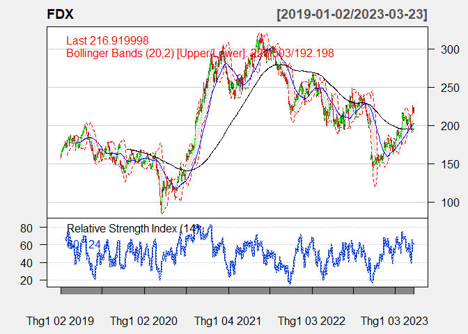

<style>
#main {
  text-align: justify;
  font-family: Sans-Serif;
}
</style>

------------------------------------------------------------------------

# A. INTRODUCTION ABOUT THE DATA

<div align="justify">

The transportation industry is responsible for moving goods and people
from one place to another, and it plays a vital role in the global
economy. We take the stocks from the website [Money
CNN](https://money.cnn.com/data/sectors/transportation/), this website
provides information on the transportation industry, with a focus on the
sub-industry of airlines, the total number of stocks in the
transportation sector is 115 stocks.

Then, we take the transportation and warehousing stock data from [Yahoo
Finance](https://finance.yahoo.com/), using R. For the transportation
stock, there are five main sub-sectors: Air Freight/Couriers, Airlines,
Marine Shipping, Railroads and Trucking. The time-frame that we take the
stock data is from 01/01/2019 to 03/24/2023

# B. BUILDING THE PORTFOLIO

## 1 Filtering by market cap

<div align="justify">

First of all, for the method of choosing stocks, we don’t choose penny
stocks. The reason we do this is due to some recent challenges
associated with investing in low-market cap stocks. More specifically,

-   **Market Instability**: In recent times, the stock market has
    experienced significant volatility due to a variety of factors,
    including geopolitical tensions, economic uncertainty, and
    pandemic-related disruptions.

-   **Social Media Influence**: The rise of social media has created new
    challenges for investors, as online platforms can quickly spread
    rumors, misinformation, and hype surrounding penny stocks. This can
    lead to inflated share prices and increased volatility, as well as a
    heightened risk of fraud and scams.

-   **Pandemic-Related Disruptions**: The COVID-19 pandemic has caused
    significant disruptions to the economy, affecting many small and
    mid-sized companies that often make up the penny stock market. As a
    result, some penny stocks may be more vulnerable to bankruptcy or
    other financial difficulties.

-   **Economic Uncertainty**: The global economy has faced significant
    challenges in recent times, with ongoing uncertainty surrounding
    issues such as trade policy, inflation, and interest rates. This has
    created a challenging environment for investors, particularly those
    who are investing in riskier assets such as penny stocks.

Overall, investing in penny stocks can be challenging, particularly in
the current economic and regulatory environment. Investors must
carefully assess the risks associated with penny stocks and conduct
thorough due diligence before making any investment decisions.

As a result, we decided to take the list of five stocks that have the
highest market capitalization in each sub sector of the transportation
industry. Choosing the top 5 market cap from each sub sector instead of
choosing directly the top 30 from the entire data in the industry is
because we want to make the portfolio more diversified.

``` r
# Sorting firms by market cap ####
afc <- read.delim('D:/quang/doc/AFC Transporting.txt', 
                       header=FALSE)
a <- read.delim('D:/quang/doc/Airline Transporting.txt', 
                  header=FALSE)
ms <- read.delim('D:/quang/doc/MS Transporting.txt', 
                  header=FALSE)
rr <- read.delim('D:/quang/doc/RR Transporting.txt', 
                  header=FALSE)
t <- read.delim('D:/quang/doc/Trucking Transporting.txt', 
                  header=FALSE)
## define custom function to convert market cap string to number
convert_market_cap <- function(x) {
  if (substr(x, nchar(x), nchar(x)) == "T") {
    return(as.numeric(substr(x, 2, nchar(x)-1)) * 1000000000000)
  } else if (substr(x, nchar(x), nchar(x)) == "B") {
    return(as.numeric(substr(x, 2, nchar(x)-1)) * 1000000000)
  } else if (substr(x, nchar(x), nchar(x)) == "M") {
    return(as.numeric(substr(x, 2, nchar(x)-1)) * 1000000)
  } else if (substr(x, nchar(x), nchar(x)) == "K") {
    return(as.numeric(substr(x, 2, nchar(x)-1)) * 1000)
  } else {
    return(NA)
  }
}
top_5_market_cap <- function(x) {
  x$V2 <- sapply(x$V2, convert_market_cap)
  x <- x[order(-x$V2), ][1:5, c("V1", "V2")]
  colnames(x) <- c("Tickers", "Market Cap")
  return(x)
}
```

``` r
top_5_market_cap(a)
```

    ##                      Tickers  Market Cap
    ## 9        DAL Delta Air Lines 20300000000
    ## 18    LUV Southwest Airlines 17600000000
    ## 4      AAL American Airlines  8900000000
    ## 2   ALK Alaska Air Group Inc  4900000000
    ## 14 JBLU JetBlue Airways Corp  2200000000

``` r
top_5_market_cap(afc)
```

    ##                                            Tickers   Market Cap
    ## 19                                         UPS UPS 134500000000
    ## 5                                        FDX FedEx  54700000000
    ## 4  EXPD Expeditors International of Washington Inc  16100000000
    ## 2                   CHRW CH Robinson Worldwide Inc  11000000000
    ## 6                               HUBG Hub Group Inc   2700000000

``` r
top_5_market_cap(ms)
```

    ##                           Tickers Market Cap
    ## 6                  KEX Kirby Corp 4000000000
    ## 5  INSW International Seaways Inc 2100000000
    ## 7                 MATX Matson Inc 2100000000
    ## 11              TDW Tidewater Inc 2000000000
    ## 1              LPG Dorian LPG Ltd  834000000

``` r
top_5_market_cap(t)
```

    ##                                         Tickers  Market Cap
    ## 17           ODFL Old Dominion Freight Line Inc 36300000000
    ## 11         JBHT J B Hunt Transport Services Inc 17200000000
    ## 12 KNX Knight-Swift Transportation Holdings Inc  8900000000
    ## 13                     LSTR Landstar System Inc  6200000000
    ## 8                         FWRD Forward Air Corp  3000000000

``` r
top_5_market_cap(rr)
```

    ##                                 Tickers   Market Cap
    ## 4                     UNP Union Pacific 115300000000
    ## 1                          CSX CSX Corp  58300000000
    ## 3                  NSC Norfolk Southern  45600000000
    ## 2                        GATX GATX Corp   3700000000
    ## 5 AWRY Allegheny and Western Railway Co      2700000

Therefore,

-   the top 5 market cap stocks in Airline are: DAL, LUV, AAL, ALK, JBLU

-   the top 5 market cap stocks in Air-Fright Courier are: UPS, FDX,
    EXPD, CHRW, HUBG

-   the top 5 market cap stocks in Marine-Shipping are: KEX, INSWL,
    MATX, TDW, LPG

-   the top 5 market cap stocks in Trucking are: ODFL, JBHT, KNX, LSTR,
    FWRD

-   the top 5 market cap stocks in Railroad are: UNP, CSX, NSC, GATX,
    AWRY

Stocks whose correlation is **less than 0.6** will be kept, to ensure
the diversity of the portfolio. In the case of stocks in highly
correlated sub-sectors, we take the stock with the highest market cap.

## 2 Filtering by correlation

### Airline Stock

the top 5 market cap stocks in Airline: ***DAL, LUV, AAL, ALK, JBLU***

``` r
symbolsA=c('DAL','LUV','AAL',
          'ALK','JBLU')

getSymbols(symbolsA, src = "yahoo", 
           from = "2019-01-01", to = "2023-03-24")
```

    ## [1] "DAL"  "LUV"  "AAL"  "ALK"  "JBLU"

``` r
dataA <- merge(DAL$DAL.Adjusted, LUV$LUV.Adjusted,AAL$AAL.Adjusted, ALK$ALK.Adjusted, 
              JBLU$JBLU.Adjusted)

chart.Correlation(dataA,
                  histogram = FALSE,
                  pch = "+")
```


After examination, these stocks are highly correlated, so we take one of
them. We will take the one with the highest market cap. ***DAL*** is
chosen

### Air Freight/ Couriers stocks testing

the top 5 market cap stocks in Air-Fright Courier are: ***UPS, FDX,
EXPD, CHRW, HUBG***

``` r
symbolsAFC=c('UPS','FDX','EXPD','CHRW','HUBG')

getSymbols(symbolsAFC, src = "yahoo", 
           from = "2019-01-01", to = "2023-03-24")
```

    ## [1] "UPS"  "FDX"  "EXPD" "CHRW" "HUBG"

``` r
dataAFC <- merge(UPS$UPS.Adjusted, FDX$FDX.Adjusted, EXPD$EXPD.Adjusted,
                 CHRW$CHRW.Adjusted, HUBG$HUBG.Adjusted)

chart.Correlation(dataAFC,
                  histogram = FALSE,
                  pch = "+")
```


Since all stocks have high correlation, only correlation between FDX and
HUBG is 0.49 smaller than 0.6. So, we take ***FDX, HUBG***.

### Marine Shipping stocks testing

The top 5 market cap stocks in Marine-Shipping: **KEX, INSWL, MATX, TDW,
LPG **

``` r
symbolsMS=c('KEX','INSW', 'MATX','TDW','LPG')

getSymbols(symbolsMS, src = "yahoo", 
           from = "2019-01-01", to = "2023-03-24")
```

    ## [1] "KEX"  "INSW" "MATX" "TDW"  "LPG"

``` r
dataMS <- merge(LPG$LPG.Adjusted,INSW$INSW.Adjusted, KEX$KEX.Adjusted, 
                MATX$MATX.Adjusted,TDW$TDW.Adjusted )

chart.Correlation(dataMS,
                  histogram = FALSE,
                  pch = "+")
```


After filtering the stocks by its correlation, only three stocks INSW,
KEX, MATX are not highly correlated. Then, stocks that we choose are
***INSW, KEX, MATX***.

### Trucking stock testing

The top 5 market cap stocks in Trucking: ***ODFL, JBHT, KNX, LSTR,
FWRD***

``` r
symbolT=c('ODFL','JBHT','KNX', 'LSTR','FWRD')

getSymbols(symbolT, src = "yahoo", 
           from = "2019-01-01", to = "2023-03-24")
```

    ## [1] "ODFL" "JBHT" "KNX"  "LSTR" "FWRD"

``` r
dataT=merge(ODFL$ODFL.Adjusted, JBHT$JBHT.Adjusted, KNX$KNX.Adjusted,
            LSTR$LSTR.Adjusted, FWRD$FWRD.Adjusted)

chart.Correlation(dataT,histogram = FALSE, pch="+")
```


All stocks in this sub sector are highly correlated. The one with the
highest market cap should be chosen so we take ***ODFL***.

### Railroad stock testing

The top 5 market cap stocks in Railroad: ***UNP, CSX, NSC, GATX,
AWRY***. However, since AWRY lacks a lot of data, we remove it from the
list.

``` r
symbolRR=c('UNP', 'CSX', 'NSC', 'GATX')
getSymbols(symbolRR, src = "yahoo", 
           from = "2019-01-01", to = "2023-03-24")
```

    ## [1] "UNP"  "CSX"  "NSC"  "GATX"

``` r
dataRR=merge(UNP$UNP.Adjusted, CSX$CSX.Adjusted, GATX$GATX.Adjusted,
                NSC$NSC.Adjusted)

chart.Correlation(dataRR, histogram = FALSE, pch = "+")
```


After filtering the stocks by its correlation, all stocks are highly
correlated, so we choose the one with highest market cap. Therefore,
***UNP*** is chosen.

### Warehousing stocks testing

``` r
symbolW=c('R','CEVA','COLD','ILPT')
getSymbols(symbolW, src = "yahoo", 
           from = "2019-01-01", to = "2023-03-24")
```

    ## [1] "R"    "CEVA" "COLD" "ILPT"

``` r
dataW=merge(R$R.Adjusted,
            CEVA$CEVA.Adjusted,COLD$COLD.Adjusted,
            ILPT$ILPT.Adjusted)

chart.Correlation(dataW, histogram = FALSE, pch="+")
```


After filtering the stocks, except for stock DPW.DE having correlation
with R and CEVA higher than 0.6, the rest stocks have weak correlations
with each other, so we can take ***R, CEVA, COLD, ILPT***.

### **Total tickers correlation testing**

``` r
g1 = merge(DAL$DAL.Adjusted,FDX$FDX.Adjusted,HUBG$HUBG.Adjusted, 
         ODFL$ODFL.Adjusted,UNP$UNP.Adjusted,
         INSW$INSW.Adjusted,KEX$KEX.Adjusted,MATX$MATX.Adjusted,
         R$R.Adjusted, CEVA$CEVA.Adjusted, COLD$COLD.Adjusted,
         ILPT$ILPT.Adjusted)

chart.Correlation(g1,histogram = FALSE, pch="+")
```


After filtering the stocks by its correlation, we remove DAL, HUBG,
ODFL, UNP, MATX, ILPT, KEX, CEVA.

Finally, we have our portfolio to optimize: ***FDX, INSW, KEX, R,
COLD***.

``` r
final_tickers =merge(FDX$FDX.Adjusted,INSW$INSW.Adjusted,KEX$KEX.Adjusted,
             R$R.Adjusted, COLD$COLD.Adjusted)

chart.Correlation(final_tickers,histogram = FALSE, pch="+")
```


> FINAL DATA: FDX, INSW, KEX, R, COLD

# C. EXPLORATORY DATA ANALYSIS

## 1. ChartSeries Analysis

***ChartSeries Explanation***

**The relative strength index (RSI)** is a momentum indicator used in
technical analysis. RSI measures the speed and magnitude of a security’s
recent price changes to evaluate overvalued or undervalued conditions in
the price of that security. The RSI is displayed as an oscillator (a
line graph) on a scale of zero to 100. The indicator was developed by J.
Welles Wilder Jr. and introduced in his seminal 1978 book, New Concepts
in Technical Trading Systems. The RSI can do more than point to
overbought and oversold securities. It can also indicate securities that
may be primed for a trend reversal or corrective pullback in price. It
can signal when to buy and sell. Traditionally, an RSI reading of 70 or
above indicates an overbought situation. A reading of 30 or below
indicates an oversold condition.

**Moving averages** are one of the core indicators in technical
analysis, and there are a variety of different versions. **SMA(Simple
Moving Average)** is the easiest moving average to construct. It is
simply the average price over the specified period. The average is
called “moving” because it is plotted on the chart bar by bar, forming a
line that moves along the chart as the average value changes.

SMAs are often used to determine trend direction. If the SMA is moving
up, the trend is up. If the SMA is moving down, the trend is down. A
200-bar SMA is common proxy for the long term trend. 50-bar SMAs are
typically used to gauge the intermediate trend. Shorter period SMAs can
be used to determine shorter term trends. SMAs are commonly used to
smooth price data and technical indicators. The longer the period of the
SMA, the smoother the result, but the more lag that is introduced
between the SMA and the source. Price crossing SMA is often used to
trigger trading signals. When prices cross above the SMA, you might want
to go long or cover short; when they cross below the SMA, you might want
to go short or exit long. SMA Crossing SMA is another common trading
signal. When a short period SMA crosses above a long period SMA, you may
want to go long. You may want to go short when the short-term SMA
crosses back below the long-term SMA

### a. FDI

``` r
chartSeries(FDX,
            theme=chartTheme('white',up.col='green',dn.col='red'),
            TA=c(addBBands(n=20,sd=2,),
                 addSMA(n=50,col="blue"),
                 addSMA(n=200,col="black"),
                 addRSI(n=14)))
```



``` r
FDXc <- FDX[,c(1:4)] # Remove Volume and Adjusted
FDXc$SMA50 <- SMA(Cl(FDXc), n = 50) #create SMA50 line
FDXc$SMA200 <- SMA(Cl(FDXc), n = 200)

dygraph(FDXc, xlab = "Date", ylab = "Price", main = "FDX Price") %>%
dySeries("FDX.Open", label = "Open", color = "#FFE15D" ) %>%
dySeries("FDX.Low", label = "Low", color = "#F49D1A") %>%
dySeries("FDX.High", label = "High", color = "#DC3535") %>%
dySeries("FDX.Close", label = "Close", color = "#B01E68") %>%
dySeries("SMA50", label = "SMA50", color = "blue") %>%
dySeries("SMA200", label = "SMA200", color = "purple") %>%
dyRangeSelector() %>%
dyCandlestick()%>%
dyCrosshair(direction = "vertical") %>%
dyHighlight(highlightCircleSize = 3, highlightSeriesBackgroundAlpha = 0.2, hideOnMouseOut = T)  %>%
dyRoller(rollPeriod = 1)
```

<div class="dygraphs html-widget html-fill-item-overflow-hidden html-fill-item" id="htmlwidget-07fb671a9621a47e4663" style="width:672px;height:480px;"></div>
<script type="application/json" data-for="htmlwidget-07fb671a9621a47e4663">{"x":{"attrs":{"title":"FDX Price","xlabel":"Date","ylabel":"Price","labels":["day","Open","Low","High","Close","SMA50","SMA200"],"legend":"auto","retainDateWindow":false,"axes":{"x":{"pixelsPerLabel":60}},"colors":["#FFE15D","#F49D1A","#DC3535","#B01E68","blue","purple"],"series":{"Open":{"axis":"y"},"Low":{"axis":"y"},"High":{"axis":"y"},"Close":{"axis":"y"},"SMA50":{"axis":"y"},"SMA200":{"axis":"y"}},"showRangeSelector":true,"rangeSelectorHeight":40,"rangeSelectorPlotFillColor":" #A7B1C4","rangeSelectorPlotStrokeColor":"#808FAB","interactionModel":"Dygraph.Interaction.defaultModel","highlightCircleSize":3,"highlightSeriesBackgroundAlpha":0.2,"highlightSeriesOpts":[],"hideOverlayOnMouseOut":true,"showRoller":true,"rollPeriod":1},"scale":"daily","annotations":[],"shadings":[],"events":[],"format":"date","data":[["2019-01-02T00:00:00.000Z","2019-01-03T00:00:00.000Z","2019-01-04T00:00:00.000Z","2019-01-07T00:00:00.000Z","2019-01-08T00:00:00.000Z","2019-01-09T00:00:00.000Z","2019-01-10T00:00:00.000Z","2019-01-11T00:00:00.000Z","2019-01-14T00:00:00.000Z","2019-01-15T00:00:00.000Z","2019-01-16T00:00:00.000Z","2019-01-17T00:00:00.000Z","2019-01-18T00:00:00.000Z","2019-01-22T00:00:00.000Z","2019-01-23T00:00:00.000Z","2019-01-24T00:00:00.000Z","2019-01-25T00:00:00.000Z","2019-01-28T00:00:00.000Z","2019-01-29T00:00:00.000Z","2019-01-30T00:00:00.000Z","2019-01-31T00:00:00.000Z","2019-02-01T00:00:00.000Z","2019-02-04T00:00:00.000Z","2019-02-05T00:00:00.000Z","2019-02-06T00:00:00.000Z","2019-02-07T00:00:00.000Z","2019-02-08T00:00:00.000Z","2019-02-11T00:00:00.000Z","2019-02-12T00:00:00.000Z","2019-02-13T00:00:00.000Z","2019-02-14T00:00:00.000Z","2019-02-15T00:00:00.000Z","2019-02-19T00:00:00.000Z","2019-02-20T00:00:00.000Z","2019-02-21T00:00:00.000Z","2019-02-22T00:00:00.000Z","2019-02-25T00:00:00.000Z","2019-02-26T00:00:00.000Z","2019-02-27T00:00:00.000Z","2019-02-28T00:00:00.000Z","2019-03-01T00:00:00.000Z","2019-03-04T00:00:00.000Z","2019-03-05T00:00:00.000Z","2019-03-06T00:00:00.000Z","2019-03-07T00:00:00.000Z","2019-03-08T00:00:00.000Z","2019-03-11T00:00:00.000Z","2019-03-12T00:00:00.000Z","2019-03-13T00:00:00.000Z","2019-03-14T00:00:00.000Z","2019-03-15T00:00:00.000Z","2019-03-18T00:00:00.000Z","2019-03-19T00:00:00.000Z","2019-03-20T00:00:00.000Z","2019-03-21T00:00:00.000Z","2019-03-22T00:00:00.000Z","2019-03-25T00:00:00.000Z","2019-03-26T00:00:00.000Z","2019-03-27T00:00:00.000Z","2019-03-28T00:00:00.000Z","2019-03-29T00:00:00.000Z","2019-04-01T00:00:00.000Z","2019-04-02T00:00:00.000Z","2019-04-03T00:00:00.000Z","2019-04-04T00:00:00.000Z","2019-04-05T00:00:00.000Z","2019-04-08T00:00:00.000Z","2019-04-09T00:00:00.000Z","2019-04-10T00:00:00.000Z","2019-04-11T00:00:00.000Z","2019-04-12T00:00:00.000Z","2019-04-15T00:00:00.000Z","2019-04-16T00:00:00.000Z","2019-04-17T00:00:00.000Z","2019-04-18T00:00:00.000Z","2019-04-22T00:00:00.000Z","2019-04-23T00:00:00.000Z","2019-04-24T00:00:00.000Z","2019-04-25T00:00:00.000Z","2019-04-26T00:00:00.000Z","2019-04-29T00:00:00.000Z","2019-04-30T00:00:00.000Z","2019-05-01T00:00:00.000Z","2019-05-02T00:00:00.000Z","2019-05-03T00:00:00.000Z","2019-05-06T00:00:00.000Z","2019-05-07T00:00:00.000Z","2019-05-08T00:00:00.000Z","2019-05-09T00:00:00.000Z","2019-05-10T00:00:00.000Z","2019-05-13T00:00:00.000Z","2019-05-14T00:00:00.000Z","2019-05-15T00:00:00.000Z","2019-05-16T00:00:00.000Z","2019-05-17T00:00:00.000Z","2019-05-20T00:00:00.000Z","2019-05-21T00:00:00.000Z","2019-05-22T00:00:00.000Z","2019-05-23T00:00:00.000Z","2019-05-24T00:00:00.000Z","2019-05-28T00:00:00.000Z","2019-05-29T00:00:00.000Z","2019-05-30T00:00:00.000Z","2019-05-31T00:00:00.000Z","2019-06-03T00:00:00.000Z","2019-06-04T00:00:00.000Z","2019-06-05T00:00:00.000Z","2019-06-06T00:00:00.000Z","2019-06-07T00:00:00.000Z","2019-06-10T00:00:00.000Z","2019-06-11T00:00:00.000Z","2019-06-12T00:00:00.000Z","2019-06-13T00:00:00.000Z","2019-06-14T00:00:00.000Z","2019-06-17T00:00:00.000Z","2019-06-18T00:00:00.000Z","2019-06-19T00:00:00.000Z","2019-06-20T00:00:00.000Z","2019-06-21T00:00:00.000Z","2019-06-24T00:00:00.000Z","2019-06-25T00:00:00.000Z","2019-06-26T00:00:00.000Z","2019-06-27T00:00:00.000Z","2019-06-28T00:00:00.000Z","2019-07-01T00:00:00.000Z","2019-07-02T00:00:00.000Z","2019-07-03T00:00:00.000Z","2019-07-05T00:00:00.000Z","2019-07-08T00:00:00.000Z","2019-07-09T00:00:00.000Z","2019-07-10T00:00:00.000Z","2019-07-11T00:00:00.000Z","2019-07-12T00:00:00.000Z","2019-07-15T00:00:00.000Z","2019-07-16T00:00:00.000Z","2019-07-17T00:00:00.000Z","2019-07-18T00:00:00.000Z","2019-07-19T00:00:00.000Z","2019-07-22T00:00:00.000Z","2019-07-23T00:00:00.000Z","2019-07-24T00:00:00.000Z","2019-07-25T00:00:00.000Z","2019-07-26T00:00:00.000Z","2019-07-29T00:00:00.000Z","2019-07-30T00:00:00.000Z","2019-07-31T00:00:00.000Z","2019-08-01T00:00:00.000Z","2019-08-02T00:00:00.000Z","2019-08-05T00:00:00.000Z","2019-08-06T00:00:00.000Z","2019-08-07T00:00:00.000Z","2019-08-08T00:00:00.000Z","2019-08-09T00:00:00.000Z","2019-08-12T00:00:00.000Z","2019-08-13T00:00:00.000Z","2019-08-14T00:00:00.000Z","2019-08-15T00:00:00.000Z","2019-08-16T00:00:00.000Z","2019-08-19T00:00:00.000Z","2019-08-20T00:00:00.000Z","2019-08-21T00:00:00.000Z","2019-08-22T00:00:00.000Z","2019-08-23T00:00:00.000Z","2019-08-26T00:00:00.000Z","2019-08-27T00:00:00.000Z","2019-08-28T00:00:00.000Z","2019-08-29T00:00:00.000Z","2019-08-30T00:00:00.000Z","2019-09-03T00:00:00.000Z","2019-09-04T00:00:00.000Z","2019-09-05T00:00:00.000Z","2019-09-06T00:00:00.000Z","2019-09-09T00:00:00.000Z","2019-09-10T00:00:00.000Z","2019-09-11T00:00:00.000Z","2019-09-12T00:00:00.000Z","2019-09-13T00:00:00.000Z","2019-09-16T00:00:00.000Z","2019-09-17T00:00:00.000Z","2019-09-18T00:00:00.000Z","2019-09-19T00:00:00.000Z","2019-09-20T00:00:00.000Z","2019-09-23T00:00:00.000Z","2019-09-24T00:00:00.000Z","2019-09-25T00:00:00.000Z","2019-09-26T00:00:00.000Z","2019-09-27T00:00:00.000Z","2019-09-30T00:00:00.000Z","2019-10-01T00:00:00.000Z","2019-10-02T00:00:00.000Z","2019-10-03T00:00:00.000Z","2019-10-04T00:00:00.000Z","2019-10-07T00:00:00.000Z","2019-10-08T00:00:00.000Z","2019-10-09T00:00:00.000Z","2019-10-10T00:00:00.000Z","2019-10-11T00:00:00.000Z","2019-10-14T00:00:00.000Z","2019-10-15T00:00:00.000Z","2019-10-16T00:00:00.000Z","2019-10-17T00:00:00.000Z","2019-10-18T00:00:00.000Z","2019-10-21T00:00:00.000Z","2019-10-22T00:00:00.000Z","2019-10-23T00:00:00.000Z","2019-10-24T00:00:00.000Z","2019-10-25T00:00:00.000Z","2019-10-28T00:00:00.000Z","2019-10-29T00:00:00.000Z","2019-10-30T00:00:00.000Z","2019-10-31T00:00:00.000Z","2019-11-01T00:00:00.000Z","2019-11-04T00:00:00.000Z","2019-11-05T00:00:00.000Z","2019-11-06T00:00:00.000Z","2019-11-07T00:00:00.000Z","2019-11-08T00:00:00.000Z","2019-11-11T00:00:00.000Z","2019-11-12T00:00:00.000Z","2019-11-13T00:00:00.000Z","2019-11-14T00:00:00.000Z","2019-11-15T00:00:00.000Z","2019-11-18T00:00:00.000Z","2019-11-19T00:00:00.000Z","2019-11-20T00:00:00.000Z","2019-11-21T00:00:00.000Z","2019-11-22T00:00:00.000Z","2019-11-25T00:00:00.000Z","2019-11-26T00:00:00.000Z","2019-11-27T00:00:00.000Z","2019-11-29T00:00:00.000Z","2019-12-02T00:00:00.000Z","2019-12-03T00:00:00.000Z","2019-12-04T00:00:00.000Z","2019-12-05T00:00:00.000Z","2019-12-06T00:00:00.000Z","2019-12-09T00:00:00.000Z","2019-12-10T00:00:00.000Z","2019-12-11T00:00:00.000Z","2019-12-12T00:00:00.000Z","2019-12-13T00:00:00.000Z","2019-12-16T00:00:00.000Z","2019-12-17T00:00:00.000Z","2019-12-18T00:00:00.000Z","2019-12-19T00:00:00.000Z","2019-12-20T00:00:00.000Z","2019-12-23T00:00:00.000Z","2019-12-24T00:00:00.000Z","2019-12-26T00:00:00.000Z","2019-12-27T00:00:00.000Z","2019-12-30T00:00:00.000Z","2019-12-31T00:00:00.000Z","2020-01-02T00:00:00.000Z","2020-01-03T00:00:00.000Z","2020-01-06T00:00:00.000Z","2020-01-07T00:00:00.000Z","2020-01-08T00:00:00.000Z","2020-01-09T00:00:00.000Z","2020-01-10T00:00:00.000Z","2020-01-13T00:00:00.000Z","2020-01-14T00:00:00.000Z","2020-01-15T00:00:00.000Z","2020-01-16T00:00:00.000Z","2020-01-17T00:00:00.000Z","2020-01-21T00:00:00.000Z","2020-01-22T00:00:00.000Z","2020-01-23T00:00:00.000Z","2020-01-24T00:00:00.000Z","2020-01-27T00:00:00.000Z","2020-01-28T00:00:00.000Z","2020-01-29T00:00:00.000Z","2020-01-30T00:00:00.000Z","2020-01-31T00:00:00.000Z","2020-02-03T00:00:00.000Z","2020-02-04T00:00:00.000Z","2020-02-05T00:00:00.000Z","2020-02-06T00:00:00.000Z","2020-02-07T00:00:00.000Z","2020-02-10T00:00:00.000Z","2020-02-11T00:00:00.000Z","2020-02-12T00:00:00.000Z","2020-02-13T00:00:00.000Z","2020-02-14T00:00:00.000Z","2020-02-18T00:00:00.000Z","2020-02-19T00:00:00.000Z","2020-02-20T00:00:00.000Z","2020-02-21T00:00:00.000Z","2020-02-24T00:00:00.000Z","2020-02-25T00:00:00.000Z","2020-02-26T00:00:00.000Z","2020-02-27T00:00:00.000Z","2020-02-28T00:00:00.000Z","2020-03-02T00:00:00.000Z","2020-03-03T00:00:00.000Z","2020-03-04T00:00:00.000Z","2020-03-05T00:00:00.000Z","2020-03-06T00:00:00.000Z","2020-03-09T00:00:00.000Z","2020-03-10T00:00:00.000Z","2020-03-11T00:00:00.000Z","2020-03-12T00:00:00.000Z","2020-03-13T00:00:00.000Z","2020-03-16T00:00:00.000Z","2020-03-17T00:00:00.000Z","2020-03-18T00:00:00.000Z","2020-03-19T00:00:00.000Z","2020-03-20T00:00:00.000Z","2020-03-23T00:00:00.000Z","2020-03-24T00:00:00.000Z","2020-03-25T00:00:00.000Z","2020-03-26T00:00:00.000Z","2020-03-27T00:00:00.000Z","2020-03-30T00:00:00.000Z","2020-03-31T00:00:00.000Z","2020-04-01T00:00:00.000Z","2020-04-02T00:00:00.000Z","2020-04-03T00:00:00.000Z","2020-04-06T00:00:00.000Z","2020-04-07T00:00:00.000Z","2020-04-08T00:00:00.000Z","2020-04-09T00:00:00.000Z","2020-04-13T00:00:00.000Z","2020-04-14T00:00:00.000Z","2020-04-15T00:00:00.000Z","2020-04-16T00:00:00.000Z","2020-04-17T00:00:00.000Z","2020-04-20T00:00:00.000Z","2020-04-21T00:00:00.000Z","2020-04-22T00:00:00.000Z","2020-04-23T00:00:00.000Z","2020-04-24T00:00:00.000Z","2020-04-27T00:00:00.000Z","2020-04-28T00:00:00.000Z","2020-04-29T00:00:00.000Z","2020-04-30T00:00:00.000Z","2020-05-01T00:00:00.000Z","2020-05-04T00:00:00.000Z","2020-05-05T00:00:00.000Z","2020-05-06T00:00:00.000Z","2020-05-07T00:00:00.000Z","2020-05-08T00:00:00.000Z","2020-05-11T00:00:00.000Z","2020-05-12T00:00:00.000Z","2020-05-13T00:00:00.000Z","2020-05-14T00:00:00.000Z","2020-05-15T00:00:00.000Z","2020-05-18T00:00:00.000Z","2020-05-19T00:00:00.000Z","2020-05-20T00:00:00.000Z","2020-05-21T00:00:00.000Z","2020-05-22T00:00:00.000Z","2020-05-26T00:00:00.000Z","2020-05-27T00:00:00.000Z","2020-05-28T00:00:00.000Z","2020-05-29T00:00:00.000Z","2020-06-01T00:00:00.000Z","2020-06-02T00:00:00.000Z","2020-06-03T00:00:00.000Z","2020-06-04T00:00:00.000Z","2020-06-05T00:00:00.000Z","2020-06-08T00:00:00.000Z","2020-06-09T00:00:00.000Z","2020-06-10T00:00:00.000Z","2020-06-11T00:00:00.000Z","2020-06-12T00:00:00.000Z","2020-06-15T00:00:00.000Z","2020-06-16T00:00:00.000Z","2020-06-17T00:00:00.000Z","2020-06-18T00:00:00.000Z","2020-06-19T00:00:00.000Z","2020-06-22T00:00:00.000Z","2020-06-23T00:00:00.000Z","2020-06-24T00:00:00.000Z","2020-06-25T00:00:00.000Z","2020-06-26T00:00:00.000Z","2020-06-29T00:00:00.000Z","2020-06-30T00:00:00.000Z","2020-07-01T00:00:00.000Z","2020-07-02T00:00:00.000Z","2020-07-06T00:00:00.000Z","2020-07-07T00:00:00.000Z","2020-07-08T00:00:00.000Z","2020-07-09T00:00:00.000Z","2020-07-10T00:00:00.000Z","2020-07-13T00:00:00.000Z","2020-07-14T00:00:00.000Z","2020-07-15T00:00:00.000Z","2020-07-16T00:00:00.000Z","2020-07-17T00:00:00.000Z","2020-07-20T00:00:00.000Z","2020-07-21T00:00:00.000Z","2020-07-22T00:00:00.000Z","2020-07-23T00:00:00.000Z","2020-07-24T00:00:00.000Z","2020-07-27T00:00:00.000Z","2020-07-28T00:00:00.000Z","2020-07-29T00:00:00.000Z","2020-07-30T00:00:00.000Z","2020-07-31T00:00:00.000Z","2020-08-03T00:00:00.000Z","2020-08-04T00:00:00.000Z","2020-08-05T00:00:00.000Z","2020-08-06T00:00:00.000Z","2020-08-07T00:00:00.000Z","2020-08-10T00:00:00.000Z","2020-08-11T00:00:00.000Z","2020-08-12T00:00:00.000Z","2020-08-13T00:00:00.000Z","2020-08-14T00:00:00.000Z","2020-08-17T00:00:00.000Z","2020-08-18T00:00:00.000Z","2020-08-19T00:00:00.000Z","2020-08-20T00:00:00.000Z","2020-08-21T00:00:00.000Z","2020-08-24T00:00:00.000Z","2020-08-25T00:00:00.000Z","2020-08-26T00:00:00.000Z","2020-08-27T00:00:00.000Z","2020-08-28T00:00:00.000Z","2020-08-31T00:00:00.000Z","2020-09-01T00:00:00.000Z","2020-09-02T00:00:00.000Z","2020-09-03T00:00:00.000Z","2020-09-04T00:00:00.000Z","2020-09-08T00:00:00.000Z","2020-09-09T00:00:00.000Z","2020-09-10T00:00:00.000Z","2020-09-11T00:00:00.000Z","2020-09-14T00:00:00.000Z","2020-09-15T00:00:00.000Z","2020-09-16T00:00:00.000Z","2020-09-17T00:00:00.000Z","2020-09-18T00:00:00.000Z","2020-09-21T00:00:00.000Z","2020-09-22T00:00:00.000Z","2020-09-23T00:00:00.000Z","2020-09-24T00:00:00.000Z","2020-09-25T00:00:00.000Z","2020-09-28T00:00:00.000Z","2020-09-29T00:00:00.000Z","2020-09-30T00:00:00.000Z","2020-10-01T00:00:00.000Z","2020-10-02T00:00:00.000Z","2020-10-05T00:00:00.000Z","2020-10-06T00:00:00.000Z","2020-10-07T00:00:00.000Z","2020-10-08T00:00:00.000Z","2020-10-09T00:00:00.000Z","2020-10-12T00:00:00.000Z","2020-10-13T00:00:00.000Z","2020-10-14T00:00:00.000Z","2020-10-15T00:00:00.000Z","2020-10-16T00:00:00.000Z","2020-10-19T00:00:00.000Z","2020-10-20T00:00:00.000Z","2020-10-21T00:00:00.000Z","2020-10-22T00:00:00.000Z","2020-10-23T00:00:00.000Z","2020-10-26T00:00:00.000Z","2020-10-27T00:00:00.000Z","2020-10-28T00:00:00.000Z","2020-10-29T00:00:00.000Z","2020-10-30T00:00:00.000Z","2020-11-02T00:00:00.000Z","2020-11-03T00:00:00.000Z","2020-11-04T00:00:00.000Z","2020-11-05T00:00:00.000Z","2020-11-06T00:00:00.000Z","2020-11-09T00:00:00.000Z","2020-11-10T00:00:00.000Z","2020-11-11T00:00:00.000Z","2020-11-12T00:00:00.000Z","2020-11-13T00:00:00.000Z","2020-11-16T00:00:00.000Z","2020-11-17T00:00:00.000Z","2020-11-18T00:00:00.000Z","2020-11-19T00:00:00.000Z","2020-11-20T00:00:00.000Z","2020-11-23T00:00:00.000Z","2020-11-24T00:00:00.000Z","2020-11-25T00:00:00.000Z","2020-11-27T00:00:00.000Z","2020-11-30T00:00:00.000Z","2020-12-01T00:00:00.000Z","2020-12-02T00:00:00.000Z","2020-12-03T00:00:00.000Z","2020-12-04T00:00:00.000Z","2020-12-07T00:00:00.000Z","2020-12-08T00:00:00.000Z","2020-12-09T00:00:00.000Z","2020-12-10T00:00:00.000Z","2020-12-11T00:00:00.000Z","2020-12-14T00:00:00.000Z","2020-12-15T00:00:00.000Z","2020-12-16T00:00:00.000Z","2020-12-17T00:00:00.000Z","2020-12-18T00:00:00.000Z","2020-12-21T00:00:00.000Z","2020-12-22T00:00:00.000Z","2020-12-23T00:00:00.000Z","2020-12-24T00:00:00.000Z","2020-12-28T00:00:00.000Z","2020-12-29T00:00:00.000Z","2020-12-30T00:00:00.000Z","2020-12-31T00:00:00.000Z","2021-01-04T00:00:00.000Z","2021-01-05T00:00:00.000Z","2021-01-06T00:00:00.000Z","2021-01-07T00:00:00.000Z","2021-01-08T00:00:00.000Z","2021-01-11T00:00:00.000Z","2021-01-12T00:00:00.000Z","2021-01-13T00:00:00.000Z","2021-01-14T00:00:00.000Z","2021-01-15T00:00:00.000Z","2021-01-19T00:00:00.000Z","2021-01-20T00:00:00.000Z","2021-01-21T00:00:00.000Z","2021-01-22T00:00:00.000Z","2021-01-25T00:00:00.000Z","2021-01-26T00:00:00.000Z","2021-01-27T00:00:00.000Z","2021-01-28T00:00:00.000Z","2021-01-29T00:00:00.000Z","2021-02-01T00:00:00.000Z","2021-02-02T00:00:00.000Z","2021-02-03T00:00:00.000Z","2021-02-04T00:00:00.000Z","2021-02-05T00:00:00.000Z","2021-02-08T00:00:00.000Z","2021-02-09T00:00:00.000Z","2021-02-10T00:00:00.000Z","2021-02-11T00:00:00.000Z","2021-02-12T00:00:00.000Z","2021-02-16T00:00:00.000Z","2021-02-17T00:00:00.000Z","2021-02-18T00:00:00.000Z","2021-02-19T00:00:00.000Z","2021-02-22T00:00:00.000Z","2021-02-23T00:00:00.000Z","2021-02-24T00:00:00.000Z","2021-02-25T00:00:00.000Z","2021-02-26T00:00:00.000Z","2021-03-01T00:00:00.000Z","2021-03-02T00:00:00.000Z","2021-03-03T00:00:00.000Z","2021-03-04T00:00:00.000Z","2021-03-05T00:00:00.000Z","2021-03-08T00:00:00.000Z","2021-03-09T00:00:00.000Z","2021-03-10T00:00:00.000Z","2021-03-11T00:00:00.000Z","2021-03-12T00:00:00.000Z","2021-03-15T00:00:00.000Z","2021-03-16T00:00:00.000Z","2021-03-17T00:00:00.000Z","2021-03-18T00:00:00.000Z","2021-03-19T00:00:00.000Z","2021-03-22T00:00:00.000Z","2021-03-23T00:00:00.000Z","2021-03-24T00:00:00.000Z","2021-03-25T00:00:00.000Z","2021-03-26T00:00:00.000Z","2021-03-29T00:00:00.000Z","2021-03-30T00:00:00.000Z","2021-03-31T00:00:00.000Z","2021-04-01T00:00:00.000Z","2021-04-05T00:00:00.000Z","2021-04-06T00:00:00.000Z","2021-04-07T00:00:00.000Z","2021-04-08T00:00:00.000Z","2021-04-09T00:00:00.000Z","2021-04-12T00:00:00.000Z","2021-04-13T00:00:00.000Z","2021-04-14T00:00:00.000Z","2021-04-15T00:00:00.000Z","2021-04-16T00:00:00.000Z","2021-04-19T00:00:00.000Z","2021-04-20T00:00:00.000Z","2021-04-21T00:00:00.000Z","2021-04-22T00:00:00.000Z","2021-04-23T00:00:00.000Z","2021-04-26T00:00:00.000Z","2021-04-27T00:00:00.000Z","2021-04-28T00:00:00.000Z","2021-04-29T00:00:00.000Z","2021-04-30T00:00:00.000Z","2021-05-03T00:00:00.000Z","2021-05-04T00:00:00.000Z","2021-05-05T00:00:00.000Z","2021-05-06T00:00:00.000Z","2021-05-07T00:00:00.000Z","2021-05-10T00:00:00.000Z","2021-05-11T00:00:00.000Z","2021-05-12T00:00:00.000Z","2021-05-13T00:00:00.000Z","2021-05-14T00:00:00.000Z","2021-05-17T00:00:00.000Z","2021-05-18T00:00:00.000Z","2021-05-19T00:00:00.000Z","2021-05-20T00:00:00.000Z","2021-05-21T00:00:00.000Z","2021-05-24T00:00:00.000Z","2021-05-25T00:00:00.000Z","2021-05-26T00:00:00.000Z","2021-05-27T00:00:00.000Z","2021-05-28T00:00:00.000Z","2021-06-01T00:00:00.000Z","2021-06-02T00:00:00.000Z","2021-06-03T00:00:00.000Z","2021-06-04T00:00:00.000Z","2021-06-07T00:00:00.000Z","2021-06-08T00:00:00.000Z","2021-06-09T00:00:00.000Z","2021-06-10T00:00:00.000Z","2021-06-11T00:00:00.000Z","2021-06-14T00:00:00.000Z","2021-06-15T00:00:00.000Z","2021-06-16T00:00:00.000Z","2021-06-17T00:00:00.000Z","2021-06-18T00:00:00.000Z","2021-06-21T00:00:00.000Z","2021-06-22T00:00:00.000Z","2021-06-23T00:00:00.000Z","2021-06-24T00:00:00.000Z","2021-06-25T00:00:00.000Z","2021-06-28T00:00:00.000Z","2021-06-29T00:00:00.000Z","2021-06-30T00:00:00.000Z","2021-07-01T00:00:00.000Z","2021-07-02T00:00:00.000Z","2021-07-06T00:00:00.000Z","2021-07-07T00:00:00.000Z","2021-07-08T00:00:00.000Z","2021-07-09T00:00:00.000Z","2021-07-12T00:00:00.000Z","2021-07-13T00:00:00.000Z","2021-07-14T00:00:00.000Z","2021-07-15T00:00:00.000Z","2021-07-16T00:00:00.000Z","2021-07-19T00:00:00.000Z","2021-07-20T00:00:00.000Z","2021-07-21T00:00:00.000Z","2021-07-22T00:00:00.000Z","2021-07-23T00:00:00.000Z","2021-07-26T00:00:00.000Z","2021-07-27T00:00:00.000Z","2021-07-28T00:00:00.000Z","2021-07-29T00:00:00.000Z","2021-07-30T00:00:00.000Z","2021-08-02T00:00:00.000Z","2021-08-03T00:00:00.000Z","2021-08-04T00:00:00.000Z","2021-08-05T00:00:00.000Z","2021-08-06T00:00:00.000Z","2021-08-09T00:00:00.000Z","2021-08-10T00:00:00.000Z","2021-08-11T00:00:00.000Z","2021-08-12T00:00:00.000Z","2021-08-13T00:00:00.000Z","2021-08-16T00:00:00.000Z","2021-08-17T00:00:00.000Z","2021-08-18T00:00:00.000Z","2021-08-19T00:00:00.000Z","2021-08-20T00:00:00.000Z","2021-08-23T00:00:00.000Z","2021-08-24T00:00:00.000Z","2021-08-25T00:00:00.000Z","2021-08-26T00:00:00.000Z","2021-08-27T00:00:00.000Z","2021-08-30T00:00:00.000Z","2021-08-31T00:00:00.000Z","2021-09-01T00:00:00.000Z","2021-09-02T00:00:00.000Z","2021-09-03T00:00:00.000Z","2021-09-07T00:00:00.000Z","2021-09-08T00:00:00.000Z","2021-09-09T00:00:00.000Z","2021-09-10T00:00:00.000Z","2021-09-13T00:00:00.000Z","2021-09-14T00:00:00.000Z","2021-09-15T00:00:00.000Z","2021-09-16T00:00:00.000Z","2021-09-17T00:00:00.000Z","2021-09-20T00:00:00.000Z","2021-09-21T00:00:00.000Z","2021-09-22T00:00:00.000Z","2021-09-23T00:00:00.000Z","2021-09-24T00:00:00.000Z","2021-09-27T00:00:00.000Z","2021-09-28T00:00:00.000Z","2021-09-29T00:00:00.000Z","2021-09-30T00:00:00.000Z","2021-10-01T00:00:00.000Z","2021-10-04T00:00:00.000Z","2021-10-05T00:00:00.000Z","2021-10-06T00:00:00.000Z","2021-10-07T00:00:00.000Z","2021-10-08T00:00:00.000Z","2021-10-11T00:00:00.000Z","2021-10-12T00:00:00.000Z","2021-10-13T00:00:00.000Z","2021-10-14T00:00:00.000Z","2021-10-15T00:00:00.000Z","2021-10-18T00:00:00.000Z","2021-10-19T00:00:00.000Z","2021-10-20T00:00:00.000Z","2021-10-21T00:00:00.000Z","2021-10-22T00:00:00.000Z","2021-10-25T00:00:00.000Z","2021-10-26T00:00:00.000Z","2021-10-27T00:00:00.000Z","2021-10-28T00:00:00.000Z","2021-10-29T00:00:00.000Z","2021-11-01T00:00:00.000Z","2021-11-02T00:00:00.000Z","2021-11-03T00:00:00.000Z","2021-11-04T00:00:00.000Z","2021-11-05T00:00:00.000Z","2021-11-08T00:00:00.000Z","2021-11-09T00:00:00.000Z","2021-11-10T00:00:00.000Z","2021-11-11T00:00:00.000Z","2021-11-12T00:00:00.000Z","2021-11-15T00:00:00.000Z","2021-11-16T00:00:00.000Z","2021-11-17T00:00:00.000Z","2021-11-18T00:00:00.000Z","2021-11-19T00:00:00.000Z","2021-11-22T00:00:00.000Z","2021-11-23T00:00:00.000Z","2021-11-24T00:00:00.000Z","2021-11-26T00:00:00.000Z","2021-11-29T00:00:00.000Z","2021-11-30T00:00:00.000Z","2021-12-01T00:00:00.000Z","2021-12-02T00:00:00.000Z","2021-12-03T00:00:00.000Z","2021-12-06T00:00:00.000Z","2021-12-07T00:00:00.000Z","2021-12-08T00:00:00.000Z","2021-12-09T00:00:00.000Z","2021-12-10T00:00:00.000Z","2021-12-13T00:00:00.000Z","2021-12-14T00:00:00.000Z","2021-12-15T00:00:00.000Z","2021-12-16T00:00:00.000Z","2021-12-17T00:00:00.000Z","2021-12-20T00:00:00.000Z","2021-12-21T00:00:00.000Z","2021-12-22T00:00:00.000Z","2021-12-23T00:00:00.000Z","2021-12-27T00:00:00.000Z","2021-12-28T00:00:00.000Z","2021-12-29T00:00:00.000Z","2021-12-30T00:00:00.000Z","2021-12-31T00:00:00.000Z","2022-01-03T00:00:00.000Z","2022-01-04T00:00:00.000Z","2022-01-05T00:00:00.000Z","2022-01-06T00:00:00.000Z","2022-01-07T00:00:00.000Z","2022-01-10T00:00:00.000Z","2022-01-11T00:00:00.000Z","2022-01-12T00:00:00.000Z","2022-01-13T00:00:00.000Z","2022-01-14T00:00:00.000Z","2022-01-18T00:00:00.000Z","2022-01-19T00:00:00.000Z","2022-01-20T00:00:00.000Z","2022-01-21T00:00:00.000Z","2022-01-24T00:00:00.000Z","2022-01-25T00:00:00.000Z","2022-01-26T00:00:00.000Z","2022-01-27T00:00:00.000Z","2022-01-28T00:00:00.000Z","2022-01-31T00:00:00.000Z","2022-02-01T00:00:00.000Z","2022-02-02T00:00:00.000Z","2022-02-03T00:00:00.000Z","2022-02-04T00:00:00.000Z","2022-02-07T00:00:00.000Z","2022-02-08T00:00:00.000Z","2022-02-09T00:00:00.000Z","2022-02-10T00:00:00.000Z","2022-02-11T00:00:00.000Z","2022-02-14T00:00:00.000Z","2022-02-15T00:00:00.000Z","2022-02-16T00:00:00.000Z","2022-02-17T00:00:00.000Z","2022-02-18T00:00:00.000Z","2022-02-22T00:00:00.000Z","2022-02-23T00:00:00.000Z","2022-02-24T00:00:00.000Z","2022-02-25T00:00:00.000Z","2022-02-28T00:00:00.000Z","2022-03-01T00:00:00.000Z","2022-03-02T00:00:00.000Z","2022-03-03T00:00:00.000Z","2022-03-04T00:00:00.000Z","2022-03-07T00:00:00.000Z","2022-03-08T00:00:00.000Z","2022-03-09T00:00:00.000Z","2022-03-10T00:00:00.000Z","2022-03-11T00:00:00.000Z","2022-03-14T00:00:00.000Z","2022-03-15T00:00:00.000Z","2022-03-16T00:00:00.000Z","2022-03-17T00:00:00.000Z","2022-03-18T00:00:00.000Z","2022-03-21T00:00:00.000Z","2022-03-22T00:00:00.000Z","2022-03-23T00:00:00.000Z","2022-03-24T00:00:00.000Z","2022-03-25T00:00:00.000Z","2022-03-28T00:00:00.000Z","2022-03-29T00:00:00.000Z","2022-03-30T00:00:00.000Z","2022-03-31T00:00:00.000Z","2022-04-01T00:00:00.000Z","2022-04-04T00:00:00.000Z","2022-04-05T00:00:00.000Z","2022-04-06T00:00:00.000Z","2022-04-07T00:00:00.000Z","2022-04-08T00:00:00.000Z","2022-04-11T00:00:00.000Z","2022-04-12T00:00:00.000Z","2022-04-13T00:00:00.000Z","2022-04-14T00:00:00.000Z","2022-04-18T00:00:00.000Z","2022-04-19T00:00:00.000Z","2022-04-20T00:00:00.000Z","2022-04-21T00:00:00.000Z","2022-04-22T00:00:00.000Z","2022-04-25T00:00:00.000Z","2022-04-26T00:00:00.000Z","2022-04-27T00:00:00.000Z","2022-04-28T00:00:00.000Z","2022-04-29T00:00:00.000Z","2022-05-02T00:00:00.000Z","2022-05-03T00:00:00.000Z","2022-05-04T00:00:00.000Z","2022-05-05T00:00:00.000Z","2022-05-06T00:00:00.000Z","2022-05-09T00:00:00.000Z","2022-05-10T00:00:00.000Z","2022-05-11T00:00:00.000Z","2022-05-12T00:00:00.000Z","2022-05-13T00:00:00.000Z","2022-05-16T00:00:00.000Z","2022-05-17T00:00:00.000Z","2022-05-18T00:00:00.000Z","2022-05-19T00:00:00.000Z","2022-05-20T00:00:00.000Z","2022-05-23T00:00:00.000Z","2022-05-24T00:00:00.000Z","2022-05-25T00:00:00.000Z","2022-05-26T00:00:00.000Z","2022-05-27T00:00:00.000Z","2022-05-31T00:00:00.000Z","2022-06-01T00:00:00.000Z","2022-06-02T00:00:00.000Z","2022-06-03T00:00:00.000Z","2022-06-06T00:00:00.000Z","2022-06-07T00:00:00.000Z","2022-06-08T00:00:00.000Z","2022-06-09T00:00:00.000Z","2022-06-10T00:00:00.000Z","2022-06-13T00:00:00.000Z","2022-06-14T00:00:00.000Z","2022-06-15T00:00:00.000Z","2022-06-16T00:00:00.000Z","2022-06-17T00:00:00.000Z","2022-06-21T00:00:00.000Z","2022-06-22T00:00:00.000Z","2022-06-23T00:00:00.000Z","2022-06-24T00:00:00.000Z","2022-06-27T00:00:00.000Z","2022-06-28T00:00:00.000Z","2022-06-29T00:00:00.000Z","2022-06-30T00:00:00.000Z","2022-07-01T00:00:00.000Z","2022-07-05T00:00:00.000Z","2022-07-06T00:00:00.000Z","2022-07-07T00:00:00.000Z","2022-07-08T00:00:00.000Z","2022-07-11T00:00:00.000Z","2022-07-12T00:00:00.000Z","2022-07-13T00:00:00.000Z","2022-07-14T00:00:00.000Z","2022-07-15T00:00:00.000Z","2022-07-18T00:00:00.000Z","2022-07-19T00:00:00.000Z","2022-07-20T00:00:00.000Z","2022-07-21T00:00:00.000Z","2022-07-22T00:00:00.000Z","2022-07-25T00:00:00.000Z","2022-07-26T00:00:00.000Z","2022-07-27T00:00:00.000Z","2022-07-28T00:00:00.000Z","2022-07-29T00:00:00.000Z","2022-08-01T00:00:00.000Z","2022-08-02T00:00:00.000Z","2022-08-03T00:00:00.000Z","2022-08-04T00:00:00.000Z","2022-08-05T00:00:00.000Z","2022-08-08T00:00:00.000Z","2022-08-09T00:00:00.000Z","2022-08-10T00:00:00.000Z","2022-08-11T00:00:00.000Z","2022-08-12T00:00:00.000Z","2022-08-15T00:00:00.000Z","2022-08-16T00:00:00.000Z","2022-08-17T00:00:00.000Z","2022-08-18T00:00:00.000Z","2022-08-19T00:00:00.000Z","2022-08-22T00:00:00.000Z","2022-08-23T00:00:00.000Z","2022-08-24T00:00:00.000Z","2022-08-25T00:00:00.000Z","2022-08-26T00:00:00.000Z","2022-08-29T00:00:00.000Z","2022-08-30T00:00:00.000Z","2022-08-31T00:00:00.000Z","2022-09-01T00:00:00.000Z","2022-09-02T00:00:00.000Z","2022-09-06T00:00:00.000Z","2022-09-07T00:00:00.000Z","2022-09-08T00:00:00.000Z","2022-09-09T00:00:00.000Z","2022-09-12T00:00:00.000Z","2022-09-13T00:00:00.000Z","2022-09-14T00:00:00.000Z","2022-09-15T00:00:00.000Z","2022-09-16T00:00:00.000Z","2022-09-19T00:00:00.000Z","2022-09-20T00:00:00.000Z","2022-09-21T00:00:00.000Z","2022-09-22T00:00:00.000Z","2022-09-23T00:00:00.000Z","2022-09-26T00:00:00.000Z","2022-09-27T00:00:00.000Z","2022-09-28T00:00:00.000Z","2022-09-29T00:00:00.000Z","2022-09-30T00:00:00.000Z","2022-10-03T00:00:00.000Z","2022-10-04T00:00:00.000Z","2022-10-05T00:00:00.000Z","2022-10-06T00:00:00.000Z","2022-10-07T00:00:00.000Z","2022-10-10T00:00:00.000Z","2022-10-11T00:00:00.000Z","2022-10-12T00:00:00.000Z","2022-10-13T00:00:00.000Z","2022-10-14T00:00:00.000Z","2022-10-17T00:00:00.000Z","2022-10-18T00:00:00.000Z","2022-10-19T00:00:00.000Z","2022-10-20T00:00:00.000Z","2022-10-21T00:00:00.000Z","2022-10-24T00:00:00.000Z","2022-10-25T00:00:00.000Z","2022-10-26T00:00:00.000Z","2022-10-27T00:00:00.000Z","2022-10-28T00:00:00.000Z","2022-10-31T00:00:00.000Z","2022-11-01T00:00:00.000Z","2022-11-02T00:00:00.000Z","2022-11-03T00:00:00.000Z","2022-11-04T00:00:00.000Z","2022-11-07T00:00:00.000Z","2022-11-08T00:00:00.000Z","2022-11-09T00:00:00.000Z","2022-11-10T00:00:00.000Z","2022-11-11T00:00:00.000Z","2022-11-14T00:00:00.000Z","2022-11-15T00:00:00.000Z","2022-11-16T00:00:00.000Z","2022-11-17T00:00:00.000Z","2022-11-18T00:00:00.000Z","2022-11-21T00:00:00.000Z","2022-11-22T00:00:00.000Z","2022-11-23T00:00:00.000Z","2022-11-25T00:00:00.000Z","2022-11-28T00:00:00.000Z","2022-11-29T00:00:00.000Z","2022-11-30T00:00:00.000Z","2022-12-01T00:00:00.000Z","2022-12-02T00:00:00.000Z","2022-12-05T00:00:00.000Z","2022-12-06T00:00:00.000Z","2022-12-07T00:00:00.000Z","2022-12-08T00:00:00.000Z","2022-12-09T00:00:00.000Z","2022-12-12T00:00:00.000Z","2022-12-13T00:00:00.000Z","2022-12-14T00:00:00.000Z","2022-12-15T00:00:00.000Z","2022-12-16T00:00:00.000Z","2022-12-19T00:00:00.000Z","2022-12-20T00:00:00.000Z","2022-12-21T00:00:00.000Z","2022-12-22T00:00:00.000Z","2022-12-23T00:00:00.000Z","2022-12-27T00:00:00.000Z","2022-12-28T00:00:00.000Z","2022-12-29T00:00:00.000Z","2022-12-30T00:00:00.000Z","2023-01-03T00:00:00.000Z","2023-01-04T00:00:00.000Z","2023-01-05T00:00:00.000Z","2023-01-06T00:00:00.000Z","2023-01-09T00:00:00.000Z","2023-01-10T00:00:00.000Z","2023-01-11T00:00:00.000Z","2023-01-12T00:00:00.000Z","2023-01-13T00:00:00.000Z","2023-01-17T00:00:00.000Z","2023-01-18T00:00:00.000Z","2023-01-19T00:00:00.000Z","2023-01-20T00:00:00.000Z","2023-01-23T00:00:00.000Z","2023-01-24T00:00:00.000Z","2023-01-25T00:00:00.000Z","2023-01-26T00:00:00.000Z","2023-01-27T00:00:00.000Z","2023-01-30T00:00:00.000Z","2023-01-31T00:00:00.000Z","2023-02-01T00:00:00.000Z","2023-02-02T00:00:00.000Z","2023-02-03T00:00:00.000Z","2023-02-06T00:00:00.000Z","2023-02-07T00:00:00.000Z","2023-02-08T00:00:00.000Z","2023-02-09T00:00:00.000Z","2023-02-10T00:00:00.000Z","2023-02-13T00:00:00.000Z","2023-02-14T00:00:00.000Z","2023-02-15T00:00:00.000Z","2023-02-16T00:00:00.000Z","2023-02-17T00:00:00.000Z","2023-02-21T00:00:00.000Z","2023-02-22T00:00:00.000Z","2023-02-23T00:00:00.000Z","2023-02-24T00:00:00.000Z","2023-02-27T00:00:00.000Z","2023-02-28T00:00:00.000Z","2023-03-01T00:00:00.000Z","2023-03-02T00:00:00.000Z","2023-03-03T00:00:00.000Z","2023-03-06T00:00:00.000Z","2023-03-07T00:00:00.000Z","2023-03-08T00:00:00.000Z","2023-03-09T00:00:00.000Z","2023-03-10T00:00:00.000Z","2023-03-13T00:00:00.000Z","2023-03-14T00:00:00.000Z","2023-03-15T00:00:00.000Z","2023-03-16T00:00:00.000Z","2023-03-17T00:00:00.000Z","2023-03-20T00:00:00.000Z","2023-03-21T00:00:00.000Z","2023-03-22T00:00:00.000Z","2023-03-23T00:00:00.000Z"],[158.520004,161.789993,160.199997,164.889999,168.699997,167.649994,169.070007,169.490005,169.869995,171.470001,171.190002,170.960007,175.179993,176.309998,176.839996,173.369995,175.889999,173.5,174,175.119995,178.710007,178.300003,179.190002,183,183.389999,182.770004,180.039993,177.800003,182.630005,186.100006,184.539993,179,179.160004,180.979996,181.779999,182.070007,181.940002,180.830002,181.070007,181.460007,182.020004,184.070007,180.440002,180.589996,176.199997,169.850006,172.089996,177,178.279999,179.240005,179.479996,178.130005,183.820007,172.75,174.449997,177.550003,173.919998,173.25,175.119995,174.850006,179.020004,182.270004,186.509995,185.589996,184.800003,187.929993,189.139999,189.899994,190,191.350006,194,197,196.25,198.479996,198.470001,197.080002,195.520004,195.100006,195.759995,185.240005,184.509995,186.940002,189.729996,185.360001,188.720001,183.210007,183.259995,180.059998,177.380005,178.759995,172.809998,172.600006,170.130005,173.039993,171.960007,168.229996,169.5,166.759995,160.100006,161.75,158.979996,157.690002,159.779999,154.899994,151.160004,154.020004,161,158.300003,157.229996,159.779999,163.460007,158.729996,163,165.199997,164.470001,165.009995,166.679993,168.389999,167.729996,164,159.970001,156.449997,160.399994,164.229996,168.020004,163.070007,160.389999,161.080002,160.259995,159.410004,162.169998,160.110001,164.630005,167.509995,168.820007,169.570007,164.639999,166.169998,168.539993,171,174.789993,175.600006,175.800003,174.529999,171.539993,172.440002,170.160004,162.779999,160.089996,159.160004,157.820007,162.089996,163.720001,161.029999,159.639999,157.779999,155.410004,154.179993,158.470001,157.559998,157.770004,158.259995,156.509995,153.220001,153.029999,149.139999,155,158.490005,155.789993,157.539993,161.059998,164,163.100006,167.330002,172.800003,174.089996,174.899994,172.380005,172.369995,153.300003,150.220001,153.360001,147.539993,145.929993,143.149994,147.270004,145.669998,145.309998,145.589996,140.160004,140.5,141.789993,141.839996,140.800003,138.830002,139.539993,143.169998,145.110001,147.600006,150.029999,151.380005,150.479996,150.679993,151.320007,154.389999,156.300003,153.800003,158.899994,158.929993,157.75,155,154.160004,159.850006,164.600006,164.559998,165.460007,163.800003,161.960007,162.350006,160,155.820007,157.270004,157.130005,158.210007,155,152.5,152.309998,157.410004,159.710007,161.75,161.110001,160.460007,154.220001,152.639999,154.839996,155,156.199997,156.5,157.25,159.309998,165.639999,166.929993,161.5,151.419998,147.070007,148.360001,149.559998,151.070007,150.899994,153.070007,153.100006,149.220001,152.419998,152.5,151.25,153.360001,154.570007,157.949997,158.070007,156.720001,159.149994,163.020004,160.589996,159.389999,159.100006,157.490005,155,155.639999,150.110001,149.75,149.160004,146,147.100006,145.5,146.369995,149.5,151.380005,147.300003,158.800003,158.270004,159.199997,157.789993,160.460007,159.309998,159,161.070007,163.259995,156.259995,155.660004,147.419998,140.759995,135,142.179993,140,135.059998,132.009995,125.75,120.400002,120.139999,117.389999,103.199997,102.459999,92,92.900002,90.389999,98.849998,113.879997,110.940002,118,121.360001,119.360001,120.050003,122.379997,122.5,116.010002,112.529999,115.239998,113.040001,124.910004,123,129.610001,125.190002,125.739998,121.690002,119.730003,121,122.529999,120.629997,122.519997,118.639999,121.410004,124.160004,129.809998,130,127.93,124.519997,117.120003,117.830002,118.889999,116.940002,118.25,118.389999,118,113.080002,107.360001,107.540001,113.489998,119,116.800003,116.580002,115.75,122.989998,128,131,130.190002,129.050003,130.830002,137,137.300003,143,144.940002,145.880005,144,133.949997,134.589996,128.419998,138.149994,136.710007,134.919998,140.759995,136.550003,138.550003,137.649994,133.720001,135.199997,131.300003,136.220001,158.850006,158.600006,157.899994,154.270004,158.119995,158,156.199997,160,156.229996,160.419998,161.770004,167.279999,164.889999,165.100006,164.639999,165.410004,164.690002,165,169.419998,167.100006,174.149994,172,169.550003,169.220001,171.850006,172,172.470001,188.160004,199.990005,200,200.679993,202.070007,210,206.369995,206.839996,206.229996,209.160004,212.960007,219.169998,215.729996,216.100006,218.229996,221.800003,219.990005,227.119995,228.130005,222.460007,223.789993,226,229.490005,226.440002,240.990005,234.990005,253.029999,242.630005,242.970001,237.949997,239.509995,244.990005,244.009995,241.679993,255.270004,254.990005,253.470001,255.259995,250.550003,258.799988,260.119995,263.850006,269.730011,274.399994,272.26001,272.320007,274.75,273.089996,284,284.809998,284,289.160004,283.579987,278.290009,279.98999,279.940002,262.730011,260.209991,264.600006,262.700012,271.950012,276.709991,273,278.519989,274.23999,264.380005,271.170013,269.230011,267.98999,273.519989,281.869995,285.700012,283.769989,280.970001,280.209991,289.589996,291.809998,290.799988,287.98999,293.559998,287.220001,291.720001,294.359985,296.899994,298,303.5,291.26001,289.779999,296,286.01001,287.380005,289.410004,283.5,271.660004,272.5,273.640015,271.359985,269.839996,263.950012,262.200012,259.600006,260.399994,251.5,250.460007,254.089996,246.520004,243,246.080002,250.5,254.259995,255.759995,253.929993,251.190002,253.770004,252,252.449997,254.199997,245.610001,246.009995,242.960007,237.380005,246.389999,242.600006,241.380005,251,256.76001,257.269989,261.720001,258,255.089996,264,259.869995,255.509995,258.029999,253.240005,253.5,254.360001,260.070007,254.929993,258.709991,262.730011,258.980011,256.559998,252.190002,260,253.190002,259.130005,263.540009,267.26001,271,267,259,267.820007,279.049988,279.579987,271.410004,269,266.200012,277.700012,278,279.369995,286,283.540009,286,281.660004,281.48999,282.899994,282.899994,285.630005,294.730011,289.51001,288.829987,292.899994,286.059998,282.420013,279.049988,277.329987,278.519989,279.309998,286.559998,286.649994,290,293.519989,294.890015,302.700012,305.890015,305.290009,308,314.679993,304.600006,302.179993,297.059998,305.230011,310,309.690002,304,309.140015,310.429993,313.519989,313,310.720001,312.51001,316,318.269989,313,305.390015,306.779999,303,302.799988,302.579987,293.589996,293.26001,296.720001,294.98999,298.470001,294.48999,284.149994,287.959991,294.920013,300,301.700012,292.73999,293,296,296.029999,299.950012,299.899994,299.380005,294,287.160004,295.809998,297.279999,298.98999,298.649994,294,296.700012,287.529999,295.410004,297.51001,297.549988,297.799988,296.089996,287.5,284.209991,281.829987,280,280.790009,276.279999,279.329987,275.899994,276.670013,275.049988,272.5,272.420013,276.5,275.230011,276.799988,279.209991,276.059998,270,266.399994,268,266.779999,268,269.940002,267.450012,268.75,266.059998,266.089996,266.309998,266.549988,266.309998,263.25,259.130005,261.540009,259.459991,262.209991,256.309998,257.970001,255.399994,252.110001,253,234.179993,229.070007,228,226,225.820007,223,221.589996,220.009995,221.240005,217.5,222.080002,227,222.399994,224.029999,219.820007,222.020004,226.399994,228.350006,228.020004,229.149994,230.330002,231.300003,232.869995,233.339996,238.990005,238.5,235.559998,233.919998,237.279999,236.470001,235.419998,241.740005,246.559998,244.820007,250,247.710007,249.419998,251.940002,254.5,252,252.610001,247.940002,244.979996,242.690002,247,245,237.309998,240,238.199997,235,227.789993,236.630005,243,247.130005,247.550003,243.5,245.789993,244.720001,240,240.039993,242.570007,253.740005,250.300003,248.279999,252.350006,250.869995,254.990005,256.019989,256.480011,257.890015,257.570007,259.799988,259.649994,265,261.98999,262.690002,262.619995,256.549988,256.079987,257.209991,254.589996,252.660004,253.330002,253.720001,249.630005,239.559998,241.740005,245.809998,245.25,241.139999,244.029999,254.779999,253.440002,249.880005,246.240005,244.899994,244.740005,245.789993,242.380005,240.050003,231.330002,231.720001,229,227.429993,223.630005,220.149994,218.679993,208,216.539993,217.179993,221.039993,216.440002,222.630005,218,212,202.580002,209,212.800003,220,212.509995,214.789993,218.919998,221.729996,220,217.720001,223.089996,224.740005,222.679993,225.990005,226.839996,236.75,237.25,233.320007,231.389999,218.389999,215.330002,209.5,203.720001,202.089996,199.610001,204.130005,204.399994,207.050003,205.520004,204.550003,210.539993,209.979996,205.619995,204.050003,204.470001,198.220001,201.820007,205.339996,198.940002,197.259995,200.600006,207,206.419998,207.320007,210.279999,207.710007,205.320007,208.690002,210.470001,214.470001,217.220001,201.089996,201.960007,202.190002,202.649994,202.729996,207.259995,212.889999,217.779999,225,218.589996,219.889999,221,218.929993,217.880005,217.199997,214.139999,201.5,220.399994,230.75,226.360001,224.100006,234.149994,227.149994,229.5,237.020004,246.940002,244,241,229.639999,222.589996,220.600006,227.940002,230.190002,232.210007,228.649994,223.330002,220.660004,211.809998,217.270004,219.110001,219.580002,225.919998,226.449997,228.800003,229.479996,223,225.610001,228.009995,229.119995,232.059998,235.880005,234.850006,233.789993,234.660004,236,227.919998,229.820007,233.490005,230.070007,229.039993,233.139999,235.419998,233.240005,234.169998,227.380005,223.339996,224.880005,226.820007,228.380005,216.199997,218.339996,214.429993,209.449997,214.199997,204.990005,201.399994,200.679993,204.800003,210.259995,208.889999,204.710007,204.600006,159.309998,160,161.169998,157.169998,152.619995,149.770004,148.470001,143.5,145.720001,147.899994,150.949997,150.119995,155.190002,155.240005,156.399994,152.509995,155.889999,151.529999,152.070007,150.440002,156.880005,158.279999,160.690002,155.720001,152.949997,150.190002,152.190002,155.889999,156.380005,158.940002,157.539993,159.020004,161.949997,156.779999,153,157.220001,157.899994,160,158,162.699997,166.889999,174.520004,176.610001,174,169,174,173.929993,174.910004,175.809998,177.25,175.75,174.740005,177.020004,182,178.160004,179.550003,176.440002,172.270004,171.289993,170.149994,172.080002,183.690002,176.369995,175.119995,172.410004,170.289993,167.919998,174.539993,168.050003,175.710007,175.720001,177.139999,173.839996,173.929993,174.970001,179,179.649994,182.369995,185.779999,188.639999,189.990005,192.130005,190.449997,187.960007,188.220001,185.940002,185.179993,187.199997,188.979996,186.710007,188.899994,189.789993,188.050003,184.5,193.100006,209.279999,212.240005,213,209.710007,209.240005,210.100006,206.389999,207.610001,210.339996,211.389999,209.520004,210.380005,206.679993,205.649994,204.820007,203.240005,206.039993,204.039993,203.25,203.320007,208.460007,209.600006,209.720001,205.899994,211.080002,207.190002,196.970001,200,194,196.289993,226.050003,219.990005,218.220001,220.419998,217.889999],[157.570007,156.960007,159.5,162.149994,165.309998,167.100006,167.929993,167.199997,169.119995,169.020004,170.940002,170.729996,174.550003,174.020004,171.279999,171.789993,174.100006,171.710007,172.520004,173.160004,176.580002,178.059998,178.300003,182.080002,182.860001,179.949997,173.770004,177.649994,181.949997,185.119995,182.970001,176.960007,178.929993,180.259995,181.419998,176.100006,180.679993,180.509995,179.899994,180.210007,182,179.899994,178.550003,177.350006,172.080002,167.610001,171.860001,175.570007,177.449997,177.5,177.589996,178.130005,180.679993,169.660004,172.490005,173.839996,171.369995,172.470001,174.589996,174.850006,178.910004,182.220001,183.679993,184.279999,184.800003,187.259995,188.399994,188.850006,189.5,190.960007,193.179993,195.550003,195.869995,196.919998,197.820007,195.199997,194.639999,194.550003,188.630005,182.889999,183.160004,185.559998,185.619995,182.809998,187.75,181.610001,178.110001,178.300003,175.940002,174.809998,170.789993,170.740005,167.460007,172.869995,169.649994,167.320007,167.460007,161.929993,158.169998,158.679993,156.809998,156.220001,157,153.789993,150.679993,153.710007,157.770004,155.600006,156.25,159.699997,158.850006,158.080002,162.869995,162.259995,163.059998,164.710007,165.669998,166.789993,165.130005,160.580002,155.979996,153.509995,160.039993,164,161.559998,159.509995,159.339996,159.520004,159.039993,158.690002,159.759995,159.759995,164.309998,166.270004,168.820007,164.740005,163.759995,166.149994,168.240005,171,174.419998,174.630005,173.800003,171.699997,169.589996,168.580002,162.690002,161.330002,155.020004,158.559998,155.229996,161.509995,160.419998,158.410004,157.320007,154.320007,151.470001,153.990005,157.5,155.309998,157.020004,155.759995,151.119995,151.660004,148.800003,147.820007,154.880005,158.160004,153.910004,157.220001,160.710007,161.619995,162.949997,166.889999,169.690002,171.410004,173.009995,171.009995,171.139999,148.5,149.5,148.449997,145.460007,142.490005,143.149994,144.470001,143.910004,144.960007,140.619995,139.100006,138.589996,140.690002,141.130005,138.380005,137.779999,139.149994,143.169998,144.389999,147.179993,149.75,150.479996,149.190002,150.089996,149.850006,153.690002,153.039993,153.509995,157.169998,156.800003,154.020004,151.619995,153.960007,159.5,163.009995,161.910004,163.470001,161.600006,161.330002,160.759995,156.149994,155.479996,156.350006,154.5,155.169998,151.550003,151.75,152.259995,156.389999,158.630005,160.210007,159.830002,158.029999,151.020004,152.369995,152.339996,154.899994,156.020004,155.520004,156.389999,158.75,163.910004,161.5,161.020004,146.289993,146.240005,146.669998,148.5,150.419998,150.509995,152.110001,149.940002,148.75,151.600006,151.839996,150.169998,152.339996,153.929993,156.589996,156.139999,156.710007,158.619995,158.669998,158.839996,158.559998,156.809998,155.470001,152.729996,152.309998,147.509995,147.110001,147.910004,143.360001,143.589996,143.600006,146,148.820007,148.490005,146.419998,156.199997,156.869995,157.229996,156.479996,158,156.389999,158.830002,159.5,161.690002,152.619995,144.809998,143.559998,136.479996,134.059998,135.279999,132.559998,132.179993,128.75,123.790001,113.849998,113.870003,108.529999,96.199997,96,90.489998,88.690002,89.800003,97.370003,106.589996,107.25,115.43,114.93,119.010002,116,119.25,119.260002,112.300003,111.589996,107.690002,113.010002,115.75,119.919998,120.160004,121.739998,122.050003,118.150002,117.120003,120.730003,121.830002,119.620003,118.449997,118.5,119.480003,122.32,125.160004,128.460007,125.75,117.5,114.610001,117.129997,115.080002,116.150002,118.18,116.279999,113.080002,108.25,103.400002,106.25,112.790001,114.650002,115.830002,115.529999,114.919998,122.010002,125.5,129.300003,126.440002,127.459999,130.710007,136.529999,135.649994,142,144.139999,142.100006,140.320007,127.809998,129.139999,127.290001,133,134.869995,134.5,135.619995,135.199997,137.380005,134.130005,132.229996,129.279999,130.119995,134.919998,155.759995,155.279999,153.660004,154.130005,156.270004,155.320007,155.970001,155.660004,155.529999,159.039993,160.470001,164.910004,162.809998,164.410004,163.440002,164.649994,164.190002,163.860001,166.710007,167.009995,169.860001,167.990005,168.529999,169.199997,170.240005,171.320007,172.470001,187.339996,195.139999,199.020004,199.610001,201.860001,206.039993,204.179993,206.839996,205.059998,208.5,211.990005,213.220001,214.080002,215.080002,218.009995,219.800003,219.139999,223.070007,218.589996,217.399994,219.720001,224.119995,222.889999,225.470001,232.570007,230.509995,246.300003,242.110001,241.949997,230.270004,235.630005,241.039993,239.5,241.470001,254.080002,249.119995,249.5,252.880005,250,257.730011,258.179993,263.5,266.350006,269.540009,271.320007,271.850006,273.769989,271.75,282,279.559998,283.109985,282.26001,274.019989,276.859985,273.399994,274.390015,258,260.059998,255.559998,259.01001,268.119995,268.529999,273,277.119995,256.350006,258,266,263.98999,267.98999,270.420013,276.899994,282.48999,276.880005,276.690002,280.200012,285.299988,286.559998,285.350006,280.540009,287.600006,285.029999,289.779999,293.119995,293.200012,297.720001,293.459991,288.609985,286.190002,285.410004,283.109985,286.609985,286.220001,274.959991,268.51001,268.279999,270.619995,267.190002,261.809998,259.670013,258.359985,257.51001,250.899994,250.050003,250.380005,245.449997,242.419998,242.720001,243,248.199997,253.399994,250.979996,248.899994,247.619995,252.369995,250.009995,248.289993,249.339996,240.610001,242.619995,234.789993,235.320007,240.830002,239.350006,240.869995,249,255.570007,254,256.25,251.559998,254.009995,261.109985,255.410004,253,253.779999,253.100006,245.380005,254.009995,253.279999,250.5,258.299988,259.480011,255.460007,247.089996,245.550003,251.009995,252.25,258.059998,262.309998,265.26001,263.790009,260.299988,257.089996,262.899994,275.290009,271.679993,265.549988,267.399994,263.940002,274.600006,276.640015,278.309998,282.829987,281.790009,280.570007,280.700012,276.690002,279.75,281.779999,285.140015,289.109985,287.570007,286.670013,287.130005,282.089996,277.339996,277.089996,276.380005,276.970001,274.200012,284.329987,285.420013,289.230011,289,294.200012,299.320007,302.25,303.480011,308,309.269989,300.570007,294.790009,296.48999,305.230011,306.679993,306.049988,299.910004,306.76001,309.390015,309.25,307.709991,308.019989,311.859985,313.01001,310.079987,303.829987,302.179993,299.660004,299.209991,298.619995,290.459991,291.209991,293.26001,292.040009,293.899994,292.470001,285.589996,282.01001,287.799988,293.850006,296.160004,298.980011,286.519989,289.440002,294.850006,295,296.820007,297.369995,292.600006,291.23999,285.850006,293.179993,294.600006,298.690002,294.600006,293.670013,292.089996,286.320007,294.450012,297.329987,296.059998,296.089996,295.649994,279.119995,280.279999,281.190002,277.790009,275.390015,274.25,275.079987,274.670013,275.029999,272.559998,270.959991,271.26001,273.690002,274.76001,275.160004,274.790009,272.420013,265.040009,264.070007,266.670013,266.299988,267.309998,266.790009,266.910004,265.440002,264.679993,263.540009,266.25,264.890015,262.959991,258.839996,257.290009,257.23999,257.75,254.710007,254.880005,256.040009,254.089996,248.160004,248.779999,228.979996,228.080002,226.600006,225.679993,221.759995,220.800003,219.029999,218.179993,217.259995,216.339996,219.830002,222.479996,221.419998,219.360001,219.679993,219.509995,225.770004,227.330002,226.679993,227.679993,229.160004,230.630005,232.360001,232.5,236.899994,235.080002,233.149994,233.550003,234.690002,235,234.619995,240.669998,241.440002,244.619995,246.100006,246.589996,248.729996,250.960007,250.25,251.679993,247.169998,241.240005,242.539993,242.039993,244.380005,243.559998,235.509995,237.080002,229.910004,227.610001,227.399994,236.380005,242.220001,246.199997,243.779999,243.100006,244.5,240.5,239.360001,239.009995,238.419998,248.059998,245.449997,247.820007,249.300003,250.649994,254.350006,255.479996,256.23999,257.5,256.929993,256.959991,259.309998,261.859985,260.130005,262.040009,252.509995,252.139999,254.779999,256.299988,253.259995,250.25,252.179993,250.639999,243.940002,236.850006,239.009995,241.220001,239.679993,239.130005,241,251.300003,248.850006,247.059998,242.039993,242.619995,243,243.610001,239.539993,231.229996,226.970001,230.009995,224.419998,224.100006,220.809998,216.330002,214.75,206.309998,216.160004,215.710007,212.639999,214.300003,220.199997,212.300003,200.639999,199.029999,209,212.350006,212.729996,208.809998,211.929993,218.75,220.389999,212.929993,217.470001,222.490005,221.059998,220.610001,223.960007,225.619995,236.050003,234.149994,231.279999,221,216.740005,210.669998,203.550003,199.210007,199.589996,199.610001,202.330002,203.089996,204.949997,201.970001,204.270004,209.080002,205.5,204.259995,197.699997,198.229996,196.149994,200.589996,198,192.820007,195.600006,199.130005,204.929993,203.25,205.679993,202.899994,206.429993,202.309998,208.619995,208.350006,213.929993,202.610001,195.539993,195.429993,200.639999,197.279999,198.820007,206.809998,212.889999,215.169998,216.259995,218.25,217.740005,219.949997,216.589996,215.729996,215.399994,206.630005,198.419998,219.580002,229.350006,223.410004,222.860001,228.860001,227.139999,224.360001,236.339996,240.199997,239.619995,226.699997,222.979996,217.710007,218.720001,225.009995,225.740005,228,223.839996,221.800003,214.880005,210.410004,215.009995,217.100006,218.830002,224.240005,225.710007,225.389999,226.820007,221.110001,221.669998,227.300003,225.869995,232,231.529999,231.729996,233.350006,233.5,228.539993,222.860001,229.009995,228.5,227.860001,228.949997,232.660004,232.839996,232,230.240005,222.899994,222.949997,222.899994,225.009995,218.020004,214.740005,212.610001,210.419998,206.970001,207.229996,202.330002,196.889999,197.559998,204.539993,210.259995,204.100006,200.910004,203.220001,155,159.5,157.050003,153.25,150.339996,146.649994,142.399994,141.919998,144.740005,147.179993,148.339996,147.979996,154.449997,154.539993,154.820007,148.960007,152.149994,151.080002,151.649994,148.929993,154.910004,155.399994,155.059998,151.559998,149.869995,149.639999,151.429993,154.850006,155.580002,156.630005,155.770004,158.619995,156.710007,154.320007,151.339996,154.100006,157.039993,157.330002,157.619995,162.699997,166.240005,174.520004,173.649994,169.559998,167.199997,172.110001,172.869995,174.550003,175.270004,176.009995,171.889999,174.320007,176.75,179.869995,177.080002,176.309998,171.089996,171.690002,170.509995,170.149994,172.080002,175.589996,175.809998,171.770004,169.589996,167.029999,162.610001,168.160004,167.630005,175.509995,175.100006,173.020004,173.610001,171.550003,174.529999,178.970001,178.339996,180.880005,185.690002,186.5,189.990005,190.449997,188.210007,186.050003,187.520004,183.639999,184.220001,186.309998,188.779999,185.850006,186.800003,189.610001,183.589996,184.389999,192.559998,209.279999,211.419998,209.190002,205.940002,208.25,207.869995,206.110001,207.25,208.600006,210,209,209.240005,203.100006,199.589996,202.559998,200.639999,203.75,203.080002,202.580002,202.580002,207.130005,209.350006,206.160004,205.389999,207.300003,198.5,194.050003,195.539993,190.830002,195.339996,218.520004,215.479996,218.070007,217.050003,216.050003],[163.380005,163.070007,164.979996,166.850006,169.419998,171.220001,170.619995,171.139999,173.100006,172.649994,174.229996,175,179.190002,176.720001,177.080002,174.279999,177.559998,174.330002,174.300003,178.229996,178.710007,180.119995,182.740005,184.320007,185.029999,183.440002,180.179993,181.240005,186.229996,187.039993,185.220001,179.5,181.800003,183.020004,183.460007,182.279999,183.649994,183.960007,182.240005,181.639999,184.440002,185.309998,181.149994,180.759995,176.619995,172.619995,176.619995,178.199997,180.100006,179.529999,181.839996,182.419998,185,175.770004,179.339996,178.130005,174.869995,175.240005,176.490005,178.259995,182.089996,187,186.660004,188,187.75,190.369995,191.559998,190.429993,191.75,193,196.979996,197.960007,198.570007,199.320007,199.320007,197.509995,196.080002,198.309998,195.910004,186.539993,187.320007,190.649994,189.839996,188.080002,190.580002,186.229996,183.470001,181.089996,179.669998,179.539993,173.759995,174.350006,173.279999,179.429993,174.220001,169.850006,169.899994,166.899994,161.050003,162.009995,160.199997,160.729996,161.710007,156.75,155.410004,159.889999,161.5,158.600006,159.440002,164,163.899994,162.009995,165.880005,165.479996,165,169.119995,167.449997,169.539993,168.059998,164.979996,160,161.259995,164.350006,166.389999,168.020004,163.229996,161.529999,162.419998,161.720001,159.940002,162.820007,163.360001,168.440002,168.850006,172.960007,169.779999,166.5,168.869995,171.130005,173.949997,178.5,176.759995,175.919998,175.039993,172.940002,173.990005,171.470001,164.800003,160.160004,162.990005,160.869995,165.199997,163.940002,161.229996,163.600006,158.039993,155.490005,156.910004,159.240005,157.970001,158.800003,158.990005,157.190002,154.729996,154.110001,154.449997,158.490005,160.309998,157.25,159.580002,165.360001,164.820007,167.630005,172.5,173.960007,174.679993,176.25,174.949997,174.440002,154.570007,152.600006,153.360001,149.100006,147.619995,147.820007,147.479996,146.820007,146.5,146.839996,141.899994,141.899994,143.059998,144.229996,140.940002,139.770004,141.619995,147.050003,147.699997,150.130005,152.360001,152.419998,151.119995,154.130005,154.690002,156.729996,156.979996,158.240005,160.389999,158.929993,157.759995,155.839996,157.100006,165.029999,167.589996,164.619995,166.830002,164,163.020004,163.839996,160.009995,158,158.509995,157.720001,158.229996,155.089996,153.770004,156.789993,160.339996,162.759995,162.070007,161.460007,163.699997,154.470001,155.690002,154.889999,157.289993,157.479996,158.139999,159.520004,165.820007,167.869995,168.369995,164.779999,152.770004,148.820007,148.550003,152.759995,152.380005,152.779999,154.110001,153.300003,151.570007,155.100006,153.339996,153.550003,155.220001,157.75,158.309998,158.429993,159.529999,164.5,163.020004,161.470001,161.179993,159.160004,158.850006,155.339996,155.639999,150.179993,149.949997,150.070007,148.399994,147.289993,147.399994,148.240005,150.850006,151.380005,157.440002,160.289993,159.559998,159.809998,161.830002,161.289993,160.910004,161.690002,165.25,164.139999,157.720001,155.800003,149.389999,145.490005,141.199997,142.520004,142.169998,136.460007,133.139999,130.649994,121.580002,121.75,118.300003,105.18,106.68,99.870003,100.150002,100.699997,116.160004,118.699997,115.050003,121.800003,126.940002,127,124.349998,125.610001,124.849998,118.75,117.300003,116,119.809998,125.480003,127.230003,130,125.190002,126.980003,121.690002,121,124.959999,125.669998,122.18,122.970001,122.419998,123.190002,128.5,129.889999,131.800003,127.93,124.559998,117.559998,120.120003,119.419998,118.870003,120.889999,119.370003,118.110001,113.150002,109.18,108.959999,120,119.400002,119.480003,118.43,117.559998,126.739998,130.779999,133.910004,130.889999,130.460007,134.589996,139.880005,139.25,145.770004,149.990005,145.929993,144.410004,134.470001,135,134.630005,139.369995,137.399994,139.339996,140.880005,137.75,139.839996,138,136.279999,135.380005,134.729996,140.75,163.649994,159.720001,158.399994,159.949997,159.380005,158.75,159.009995,160.220001,158.919998,162.529999,167.100006,168.119995,165.550003,167.559998,165.940002,167.389999,166.880005,170.720001,170.330002,171.369995,174.5,172.710007,170.589996,171.479996,172.419998,173.479996,183.880005,200.460007,203.589996,206.240005,204.789993,209.639999,211.559998,208.429993,210.940002,209.199997,212.940002,217.949997,219.580002,217.119995,218.880005,223.660004,224.199997,226.550003,229,231.580002,228.240005,225.75,228.850006,229.490005,233.669998,241,239.850006,256.179993,249.800003,248.199997,239.190002,243.779999,250.509995,247.199997,251.899994,259.950012,258.200012,257.51001,257.790009,258.549988,260.959991,264.980011,270.660004,272.519989,275,274.209991,275.23999,278.959991,282.140015,287.160004,291.220001,292.690002,293.299988,285.640015,283.869995,280.5,280.350006,266.920013,269.73999,265.98999,267.48999,276.920013,278.799988,282.269989,284.299988,274.5,268.769989,271.309998,270.890015,273.720001,280.880005,286.200012,289.76001,285,281.660004,286.399994,296.079987,292.779999,291.200012,290.899994,297.660004,293.839996,296.339996,298.980011,297.040009,303.649994,305.660004,294.380005,291.880005,296.350006,289.459991,290.850006,293.899994,284.519989,273.5,273.339996,276.640015,272.029999,270.100006,265.450012,262.679993,260.459991,260.5,254.770004,258.980011,256.209991,247.360001,246.460007,249.619995,253.869995,258.339996,255.759995,256.399994,252.350006,257.279999,255.440002,254.779999,254.839996,246.399994,246.289993,243.380005,239.75,246.589996,243.600006,248.179993,255.399994,259.380005,260.5,261.839996,258.079987,263.130005,265.459991,260.480011,258.48999,259.380005,257.399994,255.229996,261.290009,262.970001,257.459991,265.299988,263.649994,262.700012,258.429993,258.209991,261.339996,262.109985,261.809998,270.160004,271.190002,272.850006,267.029999,266.179993,269.269989,282.929993,279.799988,276.950012,274.269989,275.019989,281.48999,281.950012,288.149994,287.880005,285,286.609985,284.440002,282.440002,284.440002,287,293.089996,294.76001,291.149994,292.399994,293,286.670013,283.799988,281.070007,281.070007,279.190002,279.869995,292.200012,289.149994,296.299988,295.600006,305.399994,305.200012,309.98999,311.959991,315.100006,317,307.880005,304.76001,305.320007,310.5,311.559998,310.279999,308.429993,311.950012,315.290009,313.519989,313.380005,312.829987,319.899994,316.75,318.540009,313,307.779999,308,304.209991,303.480011,302.619995,295.589996,296.170013,297.170013,299.880005,299.390015,294.73999,289.529999,295.029999,299.119995,300.649994,304.589996,294.75,294.649994,299.5,298.619995,300.100006,299.899994,299.630005,295.149994,294.619995,298.200012,302.23999,302.649994,300.859985,298.73999,297,295.339996,299.040009,301.950012,298.850006,298.660004,298.5,288.380005,284.299988,284.649994,282,282.609985,281.709991,280.290009,277.779999,278.450012,275.980011,274.369995,277.160004,278.609985,278.75,282.880005,280.5,277.630005,270.730011,268.5,269.140015,269.079987,271.850006,269.940002,269.25,268.850006,266.929993,267.440002,268.980011,268.579987,267.369995,263.290009,262.730011,262.220001,261.899994,262.959991,259.649994,259.410004,257.709991,253.979996,253.880005,234.979996,231.289993,229,229.25,228.050003,224.240005,223.169998,224.100006,224,226.460007,224.940002,227.660004,223.940002,224.580002,222.080002,225.429993,228.570007,229.5,229.75,230.389999,231.960007,233.360001,234.699997,236.279999,241.289993,240,236.139999,238.369995,237.410004,237.380005,240.479996,245.550003,246.779999,249.639999,250.490005,250.699997,253.199997,254.880005,255.25,255.300003,253.320007,248.979996,246.199997,251.100006,247.699997,246.889999,239.410004,241.589996,239.009995,238.190002,237.229996,241.360001,246.979996,248.990005,247.550003,247.369995,248.300003,245.479996,244.880005,242.240005,244.75,260.5,252.880005,252.759995,252.740005,256.230011,257.200012,258.359985,258.51001,260.209991,260.23999,261.690002,265.940002,266.790009,265.01001,266.609985,262.619995,257.390015,259.01001,260.109985,256.660004,254.240005,255.809998,256,249.990005,245.949997,246.740005,248.25,247.639999,244.910004,246.160004,256.48999,253.5,251.380005,247.070007,245.539993,246.320007,248.600006,243.820007,240.5,232.220001,234.169998,230.389999,227.860001,225.070007,221.649994,220.039993,216.570007,222.639999,222.639999,221.949997,222.580002,224.949997,219,213.369995,209.369995,218.410004,219.720001,220.410004,214.919998,217.580002,226.020004,229.419998,220.190002,223.199997,228.699997,226.070007,225.449997,227.050003,230.160004,241.570007,238.190002,235.830002,231.679993,220.860001,218.839996,209.5,205.039993,203.679993,207.649994,207.169998,207.550003,208.5,206.979996,210.089996,214.070007,210.75,207.910004,205.800003,205.289993,201.559998,207.070007,208.869995,200.479996,200.600006,210.029999,210.550003,212.440002,212.580002,211.550003,212.169998,208.339996,215.059998,211.940002,222.520004,218.550003,203.169998,201.960007,206.970001,206,205.449997,213.600006,220.100006,225.910004,226.330002,224.410004,221.270004,225.149994,221.970001,220.529999,221.360001,215.119995,205.050003,232.289993,239.210007,227.419998,231.429993,236.5,231.75,230.25,248.759995,247.929993,248.149994,242,230.910004,224.589996,230.970001,230.169998,231.860001,232.929993,231.25,227.520004,220.919998,214.460007,218.720001,221.75,226.130005,228.550003,228.389999,230.309998,230.580002,226.649994,228.839996,230.320007,233.979996,239.740005,236.639999,236.089996,236.309998,238.869995,236.160004,227.919998,234.550003,234,230.740005,234.179993,240.899994,236.809998,235.399994,234.539993,227.899994,226.339996,227.410004,228.970001,229.399994,218.440002,218.990005,214.990005,212.100006,214.410004,206.899994,202.369995,203.009995,209.570007,215.830002,210.270004,205.460007,206.160004,161.839996,165.350006,161.190002,159.139999,160.660004,152.940002,150.839996,145.589996,151.110001,152.610001,153.369995,152.660004,159.610001,158.940002,158,154.600006,156.449997,154.589996,155.039993,158.039993,158.410004,159.869995,161.419998,156.699997,155.399994,153.860001,156.490005,157.330002,159.169998,160.300003,160.529999,162.229996,162.550003,160.199997,156.199997,158.899994,159.679993,163.289993,161.130005,167.539993,176.899994,178.889999,179.509995,175.619995,171.639999,175.139999,175.160004,176.860001,176.889999,177.770004,176.240005,178.449997,183.059998,183.550003,182.460007,179.919998,176.570007,174.289993,174.660004,174.830002,178.229996,184.389999,180.929993,176.300003,173.690002,171.710007,168.509995,174.779999,175.770004,179.059998,177.990005,177.610001,176.869995,175.160004,177.589996,183.050003,181.880005,186.460007,192.139999,189.919998,193.910004,193.139999,191,188.5,191.710007,186.860001,186.979996,192.289993,192.149994,188.320007,190.309998,193.169998,188.550003,193.949997,204.059998,217.389999,215.940002,214.470001,210.639999,210.960007,211,210.330002,211.910004,213.020004,213.130005,212.759995,211.850006,207.990005,207.179993,205.570007,204.139999,208.100006,206.740005,206.570007,207.619995,210.100006,211.889999,209.720001,209.970001,213.309998,207.190002,199.369995,201.940002,195.320007,205.100006,226.050003,221.279999,222.080002,223.600006,222.639999],[163.190002,157.190002,164.429993,166.729996,167.020004,170.589996,170.119995,170.990005,171.550003,170.630005,171.360001,173.270004,176.910004,175.899994,173.679993,174.100006,175.360001,173.960007,173.580002,177.470001,177.570007,179.309998,182.729996,183.729996,183.809998,181.369995,177.240005,181.089996,185.449997,185.619995,183.919998,179.300003,180.25,181.910004,182.279999,180.490005,181.070007,181.710007,181.809998,181,182.800003,181.139999,180.009995,178.179993,172.860001,171.779999,176.449997,177.169998,179.529999,179.080002,177.979996,182.399994,181.410004,175.070007,178.990005,173.990005,172.070007,175.149994,176.089996,177.899994,181.410004,186.449997,184.029999,185.190002,187.669998,189.899994,191.380005,189.949997,191,191.869995,196.949997,196.179993,197.229996,198.059998,198.149994,195.979996,195.130005,197.860001,188.869995,184.039993,186.630005,189.460007,185.619995,187.039993,188.059998,185.600006,180.660004,179.429993,179.559998,178,172.300003,171.860001,172.539993,175.770004,169.919998,168.210007,167.990005,162,160.589996,159.929993,158.449997,159.570007,158.009995,154.279999,152.339996,159.589996,158.589996,156.850006,158.020004,161.839996,159.440002,161.369995,165.669998,164.550003,163.720001,166.339996,166.559998,168.5,165.350006,160.899994,155.979996,159.919998,163.309998,164.190002,162.970001,159.789993,161.419998,161.970001,160.820007,159.190002,159.990005,162.600006,167.470001,167.899994,169.789993,165.050003,165.380005,167.130005,169.550003,173.770004,176.009995,175.869995,174.940002,172.600006,172.389999,170.529999,163.309998,163.729996,157.259995,161.190002,160.660004,164.229996,162.130005,158.809998,160.520004,155.059998,152.820007,156,158.309998,155.839996,158.179993,158.100006,151.970001,152.490005,149.529999,153.179993,157.449997,158.610001,155.369995,159.059998,164.380005,161.869995,167.419998,172.259995,173.960007,173.509995,174.100006,173.570007,173.300003,150.910004,152.449997,148.779999,145.669998,143.25,147.039993,145.160004,144.960007,145.570007,141.639999,140.779999,141.710007,143,142.089996,138.389999,139.25,141.360001,145.539993,146.779999,149.960007,150.770004,150.699997,149.910004,152.039993,154.630005,155.979996,154.050003,158.089996,158.399994,158.009995,155.839996,152.660004,156.520004,164.839996,164.850006,163.169998,163.919998,163.220001,162.179993,161.220001,156.229996,156.679993,158.330002,157.550003,155.520004,152.270004,152.080002,156.550003,159.539993,161.5,161.509995,160.050003,158.029999,151.139999,153.869995,153.940002,156.610001,156.509995,157,159.080002,164.889999,165.669998,164.100006,163.229996,146.860001,147.020004,148.119995,151.690002,150.779999,152.490005,152.529999,150.139999,151.210007,155.100006,153.179993,153.300003,154.800003,157.130005,158.050003,156.630005,159.279999,162.130005,159.149994,159.539993,159.979996,157.529999,155.539993,154.880005,154.070007,148.490005,148.399994,148.059998,148.259995,144.639999,143.839996,147.509995,149.949997,148.630005,155.660004,156.779999,158,158.509995,161.470001,158.619995,158.570007,161.139999,164.910004,163.25,154.850006,145.600006,144.529999,138.759995,141.169998,139.75,133.089996,136.410004,129.929993,127.68,115.699997,120.669998,111.010002,97,106.629997,90.489998,94.959999,99.68,111.68,111.059998,111.760002,120.040001,118.309998,125.599998,120.580002,124.309998,121.260002,113.480003,116.639999,109.220001,119.019997,115.949997,125.540001,122.290001,123.529999,125.080002,119.900002,119.080002,124.849998,122.639999,120.480003,118.540001,120.879997,123.059998,127.290001,127.739998,129.479996,126.769997,118.199997,115.849998,117.669998,115.120003,116.739998,120.440002,117.559998,113.139999,109.339996,109.110001,107.519997,119.190002,114.790001,117.010002,115.769997,117,124.809998,130.429993,131.149994,130.559998,129.710007,134.199997,138.080002,139.210007,142.210007,149.380005,144.690002,140.399994,128.809998,132.720001,133.679993,135.539993,135.660004,138.389999,137.630005,137.380005,139.070007,135.089996,136.110001,130.080002,134.550003,140.220001,156.660004,155.479996,156.270004,158.539993,158.559998,155.740005,158.589996,156.229996,158.5,161.25,166.100006,165.979996,164.130005,165.5,165.139999,165.990005,165.039993,170.639999,166.929993,169.550003,172.710007,168.399994,169.220001,170.660004,171.699997,172.240005,183.529999,199.979996,196.449997,201.960007,203.860001,208.600006,206.639999,206.970001,207.880005,208.820007,210.490005,217.399994,214.309998,215.770004,218.210007,221.899994,219.839996,225.460007,227.910004,220.970001,226.119995,221.050003,225.75,224.440002,232.789993,236.339996,236.669998,250.300003,244.080002,242.779999,238.740005,243.419998,241.419998,244.220001,250.169998,254.440002,253.5,251.520004,254.080002,255.199997,259.209991,259.269989,268.26001,271.059998,271.549988,273.5,272.73999,276.23999,282.109985,283.869995,281.970001,287.399994,282.279999,275.950012,283.559998,277.619995,274.410004,259.98999,267.019989,259.470001,266.980011,274.480011,269.100006,279.070007,279.769989,263.880005,267.269989,267.809998,267.160004,271.910004,279.829987,285.049988,282.5,279.850006,276.690002,286.350006,291.679993,288.299988,287.410004,286.579987,287.76001,291.720001,292.700012,294.880005,297.040009,301.450012,295.320007,290.899994,289.470001,285.540009,285.73999,288.809998,292.26001,275.570007,271.940002,273.279999,270.709991,268.820007,262.940002,261.559998,259.980011,259.619995,253.190002,253.179993,253.559998,246.029999,244.960007,245.309998,249.039993,252.220001,256.269989,252.559998,249.520004,251.960007,253.940002,254.080002,253.479996,249.669998,242.830002,242.789993,235.339996,239.240005,242.5,241.289993,248.119995,255.009995,257.450012,259.130005,257.459991,254.360001,263,261.829987,259.089996,255.630005,254.639999,254.669998,254.630005,260.059998,254.220001,254.5,262.089996,259.600006,258.769989,250.300003,257.290009,251.339996,257.920013,260.420013,268.48999,270.200012,266.880005,260.799988,265.839996,263.51001,279.579987,274.019989,266.809998,268.290009,274.179993,281.339996,279.220001,285.920013,284.040009,283.540009,281.570007,282.170013,279.109985,284.440002,286.579987,290.790009,290.890015,287.809998,291.200012,287.589996,283.25,280.339996,278.26001,276.540009,277.73999,275.76001,287.51001,287.390015,296.059998,290.309998,304.549988,304.279999,306.529999,310.959991,314.690002,309.269989,305.640015,296.01001,303.399994,309.429993,309.26001,306.049988,307.929993,309.049988,309.600006,311.839996,308.589996,310.75,315.589996,314.809998,310.850006,306.570007,306.309998,302.119995,303.339996,302.579987,293.109985,292.839996,296.089996,292.98999,299.299988,294.679993,287.570007,285.320007,293.160004,297.690002,297.369995,303.690002,291.950012,293.98999,297.890015,298.329987,299.119995,299.380005,294.609985,293.549988,293.23999,296.399994,299.670013,299.079987,295.859985,296.079987,292.48999,294.820007,298.019989,298.350006,296.619995,297.070007,297.5,282.630005,281.829987,281.920013,279.950012,276.160004,280.809998,275.119995,275.799988,276.269989,272.670013,271.26001,276.269989,276.100006,277.179993,281.660004,277.859985,272.76001,267.559998,266.549988,266.899994,267.809998,270.369995,267.459991,267.899994,265.540009,265.690002,265.929993,267.089996,266.040009,263.640015,261.019989,259.220001,257.549988,261.859985,255.199997,256.589996,258.380005,255.220001,250.800003,252.070007,229.080002,228.919998,226.639999,226.509995,222.399994,221.089996,219.289993,222.529999,217.869995,224.270004,224.199997,222.949997,223.440002,219.820007,221.320007,223.729996,227.449997,229.119995,227.979996,229.320007,231.300003,232.839996,232.979996,235.399994,237.830002,235.289993,235.960007,235.529999,235.639999,235.770004,240.020004,245.009995,242.770004,248.529999,249.479996,248.520004,250.990005,253.880005,252.300003,253.179993,247.350006,244.720001,242.690002,247.990005,246.429993,243.570007,238.149994,240.570007,230.369995,227.779999,235.300003,240.839996,245.050003,247.059998,244.75,245.25,246.279999,240.899994,240.039993,240.779999,238.520004,250.320007,245.550003,251.949997,249.960007,253.820007,256.25,256.440002,257.48999,258.559998,258.640015,258.549988,264.910004,262.130005,263.190002,263.98999,256.549988,255.539993,256.209991,257.670013,256.220001,253.330002,252.190002,250.740005,244.910004,245.720001,244.039993,243.160004,241.929993,244.779999,245.860001,252,251.820007,247.320007,244.110001,243.729996,243.860001,244.240005,240.410004,232.210007,228.460007,230.399994,229.009995,224.369995,222.229996,217.789993,214.839996,215.919998,220.720001,222.270004,214.910004,219.25,221.309998,214.539993,201.089996,203.990005,216.720001,219.279999,213.179993,211.130005,216.229996,225.929993,227.979996,218.910004,222.160004,226.570007,221.470001,225.119995,226.559998,230.050003,238.570007,235.25,231.389999,221.25,217.990005,211.029999,204,203.770004,201.520004,204.119995,204.380005,206.309998,205.740005,203.259995,208.809998,209.190002,206.860001,205.210007,205.399994,200,199.259995,206.850006,198.740005,197.009995,199.440002,209.490005,207.240005,210.210007,208.270004,208.059998,207.199997,208.199997,211.289993,209.720001,221.5,203.570007,199.050003,200.899994,204.690002,205.25,204.309998,212.289993,219.669998,224.580002,218.669998,221.520004,218.699997,222.850006,221.369995,217.169998,217,206.770004,200.979996,229.949997,232.779999,225.309998,229.899994,230.520004,229.020004,228.130005,243.240005,240.470001,240.089996,233.809998,226.710007,223.610001,229.610001,227.720001,231.350006,230.490005,224.190002,222.979996,216.130005,214.289993,217.830002,217.979996,225.429993,227.660004,227.660004,227.300003,228.169998,224.869995,227.630005,229.809998,233.089996,237.699997,233.270004,233.190002,236.100006,234.889999,229.020004,224.970001,232.449997,229.240005,230.679993,233.210007,238.220001,233.419998,234.869995,231.729996,223.570007,225.259995,226.059998,228.029999,218.160004,216.729996,213.479996,210.809998,211.860001,208.720001,204.169998,201.619995,202.869995,209.070007,213.839996,205.339996,205.009995,204.869995,161.020004,162.899994,157.399994,153.25,154.539993,149.330002,142.899994,144.949997,149.990005,152.309998,148.470001,151.460007,159.119995,156.869995,155.190002,154.410004,153.210007,152.080002,152.889999,156.25,156.960007,156.979996,156.300003,152.960007,150.139999,153.229996,154.759995,155.800003,157.960007,156.910004,160.369995,160.279999,158.190002,154.559998,154.919998,156.660004,159.240005,159.539993,158.039993,166,175.610001,174.759995,176.259995,170.770004,171.539993,174.720001,173.639999,175.669998,176.360001,176.699997,173.210007,177.820007,182.220001,180.449997,181.410004,176.600006,173.050003,172.279999,171.910004,172.330002,177.369995,176.880005,178.070007,173.169998,171.720001,168.779999,164.350006,169.990005,175.690002,175.929993,177.050003,173.050003,175.550003,173.199997,177.270004,181.449997,181.279999,185.770004,189.740005,188.740005,192.199997,191.889999,188.630005,188.130005,187.669998,184.229996,186.880005,191.149994,189.25,187.809998,190.139999,190.559998,184.080002,193.860001,202.110001,214.5,214.669998,210.589996,209.910004,209.479996,208.619995,209.369995,211.660004,212.669998,213.039993,211.669998,210.300003,205.649994,202.830002,205.179993,203.279999,204.059998,203.220001,204.330002,206.929993,209.080002,210.130005,206.320007,209.539993,207.830002,201.190002,197.389999,197.889999,195.300003,204.050003,220.309998,216.240005,219.830002,217.059998,216.919998],[null,null,null,null,null,null,null,null,null,null,null,null,null,null,null,null,null,null,null,null,null,null,null,null,null,null,null,null,null,null,null,null,null,null,null,null,null,null,null,null,null,null,null,null,null,null,null,null,null,176.57380008,176.86959996,177.3737998,177.71340002,177.88020024,178.11960026,178.18760044,178.22660068,178.30980046,178.40060032,178.5460001,178.74700016,179.01060002,179.15299992,179.33880008,179.61860018,179.93459994,180.25500002,180.57479982,180.92319978,181.21119966,181.59879946,181.93619936,182.22619936,182.5127994,182.79959932,183.09179934,183.44959934,183.78499944,183.8533994,183.82179936,183.8759995,184.07919958,184.18659948,184.28919926,184.40479924,184.50699926,184.4987992,184.45319892,184.40819892,184.34819892,184.13819892,183.95259896,183.80319892,183.75499914,183.69619908,183.62479924,183.4555994,183.15219944,182.77339938,182.3903992,181.99979922,181.54319948,181.0751993,180.65939914,180.12639896,179.83839878,179.56879856,179.2027988,178.84139896,178.520199,178.08079896,177.57919892,177.2119989,176.79919892,176.32019898,175.84899902,175.35259888,174.92359894,174.41059906,173.79119904,172.97179902,172.24659912,171.56819916,170.89079924,170.18719938,169.46339932,168.78919918,168.07139918,167.51039942,167.0133996,166.4805996,165.94339958,165.5803997,165.19759972,164.83219962,164.42119956,164.11559958,163.86959982,163.66939992,163.5848,163.65899984,163.73919972,163.7871999,163.72379994,163.77319996,163.8195998,163.72599966,163.76059958,163.69399956,163.71919974,163.76339988,163.85659966,163.93899986,164.02959984,164.1932,164.10260004,163.98720026,163.97020014,163.97600002,163.85600002,163.83079984,163.76540006,163.49140012,163.25020016,162.96640012,162.70320006,162.52100004,162.32320006,162.12359984,162.08679992,162.2548001,162.29380004,162.37600004,162.5373999,162.75720002,163.03160006,163.28520022,163.51720034,163.76680026,163.6012003,163.45040014,163.174,162.73799994,162.24500006,161.79000006,161.39220008,160.98380012,160.55260016,159.99440008,159.33459998,158.64860022,157.99120032,157.3342002,156.65000006,155.98720008,155.40380012,155.04840002,154.70940008,154.56340032,154.35500036,154.15580022,153.86940038,153.66760014,153.58400028,153.49320012,153.47300022,153.5784,153.62639988,153.62039982,153.62039982,153.51000004,153.4784,153.7357999,153.98299992,154.2557999,154.4706,154.58600008,154.65739992,154.77440004,154.7178,154.56379976,154.4929999,154.2956,153.96080018,153.52700012,153.09840026,152.7474002,152.46679992,152.23079986,152.44279968,152.5947998,152.7797998,152.88919982,153.10159972,153.2395999,153.46859984,153.6995996,153.92819946,154.27699952,154.75919952,155.23839934,155.66039946,156.08319946,156.2525995,156.40799958,156.54319946,156.66619964,156.74619964,156.7967996,156.8319995,156.82079954,156.8467996,156.90799986,156.87899962,156.82539976,156.84039976,156.82119994,156.81420012,156.78660032,156.85540038,157.0448004,157.0974002,156.99140014,156.89399994,156.78119996,156.61359986,156.44679994,156.28460022,156.0300003,155.87340026,155.70100036,155.49960022,155.24140014,155.00779998,154.9125998,154.8699997,154.71159974,154.63399996,154.53959994,154.46940004,154.43859988,154.50739992,154.65699984,154.75100008,154.89500002,155.06100008,155.19580018,155.1528003,154.88320038,154.47600038,153.93780032,153.47920016,153.00960024,152.73420014,152.52200014,152.1582001,151.67800006,150.97640002,150.33999988,149.50959994,148.44679996,147.55519976,146.2629996,145.09859972,144.02619966,143.1637996,142.24239946,141.31659944,140.58479936,139.76539934,139.0347992,138.26339936,137.55879946,136.78439958,135.90339966,135.12539978,134.2121997,133.5111995,132.86039934,132.40319948,131.88779954,131.39319962,131.00199968,130.5231998,129.95459994,129.45259996,128.93279984,128.22919982,127.46439986,126.7219998,126.01299986,125.32939986,124.71179992,124.1299997,123.44259966,122.50839952,121.56039948,120.81679932,120.20719926,119.65139924,119.28499938,118.81279938,118.28059936,117.80559936,117.2595993,116.81139938,116.64159942,116.6233995,116.55019958,116.64539948,117.04539948,117.4089995,118.2077994,118.9315993,119.54919926,119.9097994,120.37259938,120.89899938,121.2823995,121.76039968,122.23599982,122.71819982,123.03999974,123.19099966,123.57579962,123.9165995,124.44299934,124.77579948,125.22459952,125.4663996,125.76819968,126.07899984,126.27919972,126.6033997,126.8233997,127.0173998,127.36899984,128.09259986,128.83139976,129.5391999,130.2487998,130.87419974,131.43419988,132.01639988,132.60559986,133.41159992,134.31959996,135.28820012,136.30539998,137.25320012,138.15440008,139.1060001,140.16300022,141.27700016,142.50760012,143.69580004,144.70300006,145.86140018,146.88920002,147.9582001,149.03140018,149.96920016,150.8054004,151.8530005,153.24140046,154.57620026,155.93140046,157.24700044,158.63480042,159.92340026,161.07520018,162.33900024,163.7074005,165.34100064,167.0346005,168.6472006,170.25180082,171.90280088,173.57300078,175.2172006,176.97880064,178.75560058,180.47320068,182.27340056,184.09280058,185.91680052,187.60120054,189.12380032,190.74100032,192.3490002,194.1842004,195.89460048,197.63540036,199.23840054,200.98220058,202.64060054,204.30000056,205.9814004,207.75060052,209.53800042,211.2584005,213.03720056,214.8214004,216.70480036,218.47740016,220.5040005,222.5342004,224.51100002,226.61300014,228.68339992,230.79499964,233.0031994,235.2357992,237.20459924,238.9529992,240.66959924,242.14939934,243.74339928,245.12379906,246.47919916,247.53959894,248.72239862,249.7353985,250.86519862,252.00679896,253.10259912,254.36859918,255.59979882,256.43939904,257.3879989,258.23499872,259.01999872,260.03879878,261.11299862,262.39299832,263.52799832,264.6361984,265.51419858,266.51439878,267.61459868,268.37459838,269.24119842,270.11719818,271.09759828,272.06359834,273.08919862,274.1023987,275.03979892,275.97999912,276.81639926,277.60399906,278.31179904,278.91859928,279.44919926,280.03999944,280.51999944,280.61019962,280.6179999,280.61359988,280.5729999,280.42460024,280.04120058,279.59500064,279.15520084,278.59960086,278.01780092,277.56240054,276.96240054,276.33060062,275.74160068,275.44800084,275.08840092,274.94340092,274.72920048,274.29080022,273.89920018,273.35700018,272.84040044,272.64440038,272.36860052,272.00580052,271.51920048,270.93680026,270.04700044,269.13080078,268.33080078,267.55960052,266.98820038,266.36140016,265.67680054,265.09340088,264.49440062,263.8500009,263.3548007,262.75700042,262.0848001,261.2998001,260.4517999,259.51619962,258.70239958,258.08559966,257.38059966,256.75979948,256.2867996,255.70259976,255.03279934,254.52739926,254.2343994,253.79559934,253.53979978,253.3717999,253.48279966,253.65559994,253.79359982,253.81719968,254.07019956,254.2767999,254.79719968,255.35699948,255.7939993,256.25359952,256.75639952,257.33879942,257.79779966,258.46499996,259.15540006,259.7870001,260.3396002,260.90140042,261.4140002,262.10940028,262.98439998,263.9444003,265.05540068,266.02680054,267.00080078,267.92680084,268.62940094,269.13600096,269.55220092,269.900401,270.30600098,270.73400116,271.22420136,271.73540192,272.47480196,273.16840182,274.1666016,275.15880162,276.1968015,277.21480136,278.42420138,279.51960116,280.39060154,281.11880162,282.01140172,283.19400152,284.23340154,285.32760138,286.32780098,287.30040048,288.1226008,288.95540048,289.7896003,290.78860054,291.78360054,292.8096003,293.43500068,294.08600104,294.87600104,295.55260076,296.13580082,296.56060064,296.83840032,296.97679998,297.21779972,297.40679934,297.76139896,298.01159856,298.180799,298.1983991,298.32999944,298.4679993,298.5975989,298.91519898,298.93019898,299.05819886,299.35099916,299.71079898,300.12799868,300.5847986,300.9221985,301.27799806,301.39259766,301.57279724,301.64499754,301.82039732,301.64659726,301.48259702,301.20179684,300.87899716,300.5455969,300.32719724,300.14679684,300.16799678,300.0499969,299.51399714,298.96539668,298.48279718,297.92319756,297.26539788,296.68959772,295.9551977,295.29939754,294.60979732,293.75139766,292.8803979,292.18879756,291.57939754,290.99679744,290.58759762,290.0779974,289.48159786,288.97059812,288.44479796,287.86099792,287.35739808,286.77879822,286.23439818,285.84099792,285.44539796,284.89599792,284.26079774,283.65519776,282.9021979,282.33599796,281.67659794,280.90319766,280.08759768,279.34239748,278.45879732,277.69839754,276.99499788,276.2345981,275.32259828,274.37059816,272.97059846,271.63179872,270.24299896,268.92339906,267.4749988,265.93639894,264.35519868,262.87339876,261.28939852,259.8247986,258.65619844,257.47859864,256.30899842,255.10639832,254.00959838,252.86799834,251.91459838,250.98099852,250.01519866,249.14819854,248.3489984,247.48039854,246.61799834,245.78239836,244.90579832,244.05439848,243.31839842,242.67779844,242.05959866,241.43699886,240.88119898,240.37399898,239.88019924,239.49279934,239.17159908,238.82819912,238.52939936,238.26519954,237.99039942,237.78119898,237.50779932,237.21779932,236.9205996,236.6432,236.46779992,236.20740014,235.80279992,235.50980004,235.10119988,234.61539972,234.73979974,234.9781997,235.34639978,235.75739984,236.20439996,236.68760004,237.22740016,237.59480006,238.03820002,238.36839992,238.65480006,239.20220026,239.64440028,240.28700008,240.85980008,241.4616003,242.03760036,242.5840005,243.17420038,243.7590002,244.30580044,244.82000028,245.45860044,245.99320066,246.50040066,247.0744006,247.48620022,247.8864001,248.29779994,248.73580012,249.05980006,249.2262002,249.41460016,249.45880028,249.36740044,249.31140038,249.17240014,248.95800012,248.75059992,248.58260004,248.55279994,248.69839992,248.88100002,248.86760006,248.82120022,248.8244,248.93860014,249.0120001,249.21280028,249.30140044,249.16460052,248.95580048,248.63500032,248.18120026,247.73080018,247.18160004,246.55279998,246.05320006,245.66680022,245.29660032,244.82440032,244.20300018,243.71820008,242.97,241.99259978,240.99599974,240.20539976,239.4621997,238.57599976,237.6273999,236.77919952,236.12679962,235.38819946,234.52379944,233.70319948,232.95479982,232.25320008,231.64480012,231.05180026,230.49940006,230.14640018,229.78480014,229.36880008,228.77899998,228.2406,227.54679996,226.7460001,225.9582001,225.15000032,224.33680024,223.50720032,222.59340028,221.67180024,220.7906,220.08459994,219.39380006,218.65380006,217.8732001,217.1729999,216.52879976,215.94479952,215.47379976,214.86839996,214.32119996,213.86540008,213.69940032,213.5474005,213.43320068,213.18420074,212.90000062,212.74580048,212.52480042,212.32440032,212.22800048,212.63620056,212.6278006,212.27440064,211.90680054,211.73700072,211.61940062,211.38100066,211.10820066,210.9420007,211.05540066,210.98560054,210.88460048,210.8292004,210.78380062,210.68000056,210.42240046,209.99100032,209.4214004,208.81320034,208.98720028,209.28300016,209.56860014,210.08660002,210.62160002,211.17160002,211.65180022,212.42900022,213.11220028,213.7992001,214.41020016,214.76820034,215.05660032,215.51160032,215.9618002,216.48080044,217.09060054,217.58920068,217.91180048,218.25960048,218.60520044,218.97300044,219.14280026,219.50660002,219.85559996,220.24339996,220.62820006,221.04760008,221.38100004,221.70780028,222.10960022,222.34140014,223.02399994,223.70839996,224.35420012,224.9824002,225.57520018,226.0694003,226.32300046,226.57860044,226.6718005,226.9120004,227.14580046,227.53620054,227.74760038,228.01760038,228.30880034,228.44020048,228.8100003,229.31160034,229.27320038,228.98080048,228.80920044,228.48080048,228.08660036,227.7434003,227.35520022,226.57380008,225.79679996,225.05239994,224.55760012,224.3001999,223.9347998,223.44279968,222.98579956,221.57919952,220.2273993,218.89159914,217.49699922,216.26519898,214.96599916,213.467399,212.00679902,210.49799926,208.99099914,207.40719908,205.89039916,204.5093991,203.1493991,201.70059904,200.19259916,198.59499938,196.88259948,195.27499938,193.73619934,192.15339936,190.5951993,189.14079928,187.7005994,186.05439944,184.53419926,183.0157993,181.46759922,179.86239934,178.33219946,176.84219946,175.41319952,174.10559942,172.69159948,171.26879948,169.84139958,168.6629996,167.51919954,166.41039948,165.51419952,164.78919952,164.1099994,163.55179934,162.93479952,162.30819948,161.62119936,160.81719942,160.22379946,159.65079958,159.08739962,159.33119968,159.62959994,160.12600008,160.67000002,161.20740024,161.75280032,162.3558005,162.90240054,163.34080052,163.7412006,164.31920048,164.82760044,165.20660068,165.53260074,165.86320072,166.15060062,166.3734006,166.73160066,167.18760072,167.58120058,167.9830005,168.30440064,168.68940064,169.09420044,169.63680054,170.20120056,170.73160064,171.33100066,171.96660062,172.60320064,173.23980068,173.87200068,174.48080074,175.15220088,175.80720088,176.35860072,176.91140072,177.54360074,178.16780088,178.60400084,178.8946008,179.21060086,179.367001,179.82880094,180.4402011,181.23580108,182.05640106,182.75480102,183.42580108,184.08140106,184.78960082,185.42060058,186.00940064,186.65380066,187.28640044,187.98780028,188.73280028,189.40020018,190.01860014,190.67559996,191.19380004,191.7373999,192.24039978,192.86359986,193.5677997,194.37379976,195.28939974,196.01599978,196.6929996,197.33099978,197.81379976,198.30059968,198.7473996,199.18939972,199.7249997,200.50219972,201.20139984,201.8825998,202.42899966,202.99259952],[null,null,null,null,null,null,null,null,null,null,null,null,null,null,null,null,null,null,null,null,null,null,null,null,null,null,null,null,null,null,null,null,null,null,null,null,null,null,null,null,null,null,null,null,null,null,null,null,null,null,null,null,null,null,null,null,null,null,null,null,null,null,null,null,null,null,null,null,null,null,null,null,null,null,null,null,null,null,null,null,null,null,null,null,null,null,null,null,null,null,null,null,null,null,null,null,null,null,null,null,null,null,null,null,null,null,null,null,null,null,null,null,null,null,null,null,null,null,null,null,null,null,null,null,null,null,null,null,null,null,null,null,null,null,null,null,null,null,null,null,null,null,null,null,null,null,null,null,null,null,null,null,null,null,null,null,null,null,null,null,null,null,null,null,null,null,null,null,null,null,null,null,null,null,null,null,null,null,null,null,null,null,null,null,null,null,null,null,null,null,null,null,null,null,null,null,null,null,null,169.259599845,169.19714982,169.16074983,169.09879983,169.038299875,168.983099835,168.90039987,168.840249875,168.77729982,168.70959978,168.635649735,168.54214975,168.45839975,168.39804971,168.34279977,168.290249795,168.239349755,168.178649755,168.119749685,168.05794968,167.951749655,167.847299585,167.742399605,167.61649964,167.47544968,167.31774971,167.171299745,167.067849735,166.96009972,166.840349735,166.719799735,166.60044976,166.49409974,166.348549735,166.20834969,166.066649705,165.947249685,165.824449625,165.70089959,165.58724961,165.506699605,165.42104958,165.335849615,165.25194962,165.09534966,164.966149675,164.847849655,164.72404968,164.592099685,164.456899715,164.3241497,164.184949715,164.02899978,163.89744979,163.78799972,163.65954971,163.5635997,163.48889969,163.403399735,163.30609978,163.212999805,163.11659981,162.980099795,162.857649765,162.731599735,162.58089974,162.409099735,162.226599735,162.047199785,161.83464981,161.617299805,161.37284981,161.13324982,160.870299835,160.599199825,160.34599983,160.115849835,159.883349835,159.67234985,159.51189987,159.381699905,159.241099855,159.101149825,158.966149825,158.823799895,158.6891999,158.58574989,158.49869987,158.375799935,158.205999975,158.03864997,157.87094993,157.717499915,157.55354995,157.34014991,157.17259994,156.98119987,156.779649845,156.54814983,156.34854984,156.103949885,155.7966999,155.53199985,155.194399865,154.897799865,154.634499885,154.394949905,154.157299915,153.931849895,153.74194988,153.52429989,153.35509987,153.151149905,152.944349905,152.7278999,152.47669991,152.228199925,151.94149994,151.694099925,151.44709988,151.270299915,151.10184994,150.919899945,150.728749965,150.507299965,150.28784997,150.113149995,149.91925,149.71180001,149.50039998,149.308849955,149.12419992,148.947649895,148.74899988,148.55689989,148.34179991,148.10754988,147.859899845,147.61259981,147.34044981,147.05529978,146.777449815,146.48589983,146.176899815,145.860599765,145.544199775,145.229149765,145.008549785,144.76384981,144.562599845,144.33549982,144.1171998,143.92009981,143.76159975,143.62329973,143.4734997,143.346749745,143.253649695,143.164049705,143.06854975,143.000399805,142.956399865,142.889349845,142.83149981,142.713099775,142.629049785,142.531549785,142.421999765,142.30724978,142.2223498,142.115199835,141.980199835,141.866199895,141.704549885,141.523799915,141.30439989,141.10959993,140.940199905,140.85564989,140.766549855,140.793349855,140.823799835,140.87269983,140.923049865,140.999749845,141.04569986,141.11239984,141.193849805,141.2964998,141.418199785,141.534949815,141.65389978,141.764599775,141.88409982,142.01734979,142.174299785,142.302149745,142.422199795,142.551849835,142.64404977,142.736299755,142.83609979,142.945049755,143.046049815,143.190549785,143.410549785,143.622549755,143.84189981,144.069199845,144.3221499,144.576149915,144.8476999,145.104499905,145.32439996,145.552599955,145.823749935,146.075699935,146.33844995,146.61860002,146.921999985,147.240049985,147.583950055,147.931850065,148.248950055,148.60195001,148.945850005,149.314199995,149.65364999,150.01989999,150.39409997,150.769899985,151.221149985,151.6514,152.1096,152.53395005,152.98135003,153.405400015,153.843950045,154.309800035,154.786600035,155.22965004,155.65890007,156.10880005,156.568650055,157.130400005,157.69164993,158.292350005,158.889199985,159.49304993,160.098099905,160.69914986,161.329649815,161.984149705,162.62799965,163.27194969,163.942449645,164.579849625,165.17394966,165.801499635,166.406449585,166.98209961,167.471399535,168.01074951,168.51039955,169.045399625,169.630149685,170.19794975,170.81889976,171.44739967,172.02434967,172.618699645,173.217449645,173.81194969,174.448299715,175.12824967,175.815949635,176.47869965,177.134799655,177.739949645,178.38779968,179.056199645,179.70514961,180.334849625,180.974649585,181.6205996,182.27349961,182.91244965,183.570599675,184.28154969,185.06079972,185.81474976,186.575449755,187.31694977,188.045899815,188.809149785,189.571149755,190.38279984,191.122249875,191.9034499,192.666499905,193.46499985,194.324099885,195.10564991,195.96099991,196.78609997,197.585799945,198.293349955,199.00394993,199.71294991,200.3428999,200.976149945,201.574699945,202.2169999,202.856549915,203.53159985,204.226999825,204.89139985,205.60509988,206.279699905,206.97034993,207.610049905,208.24694989,208.843449905,209.43199986,210.00919983,210.609999845,211.198249855,211.791499825,212.429699785,213.112049755,213.79489983,214.475249865,215.126099815,215.75919983,216.42679985,217.1020998,217.806549795,218.50544983,219.190299835,219.88804981,220.577499845,221.275599825,221.95889984,222.665699845,223.429449845,224.18189987,224.93814983,225.593699835,226.306199875,226.977849845,227.688599925,228.40569999,229.12409995,229.822950045,230.5016001,231.15280005,231.833449995,232.48000006,233.187499985,233.861549895,234.48454985,235.07909987,235.726549825,236.431249835,237.18329985,237.94929991,238.70109999,239.44110007,240.170650085,240.889550155,241.596950055,242.33225004,243.06979994,243.848300005,244.622200075,245.410850055,246.1941001,246.930950075,247.563900055,248.188200055,248.798150085,249.388150165,249.984050125,250.58415015,251.22875022,251.884550315,252.572350305,253.217650295,253.909900205,254.60140022,255.31340019,256.040700145,256.78845016,257.50485008,258.20785019,258.834700245,259.51705025,260.2164502,260.899200215,261.587450185,262.281000145,262.972950065,263.66245011,264.360450065,264.98575005,265.53960007,266.135300065,266.69955002,267.234500045,267.72435005,268.222700045,268.698450015,269.17574997,269.64454987,270.05764977,270.43484978,270.84374977,271.2298497,271.635299605,271.9991996,272.337849655,272.637149655,272.963399655,273.34699966,273.70324966,274.116449655,274.447449715,274.795199655,275.120699765,275.43064972,275.742899705,275.988299715,276.24094963,276.494799575,276.7672995,277.03219948,277.323449555,277.597749485,277.82619942,278.034399345,278.229349295,278.44584931,278.665549245,278.88129929,279.06834931,279.2573494,279.40354935,279.461399385,279.51279938,279.554899445,279.590949555,279.590549625,279.58404969,279.54029969,279.509449625,279.4537996,279.40574967,279.38229966,279.345849615,279.33824967,279.352099615,279.460449685,279.514649665,279.58109971,279.583999645,279.54434953,279.53334947,279.477049425,279.430049455,279.447949385,279.45109941,279.439749465,279.432399455,279.4024994,279.338799445,279.24374955,279.149449625,279.05529954,278.967949535,278.823949445,278.674849405,278.50934945,278.35524941,278.2142495,278.051549455,277.846949465,277.64379944,277.314799425,276.97419937,276.600149305,276.256099245,275.913599245,275.57169922,275.24044914,274.924399185,274.56969917,274.22974914,273.97289909,273.727949065,273.47874908,273.22429916,272.98679916,272.79074913,272.620199125,272.465899045,272.30769905,272.188349075,272.078949125,271.975349115,271.9100991,271.862299035,271.824899055,271.756149055,271.674849085,271.571149135,271.48654914,271.41779914,271.358099125,271.31344909,271.2568991,271.232149115,271.231199105,271.259649115,271.300649175,271.39334922,271.45864921,271.512049175,271.54234924,271.52534927,271.463749305,271.41644927,271.35294921,271.28349929,271.202449255,271.09029929,270.93299933,270.776449345,270.674799335,270.60579932,270.557699345,270.51984931,270.44329932,270.398449315,270.35734931,270.2513993,270.153599235,270.063649285,270.00474929,269.96989928,269.940949315,269.911099235,269.858799205,269.78544929,269.71569923,269.663499215,269.646949225,269.610549235,269.58619926,269.481049265,269.43549934,269.412099375,269.38659934,269.335649325,269.211699285,269.093299245,268.944749135,268.812899155,268.676299115,268.53509909,268.385199035,268.243349135,268.045699145,267.841399215,267.607649135,267.36899908,267.139599055,266.90749899,266.698849015,266.542599015,266.39999907,266.245299055,266.083149015,265.913099045,265.753599,265.537248975,265.30234892,264.983098965,264.67384901,264.30309904,263.92674902,263.515949,263.072299025,262.58779898,262.115649015,261.66704893,261.290598885,260.884948935,260.41234899,259.96229894,259.53859899,259.07164899,258.53184903,258.003799025,257.52819905,257.081649065,256.59379903,256.071499075,255.578599065,255.153999,254.761048945,254.324048975,253.92424902,253.540399075,253.134849145,252.794899195,252.463499205,252.13329924,251.861199325,251.540949385,251.224499415,250.89289938,250.55624937,250.145599345,249.677149335,249.20914938,248.69829939,248.259149305,247.81109938,247.353199295,246.890249385,246.410949385,245.95809935,245.530999435,245.0975495,244.657399585,244.202399585,243.70404952,243.20494956,242.759899665,242.273199755,241.79579978,241.318899755,240.876249835,240.42069983,239.98864989,239.544649875,239.097449865,238.720299825,238.352149875,237.998999775,237.64784972,237.3745497,236.988349745,236.607999785,236.233499815,235.87559988,235.538499815,235.203749755,234.883849775,234.601699735,234.33869978,234.02374975,233.742049845,233.47174978,233.24819982,233.022299855,232.773649875,232.519599885,232.20159993,231.869199955,231.67944997,231.51564992,231.3137499,231.133599905,230.950749945,230.76564992,230.58809987,230.49919995,230.40544995,230.31814999,230.177900055,230.035450105,229.87055013,229.72670011,229.58920011,229.491950125,229.384050115,229.359600115,229.329900105,229.277350135,229.216250125,229.193400165,229.177850165,229.208550165,229.23420019,229.283150235,229.29830023,229.318150235,229.327750225,229.34870024,229.398650195,229.45750014,229.527350145,229.55645018,229.576800215,229.617400265,229.645250225,229.63385023,229.594500255,229.59185026,229.561050315,229.52530027,229.51490034,229.52620031,229.515650305,229.511800285,229.491600245,229.40935026,229.31060026,229.22705023,229.12455023,228.96795027,228.80900023,228.621450185,228.40610015,228.20390014,227.98160018,227.76570014,227.55020011,227.351100075,227.156500085,226.9935501,226.802400045,226.63670005,226.45819999,226.111450035,225.78705001,225.397549965,224.959599985,224.507049935,224.018399955,223.509149925,223.00764991,222.52619994,222.08324996,221.6254,221.17880004,220.781799995,220.314549935,219.86274993,219.375049965,218.891299965,218.38259994,217.865799935,217.364849925,216.86220001,216.3543,215.84259994,215.314650035,214.74080001,214.196299965,213.65414993,213.113199995,212.62025009,212.127100145,211.647900165,211.160950095,210.6708001,210.17695008,209.69060006,209.220200055,208.79185006,208.36095002,207.93095002,207.54515,207.21355004,206.86345002,206.51544999,206.10930001,205.70789994,205.34489991,204.9925499,204.65224991,204.31474991,203.97704987,203.641049885,203.369099885,203.137899855,202.88814987,202.650149915,202.41129997,202.165400005,201.937850035,201.723200075,201.505250095,201.288500065,201.06155007,200.877350085,200.646950075,200.39900009,200.17020012,199.98650017,199.81650017,199.611350175,199.394600145,199.213950195,199.023550185,198.82015022,198.55650024,198.30295028,198.115650245,197.91125022,197.707250205,197.548600225,197.366700275,197.19490027,197.00410025,196.75440024,196.518800265,196.30020026,196.11510024,195.95955024,195.860150215,195.786400215,195.706600185,195.64970016,195.581900175,195.48040016,195.418150175,195.400000155,195.45620018,195.48550018,195.49250015,195.507750165,195.52910011,195.545200115,195.59205009,195.654050135,195.683150095,195.754650035,195.82795005,195.882250055,195.86305,195.840999985,195.815849915,195.79089989,195.77089989,195.75099991,195.731649935,195.709849935,195.70664994,195.649799965,195.663549965,195.715999915,195.750649955,195.733149955,195.69384995,195.661749955,195.576800005,195.49870003,195.47735001,195.465200045,195.456750035,195.44855004,195.4189]],"plotter":"CandlestickPlotter","plugins":{"Crosshair":{"direction":"vertical"}}},"evals":["attrs.interactionModel"],"jsHooks":[]}</script>

Through the use of the Bollinger band, we can clearly see that the FDX
stock has undergone brief periods of sharp fluctuations between 2019 and
the present. Investors who plan to hold this stock for a long time
should therefore carefully consider. If the stock experienced a narrow
Bollinger band in 2019 indicating an explosive period with fast and
significant price fluctuations, then the candlestick chart line has
documented the phenomenon of breaking the band in 2020. Prices increased
as a result in 2020 and 21. Going into 2022, FDX observed a downward
trend in its stock price, which peaked in the middle of the year.
However, when looking at the chart, the candlestick chart of the most
recent period has shown signs of crossing the SMA50 and SMA200 lines
above, showing the stock price is gradually increasing. The stock price
has also shown signs of recovering immediately after the bottom.

Investors should invest in the stock now because it is moving strongly
and the bullish candlestick chart has frequently been close to the upper
border of the Bollinger Band, followed by a period of the chart that was
close to the lower border of the Bollinger Band. Investors can profit
with their fixed profit variation during the oversold period, as
indicated by the Bollinger Band, which signals a cycle of overbought and
oversold conditions. In addition, the chart shows that the SMA50 line
rises and crosses the SMA200 line in the first quarter of 2023, which is
a positive sign that investors should purchase FDX stock.

### b. INSW

``` r
chartSeries(INSW,
            theme=chartTheme('white',up.col='green',dn.col='red'),
            TA=c(addBBands(n=20,sd=2,),
                 addSMA(n=50,col="blue"),
                 addSMA(n=200,col="black"),
                 addRSI(n=14)))
```


``` r
INSWc <- INSW[,c(1:4)] # Remove Volume and Adjusted
INSWc$SMA50 <- SMA(Cl(INSWc), n = 50) #create SMA50 line
INSWc$SMA200 <- SMA(Cl(INSWc), n = 200)

dygraph(INSWc, xlab = "Date", ylab = "Price", main = "INSW Price") %>%
dySeries("INSW.Open", label = "Open", color = "#FFE15D" ) %>%
dySeries("INSW.Low", label = "Low", color = "#F49D1A") %>%
dySeries("INSW.High", label = "High", color = "#DC3535") %>%
dySeries("INSW.Close", label = "Close", color = "#B01E68") %>%
dySeries("SMA50", label = "SMA50", color = "blue") %>%
dySeries("SMA200", label = "SMA200", color = "purple") %>%
dyRangeSelector() %>%
dyCandlestick()%>%
dyCrosshair(direction = "vertical") %>%
dyHighlight(highlightCircleSize = 3, highlightSeriesBackgroundAlpha = 0.2, hideOnMouseOut = T)  %>%
dyRoller(rollPeriod = 1)
```

<div class="dygraphs html-widget html-fill-item-overflow-hidden html-fill-item" id="htmlwidget-296dc6be0d2fdc0c7dc6" style="width:672px;height:480px;"></div>
<script type="application/json" data-for="htmlwidget-296dc6be0d2fdc0c7dc6">{"x":{"attrs":{"title":"INSW Price","xlabel":"Date","ylabel":"Price","labels":["day","Open","Low","High","Close","SMA50","SMA200"],"legend":"auto","retainDateWindow":false,"axes":{"x":{"pixelsPerLabel":60}},"colors":["#FFE15D","#F49D1A","#DC3535","#B01E68","blue","purple"],"series":{"Open":{"axis":"y"},"Low":{"axis":"y"},"High":{"axis":"y"},"Close":{"axis":"y"},"SMA50":{"axis":"y"},"SMA200":{"axis":"y"}},"showRangeSelector":true,"rangeSelectorHeight":40,"rangeSelectorPlotFillColor":" #A7B1C4","rangeSelectorPlotStrokeColor":"#808FAB","interactionModel":"Dygraph.Interaction.defaultModel","highlightCircleSize":3,"highlightSeriesBackgroundAlpha":0.2,"highlightSeriesOpts":[],"hideOverlayOnMouseOut":true,"showRoller":true,"rollPeriod":1},"scale":"daily","annotations":[],"shadings":[],"events":[],"format":"date","data":[["2019-01-02T00:00:00.000Z","2019-01-03T00:00:00.000Z","2019-01-04T00:00:00.000Z","2019-01-07T00:00:00.000Z","2019-01-08T00:00:00.000Z","2019-01-09T00:00:00.000Z","2019-01-10T00:00:00.000Z","2019-01-11T00:00:00.000Z","2019-01-14T00:00:00.000Z","2019-01-15T00:00:00.000Z","2019-01-16T00:00:00.000Z","2019-01-17T00:00:00.000Z","2019-01-18T00:00:00.000Z","2019-01-22T00:00:00.000Z","2019-01-23T00:00:00.000Z","2019-01-24T00:00:00.000Z","2019-01-25T00:00:00.000Z","2019-01-28T00:00:00.000Z","2019-01-29T00:00:00.000Z","2019-01-30T00:00:00.000Z","2019-01-31T00:00:00.000Z","2019-02-01T00:00:00.000Z","2019-02-04T00:00:00.000Z","2019-02-05T00:00:00.000Z","2019-02-06T00:00:00.000Z","2019-02-07T00:00:00.000Z","2019-02-08T00:00:00.000Z","2019-02-11T00:00:00.000Z","2019-02-12T00:00:00.000Z","2019-02-13T00:00:00.000Z","2019-02-14T00:00:00.000Z","2019-02-15T00:00:00.000Z","2019-02-19T00:00:00.000Z","2019-02-20T00:00:00.000Z","2019-02-21T00:00:00.000Z","2019-02-22T00:00:00.000Z","2019-02-25T00:00:00.000Z","2019-02-26T00:00:00.000Z","2019-02-27T00:00:00.000Z","2019-02-28T00:00:00.000Z","2019-03-01T00:00:00.000Z","2019-03-04T00:00:00.000Z","2019-03-05T00:00:00.000Z","2019-03-06T00:00:00.000Z","2019-03-07T00:00:00.000Z","2019-03-08T00:00:00.000Z","2019-03-11T00:00:00.000Z","2019-03-12T00:00:00.000Z","2019-03-13T00:00:00.000Z","2019-03-14T00:00:00.000Z","2019-03-15T00:00:00.000Z","2019-03-18T00:00:00.000Z","2019-03-19T00:00:00.000Z","2019-03-20T00:00:00.000Z","2019-03-21T00:00:00.000Z","2019-03-22T00:00:00.000Z","2019-03-25T00:00:00.000Z","2019-03-26T00:00:00.000Z","2019-03-27T00:00:00.000Z","2019-03-28T00:00:00.000Z","2019-03-29T00:00:00.000Z","2019-04-01T00:00:00.000Z","2019-04-02T00:00:00.000Z","2019-04-03T00:00:00.000Z","2019-04-04T00:00:00.000Z","2019-04-05T00:00:00.000Z","2019-04-08T00:00:00.000Z","2019-04-09T00:00:00.000Z","2019-04-10T00:00:00.000Z","2019-04-11T00:00:00.000Z","2019-04-12T00:00:00.000Z","2019-04-15T00:00:00.000Z","2019-04-16T00:00:00.000Z","2019-04-17T00:00:00.000Z","2019-04-18T00:00:00.000Z","2019-04-22T00:00:00.000Z","2019-04-23T00:00:00.000Z","2019-04-24T00:00:00.000Z","2019-04-25T00:00:00.000Z","2019-04-26T00:00:00.000Z","2019-04-29T00:00:00.000Z","2019-04-30T00:00:00.000Z","2019-05-01T00:00:00.000Z","2019-05-02T00:00:00.000Z","2019-05-03T00:00:00.000Z","2019-05-06T00:00:00.000Z","2019-05-07T00:00:00.000Z","2019-05-08T00:00:00.000Z","2019-05-09T00:00:00.000Z","2019-05-10T00:00:00.000Z","2019-05-13T00:00:00.000Z","2019-05-14T00:00:00.000Z","2019-05-15T00:00:00.000Z","2019-05-16T00:00:00.000Z","2019-05-17T00:00:00.000Z","2019-05-20T00:00:00.000Z","2019-05-21T00:00:00.000Z","2019-05-22T00:00:00.000Z","2019-05-23T00:00:00.000Z","2019-05-24T00:00:00.000Z","2019-05-28T00:00:00.000Z","2019-05-29T00:00:00.000Z","2019-05-30T00:00:00.000Z","2019-05-31T00:00:00.000Z","2019-06-03T00:00:00.000Z","2019-06-04T00:00:00.000Z","2019-06-05T00:00:00.000Z","2019-06-06T00:00:00.000Z","2019-06-07T00:00:00.000Z","2019-06-10T00:00:00.000Z","2019-06-11T00:00:00.000Z","2019-06-12T00:00:00.000Z","2019-06-13T00:00:00.000Z","2019-06-14T00:00:00.000Z","2019-06-17T00:00:00.000Z","2019-06-18T00:00:00.000Z","2019-06-19T00:00:00.000Z","2019-06-20T00:00:00.000Z","2019-06-21T00:00:00.000Z","2019-06-24T00:00:00.000Z","2019-06-25T00:00:00.000Z","2019-06-26T00:00:00.000Z","2019-06-27T00:00:00.000Z","2019-06-28T00:00:00.000Z","2019-07-01T00:00:00.000Z","2019-07-02T00:00:00.000Z","2019-07-03T00:00:00.000Z","2019-07-05T00:00:00.000Z","2019-07-08T00:00:00.000Z","2019-07-09T00:00:00.000Z","2019-07-10T00:00:00.000Z","2019-07-11T00:00:00.000Z","2019-07-12T00:00:00.000Z","2019-07-15T00:00:00.000Z","2019-07-16T00:00:00.000Z","2019-07-17T00:00:00.000Z","2019-07-18T00:00:00.000Z","2019-07-19T00:00:00.000Z","2019-07-22T00:00:00.000Z","2019-07-23T00:00:00.000Z","2019-07-24T00:00:00.000Z","2019-07-25T00:00:00.000Z","2019-07-26T00:00:00.000Z","2019-07-29T00:00:00.000Z","2019-07-30T00:00:00.000Z","2019-07-31T00:00:00.000Z","2019-08-01T00:00:00.000Z","2019-08-02T00:00:00.000Z","2019-08-05T00:00:00.000Z","2019-08-06T00:00:00.000Z","2019-08-07T00:00:00.000Z","2019-08-08T00:00:00.000Z","2019-08-09T00:00:00.000Z","2019-08-12T00:00:00.000Z","2019-08-13T00:00:00.000Z","2019-08-14T00:00:00.000Z","2019-08-15T00:00:00.000Z","2019-08-16T00:00:00.000Z","2019-08-19T00:00:00.000Z","2019-08-20T00:00:00.000Z","2019-08-21T00:00:00.000Z","2019-08-22T00:00:00.000Z","2019-08-23T00:00:00.000Z","2019-08-26T00:00:00.000Z","2019-08-27T00:00:00.000Z","2019-08-28T00:00:00.000Z","2019-08-29T00:00:00.000Z","2019-08-30T00:00:00.000Z","2019-09-03T00:00:00.000Z","2019-09-04T00:00:00.000Z","2019-09-05T00:00:00.000Z","2019-09-06T00:00:00.000Z","2019-09-09T00:00:00.000Z","2019-09-10T00:00:00.000Z","2019-09-11T00:00:00.000Z","2019-09-12T00:00:00.000Z","2019-09-13T00:00:00.000Z","2019-09-16T00:00:00.000Z","2019-09-17T00:00:00.000Z","2019-09-18T00:00:00.000Z","2019-09-19T00:00:00.000Z","2019-09-20T00:00:00.000Z","2019-09-23T00:00:00.000Z","2019-09-24T00:00:00.000Z","2019-09-25T00:00:00.000Z","2019-09-26T00:00:00.000Z","2019-09-27T00:00:00.000Z","2019-09-30T00:00:00.000Z","2019-10-01T00:00:00.000Z","2019-10-02T00:00:00.000Z","2019-10-03T00:00:00.000Z","2019-10-04T00:00:00.000Z","2019-10-07T00:00:00.000Z","2019-10-08T00:00:00.000Z","2019-10-09T00:00:00.000Z","2019-10-10T00:00:00.000Z","2019-10-11T00:00:00.000Z","2019-10-14T00:00:00.000Z","2019-10-15T00:00:00.000Z","2019-10-16T00:00:00.000Z","2019-10-17T00:00:00.000Z","2019-10-18T00:00:00.000Z","2019-10-21T00:00:00.000Z","2019-10-22T00:00:00.000Z","2019-10-23T00:00:00.000Z","2019-10-24T00:00:00.000Z","2019-10-25T00:00:00.000Z","2019-10-28T00:00:00.000Z","2019-10-29T00:00:00.000Z","2019-10-30T00:00:00.000Z","2019-10-31T00:00:00.000Z","2019-11-01T00:00:00.000Z","2019-11-04T00:00:00.000Z","2019-11-05T00:00:00.000Z","2019-11-06T00:00:00.000Z","2019-11-07T00:00:00.000Z","2019-11-08T00:00:00.000Z","2019-11-11T00:00:00.000Z","2019-11-12T00:00:00.000Z","2019-11-13T00:00:00.000Z","2019-11-14T00:00:00.000Z","2019-11-15T00:00:00.000Z","2019-11-18T00:00:00.000Z","2019-11-19T00:00:00.000Z","2019-11-20T00:00:00.000Z","2019-11-21T00:00:00.000Z","2019-11-22T00:00:00.000Z","2019-11-25T00:00:00.000Z","2019-11-26T00:00:00.000Z","2019-11-27T00:00:00.000Z","2019-11-29T00:00:00.000Z","2019-12-02T00:00:00.000Z","2019-12-03T00:00:00.000Z","2019-12-04T00:00:00.000Z","2019-12-05T00:00:00.000Z","2019-12-06T00:00:00.000Z","2019-12-09T00:00:00.000Z","2019-12-10T00:00:00.000Z","2019-12-11T00:00:00.000Z","2019-12-12T00:00:00.000Z","2019-12-13T00:00:00.000Z","2019-12-16T00:00:00.000Z","2019-12-17T00:00:00.000Z","2019-12-18T00:00:00.000Z","2019-12-19T00:00:00.000Z","2019-12-20T00:00:00.000Z","2019-12-23T00:00:00.000Z","2019-12-24T00:00:00.000Z","2019-12-26T00:00:00.000Z","2019-12-27T00:00:00.000Z","2019-12-30T00:00:00.000Z","2019-12-31T00:00:00.000Z","2020-01-02T00:00:00.000Z","2020-01-03T00:00:00.000Z","2020-01-06T00:00:00.000Z","2020-01-07T00:00:00.000Z","2020-01-08T00:00:00.000Z","2020-01-09T00:00:00.000Z","2020-01-10T00:00:00.000Z","2020-01-13T00:00:00.000Z","2020-01-14T00:00:00.000Z","2020-01-15T00:00:00.000Z","2020-01-16T00:00:00.000Z","2020-01-17T00:00:00.000Z","2020-01-21T00:00:00.000Z","2020-01-22T00:00:00.000Z","2020-01-23T00:00:00.000Z","2020-01-24T00:00:00.000Z","2020-01-27T00:00:00.000Z","2020-01-28T00:00:00.000Z","2020-01-29T00:00:00.000Z","2020-01-30T00:00:00.000Z","2020-01-31T00:00:00.000Z","2020-02-03T00:00:00.000Z","2020-02-04T00:00:00.000Z","2020-02-05T00:00:00.000Z","2020-02-06T00:00:00.000Z","2020-02-07T00:00:00.000Z","2020-02-10T00:00:00.000Z","2020-02-11T00:00:00.000Z","2020-02-12T00:00:00.000Z","2020-02-13T00:00:00.000Z","2020-02-14T00:00:00.000Z","2020-02-18T00:00:00.000Z","2020-02-19T00:00:00.000Z","2020-02-20T00:00:00.000Z","2020-02-21T00:00:00.000Z","2020-02-24T00:00:00.000Z","2020-02-25T00:00:00.000Z","2020-02-26T00:00:00.000Z","2020-02-27T00:00:00.000Z","2020-02-28T00:00:00.000Z","2020-03-02T00:00:00.000Z","2020-03-03T00:00:00.000Z","2020-03-04T00:00:00.000Z","2020-03-05T00:00:00.000Z","2020-03-06T00:00:00.000Z","2020-03-09T00:00:00.000Z","2020-03-10T00:00:00.000Z","2020-03-11T00:00:00.000Z","2020-03-12T00:00:00.000Z","2020-03-13T00:00:00.000Z","2020-03-16T00:00:00.000Z","2020-03-17T00:00:00.000Z","2020-03-18T00:00:00.000Z","2020-03-19T00:00:00.000Z","2020-03-20T00:00:00.000Z","2020-03-23T00:00:00.000Z","2020-03-24T00:00:00.000Z","2020-03-25T00:00:00.000Z","2020-03-26T00:00:00.000Z","2020-03-27T00:00:00.000Z","2020-03-30T00:00:00.000Z","2020-03-31T00:00:00.000Z","2020-04-01T00:00:00.000Z","2020-04-02T00:00:00.000Z","2020-04-03T00:00:00.000Z","2020-04-06T00:00:00.000Z","2020-04-07T00:00:00.000Z","2020-04-08T00:00:00.000Z","2020-04-09T00:00:00.000Z","2020-04-13T00:00:00.000Z","2020-04-14T00:00:00.000Z","2020-04-15T00:00:00.000Z","2020-04-16T00:00:00.000Z","2020-04-17T00:00:00.000Z","2020-04-20T00:00:00.000Z","2020-04-21T00:00:00.000Z","2020-04-22T00:00:00.000Z","2020-04-23T00:00:00.000Z","2020-04-24T00:00:00.000Z","2020-04-27T00:00:00.000Z","2020-04-28T00:00:00.000Z","2020-04-29T00:00:00.000Z","2020-04-30T00:00:00.000Z","2020-05-01T00:00:00.000Z","2020-05-04T00:00:00.000Z","2020-05-05T00:00:00.000Z","2020-05-06T00:00:00.000Z","2020-05-07T00:00:00.000Z","2020-05-08T00:00:00.000Z","2020-05-11T00:00:00.000Z","2020-05-12T00:00:00.000Z","2020-05-13T00:00:00.000Z","2020-05-14T00:00:00.000Z","2020-05-15T00:00:00.000Z","2020-05-18T00:00:00.000Z","2020-05-19T00:00:00.000Z","2020-05-20T00:00:00.000Z","2020-05-21T00:00:00.000Z","2020-05-22T00:00:00.000Z","2020-05-26T00:00:00.000Z","2020-05-27T00:00:00.000Z","2020-05-28T00:00:00.000Z","2020-05-29T00:00:00.000Z","2020-06-01T00:00:00.000Z","2020-06-02T00:00:00.000Z","2020-06-03T00:00:00.000Z","2020-06-04T00:00:00.000Z","2020-06-05T00:00:00.000Z","2020-06-08T00:00:00.000Z","2020-06-09T00:00:00.000Z","2020-06-10T00:00:00.000Z","2020-06-11T00:00:00.000Z","2020-06-12T00:00:00.000Z","2020-06-15T00:00:00.000Z","2020-06-16T00:00:00.000Z","2020-06-17T00:00:00.000Z","2020-06-18T00:00:00.000Z","2020-06-19T00:00:00.000Z","2020-06-22T00:00:00.000Z","2020-06-23T00:00:00.000Z","2020-06-24T00:00:00.000Z","2020-06-25T00:00:00.000Z","2020-06-26T00:00:00.000Z","2020-06-29T00:00:00.000Z","2020-06-30T00:00:00.000Z","2020-07-01T00:00:00.000Z","2020-07-02T00:00:00.000Z","2020-07-06T00:00:00.000Z","2020-07-07T00:00:00.000Z","2020-07-08T00:00:00.000Z","2020-07-09T00:00:00.000Z","2020-07-10T00:00:00.000Z","2020-07-13T00:00:00.000Z","2020-07-14T00:00:00.000Z","2020-07-15T00:00:00.000Z","2020-07-16T00:00:00.000Z","2020-07-17T00:00:00.000Z","2020-07-20T00:00:00.000Z","2020-07-21T00:00:00.000Z","2020-07-22T00:00:00.000Z","2020-07-23T00:00:00.000Z","2020-07-24T00:00:00.000Z","2020-07-27T00:00:00.000Z","2020-07-28T00:00:00.000Z","2020-07-29T00:00:00.000Z","2020-07-30T00:00:00.000Z","2020-07-31T00:00:00.000Z","2020-08-03T00:00:00.000Z","2020-08-04T00:00:00.000Z","2020-08-05T00:00:00.000Z","2020-08-06T00:00:00.000Z","2020-08-07T00:00:00.000Z","2020-08-10T00:00:00.000Z","2020-08-11T00:00:00.000Z","2020-08-12T00:00:00.000Z","2020-08-13T00:00:00.000Z","2020-08-14T00:00:00.000Z","2020-08-17T00:00:00.000Z","2020-08-18T00:00:00.000Z","2020-08-19T00:00:00.000Z","2020-08-20T00:00:00.000Z","2020-08-21T00:00:00.000Z","2020-08-24T00:00:00.000Z","2020-08-25T00:00:00.000Z","2020-08-26T00:00:00.000Z","2020-08-27T00:00:00.000Z","2020-08-28T00:00:00.000Z","2020-08-31T00:00:00.000Z","2020-09-01T00:00:00.000Z","2020-09-02T00:00:00.000Z","2020-09-03T00:00:00.000Z","2020-09-04T00:00:00.000Z","2020-09-08T00:00:00.000Z","2020-09-09T00:00:00.000Z","2020-09-10T00:00:00.000Z","2020-09-11T00:00:00.000Z","2020-09-14T00:00:00.000Z","2020-09-15T00:00:00.000Z","2020-09-16T00:00:00.000Z","2020-09-17T00:00:00.000Z","2020-09-18T00:00:00.000Z","2020-09-21T00:00:00.000Z","2020-09-22T00:00:00.000Z","2020-09-23T00:00:00.000Z","2020-09-24T00:00:00.000Z","2020-09-25T00:00:00.000Z","2020-09-28T00:00:00.000Z","2020-09-29T00:00:00.000Z","2020-09-30T00:00:00.000Z","2020-10-01T00:00:00.000Z","2020-10-02T00:00:00.000Z","2020-10-05T00:00:00.000Z","2020-10-06T00:00:00.000Z","2020-10-07T00:00:00.000Z","2020-10-08T00:00:00.000Z","2020-10-09T00:00:00.000Z","2020-10-12T00:00:00.000Z","2020-10-13T00:00:00.000Z","2020-10-14T00:00:00.000Z","2020-10-15T00:00:00.000Z","2020-10-16T00:00:00.000Z","2020-10-19T00:00:00.000Z","2020-10-20T00:00:00.000Z","2020-10-21T00:00:00.000Z","2020-10-22T00:00:00.000Z","2020-10-23T00:00:00.000Z","2020-10-26T00:00:00.000Z","2020-10-27T00:00:00.000Z","2020-10-28T00:00:00.000Z","2020-10-29T00:00:00.000Z","2020-10-30T00:00:00.000Z","2020-11-02T00:00:00.000Z","2020-11-03T00:00:00.000Z","2020-11-04T00:00:00.000Z","2020-11-05T00:00:00.000Z","2020-11-06T00:00:00.000Z","2020-11-09T00:00:00.000Z","2020-11-10T00:00:00.000Z","2020-11-11T00:00:00.000Z","2020-11-12T00:00:00.000Z","2020-11-13T00:00:00.000Z","2020-11-16T00:00:00.000Z","2020-11-17T00:00:00.000Z","2020-11-18T00:00:00.000Z","2020-11-19T00:00:00.000Z","2020-11-20T00:00:00.000Z","2020-11-23T00:00:00.000Z","2020-11-24T00:00:00.000Z","2020-11-25T00:00:00.000Z","2020-11-27T00:00:00.000Z","2020-11-30T00:00:00.000Z","2020-12-01T00:00:00.000Z","2020-12-02T00:00:00.000Z","2020-12-03T00:00:00.000Z","2020-12-04T00:00:00.000Z","2020-12-07T00:00:00.000Z","2020-12-08T00:00:00.000Z","2020-12-09T00:00:00.000Z","2020-12-10T00:00:00.000Z","2020-12-11T00:00:00.000Z","2020-12-14T00:00:00.000Z","2020-12-15T00:00:00.000Z","2020-12-16T00:00:00.000Z","2020-12-17T00:00:00.000Z","2020-12-18T00:00:00.000Z","2020-12-21T00:00:00.000Z","2020-12-22T00:00:00.000Z","2020-12-23T00:00:00.000Z","2020-12-24T00:00:00.000Z","2020-12-28T00:00:00.000Z","2020-12-29T00:00:00.000Z","2020-12-30T00:00:00.000Z","2020-12-31T00:00:00.000Z","2021-01-04T00:00:00.000Z","2021-01-05T00:00:00.000Z","2021-01-06T00:00:00.000Z","2021-01-07T00:00:00.000Z","2021-01-08T00:00:00.000Z","2021-01-11T00:00:00.000Z","2021-01-12T00:00:00.000Z","2021-01-13T00:00:00.000Z","2021-01-14T00:00:00.000Z","2021-01-15T00:00:00.000Z","2021-01-19T00:00:00.000Z","2021-01-20T00:00:00.000Z","2021-01-21T00:00:00.000Z","2021-01-22T00:00:00.000Z","2021-01-25T00:00:00.000Z","2021-01-26T00:00:00.000Z","2021-01-27T00:00:00.000Z","2021-01-28T00:00:00.000Z","2021-01-29T00:00:00.000Z","2021-02-01T00:00:00.000Z","2021-02-02T00:00:00.000Z","2021-02-03T00:00:00.000Z","2021-02-04T00:00:00.000Z","2021-02-05T00:00:00.000Z","2021-02-08T00:00:00.000Z","2021-02-09T00:00:00.000Z","2021-02-10T00:00:00.000Z","2021-02-11T00:00:00.000Z","2021-02-12T00:00:00.000Z","2021-02-16T00:00:00.000Z","2021-02-17T00:00:00.000Z","2021-02-18T00:00:00.000Z","2021-02-19T00:00:00.000Z","2021-02-22T00:00:00.000Z","2021-02-23T00:00:00.000Z","2021-02-24T00:00:00.000Z","2021-02-25T00:00:00.000Z","2021-02-26T00:00:00.000Z","2021-03-01T00:00:00.000Z","2021-03-02T00:00:00.000Z","2021-03-03T00:00:00.000Z","2021-03-04T00:00:00.000Z","2021-03-05T00:00:00.000Z","2021-03-08T00:00:00.000Z","2021-03-09T00:00:00.000Z","2021-03-10T00:00:00.000Z","2021-03-11T00:00:00.000Z","2021-03-12T00:00:00.000Z","2021-03-15T00:00:00.000Z","2021-03-16T00:00:00.000Z","2021-03-17T00:00:00.000Z","2021-03-18T00:00:00.000Z","2021-03-19T00:00:00.000Z","2021-03-22T00:00:00.000Z","2021-03-23T00:00:00.000Z","2021-03-24T00:00:00.000Z","2021-03-25T00:00:00.000Z","2021-03-26T00:00:00.000Z","2021-03-29T00:00:00.000Z","2021-03-30T00:00:00.000Z","2021-03-31T00:00:00.000Z","2021-04-01T00:00:00.000Z","2021-04-05T00:00:00.000Z","2021-04-06T00:00:00.000Z","2021-04-07T00:00:00.000Z","2021-04-08T00:00:00.000Z","2021-04-09T00:00:00.000Z","2021-04-12T00:00:00.000Z","2021-04-13T00:00:00.000Z","2021-04-14T00:00:00.000Z","2021-04-15T00:00:00.000Z","2021-04-16T00:00:00.000Z","2021-04-19T00:00:00.000Z","2021-04-20T00:00:00.000Z","2021-04-21T00:00:00.000Z","2021-04-22T00:00:00.000Z","2021-04-23T00:00:00.000Z","2021-04-26T00:00:00.000Z","2021-04-27T00:00:00.000Z","2021-04-28T00:00:00.000Z","2021-04-29T00:00:00.000Z","2021-04-30T00:00:00.000Z","2021-05-03T00:00:00.000Z","2021-05-04T00:00:00.000Z","2021-05-05T00:00:00.000Z","2021-05-06T00:00:00.000Z","2021-05-07T00:00:00.000Z","2021-05-10T00:00:00.000Z","2021-05-11T00:00:00.000Z","2021-05-12T00:00:00.000Z","2021-05-13T00:00:00.000Z","2021-05-14T00:00:00.000Z","2021-05-17T00:00:00.000Z","2021-05-18T00:00:00.000Z","2021-05-19T00:00:00.000Z","2021-05-20T00:00:00.000Z","2021-05-21T00:00:00.000Z","2021-05-24T00:00:00.000Z","2021-05-25T00:00:00.000Z","2021-05-26T00:00:00.000Z","2021-05-27T00:00:00.000Z","2021-05-28T00:00:00.000Z","2021-06-01T00:00:00.000Z","2021-06-02T00:00:00.000Z","2021-06-03T00:00:00.000Z","2021-06-04T00:00:00.000Z","2021-06-07T00:00:00.000Z","2021-06-08T00:00:00.000Z","2021-06-09T00:00:00.000Z","2021-06-10T00:00:00.000Z","2021-06-11T00:00:00.000Z","2021-06-14T00:00:00.000Z","2021-06-15T00:00:00.000Z","2021-06-16T00:00:00.000Z","2021-06-17T00:00:00.000Z","2021-06-18T00:00:00.000Z","2021-06-21T00:00:00.000Z","2021-06-22T00:00:00.000Z","2021-06-23T00:00:00.000Z","2021-06-24T00:00:00.000Z","2021-06-25T00:00:00.000Z","2021-06-28T00:00:00.000Z","2021-06-29T00:00:00.000Z","2021-06-30T00:00:00.000Z","2021-07-01T00:00:00.000Z","2021-07-02T00:00:00.000Z","2021-07-06T00:00:00.000Z","2021-07-07T00:00:00.000Z","2021-07-08T00:00:00.000Z","2021-07-09T00:00:00.000Z","2021-07-12T00:00:00.000Z","2021-07-13T00:00:00.000Z","2021-07-14T00:00:00.000Z","2021-07-15T00:00:00.000Z","2021-07-16T00:00:00.000Z","2021-07-19T00:00:00.000Z","2021-07-20T00:00:00.000Z","2021-07-21T00:00:00.000Z","2021-07-22T00:00:00.000Z","2021-07-23T00:00:00.000Z","2021-07-26T00:00:00.000Z","2021-07-27T00:00:00.000Z","2021-07-28T00:00:00.000Z","2021-07-29T00:00:00.000Z","2021-07-30T00:00:00.000Z","2021-08-02T00:00:00.000Z","2021-08-03T00:00:00.000Z","2021-08-04T00:00:00.000Z","2021-08-05T00:00:00.000Z","2021-08-06T00:00:00.000Z","2021-08-09T00:00:00.000Z","2021-08-10T00:00:00.000Z","2021-08-11T00:00:00.000Z","2021-08-12T00:00:00.000Z","2021-08-13T00:00:00.000Z","2021-08-16T00:00:00.000Z","2021-08-17T00:00:00.000Z","2021-08-18T00:00:00.000Z","2021-08-19T00:00:00.000Z","2021-08-20T00:00:00.000Z","2021-08-23T00:00:00.000Z","2021-08-24T00:00:00.000Z","2021-08-25T00:00:00.000Z","2021-08-26T00:00:00.000Z","2021-08-27T00:00:00.000Z","2021-08-30T00:00:00.000Z","2021-08-31T00:00:00.000Z","2021-09-01T00:00:00.000Z","2021-09-02T00:00:00.000Z","2021-09-03T00:00:00.000Z","2021-09-07T00:00:00.000Z","2021-09-08T00:00:00.000Z","2021-09-09T00:00:00.000Z","2021-09-10T00:00:00.000Z","2021-09-13T00:00:00.000Z","2021-09-14T00:00:00.000Z","2021-09-15T00:00:00.000Z","2021-09-16T00:00:00.000Z","2021-09-17T00:00:00.000Z","2021-09-20T00:00:00.000Z","2021-09-21T00:00:00.000Z","2021-09-22T00:00:00.000Z","2021-09-23T00:00:00.000Z","2021-09-24T00:00:00.000Z","2021-09-27T00:00:00.000Z","2021-09-28T00:00:00.000Z","2021-09-29T00:00:00.000Z","2021-09-30T00:00:00.000Z","2021-10-01T00:00:00.000Z","2021-10-04T00:00:00.000Z","2021-10-05T00:00:00.000Z","2021-10-06T00:00:00.000Z","2021-10-07T00:00:00.000Z","2021-10-08T00:00:00.000Z","2021-10-11T00:00:00.000Z","2021-10-12T00:00:00.000Z","2021-10-13T00:00:00.000Z","2021-10-14T00:00:00.000Z","2021-10-15T00:00:00.000Z","2021-10-18T00:00:00.000Z","2021-10-19T00:00:00.000Z","2021-10-20T00:00:00.000Z","2021-10-21T00:00:00.000Z","2021-10-22T00:00:00.000Z","2021-10-25T00:00:00.000Z","2021-10-26T00:00:00.000Z","2021-10-27T00:00:00.000Z","2021-10-28T00:00:00.000Z","2021-10-29T00:00:00.000Z","2021-11-01T00:00:00.000Z","2021-11-02T00:00:00.000Z","2021-11-03T00:00:00.000Z","2021-11-04T00:00:00.000Z","2021-11-05T00:00:00.000Z","2021-11-08T00:00:00.000Z","2021-11-09T00:00:00.000Z","2021-11-10T00:00:00.000Z","2021-11-11T00:00:00.000Z","2021-11-12T00:00:00.000Z","2021-11-15T00:00:00.000Z","2021-11-16T00:00:00.000Z","2021-11-17T00:00:00.000Z","2021-11-18T00:00:00.000Z","2021-11-19T00:00:00.000Z","2021-11-22T00:00:00.000Z","2021-11-23T00:00:00.000Z","2021-11-24T00:00:00.000Z","2021-11-26T00:00:00.000Z","2021-11-29T00:00:00.000Z","2021-11-30T00:00:00.000Z","2021-12-01T00:00:00.000Z","2021-12-02T00:00:00.000Z","2021-12-03T00:00:00.000Z","2021-12-06T00:00:00.000Z","2021-12-07T00:00:00.000Z","2021-12-08T00:00:00.000Z","2021-12-09T00:00:00.000Z","2021-12-10T00:00:00.000Z","2021-12-13T00:00:00.000Z","2021-12-14T00:00:00.000Z","2021-12-15T00:00:00.000Z","2021-12-16T00:00:00.000Z","2021-12-17T00:00:00.000Z","2021-12-20T00:00:00.000Z","2021-12-21T00:00:00.000Z","2021-12-22T00:00:00.000Z","2021-12-23T00:00:00.000Z","2021-12-27T00:00:00.000Z","2021-12-28T00:00:00.000Z","2021-12-29T00:00:00.000Z","2021-12-30T00:00:00.000Z","2021-12-31T00:00:00.000Z","2022-01-03T00:00:00.000Z","2022-01-04T00:00:00.000Z","2022-01-05T00:00:00.000Z","2022-01-06T00:00:00.000Z","2022-01-07T00:00:00.000Z","2022-01-10T00:00:00.000Z","2022-01-11T00:00:00.000Z","2022-01-12T00:00:00.000Z","2022-01-13T00:00:00.000Z","2022-01-14T00:00:00.000Z","2022-01-18T00:00:00.000Z","2022-01-19T00:00:00.000Z","2022-01-20T00:00:00.000Z","2022-01-21T00:00:00.000Z","2022-01-24T00:00:00.000Z","2022-01-25T00:00:00.000Z","2022-01-26T00:00:00.000Z","2022-01-27T00:00:00.000Z","2022-01-28T00:00:00.000Z","2022-01-31T00:00:00.000Z","2022-02-01T00:00:00.000Z","2022-02-02T00:00:00.000Z","2022-02-03T00:00:00.000Z","2022-02-04T00:00:00.000Z","2022-02-07T00:00:00.000Z","2022-02-08T00:00:00.000Z","2022-02-09T00:00:00.000Z","2022-02-10T00:00:00.000Z","2022-02-11T00:00:00.000Z","2022-02-14T00:00:00.000Z","2022-02-15T00:00:00.000Z","2022-02-16T00:00:00.000Z","2022-02-17T00:00:00.000Z","2022-02-18T00:00:00.000Z","2022-02-22T00:00:00.000Z","2022-02-23T00:00:00.000Z","2022-02-24T00:00:00.000Z","2022-02-25T00:00:00.000Z","2022-02-28T00:00:00.000Z","2022-03-01T00:00:00.000Z","2022-03-02T00:00:00.000Z","2022-03-03T00:00:00.000Z","2022-03-04T00:00:00.000Z","2022-03-07T00:00:00.000Z","2022-03-08T00:00:00.000Z","2022-03-09T00:00:00.000Z","2022-03-10T00:00:00.000Z","2022-03-11T00:00:00.000Z","2022-03-14T00:00:00.000Z","2022-03-15T00:00:00.000Z","2022-03-16T00:00:00.000Z","2022-03-17T00:00:00.000Z","2022-03-18T00:00:00.000Z","2022-03-21T00:00:00.000Z","2022-03-22T00:00:00.000Z","2022-03-23T00:00:00.000Z","2022-03-24T00:00:00.000Z","2022-03-25T00:00:00.000Z","2022-03-28T00:00:00.000Z","2022-03-29T00:00:00.000Z","2022-03-30T00:00:00.000Z","2022-03-31T00:00:00.000Z","2022-04-01T00:00:00.000Z","2022-04-04T00:00:00.000Z","2022-04-05T00:00:00.000Z","2022-04-06T00:00:00.000Z","2022-04-07T00:00:00.000Z","2022-04-08T00:00:00.000Z","2022-04-11T00:00:00.000Z","2022-04-12T00:00:00.000Z","2022-04-13T00:00:00.000Z","2022-04-14T00:00:00.000Z","2022-04-18T00:00:00.000Z","2022-04-19T00:00:00.000Z","2022-04-20T00:00:00.000Z","2022-04-21T00:00:00.000Z","2022-04-22T00:00:00.000Z","2022-04-25T00:00:00.000Z","2022-04-26T00:00:00.000Z","2022-04-27T00:00:00.000Z","2022-04-28T00:00:00.000Z","2022-04-29T00:00:00.000Z","2022-05-02T00:00:00.000Z","2022-05-03T00:00:00.000Z","2022-05-04T00:00:00.000Z","2022-05-05T00:00:00.000Z","2022-05-06T00:00:00.000Z","2022-05-09T00:00:00.000Z","2022-05-10T00:00:00.000Z","2022-05-11T00:00:00.000Z","2022-05-12T00:00:00.000Z","2022-05-13T00:00:00.000Z","2022-05-16T00:00:00.000Z","2022-05-17T00:00:00.000Z","2022-05-18T00:00:00.000Z","2022-05-19T00:00:00.000Z","2022-05-20T00:00:00.000Z","2022-05-23T00:00:00.000Z","2022-05-24T00:00:00.000Z","2022-05-25T00:00:00.000Z","2022-05-26T00:00:00.000Z","2022-05-27T00:00:00.000Z","2022-05-31T00:00:00.000Z","2022-06-01T00:00:00.000Z","2022-06-02T00:00:00.000Z","2022-06-03T00:00:00.000Z","2022-06-06T00:00:00.000Z","2022-06-07T00:00:00.000Z","2022-06-08T00:00:00.000Z","2022-06-09T00:00:00.000Z","2022-06-10T00:00:00.000Z","2022-06-13T00:00:00.000Z","2022-06-14T00:00:00.000Z","2022-06-15T00:00:00.000Z","2022-06-16T00:00:00.000Z","2022-06-17T00:00:00.000Z","2022-06-21T00:00:00.000Z","2022-06-22T00:00:00.000Z","2022-06-23T00:00:00.000Z","2022-06-24T00:00:00.000Z","2022-06-27T00:00:00.000Z","2022-06-28T00:00:00.000Z","2022-06-29T00:00:00.000Z","2022-06-30T00:00:00.000Z","2022-07-01T00:00:00.000Z","2022-07-05T00:00:00.000Z","2022-07-06T00:00:00.000Z","2022-07-07T00:00:00.000Z","2022-07-08T00:00:00.000Z","2022-07-11T00:00:00.000Z","2022-07-12T00:00:00.000Z","2022-07-13T00:00:00.000Z","2022-07-14T00:00:00.000Z","2022-07-15T00:00:00.000Z","2022-07-18T00:00:00.000Z","2022-07-19T00:00:00.000Z","2022-07-20T00:00:00.000Z","2022-07-21T00:00:00.000Z","2022-07-22T00:00:00.000Z","2022-07-25T00:00:00.000Z","2022-07-26T00:00:00.000Z","2022-07-27T00:00:00.000Z","2022-07-28T00:00:00.000Z","2022-07-29T00:00:00.000Z","2022-08-01T00:00:00.000Z","2022-08-02T00:00:00.000Z","2022-08-03T00:00:00.000Z","2022-08-04T00:00:00.000Z","2022-08-05T00:00:00.000Z","2022-08-08T00:00:00.000Z","2022-08-09T00:00:00.000Z","2022-08-10T00:00:00.000Z","2022-08-11T00:00:00.000Z","2022-08-12T00:00:00.000Z","2022-08-15T00:00:00.000Z","2022-08-16T00:00:00.000Z","2022-08-17T00:00:00.000Z","2022-08-18T00:00:00.000Z","2022-08-19T00:00:00.000Z","2022-08-22T00:00:00.000Z","2022-08-23T00:00:00.000Z","2022-08-24T00:00:00.000Z","2022-08-25T00:00:00.000Z","2022-08-26T00:00:00.000Z","2022-08-29T00:00:00.000Z","2022-08-30T00:00:00.000Z","2022-08-31T00:00:00.000Z","2022-09-01T00:00:00.000Z","2022-09-02T00:00:00.000Z","2022-09-06T00:00:00.000Z","2022-09-07T00:00:00.000Z","2022-09-08T00:00:00.000Z","2022-09-09T00:00:00.000Z","2022-09-12T00:00:00.000Z","2022-09-13T00:00:00.000Z","2022-09-14T00:00:00.000Z","2022-09-15T00:00:00.000Z","2022-09-16T00:00:00.000Z","2022-09-19T00:00:00.000Z","2022-09-20T00:00:00.000Z","2022-09-21T00:00:00.000Z","2022-09-22T00:00:00.000Z","2022-09-23T00:00:00.000Z","2022-09-26T00:00:00.000Z","2022-09-27T00:00:00.000Z","2022-09-28T00:00:00.000Z","2022-09-29T00:00:00.000Z","2022-09-30T00:00:00.000Z","2022-10-03T00:00:00.000Z","2022-10-04T00:00:00.000Z","2022-10-05T00:00:00.000Z","2022-10-06T00:00:00.000Z","2022-10-07T00:00:00.000Z","2022-10-10T00:00:00.000Z","2022-10-11T00:00:00.000Z","2022-10-12T00:00:00.000Z","2022-10-13T00:00:00.000Z","2022-10-14T00:00:00.000Z","2022-10-17T00:00:00.000Z","2022-10-18T00:00:00.000Z","2022-10-19T00:00:00.000Z","2022-10-20T00:00:00.000Z","2022-10-21T00:00:00.000Z","2022-10-24T00:00:00.000Z","2022-10-25T00:00:00.000Z","2022-10-26T00:00:00.000Z","2022-10-27T00:00:00.000Z","2022-10-28T00:00:00.000Z","2022-10-31T00:00:00.000Z","2022-11-01T00:00:00.000Z","2022-11-02T00:00:00.000Z","2022-11-03T00:00:00.000Z","2022-11-04T00:00:00.000Z","2022-11-07T00:00:00.000Z","2022-11-08T00:00:00.000Z","2022-11-09T00:00:00.000Z","2022-11-10T00:00:00.000Z","2022-11-11T00:00:00.000Z","2022-11-14T00:00:00.000Z","2022-11-15T00:00:00.000Z","2022-11-16T00:00:00.000Z","2022-11-17T00:00:00.000Z","2022-11-18T00:00:00.000Z","2022-11-21T00:00:00.000Z","2022-11-22T00:00:00.000Z","2022-11-23T00:00:00.000Z","2022-11-25T00:00:00.000Z","2022-11-28T00:00:00.000Z","2022-11-29T00:00:00.000Z","2022-11-30T00:00:00.000Z","2022-12-01T00:00:00.000Z","2022-12-02T00:00:00.000Z","2022-12-05T00:00:00.000Z","2022-12-06T00:00:00.000Z","2022-12-07T00:00:00.000Z","2022-12-08T00:00:00.000Z","2022-12-09T00:00:00.000Z","2022-12-12T00:00:00.000Z","2022-12-13T00:00:00.000Z","2022-12-14T00:00:00.000Z","2022-12-15T00:00:00.000Z","2022-12-16T00:00:00.000Z","2022-12-19T00:00:00.000Z","2022-12-20T00:00:00.000Z","2022-12-21T00:00:00.000Z","2022-12-22T00:00:00.000Z","2022-12-23T00:00:00.000Z","2022-12-27T00:00:00.000Z","2022-12-28T00:00:00.000Z","2022-12-29T00:00:00.000Z","2022-12-30T00:00:00.000Z","2023-01-03T00:00:00.000Z","2023-01-04T00:00:00.000Z","2023-01-05T00:00:00.000Z","2023-01-06T00:00:00.000Z","2023-01-09T00:00:00.000Z","2023-01-10T00:00:00.000Z","2023-01-11T00:00:00.000Z","2023-01-12T00:00:00.000Z","2023-01-13T00:00:00.000Z","2023-01-17T00:00:00.000Z","2023-01-18T00:00:00.000Z","2023-01-19T00:00:00.000Z","2023-01-20T00:00:00.000Z","2023-01-23T00:00:00.000Z","2023-01-24T00:00:00.000Z","2023-01-25T00:00:00.000Z","2023-01-26T00:00:00.000Z","2023-01-27T00:00:00.000Z","2023-01-30T00:00:00.000Z","2023-01-31T00:00:00.000Z","2023-02-01T00:00:00.000Z","2023-02-02T00:00:00.000Z","2023-02-03T00:00:00.000Z","2023-02-06T00:00:00.000Z","2023-02-07T00:00:00.000Z","2023-02-08T00:00:00.000Z","2023-02-09T00:00:00.000Z","2023-02-10T00:00:00.000Z","2023-02-13T00:00:00.000Z","2023-02-14T00:00:00.000Z","2023-02-15T00:00:00.000Z","2023-02-16T00:00:00.000Z","2023-02-17T00:00:00.000Z","2023-02-21T00:00:00.000Z","2023-02-22T00:00:00.000Z","2023-02-23T00:00:00.000Z","2023-02-24T00:00:00.000Z","2023-02-27T00:00:00.000Z","2023-02-28T00:00:00.000Z","2023-03-01T00:00:00.000Z","2023-03-02T00:00:00.000Z","2023-03-03T00:00:00.000Z","2023-03-06T00:00:00.000Z","2023-03-07T00:00:00.000Z","2023-03-08T00:00:00.000Z","2023-03-09T00:00:00.000Z","2023-03-10T00:00:00.000Z","2023-03-13T00:00:00.000Z","2023-03-14T00:00:00.000Z","2023-03-15T00:00:00.000Z","2023-03-16T00:00:00.000Z","2023-03-17T00:00:00.000Z","2023-03-20T00:00:00.000Z","2023-03-21T00:00:00.000Z","2023-03-22T00:00:00.000Z","2023-03-23T00:00:00.000Z"],[16.74,17.73,18.030001,18.799999,19.379999,19.040001,18.24,17.33,17.48,17.51,17.57,17.690001,18.1,18.24,17.440001,17.059999,17.190001,17.1,17.459999,17.530001,17.9,18.129999,17.98,18.139999,17.440001,17.030001,16.450001,16.41,16.559999,17.5,17.1,17.23,17.709999,18.290001,17.26,17.42,18.139999,17.51,17.24,16.98,16.780001,16.75,17.200001,17.42,16.91,16.700001,16.870001,18.9,19.049999,18.68,18.370001,18.610001,18.889999,18.440001,18.48,18,17.49,18.280001,17.92,17.700001,17.540001,17.26,17.280001,17.290001,17.139999,17.059999,17.360001,17.549999,18.280001,18.889999,19.309999,19.950001,19.879999,19.57,19.82,19.299999,19.459999,18.84,19.280001,18.459999,18.23,18.23,17.780001,17.780001,17.959999,18.290001,18.209999,18.34,18.610001,19.43,19.860001,19.9,20.129999,20.190001,20.07,19.43,19.43,19.6,19.32,19.190001,18.639999,18.02,18.15,17.469999,17.540001,17.950001,18.299999,18.209999,18.07,18.41,18.040001,18.02,17.43,17.370001,17.27,17.790001,17.790001,18.299999,18.41,18.110001,17.76,18.26,18.690001,19.09,19.200001,19.370001,19.139999,18.59,19.15,18.959999,19.18,19.24,19.219999,19.459999,18.700001,18.889999,17.82,17.75,17.57,17.459999,17.57,17.93,17.379999,17.4,16.83,16.969999,16.809999,16.469999,15.76,15.42,15.58,15.61,15.96,15.76,15.71,15.9,15.95,16,16.27,16.549999,16.77,16.99,16.860001,16.68,16.969999,16.98,17.219999,17.35,16.92,17.49,17.9,17.959999,18.120001,18.42,18.98,18.780001,19.1,19.200001,18.93,18.559999,18.389999,18.5,18.15,18.370001,17.889999,18.68,19.07,19.440001,19.49,19.59,19.700001,19.799999,22.92,23.719999,24.68,23.84,25.389999,25.67,25.75,24.700001,25.26,25,25.540001,24.65,25.110001,26.879999,26.09,26.5,26,25.860001,26,25.120001,25.5,26.17,25.25,24.23,23.4,24.07,25.120001,25.48,25.110001,26,26.02,25.620001,26.15,26.790001,27.1,27.15,27.530001,27.049999,26.459999,26.440001,26.09,26.08,26.4,26.99,27.700001,27.639999,27.950001,27.6,27.57,27.959999,28.139999,28.24,28.370001,29.620001,28.959999,29.43,29.120001,29.379999,28.91,29.280001,29.799999,29.879999,30.08,29.959999,31.17,29.73,29.83,29.190001,29.08,28.200001,27.549999,27.18,26.59,26.790001,26.059999,25.959999,24.24,24.16,24,23.370001,22.16,22.26,22.290001,22.559999,22.860001,22.059999,20.299999,20.51,21.5,21.620001,21.280001,21.110001,20.65,20.76,20.549999,19.43,19.32,18.83,18.27,18.299999,20,20.799999,22.27,19.27,17.809999,18.99,20.440001,21.690001,20.280001,22.76,20.75,19.99,18.969999,16.5,19.26,17.709999,19.190001,20.5,19.76,20.49,24.98,24.809999,23.66,23.5,21.530001,21.08,21.24,20.07,20.379999,23.51,22.5,23.01,23.35,23.4,24.9,26.85,27.200001,28.25,26.389999,27.4,29.209999,26.889999,24.379999,23.83,24.049999,25.83,22.57,21,21.5,21.450001,21.99,21.51,21.59,20.83,21.450001,20.99,20.51,21.84,21.66,22,22.709999,23.6,21.549999,22.870001,22.5,21.690001,20.23,20.75,21.860001,22.790001,22.98,20.52,20.610001,19.219999,20.41,19.66,18.33,18.76,18.299999,17.82,17.4,16.790001,16.549999,16.459999,17.16,16.35,17.5,16.01,16.459999,15.8,16.08,15.37,16.5,16.139999,16.959999,16.860001,16.370001,16.5,16.549999,16.1,16.469999,17,17.059999,16.92,17.360001,17.639999,17.32,17.299999,17.129999,18.01,17.469999,17.940001,17.48,17.6,18.26,18.32,18.290001,19.049999,18.57,18.32,17.709999,17.809999,17.9,17.860001,18.1,17.34,16.68,16.92,16.76,16.09,16.02,15.84,15.33,15.93,15.84,16.620001,16.91,17.83,16.940001,17.040001,16.940001,16.23,15.35,14.69,14.45,14.15,14.49,14.54,14.68,14.64,14.63,15.11,16,15.44,15.35,16.1,15.61,15.1,15.23,15.56,15.8,15.31,14.96,14.26,14.32,14.5,13.72,13.81,13.29,12.9,13.46,13.76,14.17,13.78,13.79,15.9,15.62,15.94,16.540001,15.88,15.56,16.389999,16.66,17.16,16.440001,16.68,17.200001,18.07,17.32,17.52,17.450001,17.25,16.889999,16.700001,17.51,18.4,18.219999,18.34,18.15,19.09,18.5,17.620001,17.91,17.559999,17.5,16.549999,16.049999,15.8,16.610001,16.790001,16.35,16.299999,16.4,16.629999,17.360001,17.440001,17.360001,18.200001,18.040001,18.25,19.040001,18.639999,18.5,18.32,17.870001,17.360001,16.67,17.200001,17.17,16.610001,16.43,16.120001,16,16,16.07,16.780001,16.93,17.969999,18.530001,18.83,19.299999,18.92,20.76,21.049999,20.290001,19.379999,19.889999,19.51,18.870001,18.719999,18.379999,17.85,17.809999,18.120001,18.709999,18.110001,18.75,19.6,18.34,19.889999,19.51,19.530001,21.18,20.559999,21.43,21.040001,20.719999,19.66,19.24,18.98,19.49,20.75,18.1,19.450001,19.709999,19.139999,19.690001,19.559999,19.799999,19.799999,19.08,17.82,17.200001,17.879999,18.059999,18.040001,18.780001,18.469999,19.059999,18.5,17.790001,17.780001,17.639999,18.52,17.99,17.950001,18.65,18.719999,18.809999,20.299999,20.809999,19.709999,19.59,19.139999,20.120001,20.01,20,19.77,20.07,20.469999,20.98,21.07,20.41,20.75,20.049999,20.18,20.5,19.65,20.110001,20.07,20.4,20.530001,20.540001,20.08,20.15,19.950001,20,20.17,19.49,19.58,19.450001,19.629999,20.01,20.639999,20.24,19.23,19.309999,19.629999,19.040001,19.77,19.690001,18.809999,19,19.049999,18.99,17.18,17.440001,17.540001,15.56,14.68,15.75,16.799999,16.77,16.879999,16.6,16.75,16.74,16.700001,16.51,16.540001,16.02,16.1,15.97,16,15,16.32,16.709999,15.975,15.82,15.74,16.26,15.9,15.84,16.040001,16.57,16.51,16.77,16.42,17.24,16.6,17.02,17.68,17.85,18.16,17.9,17.08,17.790001,17.639999,17.92,17.42,17.700001,17.25,16.209999,16.190001,16.629999,16.99,17.290001,17.76,18.389999,18.309999,17.98,18.41,19.030001,19.139999,18.370001,17.639999,17.629999,17.35,17.389999,16.74,17.15,16.98,17.18,17.9,18.559999,18.879999,18.42,18.450001,18.25,17.16,17.34,17.530001,17.68,18.290001,17.879999,18.5,18.99,18.959999,18.889999,18.790001,17.5,17.700001,18.23,17.67,16.9,16.59,15.94,15.51,15.46,14.98,14.93,15.26,14.53,14.91,14,14.5,14.53,15.41,15.77,15.78,15.87,15.8,15.17,15.1,15.39,14.79,14.97,14.93,15.04,15.16,14.6,14.47,14.85,14.39,14.46,14.88,15.34,15.45,14.95,14.9,15.32,15.24,15.79,15.6,15.08,15.3,15.04,14.9,14.25,13.62,13.58,14.24,13.96,14.14,14.3,14.5,15.45,14.81,14.69,14.99,15.64,15.28,15.29,15.91,16.26,16,16.389999,16.559999,16.629999,16.41,16.75,16.5,17.549999,18,18.450001,17.690001,18.059999,18.09,18.57,18.780001,18.120001,17.5,17.790001,16.92,16,16.49,16.65,16.85,17,17.58,17.27,16.98,16.809999,17.559999,17.360001,17.43,17.83,18.129999,18.99,18.75,18.889999,19.59,19.65,19.799999,20.17,20.360001,20.65,20.709999,20.73,21.309999,21.75,21.309999,19.9,20.1,20.629999,22.440001,22.27,21.110001,21.110001,21.99,22.67,22.26,22.18,20.540001,21.85,21.73,21.73,22.200001,23.75,23.74,23.5,23.67,23.6,24.07,24,24.690001,24.610001,24.700001,24.209999,24.620001,23.950001,24.76,24.18,24.940001,24.370001,22.959999,23.18,22.690001,22.48,21.99,22.120001,21.08,21.01,20.700001,19.77,20.75,21.940001,21.799999,20.73,21.17,20.75,20.299999,18.639999,18.99,18.65,18.33,18.91,19.15,20.370001,20.73,21.700001,22,22.780001,22.379999,21.82,22.559999,23.32,24.07,23.93,23.84,24.549999,25.1,24.950001,23.77,25,25.969999,27.5,27.559999,28.33,27.59,29,28.629999,30.110001,29.549999,29.57,30.389999,29.879999,30.299999,29.67,29.59,30.48,28.610001,29.1,29.620001,31.360001,31.33,30.969999,32.57,32.5,32.080002,33.07,33.5,33.509998,33.57,35.919998,36.400002,35.560001,33.990002,33.5,34.619999,34.610001,34.810001,34.599998,35.650002,35.41,33.119999,33,34.23,34.16,34.220001,35.080002,36.150002,37.73,38.540001,39.560001,39.57,39.5,39.43,40.790001,40.580002,41.470001,41.84,42.290001,41.18,42.709999,43.599998,43.639999,44.080002,45.169998,44.099998,46.119999,46.099998,44.07,44.25,45.040001,43.779999,44.049999,45.700001,46,45.619999,46.02,43.209999,43.779999,44.07,43.119999,43.09,42.34,44.220001,42.77,39.790001,38.509998,39,38.950001,39.990002,39.540001,38.740002,38.5,38.700001,38.490002,39.23,38.400002,37.880001,37.740002,37.939999,36.630001,36.689999,36.619999,34.259998,33.380001,34.799999,34.889999,34.700001,36.299999,35.150002,37,38.299999,39.709999,38.150002,38.900002,38.82,37.700001,38.099998,38.34,37.060001,37.689999,37.709999,39.099998,39.18,38.740002,40.900002,41.68,43.029999,43.34,43.540001,43.52,44.93,44.900002,45.619999,45.900002,44.950001,44.23,44.07,46,47.790001,50.759998,51.869999,51.189999,52.599998,52.880001,51.43,51.779999,51.59,49.200001,43.330002,44.380001,42.799999,41.32,41.75,41.080002,44,44.48,44.259998],[16.610001,17.42,18.030001,18.799999,18.85,18.365,17.440001,17.235001,17.205,17.27,17.49,17.684999,17.959999,17.530001,16.9,16.809999,17.01,16.934999,17.17,17.360001,17.837999,17.92,17.959999,17.41,17.030001,16.450001,15.98,16.1,16.559999,17.01,17.030001,17.23,17.665001,17.219999,17.040001,17.32,17.49,17.07,16.76,16.48,16.57,16.73,17.200001,16.76,16.66,16.299999,16.870001,18.690001,18.540001,18.110001,18.35,18.610001,18.385,18.34,18.23,17.15,17.49,17.84,17.530001,17.139999,17.08,17.120001,17,16.700001,16.93,16.940001,17.299999,17.42,18.280001,18.77,19.309999,19.780001,19.280001,19.49,19.23,19.129999,18.870001,18.65,18.34,17.84,18,17.67,17.719999,17.75,17.959999,17.879999,17.959999,18.26,18.559999,19.43,19.629999,19.889999,19.98,20.059999,19.4,19.370001,19.43,19.48,18.73,18.52,18.190001,17.780001,17.51,17.280001,17.540001,17.809999,17.895,17.867001,18.07,17.68,17.892,17.17,17.18,17.167999,17.219999,17.709999,17.790001,18.110001,18.02,17.629999,17.754999,18.26,18.690001,18.91,19.139999,18.870001,18.49,18.48,18.9,18.77,19.049999,19.09,19.01,18.709999,18.540001,17.75,17.26,17.495001,17.09,17.27,17.459999,17.200001,17.174999,16.84,16.610001,16.969999,16.43,15.88,15.22,15.39,15.25,15.15,15.64,15.49,15.68,15.72,15.66,15.99,16.08,16.4,16.66,16.895,16.530001,16.639999,16.65,16.9,17.110001,17.120001,16.754999,17.370001,17.85,17.809999,17.950001,18.34,18.549999,18.49,18.875,18.809999,18.360001,18.299999,18.219999,18.110001,18.115,17.77,17.709999,18.67,18.855,19.09,19.299999,19.139999,19.26,19.799999,22.23,23.506001,23.51,23.17,25.245001,25.620001,24.74,24.700001,24.940001,25,24.547001,24.540001,25,25.5,25.709999,26.15,25.665001,25.440001,25.01,25,25.375,25.23,23.870001,23.059999,23.23,23.82,25.094999,25.07,25.084999,25.629999,25.389999,25.379999,26.059999,26.120001,26.389999,27.01,26.57,25.780001,26.120001,25.940001,25.59,25.969999,26.219999,26.84,27.129999,27.59,27.6,27.403999,27.309999,27.959999,27.92,28,28.370001,29.030001,28.629999,29.15,29.120001,28.9,28.91,29.120001,29.51,29.58,29.67,29.77,29.42,29.459999,28.9,28.41,28.23,26.950001,26.129999,26.389999,26.5,26.07,25.049999,24.42,23.5,23.969999,23.540001,21.879999,21.73,21.780001,22.08,22.559999,22.33,20.360001,20.040001,20.51,21.375,21.16,20.91,20.450001,20.42,20.26,19.9,18.924999,18.65,18.540001,18.063,18.23,19.75,19.950001,19.299999,17.615,17.610001,18.549999,20.35,20.860001,19.865,21.530001,18.809999,18.639999,15.665,14.89,17.26,16.929001,19.190001,19.049999,19.347,20.120001,23.01,23.139999,23.040001,18.280001,20.049999,20.639999,19.469999,19.73,18.610001,21.51,22.35,22.780001,22.950001,23.4,23.969999,25.632999,26.25,25.41,25.42,27.01,26.379999,24.559999,23.549999,23.52,23.639999,22.4,20.700001,20.389999,21.139999,20.771,21.496,21.040001,20.58,20.235001,20.610001,20.35,20.5,21.02,20.440001,21.66,22.18,21.76,21.549999,22.799999,21.1,20.65,19.620001,20.655001,21.84,21.700001,21.290001,19.780001,19.299999,18.91,19.48,18.459999,18.280001,18.030001,17.450001,17.33,16.459999,16.309999,15.93,16.35,16.049999,16.35,15.71,15.8,15.7,15.75,15.15,15.263,15.92,16.01,16.66,16.35,16.370001,16.02,16.309999,15.86,16.450001,16.986,16.76,16.879999,17.285,17,16.76,16.93,17.1,17.17,17.173,17,16.945,17.530001,18.190001,18.209999,18.290001,18.52,18.25,17.34,17.709999,17.431,17.444,17.82,17.35,16.35,16.4,16.540001,16.059999,15.8,15.64,15.14,15.28,15.82,15.705,16.620001,16.834999,16.68,16.9,16.74,16.4,15.266,14.55,14.18,13.92,14.15,14.04,14.095,14.52,14.38,14.49,15.11,15.21,15.18,15.1,15.67,14.94,15.02,15.23,15.44,15.58,14.83,14.64,14.09,14.21,13.87,12.92,13.56,12.86,12.44,13.145,13.63,13.7,13.41,13.79,14.48,15.21,15.66,15.75,14.82,15.35,16.27,16.200001,16.440001,16.059999,16.51,17.200001,17.059999,16.6,17.17,16.48,16.85,16.67,16.700001,17.51,18.209999,18.219999,18.059999,18.15,18.58,17.424999,17.24,17.4,17.200001,17.08,15.795,15.44,15.79,16.07,16.139999,15.76,15.94,16.200001,16.459999,17,17.219999,17.280001,18.115,17.280001,18.25,18.309999,18.572001,17.940001,17.42,17.07,16.74,16.455,16.719999,16.99,16.16,16.01,15.92,15.45,15.8,16.07,16.51,16.809999,17.92,18.280001,18.732,18.57,18.885,20.01,20.013,19.120001,19.379999,19.52,18.08,18.360001,18.195,17.139999,17.365,17.49,17.950001,17.395,17.5,18.5,18.43,18.200001,19.4,18.34,19.530001,20.25,20.42,20.620001,19.82,20.08,18.77,18.99,18.360001,19.200001,18.08,17.9,18.02,18.83,18.549999,19.440001,19.23,19.51,19,17.719999,16.809999,17.1,17.42,17.540001,17.82,18.049999,18.049999,18.41,17.700001,17.52,17.459999,17.549999,18.08,17.65,17.889999,18.27,18.299999,18.23,20.01,20.23,19.360001,19.25,19.115,19.879999,19.34,19.695,19.41,19.469999,20.219999,20.73,20.389999,20.34,19.76,19.940001,20.049999,19.49,19.440001,19.540001,19.931,20.4,20.15,19.964001,19.85,19.790001,19.424999,19.85,19.195,19.129999,19.459999,18.969999,19.629999,19.780001,20.32,18.940001,19.1,19.040001,18.605,18.74,19.5,19.01,18.43,18.77,18.59,18.09,16.889999,16.83,15.869,14.59,14.325,15.64,16.040001,16.280001,16.629999,15.941,16.33,16.565001,16.365,16.280001,15.84,15.64,15.53,15.705,14.95,15,16.139999,15.79,15.4,15.63,15.71,16.1,15.63,15.51,15.82,16.379999,16.360001,16.459999,16.42,16.549999,16.440001,17.02,17.629999,17.75,17.865,17.129999,17.08,17.459999,17.360001,17.32,17.299999,17.209999,16.52,15.71,16.075001,16.629999,16.82,17.290001,17.76,17.9,17.780001,17.719999,18.35,18.74,18.459999,17.610001,17.295,17.16,17.08,16.530001,16.459999,16.59,16.889999,17.01,17.9,18.299999,18.32,17.65,17.879999,17.4,17.155001,17.219999,17.360001,17.68,17.57,17.745001,18.43,18.450001,18.285,18.1,17.041,17.280001,17.594999,17.33,16.5,16.5,15.92,15.5,15.39,14.98,14.71,14.68,14.79,14.035,13.77,13.835,14.11,14.23,15.41,15.6,15.46,15.55,15.24,15.09,14.11,14.68,14.74,14.27,14.88,14.71,14.69,14.18,14.4,14.19,14.38,14.2,14.85,15.18,14.76,14.65,14.81,14.795,15.2,15.533,14.94,15.03,14.89,14.93,14.41,13.75,13.052,13.36,13.62,13.85,13.9,13.94,14.42,14.92,14.55,14.5,14.94,15.15,15.21,15.29,15.82,15.92,15.9,16.209999,16.559999,16.17,16.405001,16.43,16.219999,17.24,17.889999,17.799999,17.16,17.76,17.5,18.459999,17.59,17.07,17.370001,17.09,16.190001,15.785,16.334999,16.48,16.360001,17,17.08,16.940001,16.629999,16.775,17.322001,16.74,17.389999,17.799999,18.129999,18.41,18.52,18.889999,19.25,19.65,19.200001,19.940001,19.9,20.120001,20.35,19.92,21.190001,21.030001,20.295,19.299999,19.74,20.620001,21.9,21.09,20.375,21.110001,21.34,21.73,21.950001,20.02,20.27,21.639999,20.57,21.559999,22.16,22.860001,23.191,23.200001,22.77,23.27,23.530001,23.719999,23.912001,23.9,23.93,24.08,23.530001,23.639999,24.243,24.18,24.059999,23,22.719999,22.459999,22.26,22.01,21.34,20.98,20.870001,20.299999,19.15,19.549999,20.620001,21.35,20.68,20.540001,20.200001,20.02,17.889999,18.48,18.32,18.120001,18.08,18.91,18.98,19.67,20.59,21.280001,21.73,21.620001,21.26,21.629999,22.23,23.16,23.139999,23.58,23,24.41,24.610001,24.17,23.74,24.969999,25.040001,26.445,27.34,28.059999,27.299999,28.559999,28.5,29.67,29.1,29.48,29.700001,29.76,29.65,29.110001,29.35,28.93,28.51,28.629999,29.18,31.209999,30.042,30.969999,32.18,32.07,31.870001,32.834999,33.18,32.48,33.169998,35.438,35.189999,34.889999,32.540001,33.5,34.189999,33.509998,33.650002,34.580002,34.860001,33.32,32.133999,32.689999,33.970001,33.970001,33.349998,34.529999,35.790001,36.889999,38.068001,39.099998,38.812,38.509998,39.080002,39.919998,40.084999,40.959999,41.029999,40.290001,40.669998,42.169998,43.369999,43.09,43.580002,44.360001,43.080002,45.459999,43.66,41.540001,43.889999,43.68,43.349998,43.671001,44.976002,44.360001,45.455002,42.66,42.610001,42.32,42.580002,42.040001,42.459999,41.779999,42.66,40.459999,37.259998,38.380001,38.301998,38.950001,39.220001,37.93,38.455002,37.919998,37.360001,38.290001,38.049999,37.099998,37.209999,37.34,36.189999,36.439999,36.34,34.57,33.040001,33.209999,34.400002,33.494999,34.580002,34.59,35.150002,36.869999,38.299999,38.110001,37.889999,38.360001,37.689999,37.450001,37.040001,36.465,37.035,37.619999,37.330002,38.880001,37.634998,38.459999,40.619999,41.68,42.34,43.215,42.84,43.07,43.599998,44.450001,44.830002,44.509998,44.68,43.310001,44.07,45.75,47.380001,49.549999,50.810001,50.25,51.375,50.618999,49.830002,50.599998,48.990002,47.360001,41.75,44.23,41.240002,39.959999,40.27,41.029999,43.769001,43.110001,42.400002],[17.775,18.049999,18.76,19.379999,19.4,19.41,18.299999,17.68,17.59,17.785,17.969999,18.049999,18.49,18.440001,17.51,17.110001,17.5,17.48,17.530001,17.98,18.200001,18.17,18.200001,18.200001,17.48,17.049999,16.57,16.5,17.58,17.6,17.379999,17.82,18.700001,18.299999,17.378,18.33,18.290001,17.58,17.26,17,16.99,17.200001,17.530001,17.42,16.93,16.879999,17.440001,19.610001,19.25,18.68,18.76,19.48,18.965,18.68,18.530001,18.02,18.459999,18.462999,18.02,17.84,17.540001,17.469999,17.405001,17.389999,17.200001,17.245001,18.15,18.34,18.799999,19.35,20.07,20.01,20,19.85,20.09,19.65,19.5,20,19.280001,18.48,18.35,18.25,18.17,18.15,18.58,18.440001,18.4,18.83,19.577,20.290001,20.200001,20.200001,20.459999,20.41,20.290001,20.040001,19.969999,19.709999,19.615,19.190001,18.705,18.219999,18.450001,17.799999,17.99,18.360001,18.34,18.389999,18.43,18.41,18.469999,18.030001,17.450001,17.49,17.67,18.040001,18.1,18.610001,18.615,18.25,18.17,18.719999,19.07,19.41,19.879999,19.540001,19.139999,19.059999,19.200001,19.01,19.530001,19.389999,19.655001,19.459999,19.09,19.01,17.82,17.85,17.629999,17.58,17.91,17.93,17.450001,17.51,17.07,17.469999,17.075001,16.555,15.76,15.77,15.82,16.145,16.129999,16.02,16.219999,16.049999,16.076,16.32,16.629999,16.67,16.959999,17.34,17.1,16.92,17.67,17.25,17.549999,17.465,17.389999,17.809999,18.440001,18.285,18.719999,19.15,19.280001,19.200001,19.200001,19.74,19.145,18.68,18.559999,18.639999,18.440001,18.459999,18.67,19.33,19.379999,19.459999,20.389999,19.77,19.93,21.43,23.93,24.82,25.33,24.5,26.32,26.5,25.91,25.66,25.674999,25.639999,25.790001,25.219999,26.83,26.879999,26.809999,27.01,26.139999,26.02,26.15,25.459999,25.75,26.35,25.469999,25.098,24.58,25.1,26.110001,25.77,25.84,26.436001,26.030001,26.27,27.02,27.18,27.275999,27.67,27.530001,27.15,26.695,26.52,26.09,26.778999,27.15,27.82,28,28.16,28.025,28.129999,27.9,28.412001,28.790001,28.530001,30.15,30.18,29.67,29.889999,30.025,29.469999,29.59,29.969999,29.965,30.559999,30.34,30.75,31.389999,30.200001,29.91,29.51,29.35,28.370001,27.667999,27.73,27.200001,26.82,26.389999,26.23,24.52,24.41,24.225,23.370001,22.434999,22.41,22.870001,23.059999,22.860001,22.059999,20.690001,21.25,22.15,21.92,21.559999,21.110001,20.879999,20.870001,20.549999,19.43,19.32,19.370001,19.51,19.889999,20.969999,21.51,22.27,19.450001,19.84,20.85,22.780001,22.610001,23.49,23.860001,21.41,20.299999,20.094999,19.82,19.629999,19.43,20.65,21.459999,21.25,23.17,25.5,24.809999,24.780001,23.639999,22.58,22.040001,21.465,21.15,23.219999,24.690001,23.559999,23.84,24.08,24.09,25.879999,27.99,27.709999,28.384001,26.844,28.450001,29.299999,26.9,25.57,24.98,25.469999,25.879999,22.959999,21.74,21.98,22.549999,22.424999,22.370001,21.790001,21.41,21.58,21.08,21.82,21.889999,21.799999,22.879999,23.620001,23.995001,22.83,23.870001,22.700001,21.690001,20.530001,21.700001,23.34,23.32,23,21.01,20.610001,20.17,20.41,19.84,18.870001,18.809999,18.299999,17.82,17.427999,16.905001,16.549999,17.469999,17.360001,17.25,17.5,16.65,16.51,16.379999,16.110001,16.790001,16.879999,16.700001,17.450001,17,16.9,16.690001,16.92,16.440001,17.530001,17.58,17.299999,17.34,17.929001,17.639999,17.379999,17.379999,17.790001,18.01,17.705,18.43,17.629999,18.68,18.610001,18.85,19.18,19.049999,18.809999,18.32,18.25,17.99,17.9,18.35,18.1,17.455,16.950001,17.264999,16.834999,16.219999,16.200001,15.91,16.110001,16.16,16.780001,17.709999,17.65,17.83,17.42,17.42,16.940001,16.27,15.44,14.73,14.45,14.57,14.75,14.785,15.095,14.91,15.08,15.89,16.049999,15.62,15.9,16.450001,15.71,15.5,16.190001,16.184999,16.25,15.54,14.96,14.46,14.73,14.55,13.99,13.92,13.425,13.59,13.56,14.21,14.4,14.035,15.01,15.9,16.16,16.68,16.540001,15.89,15.98,16.98,17.639999,17.540001,16.940001,17.25,18.01,18.129999,17.66,18,17.5,17.860001,17.280001,17.370001,18.799999,18.700001,18.780001,18.620001,19.4,19.34,18.605,17.950001,17.950001,17.6,17.700001,16.799999,16.049999,17.1,16.700001,16.790001,16.35,16.530001,16.790001,17.5,17.84,17.940001,18.440001,19.379999,18.077999,19.5,19.09,19.469999,18.875,18.631001,17.870001,17.405001,17.26,17.25,17.799999,16.771,16.48,16.790001,16.08,16.280001,16.93,17.07,17.76,18.799999,19.021999,19.4,19.360001,20.451,21.334999,21.049999,20.549999,19.959999,20.188,19.51,19.030001,18.948999,18.379999,17.969999,18.27,18.99,18.957001,18.530001,19.6,19.870001,19.57,20.33,19.790001,21.700001,21.709999,22.198999,22.389999,21.040001,20.77,19.969999,19.870001,19.24,20.469999,20.91,18.764999,19.540001,19.709999,19.690001,19.74,19.74,20.07,19.834999,19.219999,17.82,18.16,17.969999,18.129999,18.950001,18.780001,19.1,19.129999,18.549999,18.07,17.84,18.360001,19,18.200001,18.719999,19.120001,18.83,20.290001,21,21.040001,20.07,19.91,20.08,20.59,20.049999,20.290001,20.34,20.25,21.27,21.17,21.08,20.799999,20.780001,20.24,20.42,20.5,20.209999,20.25,20.6,20.780001,20.809999,20.6,20.440001,20.25,20.184999,20.370001,20.280001,19.74,19.83,19.629999,20.030001,20.73,20.83,20.24,19.431999,19.620001,19.629999,19.51,20.549999,19.809999,19.01,19.530001,19.18,19.110001,17.82,17.48,17.91,15.59,15.55,16.969999,16.938999,16.9,17.43,16.797001,16.780001,16.99,16.93,16.98,16.65,16.16,16.27,16.24,16,16.290001,16.76,16.709999,16.219999,16.1,16.389999,16.549999,16.110001,16.125,16.540001,16.809999,16.969999,17.1,17.190001,17.24,17.219999,17.75,18.115,18.190001,18.629999,18.01,18.01,18,18.1,18,17.790001,17.799999,17.497999,16.299999,16.719999,17.459999,17.440001,18.07,18.450001,18.530001,18.309999,18.35,19.190001,19.129999,19.139999,18.4,17.82,18,17.780001,17.424999,17.15,17.23,18.299999,17.860001,18.74,18.85,18.9,18.59,18.469999,18.25,17.940001,17.68,17.84,18.360001,18.290001,18.690001,19.1,19.09,19.040001,19.049999,18.790001,18.08,18.16,18.27,17.75,17.469999,16.709999,16.08,15.91,15.78,15.76,15.21,15.43,14.9,14.96,14.48,14.58,15.36,16.110001,16.34,15.93,16.084999,15.82,15.58,15.27,15.61,15.66,14.97,15.2,15.29,15.16,14.61,14.98,14.99,14.91,14.761,15.55,15.642,15.64,15.06,15.31,15.36,16.004999,15.89,15.74,15.44,15.48,15.225,15.19,14.44,13.92,14.2,14.37,14.32,14.45,14.69,15.21,15.6,14.88,15.155,15.73,15.75,15.61,16.200001,16.639999,16.49,16.379999,16.635,17.094999,16.93,16.84,16.799999,17.65,17.99,18.98,19,18.26,18.639999,18.5,19.559999,18.799999,18.120001,18.1,17.895,17.08,16.51,17.360001,16.950001,16.92,17.805,17.790001,17.469999,17.025,17.67,17.799999,17.42,17.860001,18.49,18.940001,19.120001,19.049999,19.950001,19.92,20.068001,20.07,20.450001,20.620001,20.799999,21.07,21.43,21.75,21.82,21.49,20.025,20.66,22.280001,22.978001,22.549999,21.32,22.139999,22.719999,22.67,22.82,22.299999,21.66,22.299999,21.74,22.450001,23.559999,23.959999,24.110001,23.940001,24,24.860001,24.32,24.639999,24.790001,24.691999,24.927999,24.860001,24.908001,24.52,24.834999,24.99,24.940001,24.4,24.049999,23.365,23.299999,22.719999,22.15,22.5,22.219999,21.299999,20.975,20.870001,21.58,22.049999,21.799999,21.334999,21.27,20.75,20.299999,19.280001,18.99,18.9,19.18,19.995001,19.780001,20.370001,21.5,22.34,22.889999,22.780001,22.76,22.84,22.82,23.959999,24.280001,24.08,24.76,25.530001,25.370001,24.950001,24.85,25.799999,27.309999,27.940001,28.780001,28.610001,29.41,29.18,30.247,30.559999,30.09,30.440001,30.639999,30.49,30.379999,30.004999,31.249001,30.690001,29.870001,29.190001,30.65,32.400002,31.365,32.044998,32.77,32.900002,33.16,34.25,34.055,33.720001,36.720001,36.400002,36.66,36.200001,33.990002,35.580002,35.255001,35.23,35.549999,35.450001,36.487,35.41,33.549999,34.630001,35.169998,35.040001,35.494999,36.099998,37.43,38.540001,39.439999,40.110001,39.990002,39.889999,40.490002,40.985001,41.299999,41.869999,42.619999,42.470001,42.650002,44.279999,44.849998,44.389999,44.990002,46.419998,46.990002,48.124001,46.419998,44.884998,46.150002,45.439999,45.049999,46.029999,46.220001,46.119999,47.055,46.759998,44.790001,43.82,44.07,43.52,43.330002,43.84,44.5,43.240002,39.790001,40.055,39.639999,40.52,40.075001,39.779999,39.584999,39.240002,38.970001,39.189999,39.299999,38.400002,38.23,38.380001,37.950001,37.290001,37.125,36.689999,34.535,34.709999,35.02,34.942001,36.529999,37.259998,37.259998,38.025002,39.650002,39.900002,38.720001,39.383999,39.169998,38.799999,38.615002,38.34,38.169998,38.630001,38.999001,39.950001,39.689999,40.549999,43.220001,43.34,43.679001,44.305,43.889999,45.529999,45.919998,45.889999,46.325001,46.139999,46.119999,44.623001,46.18,47.73,48.970001,52.439999,51.990002,52.681999,53.25,52.880001,51.43,52.799999,51.91,50.18,44.900002,45.919998,43.007999,41.669998,42.290001,42.93,45.009998,45.209999,45.669998],[17.700001,17.790001,18.76,19.110001,18.969999,18.42,17.5,17.530001,17.48,17.52,17.84,17.959999,18.469999,17.67,16.98,17.01,17.440001,17.43,17.43,17.889999,18.120001,18,18.16,17.469999,17.120001,16.52,16.43,16.469999,17.51,17.129999,17.120001,17.709999,18.26,17.26,17.33,18.110001,17.49,17.219999,16.969999,16.639999,16.66,17.08,17.440001,16.92,16.780001,16.780001,17.35,18.9,18.65,18.370001,18.59,18.9,18.48,18.48,18.299999,17.58,18.15,18,17.75,17.360001,17.139999,17.290001,17.15,17.120001,17.040001,17.209999,17.549999,18.139999,18.74,19.190001,19.889999,19.84,19.5,19.84,19.25,19.48,18.889999,19.4,18.42,18.120001,18.1,17.82,17.9,17.870001,18.389999,18.360001,18.360001,18.709999,19.43,20.040001,19.73,20.139999,20.15,20.200001,19.43,19.799999,19.68,19.6,18.98,18.59,18.24,18.16,17.639999,17.799999,17.82,18.299999,18.1,18,18.309999,17.799999,18.17,17.219999,17.360001,17.280001,17.66,17.75,17.879999,18.48,18.120001,17.809999,18.16,18.65,19,19,19.370001,19,18.58,19.040001,18.98,19,19.110001,19.200001,19.459999,18.76,18.9,17.77,17.639999,17.58,17.33,17.540001,17.889999,17.32,17.4,16.92,16.969999,17.01,16.469999,15.99,15.34,15.76,15.61,15.94,15.88,15.77,16.209999,16,15.94,16.030001,16.58,16.59,16.91,17.07,16.620001,16.84,16.959999,17.059999,17.219999,17.219999,17.299999,17.700001,17.93,17.950001,18.32,18.889999,18.889999,19,19.01,18.98,18.66,18.370001,18.379999,18.27,18.370001,17.93,18.67,19.139999,19.139999,19.26,19.790001,19.719999,19.700001,20.75,23.83,24.219999,23.99,24.42,25.459999,25.879999,24.799999,25.120001,25.049999,25.360001,24.629999,24.780001,26.52,26.18,26.34,26.209999,25.85,25.98,25.139999,25.290001,25.66,25.290001,24.09,23.4,24.35,25.1,25.59,25.129999,25.809999,26.129999,25.719999,26.049999,26.76,27.030001,26.98,27.6,26.940001,26.440001,26.48,26.24,25.99,26.360001,26.83,27.73,27.639999,27.74,27.66,27.559999,27.85,28.129999,28.190001,28.4,30.040001,29.059999,29.4,29.24,29.290001,28.959999,29.379999,29.76,29.82,30,29.959999,30.629999,29.67,29.780001,29.08,29.02,28.32,27.309999,27.059999,26.549999,26.799999,26.309999,25.969999,24.6,24.110001,24.120001,23.58,22.370001,22.26,21.950001,22.33,22.940001,22.360001,20.469999,20.299999,21.200001,21.73,21.26,21.219999,20.6,20.82,20.6,20.25,19.129999,18.719999,18.700001,18.75,19.889999,20.93,20.59,19.690001,18.309999,19.469999,19.940001,22.1,21.65,21.190001,23.440001,19.49,20.16,16.58,18.99,17.43,18.690001,20.540001,19.129999,20.84,22.709999,23.959999,23.889999,23.530001,21.93,20.440001,20.969999,19.870001,19.85,23.059999,21.889999,23.48,23.209999,23.23,23.98,25.82,26.4,27.290001,26.309999,26.120001,28.290001,27.16,24.66,24.200001,23.93,25.389999,22.51,20.790001,21.49,21.82,22.17,21.629999,22.02,20.870001,21.299999,20.82,20.360001,20.99,21.66,21.530001,22.459999,23.540001,21.85,22.68,23.209999,21.4,20.75,20.48,21.610001,23.32,23.120001,21.370001,19.799999,19.889999,19.709999,19.860001,18.5,18.74,18.49,17.559999,17.59,16.85,16.67,16.049999,17.290001,16.34,17.139999,15.73,16.57,15.72,16.059999,15.25,16.52,16.120001,16.65,16.959999,16.41,16.52,16.52,16.389999,16.4,17.120001,17.129999,17.120001,17.27,17.889999,17.299999,17.27,17.09,17.48,17.4,17.26,17.389999,17.34,17.889999,18.51,18.549999,19.049999,18.639999,18.4,17.809999,17.99,17.83,17.709999,18.25,17.41,16.450001,16.93,16.959999,16.110001,16.1,15.66,15.78,15.9,15.84,16.559999,16.879999,17.49,16.85,17.16,16.860001,16.52,15.32,14.75,14.38,14.18,14.43,14.37,14.49,14.61,14.88,15.06,15.82,15.3,15.28,15.81,15.74,15.4,15.18,15.8,16.07,15.6,14.84,14.75,14.26,14.71,14.13,13.94,13.68,12.9,13.52,13.54,13.95,13.93,13.67,14.88,14.55,15.68,16.49,16.030001,15.36,15.93,16.92,17.08,16.530001,16.870001,17.059999,17.709999,17.33,17.559999,17.76,16.889999,16.93,16.82,17.27,18.360001,18.34,18.34,18.24,19.309999,18.66,17.49,17.77,17.469999,17.459999,17.08,16.209999,15.63,16.540001,16.549999,16.24,16.190001,16.379999,16.33,17.35,17.049999,17.32,18.23,18.58,17.91,18.98,18.48,18.940001,18.07,17.559999,17.27,17,17.23,17.15,17.110001,16.309999,16.139999,16.01,15.79,16.16,16.83,16.66,17.719999,18.6,18.77,19.24,18.98,20.15,21.040001,20.26,19.309999,19.799999,19.540001,18.57,18.68,18.299999,17.34,17.629999,18,18.65,17.73,18.51,19.530001,18.43,19.530001,20.139999,19.540001,21.42,21.42,21.58,20.700001,20.700001,20.139999,18.889999,18.99,18.99,20.01,18.26,18.360001,19.379999,19.08,19.51,19.6,19.67,19.91,19.15,17.809999,17.07,17.82,17.639999,18.01,18.73,18.440001,19.02,18.42,17.700001,17.780001,17.629999,18.25,18.17,17.68,18.629999,18.57,18.540001,20.23,20.450001,20.27,19.6,19.4,19.959999,20.07,19.879999,20.01,20.15,20.209999,21.09,20.940001,20.42,20.540001,19.969999,20.040001,20.280001,19.860001,19.92,19.879999,20.530001,20.6,20.299999,20.030001,20.190001,19.889999,20.08,20.18,19.690001,19.379999,19.620001,19.52,19.940001,20.73,20.360001,19.16,19.15,19.18,18.73,19.5,19.860001,19.129999,18.889999,19.049999,18.98,18.25,17.18,17.450001,16,14.69,15.36,16.76,16.549999,16.73,16.870001,16.52,16.6,16.76,16.450001,16.389999,16.379999,15.91,15.7,16.07,15.01,16.190001,16.709999,15.88,16.02,15.83,16.26,16.25,15.99,15.94,16.469999,16.58,16.870001,16.469999,17.07,16.629999,17.200001,17.690001,17.85,18.129999,17.889999,17.280001,17.610001,17.459999,17.75,17.450001,17.700001,17.370001,16.690001,15.94,16.42,16.98,17.43,17.549999,18.35,18.25,17.98,18.219999,19.01,19.030001,18.65,17.67,17.59,17.190001,17.34,16.790001,16.959999,16.629999,17.059999,17.719999,18.620001,18.83,18.42,18.200001,18.25,17.43,17.309999,17.5,17.549999,18.35,18.1,18.440001,18.66,18.75,18.33,18.6,17.35,17.93,18.139999,17.780001,16.959999,16.57,16.129999,15.59,15.4,15.06,15.68,15.01,14.83,14.6,13.86,14.45,14.36,15.27,15.8,16.219999,15.67,15.99,15.35,15.14,15.15,14.78,15.24,14.78,15.06,15.12,14.7,14.37,14.82,14.51,14.55,14.68,15.24,15.34,14.77,14.85,15.21,15.13,15.7,15.67,15.33,15.31,14.99,14.98,14.46,13.77,13.88,14.06,13.74,14.13,14.31,14.59,15.17,15.02,14.65,15.01,15.59,15.26,15.56,15.84,16.26,16.120001,16.360001,16.440001,16.77,16.290001,16.690001,16.57,17.610001,17.959999,18.290001,18.040001,17.99,18.1,18.49,18.610001,18.32,17.549999,17.98,17.129999,16.290001,16.299999,16.59,16.85,16.780001,17.549999,17.17,16.98,16.85,17.639999,17.77,17.280001,17.85,18.040001,18.85,18.719999,18.73,19.35,19.629999,19.799999,19.969999,20.370001,20.610001,20.67,20.74,21.299999,21.65,21.35,20.360001,20.01,20.51,22.280001,22.34,21.129999,21.110001,21.790001,22.35,22.08,22.77,20.18,21.639999,21.85,21.299999,21.940001,23.52,23.52,23.77,23.57,23.469999,24.389999,23.870001,24.459999,24.5,24.51,24.129999,24.620001,23.85,24.450001,24.469999,24.9,24.700001,23.280001,23.98,22.690001,22.49,22.59,22.059999,21,21.639999,20.42,19.51,20.33,21.469999,21.530001,21.190001,21.200001,21.16,20.68,18.219999,18.540001,18.65,18.73,19.09,19.809999,19.75,20.32,21.209999,22.17,22.870001,22.700001,21.68,22.4,22.51,23.83,23.68,23.65,24.459999,24.92,24.93,24.24,24.780001,25.4,27.299999,26.959999,28.280001,28.48,28.74,28.780001,30.030001,29.889999,29.83,29.99,29.84,30.209999,29.889999,29.68,31.049999,29.43,29.530001,28.889999,30.639999,32.040001,30.98,31.84,32.529999,32.509998,32.509998,33.950001,33.889999,33.59,36,35.950001,35.200001,35.009998,33.68,34.040001,34.810001,34.91,34.790001,35.130001,34.990002,33.740002,33.119999,34.150002,34.259998,34.310001,35,36.07,37.380001,38.400002,38.540001,39.689999,39.889999,38.799999,40.369999,40.869999,40.889999,41.029999,42.060001,41.150002,42.41,43.880001,43.709999,43.240002,44.950001,44.639999,45.169998,45.599998,44.040001,43.299999,45,44,44.200001,45.990002,45.900002,45.299999,46.23,43.049999,44.740002,42.880001,42.669998,43.080002,42.689999,43.560001,42.93,40.75,37.779999,39.119999,38.360001,39.939999,39.52,38.599998,39.119999,38.669998,38.310001,38.919998,38.310001,37.84,37.919998,38.299999,36.580002,36.970001,37.02,34.900002,33.290001,34.689999,34.5,33.73,36.27,34.619999,36.75,37.970001,39.599998,38.25,38.360001,39,37.740002,38.459999,37.970001,37.060001,37.860001,37.619999,38.84,39.27,38.52,40.200001,41.799999,43.25,43.009998,43.639999,43.34,45.490002,45.299999,45.689999,45.959999,44.709999,44.689999,43.59,45.709999,47.09,48.630001,51.439999,51.27,52.32,52.880001,51.540001,51.139999,51.369999,49.169998,47.459999,43.860001,44.490002,41.77,41.310001,40.720001,42.220001,44.59,43.970001,42.619999],[null,null,null,null,null,null,null,null,null,null,null,null,null,null,null,null,null,null,null,null,null,null,null,null,null,null,null,null,null,null,null,null,null,null,null,null,null,null,null,null,null,null,null,null,null,null,null,null,null,17.57740004,17.59520002,17.6174,17.6118,17.59919998,17.58579998,17.56899998,17.58199998,17.59139996,17.59679996,17.59359998,17.57959996,17.5662,17.53980002,17.52880004,17.53000006,17.53400004,17.5362,17.55039998,17.57659998,17.60260002,17.63799998,17.67479998,17.70159998,17.749,17.79159998,17.85079998,17.89999996,17.95859998,17.97679998,17.99660002,18.0162,18.01840002,18.01120002,18.02340004,18.04460002,18.04960002,18.06700004,18.09680004,18.14600006,18.2140001,18.2754001,18.33660008,18.39080006,18.45640008,18.50940006,18.56980002,18.61640002,18.63040002,18.63700002,18.6414,18.6344,18.6196,18.60279998,18.58919996,18.57959998,18.59399996,18.59299996,18.59299996,18.60419994,18.6129999,18.63359992,18.63219988,18.6363999,18.6395999,18.65199988,18.6627999,18.6693999,18.67619992,18.66379994,18.6361999,18.60159992,18.57779992,18.56779992,18.55099992,18.55339994,18.54379994,18.53759996,18.53039998,18.54159998,18.55919996,18.57939998,18.607,18.63819998,18.65599996,18.66619998,18.65439996,18.63999992,18.61739994,18.57539994,18.52539994,18.48859992,18.43219994,18.37719994,18.31159992,18.2623999,18.20659992,18.1423999,18.0701999,17.9973999,17.9407999,17.8881999,17.8437999,17.80859992,17.76799994,17.73579992,17.68979994,17.64659994,17.60719996,17.57259998,17.5484,17.5232,17.52020002,17.50540002,17.4966,17.48259998,17.46879996,17.45559996,17.43039994,17.4139999,17.41179994,17.40719994,17.39319996,17.37959996,17.37739994,17.3677999,17.3677999,17.3763999,17.37519988,17.36879988,17.3561999,17.34159986,17.32299984,17.30119988,17.28459988,17.27999988,17.30739986,17.33739986,17.37099986,17.42019988,17.46379984,17.49999988,17.56859988,17.69719988,17.84319986,17.98359988,18.13179988,18.31159988,18.50939986,18.69859984,18.88579986,19.07459984,19.26299986,19.43799984,19.61819986,19.82439988,20.02799988,20.23599988,20.43959984,20.62499984,20.81279984,20.97739982,21.14179984,21.32259982,21.49159984,21.63419986,21.76099988,21.9035999,22.06119992,22.22699994,22.3755999,22.53319988,22.69679984,22.84479982,22.98799982,23.14539984,23.30599986,23.46539986,23.63779986,23.80339988,23.96479988,24.1267999,24.2861999,24.43859988,24.6071999,24.7703999,24.94219992,25.11219992,25.28179992,25.4391999,25.5959999,25.75899988,25.90659986,25.99379988,26.0773999,26.19839992,26.2911999,26.36999992,26.43719994,26.52699998,26.60379994,26.69039994,26.77839992,26.88219994,26.98659992,27.0553999,27.14439988,27.21099988,27.28239992,27.34699992,27.40779992,27.47139994,27.5117999,27.53979988,27.56499984,27.61919982,27.6773998,27.70979978,27.69979978,27.6701998,27.64999984,27.60539986,27.5301999,27.46099992,27.37899996,27.29039996,27.20859996,27.11619998,26.97359996,26.84079992,26.73599992,26.64099992,26.54139992,26.4459999,26.33079988,26.21059988,26.06799988,25.9201999,25.74799988,25.56919986,25.3919999,25.2099999,25.0451999,24.89999988,24.74379988,24.53679988,24.32179988,24.12319986,23.93719988,23.79339986,23.64719988,23.48339992,23.35699994,23.15039994,22.95359994,22.68599996,22.45319998,22.20839998,21.98659998,21.8158,21.61799998,21.46839998,21.37639998,21.31439998,21.26119998,21.19580002,21.10820004,20.99760008,20.92500006,20.84020006,20.75480004,20.74440002,20.73479998,20.75919998,20.78439994,20.80239994,20.82319992,20.8923999,21.01099992,21.15079996,21.25299992,21.34079994,21.48139996,21.60019998,21.68139998,21.749,21.8156,21.91839998,21.986,22.02740004,22.08320002,22.14460002,22.19020004,22.20420002,22.23280002,22.25640002,22.31620002,22.34320004,22.35160004,22.32940004,22.32960004,22.33640004,22.3168,22.39780002,22.43160002,22.55360002,22.638,22.7174,22.75859998,22.75739996,22.807,22.8566,22.86480004,22.81300008,22.73120008,22.65840004,22.61400002,22.60240002,22.55300004,22.53040002,22.50320002,22.39320002,22.30720004,22.17460004,22.04380006,21.90020004,21.76640006,21.57680006,21.39160004,21.16040002,20.96560004,20.75760002,20.51299998,20.27479998,20.11199998,19.95039998,19.80479998,19.63619998,19.51419998,19.42879996,19.32939996,19.22079994,19.10539994,19.01519998,18.91739996,18.84239996,18.76179998,18.70319996,18.64199992,18.56759992,18.47619992,18.3951999,18.29399992,18.1683999,18.07919988,17.97239988,17.86599988,17.80819988,17.76419986,17.73559984,17.6761998,17.5777998,17.47159976,17.40399974,17.36459976,17.32099976,17.29179978,17.24279976,17.20179978,17.16559978,17.13499976,17.1059998,17.0761998,17.0523998,17.0345998,17.03159982,17.0025998,17.00699978,17.00179978,17.03699978,17.04259978,17.07139978,17.08739982,17.11279982,17.08879982,17.0613998,17.0159998,16.96039982,16.92079982,16.87779982,16.83719982,16.80159984,16.77119984,16.72999982,16.70379984,16.66739982,16.62759982,16.58599984,16.55479986,16.51739986,16.47919986,16.44559986,16.41899986,16.38579986,16.33479988,16.28299988,16.2103999,16.1343999,16.04599992,15.94379994,15.84459996,15.73459996,15.64879998,15.55979998,15.48219998,15.4066,15.315,15.2644,15.22639998,15.20139998,15.192,15.1904,15.1756,15.181,15.2038,15.2274,15.24120002,15.24740006,15.25100006,15.25540004,15.26500004,15.27300002,15.291,15.29839998,15.33059998,15.37199998,15.42979998,15.5134,15.5916,15.671,15.746,15.83999998,15.91559998,15.96419998,16.00319998,16.04659996,16.09019994,16.11559994,16.12499992,16.12959992,16.15679994,16.17179992,16.17519992,16.18699994,16.21779992,16.24939992,16.31119992,16.3579999,16.4217999,16.5075999,16.6055999,16.7057999,16.8149999,16.9137999,17.01359992,17.09639992,17.1741999,17.2219999,17.2709999,17.3019999,17.3151999,17.3367999,17.35579988,17.35999986,17.34179986,17.31599986,17.30859984,17.30779982,17.29979984,17.29999984,17.32539984,17.34959986,17.37919986,17.42099988,17.48539988,17.5697999,17.6295999,17.64859986,17.67779984,17.70179986,17.70839986,17.69579988,17.68859986,17.68559986,17.68279984,17.69339986,17.71719988,17.73019988,17.7761999,17.85419992,17.8919999,17.95159994,18.02959992,18.09659992,18.19739994,18.29919994,18.38379994,18.45679998,18.5244,18.56259998,18.56879996,18.59039996,18.59059996,18.62119996,18.60759994,18.61339996,18.64979996,18.68599996,18.73619996,18.78359996,18.83399996,18.88999994,18.94679996,18.98019996,19.00139996,19.04199996,19.07159994,19.09519994,19.13659994,19.15099998,19.15939998,19.15239998,19.1216,19.09760002,19.0472,18.99139998,18.94959998,18.917,18.8936,18.87419998,18.8736,18.9046,18.94760004,19.00620004,19.04560006,19.07360006,19.09980004,19.14660004,19.17400002,19.1836,19.218,19.23159996,19.25059998,19.27859998,19.25859998,19.241,19.20879998,19.19559998,19.18719998,19.18160002,19.20220004,19.22000002,19.25080004,19.26260004,19.30340002,19.33680002,19.35300006,19.36920004,19.38060004,19.39220004,19.39260006,19.38200004,19.39140006,19.42560008,19.4830001,19.5412001,19.59560014,19.61860014,19.62700014,19.64180012,19.63600012,19.65760012,19.70080012,19.72780008,19.75300008,19.76900006,19.78520006,19.79660006,19.76760008,19.7452001,19.69440008,19.58360008,19.48180006,19.41160006,19.35060004,19.29720004,19.23540008,19.16440008,19.0988001,19.0338001,18.95980012,18.88340012,18.7892001,18.68860008,18.59420008,18.50480006,18.40560008,18.32860008,18.25720004,18.17760002,18.09960002,18.01860004,17.93320002,17.84620002,17.76000004,17.67820002,17.60379998,17.5376,17.47340002,17.3992,17.34679998,17.29179998,17.24339998,17.2068,17.16499998,17.11299996,17.06359992,17.02599994,16.99519996,16.96079994,16.94119994,16.90019996,16.85699996,16.8218,16.77780004,16.71560006,16.66440006,16.63900006,16.64400006,16.64600002,16.69300002,16.76420002,16.81660002,16.8458,16.89500002,16.94100004,16.97660002,16.99960002,17.01940002,17.02800004,17.04580002,17.05380006,17.06540006,17.07980004,17.10700002,17.14,17.21220002,17.265,17.29920002,17.34560004,17.39020004,17.42220004,17.44320002,17.46820002,17.4994,17.5476,17.58020002,17.61740004,17.65320002,17.69880004,17.72400004,17.76340006,17.76640004,17.77120002,17.777,17.77000004,17.75140004,17.73720002,17.70759998,17.6702,17.6232,17.57539998,17.53499996,17.48779994,17.45059992,17.42379992,17.37259992,17.32199992,17.26059992,17.21499994,17.16399994,17.12339992,17.07719992,17.03259994,16.95939994,16.88159992,16.81159992,16.75379992,16.70679992,16.6585999,16.6129999,16.57959988,16.5343999,16.48919992,16.44439994,16.38019996,16.29879994,16.21579994,16.15219994,16.09499992,16.02539992,15.97379992,15.93179994,15.88439994,15.84739996,15.79379996,15.73839996,15.67579994,15.60239994,15.52699994,15.44959994,15.35299994,15.28359994,15.20619994,15.11819996,15.04519994,14.99219996,14.95259996,14.93339998,14.92199998,14.90699998,14.90599998,14.90419998,14.90919998,14.92379998,14.94859998,14.99659998,15.03,15.07000002,15.09340004,15.11280004,15.11420008,15.1346001,15.1462001,15.19140012,15.2478001,15.31060012,15.37580014,15.43080014,15.49720014,15.56580014,15.63560016,15.70800016,15.77160014,15.83480014,15.88720012,15.92200014,15.95440012,15.98140012,16.01160012,16.05180014,16.10580012,16.14500012,16.18200012,16.20500012,16.2444001,16.2932001,16.33260012,16.38980012,16.45100014,16.53880014,16.63780012,16.73480012,16.84060012,16.9584001,17.07180008,17.18500006,17.30060008,17.4094001,17.5224001,17.6442001,17.77000008,17.89120008,18.01300008,18.1090001,18.1924001,18.2774001,18.4006001,18.52020008,18.61400004,18.70080006,18.81080006,18.92400004,19.03420004,19.13740002,19.18180004,19.2488,19.32499998,19.39119996,19.46799998,19.56859998,19.66679996,19.77579996,19.89619998,20.00599996,20.15119996,20.30279996,20.46599996,20.62419996,20.77739996,20.92439992,21.06579996,21.19939996,21.34879998,21.50119996,21.64639998,21.785,21.905,22.0276,22.1206,22.1934,22.27080002,22.3374,22.3704,22.4106,22.42300002,22.41380004,22.41300002,22.43019998,22.4474,22.45640002,22.45440006,22.44460006,22.43120006,22.38840002,22.35900004,22.32180004,22.25080002,22.18580002,22.15940002,22.1322,22.10279998,22.07999996,22.08179996,22.08379998,22.1342,22.13500002,22.14600002,22.17020004,22.20800002,22.21120002,22.21380002,22.2276,22.2546,22.28380002,22.28080004,22.29900004,22.31780006,22.37380004,22.42280002,22.50580006,22.58300004,22.68080004,22.76740004,22.8786000800001,22.97840006,23.08100004,23.21520002,23.33240002,23.48279998,23.63079996,23.77259996,23.95239996,24.12099996,24.2788000000001,24.44819998,24.67079996,24.9049999800001,25.0952000000001,25.3013999800001,25.5281999400001,25.7543998800001,25.9813998400001,26.2467998600001,26.5601998600001,26.8611998400001,27.20819984,27.55259986,27.87479988,28.17879986,28.45739986,28.7317998800001,29.0037999200001,29.2585999200001,29.4969999200001,29.7455999200001,30.0117999600001,30.2386000000001,30.4507999800001,30.6572000200001,30.8687999800001,31.0820000000001,31.2928000200001,31.5158000200001,31.7648000400001,32.0480000800001,32.32320008,32.60900006,32.86080006,33.09760006,33.33940002,33.5872,33.83019998,34.07519994,34.31579994,34.541,34.7926,35.0704000200001,35.3478,35.6084000600001,35.9096001000001,36.2088000800001,36.4912000600001,36.8146000200001,37.10480002,37.3930000200001,37.6802000400001,37.91940002,38.18380004,38.46680008,38.73420014,38.9900001600001,39.2644002,39.4464001600001,39.6634002200001,39.8492002400001,39.9826002000001,40.1252002200001,40.2750001800001,40.4460002400001,40.6310002400001,40.76520022,40.82460018,40.90880016,40.98020016,41.07640012,41.16700008,41.2642,41.3842,41.47459992,41.55559998,41.64779992,41.71399994,41.74939994,41.76019988,41.75819982,41.71899984,41.66459988,41.6071999,41.52919996,41.3876,41.264,41.13620002,40.99020004,40.87440002,40.74379996,40.63059996,40.51239996,40.43019994,40.3303999,40.1985999,40.08579992,39.9372,39.79440002,39.67300002,39.54820006,39.40540008,39.27780006,39.17060004,39.0362,38.88859996,38.7866,38.69799998,38.702,38.66739992,38.68259988,38.69599992,38.74419992,38.79639992,38.83899988,38.89959986,38.97879984,39.11699984,39.20639986,39.35339982,39.49639984,39.67859986,39.93539988,40.1783999,40.45139994,40.74279994,40.9952,41.25179996,41.52239994,41.74739994,41.93059994,42.07619992,42.22659994,42.32159994,42.44979992,42.59839992,42.74899996,42.95079996,43.15559998,43.28259996],[null,null,null,null,null,null,null,null,null,null,null,null,null,null,null,null,null,null,null,null,null,null,null,null,null,null,null,null,null,null,null,null,null,null,null,null,null,null,null,null,null,null,null,null,null,null,null,null,null,null,null,null,null,null,null,null,null,null,null,null,null,null,null,null,null,null,null,null,null,null,null,null,null,null,null,null,null,null,null,null,null,null,null,null,null,null,null,null,null,null,null,null,null,null,null,null,null,null,null,null,null,null,null,null,null,null,null,null,null,null,null,null,null,null,null,null,null,null,null,null,null,null,null,null,null,null,null,null,null,null,null,null,null,null,null,null,null,null,null,null,null,null,null,null,null,null,null,null,null,null,null,null,null,null,null,null,null,null,null,null,null,null,null,null,null,null,null,null,null,null,null,null,null,null,null,null,null,null,null,null,null,null,null,null,null,null,null,null,null,null,null,null,null,null,null,null,null,null,null,18.26134995,18.29809994,18.33594994,18.365299935,18.393649935,18.43139994,18.47019994,18.51439994,18.55779993,18.59964993,18.64194993,18.678449925,18.715099935,18.75104994,18.789149945,18.824699945,18.856649945,18.89119994,18.92954994,18.97034994,19.00654994,19.04499993,19.085649925,19.12344992,19.16634992,19.214549915,19.26709992,19.31984992,19.375499925,19.42264993,19.46919994,19.515999935,19.55864994,19.59729994,19.642799945,19.690299945,19.73839994,19.789149935,19.84174994,19.895199945,19.949799945,20.005749945,20.06099994,20.11474994,20.17214994,20.23844994,20.29984993,20.36009993,20.41179993,20.464999935,20.517949925,20.57189992,20.62619992,20.68289992,20.74049992,20.79879992,20.864049915,20.921649915,20.98054992,21.03719992,21.095499915,21.15139992,21.20149991,21.251049905,21.298199895,21.346999885,21.392499885,21.434599885,21.46689989,21.493749895,21.518399895,21.5368499,21.549499905,21.563299905,21.57384991,21.58924991,21.606549915,21.623899925,21.62924992,21.638649915,21.654049915,21.672199915,21.689399915,21.70599991,21.719649905,21.73179991,21.742999905,21.7524499,21.7545499,21.750999895,21.744299895,21.739399895,21.738149895,21.742049895,21.74399989,21.745299895,21.737849895,21.73679989,21.738499895,21.754099895,21.769399895,21.7841499,21.810549905,21.81979991,21.831599915,21.825399915,21.82884992,21.82549992,21.828949925,21.840099935,21.846749935,21.860099935,21.887549935,21.920549925,21.953599915,21.98294992,22.00384992,22.01664993,22.029099925,22.037849925,22.04804993,22.072549925,22.08874992,22.11114992,22.132199915,22.15149991,22.17639991,22.21259991,22.249399905,22.29094991,22.327499905,22.362549905,22.407999905,22.44649991,22.47599991,22.502499915,22.533299915,22.572049915,22.596699915,22.61399992,22.633749915,22.65339992,22.67764992,22.698799915,22.724299915,22.743799925,22.76524992,22.786999925,22.80884993,22.83709993,22.86659993,22.896199935,22.92879993,22.967099935,22.997499935,23.02984994,23.065899935,23.093199935,23.11679993,23.13629993,23.161399935,23.193449935,23.22369994,23.24744994,23.262249935,23.276899935,23.290149935,23.303349945,23.30974995,23.316949955,23.32089995,23.319049945,23.31724994,23.30989994,23.298799945,23.284599945,23.27604995,23.26269995,23.253499945,23.238849945,23.22984994,23.216549945,23.20549994,23.189899935,23.182849935,23.17009994,23.157649945,23.146749945,23.132499945,23.11614994,23.100149945,23.083599935,23.061849935,23.02829994,22.99284994,22.958499945,22.922749945,22.884899945,22.841999945,22.80434995,22.764199945,22.72634995,22.686549945,22.64969995,22.61274994,22.56684994,22.525399935,22.486249935,22.447949935,22.41394993,22.377249925,22.34354993,22.30614992,22.26779992,22.230499915,22.19859991,22.17284991,22.13814991,22.094899915,22.051599915,22.010749915,21.962249925,21.91209993,21.861799935,21.81044994,21.75614994,21.700199935,21.64809993,21.594499925,21.54724992,21.499299915,21.452699915,21.40579992,21.35844992,21.303249915,21.242849915,21.176099915,21.10879992,21.04224992,20.97579992,20.910449925,20.844249925,20.77799993,20.712349925,20.649449925,20.57574992,20.506849925,20.438899925,20.371399925,20.30194992,20.233049925,20.16514993,20.09669993,20.02559993,19.94979993,19.873749935,19.79189994,19.71709994,19.638849935,19.563149935,19.486449935,19.409349935,19.34039994,19.272799945,19.20979995,19.145449955,19.08224996,19.026799965,18.976549965,18.93439996,18.896249955,18.85849996,18.823449955,18.791799955,18.76664995,18.74039995,18.70834995,18.68089995,18.66384995,18.65089995,18.631549945,18.61069994,18.59319994,18.57154994,18.55319994,18.53319994,18.51654994,18.507099945,18.50314995,18.501249955,18.49894995,18.501749945,18.49559995,18.47839995,18.46429995,18.45319994,18.44894994,18.436999945,18.418349935,18.385999935,18.36044994,18.33724993,18.301249925,18.28474993,18.265849925,18.264599925,18.256399925,18.25449992,18.247649915,18.23609991,18.233349915,18.218699915,18.20004992,18.172649925,18.147899935,18.12059993,18.098749925,18.08289992,18.063049925,18.04984992,18.03634992,18.00659993,17.97869993,17.941999925,17.90599993,17.86879993,17.82969993,17.78474993,17.73604993,17.68819992,17.649649925,17.61289992,17.567649915,17.526749915,17.504199915,17.488399915,17.470049915,17.439649915,17.42609991,17.41984991,17.40524991,17.38954991,17.370199905,17.34874991,17.326799905,17.3124499,17.299199905,17.283749905,17.2744999,17.267199905,17.251049905,17.241049905,17.229449905,17.209449905,17.207299905,17.200999905,17.19284991,17.189349915,17.18909992,17.187399915,17.173799905,17.152149905,17.1314999,17.124699895,17.1169999,17.10934991,17.10769991,17.103799905,17.108849905,17.113149905,17.119049905,17.13079991,17.13859991,17.143399905,17.145399905,17.15424991,17.1559999,17.1643499,17.172299905,17.18584991,17.19809991,17.21159991,17.21979992,17.232449925,17.23799992,17.248649915,17.256249915,17.25984992,17.270949915,17.281199915,17.29129992,17.310499925,17.33074993,17.346499925,17.35884993,17.370249925,17.38369992,17.394599925,17.407499925,17.421199925,17.436499925,17.45014992,17.46859992,17.486999925,17.50214993,17.518149935,17.528549935,17.53619994,17.54484995,17.54889996,17.555299965,17.56269996,17.57629997,17.58934997,17.601699965,17.613299975,17.62299998,17.635399975,17.65354997,17.66979997,17.68344998,17.69979997,17.717399975,17.736699975,17.75749998,17.78164998,17.804249985,17.81724999,17.828599995,17.837049995,17.846449995,17.858149995,17.873149995,17.88619999,17.904049985,17.92554998,17.94854998,17.96889998,17.98264998,17.998049985,18.005599985,18.005999985,18.008399985,18.016899985,18.02054998,18.02769998,18.035649985,18.039199985,18.043499985,18.050299985,18.05664999,18.059599985,18.06114998,18.06269998,18.06699998,18.07359998,18.07734998,18.084749985,18.09764998,18.10734998,18.11904998,18.13369998,18.14739998,18.16094998,18.17114998,18.18119998,18.195199975,18.203699975,18.21529998,18.219249975,18.222149975,18.225149965,18.23434997,18.243149975,18.247799975,18.25304997,18.25984996,18.26189996,18.26464997,18.26339997,18.26549997,18.26494998,18.264649985,18.267049995,18.26585,18.26145,18.2572,18.250299995,18.245749995,18.24179999,18.24234999,18.237049995,18.233649995,18.23729999,18.24349999,18.2513,18.257250005,18.260200005,18.26710001,18.274900015,18.27890001,18.28010002,18.2837000150001,18.2859000050001,18.2893000050001,18.2962500000001,18.302600005,18.31150001,18.3170000100001,18.316850015,18.3152000150001,18.3128000150001,18.30445001,18.2995500100001,18.2926,18.2940000000001,18.296700005,18.30255001,18.31085001,18.31845001,18.32435001,18.331800005,18.33700001,18.345950015,18.35660001,18.366550015,18.37055001,18.36925001,18.366600005,18.3559500100001,18.33995001,18.3214000100001,18.30360001,18.2837500100001,18.25715001,18.224950005,18.192950005,18.1686500100001,18.141450015,18.1201000100001,18.10625001,18.0939500050001,18.0808000100001,18.0740500100001,18.062650015,18.0483500150001,18.030850015,18.016100015,17.999750015,17.97600001,17.95915001,17.937100005,17.90990001,17.884050005,17.851050005,17.816500005,17.781350005,17.75125,17.723949995,17.69995,17.679350005,17.658650005,17.639750005,17.615350005,17.602550005,17.5891,17.568850005,17.550000005,17.527400005,17.504300005,17.478250005,17.447550005,17.421200005,17.40245001,17.38580001,17.36735001,17.350700015,17.333600015,17.315800015,17.29870001,17.27685001,17.25980001,17.249250005,17.23665,17.226300005,17.214250005,17.204700005,17.19690001,17.18555002,17.174900025,17.16605002,17.146350025,17.127550025,17.109050025,17.09910003,17.091900025,17.083550035,17.07340004,17.063950045,17.054400045,17.046100045,17.038100055,17.024250055,17.007300045,16.995100045,16.978050035,16.959650045,16.940950035,16.92250003,16.907450025,16.89175003,16.88010003,16.863300025,16.845200025,16.82795003,16.81600002,16.803900015,16.790850025,16.779700025,16.76900003,16.764800025,16.761500025,16.75705002,16.75620002,16.75465001,16.750000005,16.748049995,16.7541,16.761400005,16.768850005,16.778900005,16.7879,16.796849995,16.80795,16.81530001,16.820100015,16.827750015,16.84790002,16.87370002,16.89210001,16.917650015,16.95315002,16.98810002,17.01470002,17.045800025,17.063050025,17.086900015,17.113550015,17.13705001,17.162950015,17.19830001,17.233950015,17.27090002,17.30920002,17.348050015,17.38965001,17.433950015,17.475300005,17.51425001,17.55740001,17.597950005,17.64190001,17.67985001,17.720850015,17.76325001,17.80805001,17.84920002,17.882700025,17.91825002,17.94935003,17.97645003,18.006250035,18.030550025,18.04710002,18.066050015,18.07750002,18.085600025,18.10085002,18.12015001,18.14050002,18.157700025,18.176450025,18.19375002,18.210300015,18.217950005,18.23095001,18.24210001,18.25085001,18.25915001,18.27045001,18.27745001,18.28780001,18.303950005,18.32370001,18.343000015,18.361350015,18.376500015,18.400150015,18.424750015,18.45795001,18.48965001,18.523950005,18.561450005,18.60290001,18.642250015,18.67485002,18.70565002,18.73850002,18.782900015,18.826700005,18.87685001,18.93210001,18.989250015,19.04565002,19.10805003,19.165750025,19.224400025,19.28215002,19.33805002,19.395350015,19.45315001,19.50855001,19.577050005,19.634550005,19.691500015,19.747050005,19.815450005,19.89280001,19.967050015,20.048300015,20.13395001,20.2212,20.30534999,20.400049995,20.49534999,20.59029999,20.70099999,20.808499995,20.9127,21.01139999,21.10079999,21.1899,21.285600005,21.380200005,21.47740001,21.577350015,21.676550025,21.771350035,21.86075003,21.95760004,22.05360003,22.149550035,22.251050035,22.359550035,22.47235004,22.59180005,22.711750055,22.83680005,22.960050045,23.07735004,23.205350035,23.33545003,23.463850025,23.59335002,23.725150025,23.852550035,23.987950035,24.13080004,24.274400035,24.415700045,24.56815005,24.722500045,24.878950035,25.036650025,25.18815003,25.334000025,25.487450025,25.634500025,25.77965003,25.93450004,26.09075005,26.242200045,26.395400045,26.53435004,26.68025005,26.815450055,26.947500045,27.08230005,27.21395004,27.34955004,27.48035004,27.602650035,27.708100025,27.82085002,27.92460002,28.03450002,28.140650015,28.24345,28.349099995,28.451949985,28.55104999,28.652599975,28.75254998,28.853999985,28.953699975,29.059549975,29.16099998,29.26434999,29.36649999,29.45675,29.5393,29.625,29.71165,29.7954,29.8925,29.9774,30.0723,30.17575,30.28449999,30.385549985,30.48309999,30.584499995,30.679550005,30.7751,30.86680001,30.95310002,31.04255003,31.12880002,31.219950015,31.312950015,31.401850015,31.496350025,31.59710002,31.70660002,31.819850005,31.938,32.05215,32.168200005,32.283,32.4058,32.53004999,32.64464998,32.756349975,32.863899975,32.97859997,33.11314997,33.24809998,33.396049975,33.54589998,33.697799975,33.84459998,33.984699985,34.12154998,34.260549975,34.38904997,34.50439997,34.60434997,34.704499985,34.790849985,34.87484999,34.9578,35.0458,35.1495,35.2471,35.33785]],"plotter":"CandlestickPlotter","plugins":{"Crosshair":{"direction":"vertical"}}},"evals":["attrs.interactionModel"],"jsHooks":[]}</script>

Given that the price of the stock has been rising steadily, the INSW
stock index ticker can be regarded as a top option for investors.
Looking at the chart, we can see that the candlestick chart has a
propensity to breach the upper Bollinger Band, indicating the potential
for INSW’s stock price to increase rapidly. When the SMA50 and SMA200
lines were added, the share price of INSW stock showed a decline during
the year 2020, but it quickly bounced back in early 2021 and maintained
a steady uptrend until the present.

In addition, given that the short-term SMA is rising and crossing the
long-term SMA, it is advisable for investors to think about purchasing
INSW stocks at this time. As a result, we can say that the company is
performing well and offers a good long-term investment. When deciding
whether to invest in INSW, we should also take the RSI into
consideration.We can see from the chart that this stock’s RSI fluctuates
quite a bit. Overbought and oversold market cycles have been common in
the past and could happen again today. From there, during the stock’s
oversold period, short-term investors can fully profit with a fixed
profit margin.

### c. KEX

``` r
chartSeries(KEX,
            theme=chartTheme('white',up.col='green',dn.col='red'),
            TA=c(addBBands(n=20,sd=2,),
                 addSMA(n=50,col="blue"),
                 addSMA(n=200,col="black"),
                 addRSI(n=14)))
```


``` r
KEXc <- KEX[,c(1:4)] # Remove Volume and Adjusted
KEXc$SMA50 <- SMA(Cl(KEXc), n = 50) #create SMA50 line
KEXc$SMA200 <- SMA(Cl(KEXc), n = 200)

dygraph(KEXc, xlab = "Date", ylab = "Price", main = "KEX Price") %>%
dySeries("KEX.Open", label = "Open", color = "#FFE15D" ) %>%
dySeries("KEX.Low", label = "Low", color = "#F49D1A") %>%
dySeries("KEX.High", label = "High", color = "#DC3535") %>%
dySeries("KEX.Close", label = "Close", color = "#B01E68") %>%
dySeries("SMA50", label = "SMA50", color = "blue") %>%
dySeries("SMA200", label = "SMA200", color = "purple") %>%
dyRangeSelector() %>%
dyCandlestick()%>%
dyCrosshair(direction = "vertical") %>%
dyHighlight(highlightCircleSize = 3, highlightSeriesBackgroundAlpha = 0.2, hideOnMouseOut = T)  %>%
dyRoller(rollPeriod = 1)
```

<div class="dygraphs html-widget html-fill-item-overflow-hidden html-fill-item" id="htmlwidget-4d1dd420859943a83121" style="width:672px;height:480px;"></div>
<script type="application/json" data-for="htmlwidget-4d1dd420859943a83121">{"x":{"attrs":{"title":"KEX Price","xlabel":"Date","ylabel":"Price","labels":["day","Open","Low","High","Close","SMA50","SMA200"],"legend":"auto","retainDateWindow":false,"axes":{"x":{"pixelsPerLabel":60}},"colors":["#FFE15D","#F49D1A","#DC3535","#B01E68","blue","purple"],"series":{"Open":{"axis":"y"},"Low":{"axis":"y"},"High":{"axis":"y"},"Close":{"axis":"y"},"SMA50":{"axis":"y"},"SMA200":{"axis":"y"}},"showRangeSelector":true,"rangeSelectorHeight":40,"rangeSelectorPlotFillColor":" #A7B1C4","rangeSelectorPlotStrokeColor":"#808FAB","interactionModel":"Dygraph.Interaction.defaultModel","highlightCircleSize":3,"highlightSeriesBackgroundAlpha":0.2,"highlightSeriesOpts":[],"hideOverlayOnMouseOut":true,"showRoller":true,"rollPeriod":1},"scale":"daily","annotations":[],"shadings":[],"events":[],"format":"date","data":[["2019-01-02T00:00:00.000Z","2019-01-03T00:00:00.000Z","2019-01-04T00:00:00.000Z","2019-01-07T00:00:00.000Z","2019-01-08T00:00:00.000Z","2019-01-09T00:00:00.000Z","2019-01-10T00:00:00.000Z","2019-01-11T00:00:00.000Z","2019-01-14T00:00:00.000Z","2019-01-15T00:00:00.000Z","2019-01-16T00:00:00.000Z","2019-01-17T00:00:00.000Z","2019-01-18T00:00:00.000Z","2019-01-22T00:00:00.000Z","2019-01-23T00:00:00.000Z","2019-01-24T00:00:00.000Z","2019-01-25T00:00:00.000Z","2019-01-28T00:00:00.000Z","2019-01-29T00:00:00.000Z","2019-01-30T00:00:00.000Z","2019-01-31T00:00:00.000Z","2019-02-01T00:00:00.000Z","2019-02-04T00:00:00.000Z","2019-02-05T00:00:00.000Z","2019-02-06T00:00:00.000Z","2019-02-07T00:00:00.000Z","2019-02-08T00:00:00.000Z","2019-02-11T00:00:00.000Z","2019-02-12T00:00:00.000Z","2019-02-13T00:00:00.000Z","2019-02-14T00:00:00.000Z","2019-02-15T00:00:00.000Z","2019-02-19T00:00:00.000Z","2019-02-20T00:00:00.000Z","2019-02-21T00:00:00.000Z","2019-02-22T00:00:00.000Z","2019-02-25T00:00:00.000Z","2019-02-26T00:00:00.000Z","2019-02-27T00:00:00.000Z","2019-02-28T00:00:00.000Z","2019-03-01T00:00:00.000Z","2019-03-04T00:00:00.000Z","2019-03-05T00:00:00.000Z","2019-03-06T00:00:00.000Z","2019-03-07T00:00:00.000Z","2019-03-08T00:00:00.000Z","2019-03-11T00:00:00.000Z","2019-03-12T00:00:00.000Z","2019-03-13T00:00:00.000Z","2019-03-14T00:00:00.000Z","2019-03-15T00:00:00.000Z","2019-03-18T00:00:00.000Z","2019-03-19T00:00:00.000Z","2019-03-20T00:00:00.000Z","2019-03-21T00:00:00.000Z","2019-03-22T00:00:00.000Z","2019-03-25T00:00:00.000Z","2019-03-26T00:00:00.000Z","2019-03-27T00:00:00.000Z","2019-03-28T00:00:00.000Z","2019-03-29T00:00:00.000Z","2019-04-01T00:00:00.000Z","2019-04-02T00:00:00.000Z","2019-04-03T00:00:00.000Z","2019-04-04T00:00:00.000Z","2019-04-05T00:00:00.000Z","2019-04-08T00:00:00.000Z","2019-04-09T00:00:00.000Z","2019-04-10T00:00:00.000Z","2019-04-11T00:00:00.000Z","2019-04-12T00:00:00.000Z","2019-04-15T00:00:00.000Z","2019-04-16T00:00:00.000Z","2019-04-17T00:00:00.000Z","2019-04-18T00:00:00.000Z","2019-04-22T00:00:00.000Z","2019-04-23T00:00:00.000Z","2019-04-24T00:00:00.000Z","2019-04-25T00:00:00.000Z","2019-04-26T00:00:00.000Z","2019-04-29T00:00:00.000Z","2019-04-30T00:00:00.000Z","2019-05-01T00:00:00.000Z","2019-05-02T00:00:00.000Z","2019-05-03T00:00:00.000Z","2019-05-06T00:00:00.000Z","2019-05-07T00:00:00.000Z","2019-05-08T00:00:00.000Z","2019-05-09T00:00:00.000Z","2019-05-10T00:00:00.000Z","2019-05-13T00:00:00.000Z","2019-05-14T00:00:00.000Z","2019-05-15T00:00:00.000Z","2019-05-16T00:00:00.000Z","2019-05-17T00:00:00.000Z","2019-05-20T00:00:00.000Z","2019-05-21T00:00:00.000Z","2019-05-22T00:00:00.000Z","2019-05-23T00:00:00.000Z","2019-05-24T00:00:00.000Z","2019-05-28T00:00:00.000Z","2019-05-29T00:00:00.000Z","2019-05-30T00:00:00.000Z","2019-05-31T00:00:00.000Z","2019-06-03T00:00:00.000Z","2019-06-04T00:00:00.000Z","2019-06-05T00:00:00.000Z","2019-06-06T00:00:00.000Z","2019-06-07T00:00:00.000Z","2019-06-10T00:00:00.000Z","2019-06-11T00:00:00.000Z","2019-06-12T00:00:00.000Z","2019-06-13T00:00:00.000Z","2019-06-14T00:00:00.000Z","2019-06-17T00:00:00.000Z","2019-06-18T00:00:00.000Z","2019-06-19T00:00:00.000Z","2019-06-20T00:00:00.000Z","2019-06-21T00:00:00.000Z","2019-06-24T00:00:00.000Z","2019-06-25T00:00:00.000Z","2019-06-26T00:00:00.000Z","2019-06-27T00:00:00.000Z","2019-06-28T00:00:00.000Z","2019-07-01T00:00:00.000Z","2019-07-02T00:00:00.000Z","2019-07-03T00:00:00.000Z","2019-07-05T00:00:00.000Z","2019-07-08T00:00:00.000Z","2019-07-09T00:00:00.000Z","2019-07-10T00:00:00.000Z","2019-07-11T00:00:00.000Z","2019-07-12T00:00:00.000Z","2019-07-15T00:00:00.000Z","2019-07-16T00:00:00.000Z","2019-07-17T00:00:00.000Z","2019-07-18T00:00:00.000Z","2019-07-19T00:00:00.000Z","2019-07-22T00:00:00.000Z","2019-07-23T00:00:00.000Z","2019-07-24T00:00:00.000Z","2019-07-25T00:00:00.000Z","2019-07-26T00:00:00.000Z","2019-07-29T00:00:00.000Z","2019-07-30T00:00:00.000Z","2019-07-31T00:00:00.000Z","2019-08-01T00:00:00.000Z","2019-08-02T00:00:00.000Z","2019-08-05T00:00:00.000Z","2019-08-06T00:00:00.000Z","2019-08-07T00:00:00.000Z","2019-08-08T00:00:00.000Z","2019-08-09T00:00:00.000Z","2019-08-12T00:00:00.000Z","2019-08-13T00:00:00.000Z","2019-08-14T00:00:00.000Z","2019-08-15T00:00:00.000Z","2019-08-16T00:00:00.000Z","2019-08-19T00:00:00.000Z","2019-08-20T00:00:00.000Z","2019-08-21T00:00:00.000Z","2019-08-22T00:00:00.000Z","2019-08-23T00:00:00.000Z","2019-08-26T00:00:00.000Z","2019-08-27T00:00:00.000Z","2019-08-28T00:00:00.000Z","2019-08-29T00:00:00.000Z","2019-08-30T00:00:00.000Z","2019-09-03T00:00:00.000Z","2019-09-04T00:00:00.000Z","2019-09-05T00:00:00.000Z","2019-09-06T00:00:00.000Z","2019-09-09T00:00:00.000Z","2019-09-10T00:00:00.000Z","2019-09-11T00:00:00.000Z","2019-09-12T00:00:00.000Z","2019-09-13T00:00:00.000Z","2019-09-16T00:00:00.000Z","2019-09-17T00:00:00.000Z","2019-09-18T00:00:00.000Z","2019-09-19T00:00:00.000Z","2019-09-20T00:00:00.000Z","2019-09-23T00:00:00.000Z","2019-09-24T00:00:00.000Z","2019-09-25T00:00:00.000Z","2019-09-26T00:00:00.000Z","2019-09-27T00:00:00.000Z","2019-09-30T00:00:00.000Z","2019-10-01T00:00:00.000Z","2019-10-02T00:00:00.000Z","2019-10-03T00:00:00.000Z","2019-10-04T00:00:00.000Z","2019-10-07T00:00:00.000Z","2019-10-08T00:00:00.000Z","2019-10-09T00:00:00.000Z","2019-10-10T00:00:00.000Z","2019-10-11T00:00:00.000Z","2019-10-14T00:00:00.000Z","2019-10-15T00:00:00.000Z","2019-10-16T00:00:00.000Z","2019-10-17T00:00:00.000Z","2019-10-18T00:00:00.000Z","2019-10-21T00:00:00.000Z","2019-10-22T00:00:00.000Z","2019-10-23T00:00:00.000Z","2019-10-24T00:00:00.000Z","2019-10-25T00:00:00.000Z","2019-10-28T00:00:00.000Z","2019-10-29T00:00:00.000Z","2019-10-30T00:00:00.000Z","2019-10-31T00:00:00.000Z","2019-11-01T00:00:00.000Z","2019-11-04T00:00:00.000Z","2019-11-05T00:00:00.000Z","2019-11-06T00:00:00.000Z","2019-11-07T00:00:00.000Z","2019-11-08T00:00:00.000Z","2019-11-11T00:00:00.000Z","2019-11-12T00:00:00.000Z","2019-11-13T00:00:00.000Z","2019-11-14T00:00:00.000Z","2019-11-15T00:00:00.000Z","2019-11-18T00:00:00.000Z","2019-11-19T00:00:00.000Z","2019-11-20T00:00:00.000Z","2019-11-21T00:00:00.000Z","2019-11-22T00:00:00.000Z","2019-11-25T00:00:00.000Z","2019-11-26T00:00:00.000Z","2019-11-27T00:00:00.000Z","2019-11-29T00:00:00.000Z","2019-12-02T00:00:00.000Z","2019-12-03T00:00:00.000Z","2019-12-04T00:00:00.000Z","2019-12-05T00:00:00.000Z","2019-12-06T00:00:00.000Z","2019-12-09T00:00:00.000Z","2019-12-10T00:00:00.000Z","2019-12-11T00:00:00.000Z","2019-12-12T00:00:00.000Z","2019-12-13T00:00:00.000Z","2019-12-16T00:00:00.000Z","2019-12-17T00:00:00.000Z","2019-12-18T00:00:00.000Z","2019-12-19T00:00:00.000Z","2019-12-20T00:00:00.000Z","2019-12-23T00:00:00.000Z","2019-12-24T00:00:00.000Z","2019-12-26T00:00:00.000Z","2019-12-27T00:00:00.000Z","2019-12-30T00:00:00.000Z","2019-12-31T00:00:00.000Z","2020-01-02T00:00:00.000Z","2020-01-03T00:00:00.000Z","2020-01-06T00:00:00.000Z","2020-01-07T00:00:00.000Z","2020-01-08T00:00:00.000Z","2020-01-09T00:00:00.000Z","2020-01-10T00:00:00.000Z","2020-01-13T00:00:00.000Z","2020-01-14T00:00:00.000Z","2020-01-15T00:00:00.000Z","2020-01-16T00:00:00.000Z","2020-01-17T00:00:00.000Z","2020-01-21T00:00:00.000Z","2020-01-22T00:00:00.000Z","2020-01-23T00:00:00.000Z","2020-01-24T00:00:00.000Z","2020-01-27T00:00:00.000Z","2020-01-28T00:00:00.000Z","2020-01-29T00:00:00.000Z","2020-01-30T00:00:00.000Z","2020-01-31T00:00:00.000Z","2020-02-03T00:00:00.000Z","2020-02-04T00:00:00.000Z","2020-02-05T00:00:00.000Z","2020-02-06T00:00:00.000Z","2020-02-07T00:00:00.000Z","2020-02-10T00:00:00.000Z","2020-02-11T00:00:00.000Z","2020-02-12T00:00:00.000Z","2020-02-13T00:00:00.000Z","2020-02-14T00:00:00.000Z","2020-02-18T00:00:00.000Z","2020-02-19T00:00:00.000Z","2020-02-20T00:00:00.000Z","2020-02-21T00:00:00.000Z","2020-02-24T00:00:00.000Z","2020-02-25T00:00:00.000Z","2020-02-26T00:00:00.000Z","2020-02-27T00:00:00.000Z","2020-02-28T00:00:00.000Z","2020-03-02T00:00:00.000Z","2020-03-03T00:00:00.000Z","2020-03-04T00:00:00.000Z","2020-03-05T00:00:00.000Z","2020-03-06T00:00:00.000Z","2020-03-09T00:00:00.000Z","2020-03-10T00:00:00.000Z","2020-03-11T00:00:00.000Z","2020-03-12T00:00:00.000Z","2020-03-13T00:00:00.000Z","2020-03-16T00:00:00.000Z","2020-03-17T00:00:00.000Z","2020-03-18T00:00:00.000Z","2020-03-19T00:00:00.000Z","2020-03-20T00:00:00.000Z","2020-03-23T00:00:00.000Z","2020-03-24T00:00:00.000Z","2020-03-25T00:00:00.000Z","2020-03-26T00:00:00.000Z","2020-03-27T00:00:00.000Z","2020-03-30T00:00:00.000Z","2020-03-31T00:00:00.000Z","2020-04-01T00:00:00.000Z","2020-04-02T00:00:00.000Z","2020-04-03T00:00:00.000Z","2020-04-06T00:00:00.000Z","2020-04-07T00:00:00.000Z","2020-04-08T00:00:00.000Z","2020-04-09T00:00:00.000Z","2020-04-13T00:00:00.000Z","2020-04-14T00:00:00.000Z","2020-04-15T00:00:00.000Z","2020-04-16T00:00:00.000Z","2020-04-17T00:00:00.000Z","2020-04-20T00:00:00.000Z","2020-04-21T00:00:00.000Z","2020-04-22T00:00:00.000Z","2020-04-23T00:00:00.000Z","2020-04-24T00:00:00.000Z","2020-04-27T00:00:00.000Z","2020-04-28T00:00:00.000Z","2020-04-29T00:00:00.000Z","2020-04-30T00:00:00.000Z","2020-05-01T00:00:00.000Z","2020-05-04T00:00:00.000Z","2020-05-05T00:00:00.000Z","2020-05-06T00:00:00.000Z","2020-05-07T00:00:00.000Z","2020-05-08T00:00:00.000Z","2020-05-11T00:00:00.000Z","2020-05-12T00:00:00.000Z","2020-05-13T00:00:00.000Z","2020-05-14T00:00:00.000Z","2020-05-15T00:00:00.000Z","2020-05-18T00:00:00.000Z","2020-05-19T00:00:00.000Z","2020-05-20T00:00:00.000Z","2020-05-21T00:00:00.000Z","2020-05-22T00:00:00.000Z","2020-05-26T00:00:00.000Z","2020-05-27T00:00:00.000Z","2020-05-28T00:00:00.000Z","2020-05-29T00:00:00.000Z","2020-06-01T00:00:00.000Z","2020-06-02T00:00:00.000Z","2020-06-03T00:00:00.000Z","2020-06-04T00:00:00.000Z","2020-06-05T00:00:00.000Z","2020-06-08T00:00:00.000Z","2020-06-09T00:00:00.000Z","2020-06-10T00:00:00.000Z","2020-06-11T00:00:00.000Z","2020-06-12T00:00:00.000Z","2020-06-15T00:00:00.000Z","2020-06-16T00:00:00.000Z","2020-06-17T00:00:00.000Z","2020-06-18T00:00:00.000Z","2020-06-19T00:00:00.000Z","2020-06-22T00:00:00.000Z","2020-06-23T00:00:00.000Z","2020-06-24T00:00:00.000Z","2020-06-25T00:00:00.000Z","2020-06-26T00:00:00.000Z","2020-06-29T00:00:00.000Z","2020-06-30T00:00:00.000Z","2020-07-01T00:00:00.000Z","2020-07-02T00:00:00.000Z","2020-07-06T00:00:00.000Z","2020-07-07T00:00:00.000Z","2020-07-08T00:00:00.000Z","2020-07-09T00:00:00.000Z","2020-07-10T00:00:00.000Z","2020-07-13T00:00:00.000Z","2020-07-14T00:00:00.000Z","2020-07-15T00:00:00.000Z","2020-07-16T00:00:00.000Z","2020-07-17T00:00:00.000Z","2020-07-20T00:00:00.000Z","2020-07-21T00:00:00.000Z","2020-07-22T00:00:00.000Z","2020-07-23T00:00:00.000Z","2020-07-24T00:00:00.000Z","2020-07-27T00:00:00.000Z","2020-07-28T00:00:00.000Z","2020-07-29T00:00:00.000Z","2020-07-30T00:00:00.000Z","2020-07-31T00:00:00.000Z","2020-08-03T00:00:00.000Z","2020-08-04T00:00:00.000Z","2020-08-05T00:00:00.000Z","2020-08-06T00:00:00.000Z","2020-08-07T00:00:00.000Z","2020-08-10T00:00:00.000Z","2020-08-11T00:00:00.000Z","2020-08-12T00:00:00.000Z","2020-08-13T00:00:00.000Z","2020-08-14T00:00:00.000Z","2020-08-17T00:00:00.000Z","2020-08-18T00:00:00.000Z","2020-08-19T00:00:00.000Z","2020-08-20T00:00:00.000Z","2020-08-21T00:00:00.000Z","2020-08-24T00:00:00.000Z","2020-08-25T00:00:00.000Z","2020-08-26T00:00:00.000Z","2020-08-27T00:00:00.000Z","2020-08-28T00:00:00.000Z","2020-08-31T00:00:00.000Z","2020-09-01T00:00:00.000Z","2020-09-02T00:00:00.000Z","2020-09-03T00:00:00.000Z","2020-09-04T00:00:00.000Z","2020-09-08T00:00:00.000Z","2020-09-09T00:00:00.000Z","2020-09-10T00:00:00.000Z","2020-09-11T00:00:00.000Z","2020-09-14T00:00:00.000Z","2020-09-15T00:00:00.000Z","2020-09-16T00:00:00.000Z","2020-09-17T00:00:00.000Z","2020-09-18T00:00:00.000Z","2020-09-21T00:00:00.000Z","2020-09-22T00:00:00.000Z","2020-09-23T00:00:00.000Z","2020-09-24T00:00:00.000Z","2020-09-25T00:00:00.000Z","2020-09-28T00:00:00.000Z","2020-09-29T00:00:00.000Z","2020-09-30T00:00:00.000Z","2020-10-01T00:00:00.000Z","2020-10-02T00:00:00.000Z","2020-10-05T00:00:00.000Z","2020-10-06T00:00:00.000Z","2020-10-07T00:00:00.000Z","2020-10-08T00:00:00.000Z","2020-10-09T00:00:00.000Z","2020-10-12T00:00:00.000Z","2020-10-13T00:00:00.000Z","2020-10-14T00:00:00.000Z","2020-10-15T00:00:00.000Z","2020-10-16T00:00:00.000Z","2020-10-19T00:00:00.000Z","2020-10-20T00:00:00.000Z","2020-10-21T00:00:00.000Z","2020-10-22T00:00:00.000Z","2020-10-23T00:00:00.000Z","2020-10-26T00:00:00.000Z","2020-10-27T00:00:00.000Z","2020-10-28T00:00:00.000Z","2020-10-29T00:00:00.000Z","2020-10-30T00:00:00.000Z","2020-11-02T00:00:00.000Z","2020-11-03T00:00:00.000Z","2020-11-04T00:00:00.000Z","2020-11-05T00:00:00.000Z","2020-11-06T00:00:00.000Z","2020-11-09T00:00:00.000Z","2020-11-10T00:00:00.000Z","2020-11-11T00:00:00.000Z","2020-11-12T00:00:00.000Z","2020-11-13T00:00:00.000Z","2020-11-16T00:00:00.000Z","2020-11-17T00:00:00.000Z","2020-11-18T00:00:00.000Z","2020-11-19T00:00:00.000Z","2020-11-20T00:00:00.000Z","2020-11-23T00:00:00.000Z","2020-11-24T00:00:00.000Z","2020-11-25T00:00:00.000Z","2020-11-27T00:00:00.000Z","2020-11-30T00:00:00.000Z","2020-12-01T00:00:00.000Z","2020-12-02T00:00:00.000Z","2020-12-03T00:00:00.000Z","2020-12-04T00:00:00.000Z","2020-12-07T00:00:00.000Z","2020-12-08T00:00:00.000Z","2020-12-09T00:00:00.000Z","2020-12-10T00:00:00.000Z","2020-12-11T00:00:00.000Z","2020-12-14T00:00:00.000Z","2020-12-15T00:00:00.000Z","2020-12-16T00:00:00.000Z","2020-12-17T00:00:00.000Z","2020-12-18T00:00:00.000Z","2020-12-21T00:00:00.000Z","2020-12-22T00:00:00.000Z","2020-12-23T00:00:00.000Z","2020-12-24T00:00:00.000Z","2020-12-28T00:00:00.000Z","2020-12-29T00:00:00.000Z","2020-12-30T00:00:00.000Z","2020-12-31T00:00:00.000Z","2021-01-04T00:00:00.000Z","2021-01-05T00:00:00.000Z","2021-01-06T00:00:00.000Z","2021-01-07T00:00:00.000Z","2021-01-08T00:00:00.000Z","2021-01-11T00:00:00.000Z","2021-01-12T00:00:00.000Z","2021-01-13T00:00:00.000Z","2021-01-14T00:00:00.000Z","2021-01-15T00:00:00.000Z","2021-01-19T00:00:00.000Z","2021-01-20T00:00:00.000Z","2021-01-21T00:00:00.000Z","2021-01-22T00:00:00.000Z","2021-01-25T00:00:00.000Z","2021-01-26T00:00:00.000Z","2021-01-27T00:00:00.000Z","2021-01-28T00:00:00.000Z","2021-01-29T00:00:00.000Z","2021-02-01T00:00:00.000Z","2021-02-02T00:00:00.000Z","2021-02-03T00:00:00.000Z","2021-02-04T00:00:00.000Z","2021-02-05T00:00:00.000Z","2021-02-08T00:00:00.000Z","2021-02-09T00:00:00.000Z","2021-02-10T00:00:00.000Z","2021-02-11T00:00:00.000Z","2021-02-12T00:00:00.000Z","2021-02-16T00:00:00.000Z","2021-02-17T00:00:00.000Z","2021-02-18T00:00:00.000Z","2021-02-19T00:00:00.000Z","2021-02-22T00:00:00.000Z","2021-02-23T00:00:00.000Z","2021-02-24T00:00:00.000Z","2021-02-25T00:00:00.000Z","2021-02-26T00:00:00.000Z","2021-03-01T00:00:00.000Z","2021-03-02T00:00:00.000Z","2021-03-03T00:00:00.000Z","2021-03-04T00:00:00.000Z","2021-03-05T00:00:00.000Z","2021-03-08T00:00:00.000Z","2021-03-09T00:00:00.000Z","2021-03-10T00:00:00.000Z","2021-03-11T00:00:00.000Z","2021-03-12T00:00:00.000Z","2021-03-15T00:00:00.000Z","2021-03-16T00:00:00.000Z","2021-03-17T00:00:00.000Z","2021-03-18T00:00:00.000Z","2021-03-19T00:00:00.000Z","2021-03-22T00:00:00.000Z","2021-03-23T00:00:00.000Z","2021-03-24T00:00:00.000Z","2021-03-25T00:00:00.000Z","2021-03-26T00:00:00.000Z","2021-03-29T00:00:00.000Z","2021-03-30T00:00:00.000Z","2021-03-31T00:00:00.000Z","2021-04-01T00:00:00.000Z","2021-04-05T00:00:00.000Z","2021-04-06T00:00:00.000Z","2021-04-07T00:00:00.000Z","2021-04-08T00:00:00.000Z","2021-04-09T00:00:00.000Z","2021-04-12T00:00:00.000Z","2021-04-13T00:00:00.000Z","2021-04-14T00:00:00.000Z","2021-04-15T00:00:00.000Z","2021-04-16T00:00:00.000Z","2021-04-19T00:00:00.000Z","2021-04-20T00:00:00.000Z","2021-04-21T00:00:00.000Z","2021-04-22T00:00:00.000Z","2021-04-23T00:00:00.000Z","2021-04-26T00:00:00.000Z","2021-04-27T00:00:00.000Z","2021-04-28T00:00:00.000Z","2021-04-29T00:00:00.000Z","2021-04-30T00:00:00.000Z","2021-05-03T00:00:00.000Z","2021-05-04T00:00:00.000Z","2021-05-05T00:00:00.000Z","2021-05-06T00:00:00.000Z","2021-05-07T00:00:00.000Z","2021-05-10T00:00:00.000Z","2021-05-11T00:00:00.000Z","2021-05-12T00:00:00.000Z","2021-05-13T00:00:00.000Z","2021-05-14T00:00:00.000Z","2021-05-17T00:00:00.000Z","2021-05-18T00:00:00.000Z","2021-05-19T00:00:00.000Z","2021-05-20T00:00:00.000Z","2021-05-21T00:00:00.000Z","2021-05-24T00:00:00.000Z","2021-05-25T00:00:00.000Z","2021-05-26T00:00:00.000Z","2021-05-27T00:00:00.000Z","2021-05-28T00:00:00.000Z","2021-06-01T00:00:00.000Z","2021-06-02T00:00:00.000Z","2021-06-03T00:00:00.000Z","2021-06-04T00:00:00.000Z","2021-06-07T00:00:00.000Z","2021-06-08T00:00:00.000Z","2021-06-09T00:00:00.000Z","2021-06-10T00:00:00.000Z","2021-06-11T00:00:00.000Z","2021-06-14T00:00:00.000Z","2021-06-15T00:00:00.000Z","2021-06-16T00:00:00.000Z","2021-06-17T00:00:00.000Z","2021-06-18T00:00:00.000Z","2021-06-21T00:00:00.000Z","2021-06-22T00:00:00.000Z","2021-06-23T00:00:00.000Z","2021-06-24T00:00:00.000Z","2021-06-25T00:00:00.000Z","2021-06-28T00:00:00.000Z","2021-06-29T00:00:00.000Z","2021-06-30T00:00:00.000Z","2021-07-01T00:00:00.000Z","2021-07-02T00:00:00.000Z","2021-07-06T00:00:00.000Z","2021-07-07T00:00:00.000Z","2021-07-08T00:00:00.000Z","2021-07-09T00:00:00.000Z","2021-07-12T00:00:00.000Z","2021-07-13T00:00:00.000Z","2021-07-14T00:00:00.000Z","2021-07-15T00:00:00.000Z","2021-07-16T00:00:00.000Z","2021-07-19T00:00:00.000Z","2021-07-20T00:00:00.000Z","2021-07-21T00:00:00.000Z","2021-07-22T00:00:00.000Z","2021-07-23T00:00:00.000Z","2021-07-26T00:00:00.000Z","2021-07-27T00:00:00.000Z","2021-07-28T00:00:00.000Z","2021-07-29T00:00:00.000Z","2021-07-30T00:00:00.000Z","2021-08-02T00:00:00.000Z","2021-08-03T00:00:00.000Z","2021-08-04T00:00:00.000Z","2021-08-05T00:00:00.000Z","2021-08-06T00:00:00.000Z","2021-08-09T00:00:00.000Z","2021-08-10T00:00:00.000Z","2021-08-11T00:00:00.000Z","2021-08-12T00:00:00.000Z","2021-08-13T00:00:00.000Z","2021-08-16T00:00:00.000Z","2021-08-17T00:00:00.000Z","2021-08-18T00:00:00.000Z","2021-08-19T00:00:00.000Z","2021-08-20T00:00:00.000Z","2021-08-23T00:00:00.000Z","2021-08-24T00:00:00.000Z","2021-08-25T00:00:00.000Z","2021-08-26T00:00:00.000Z","2021-08-27T00:00:00.000Z","2021-08-30T00:00:00.000Z","2021-08-31T00:00:00.000Z","2021-09-01T00:00:00.000Z","2021-09-02T00:00:00.000Z","2021-09-03T00:00:00.000Z","2021-09-07T00:00:00.000Z","2021-09-08T00:00:00.000Z","2021-09-09T00:00:00.000Z","2021-09-10T00:00:00.000Z","2021-09-13T00:00:00.000Z","2021-09-14T00:00:00.000Z","2021-09-15T00:00:00.000Z","2021-09-16T00:00:00.000Z","2021-09-17T00:00:00.000Z","2021-09-20T00:00:00.000Z","2021-09-21T00:00:00.000Z","2021-09-22T00:00:00.000Z","2021-09-23T00:00:00.000Z","2021-09-24T00:00:00.000Z","2021-09-27T00:00:00.000Z","2021-09-28T00:00:00.000Z","2021-09-29T00:00:00.000Z","2021-09-30T00:00:00.000Z","2021-10-01T00:00:00.000Z","2021-10-04T00:00:00.000Z","2021-10-05T00:00:00.000Z","2021-10-06T00:00:00.000Z","2021-10-07T00:00:00.000Z","2021-10-08T00:00:00.000Z","2021-10-11T00:00:00.000Z","2021-10-12T00:00:00.000Z","2021-10-13T00:00:00.000Z","2021-10-14T00:00:00.000Z","2021-10-15T00:00:00.000Z","2021-10-18T00:00:00.000Z","2021-10-19T00:00:00.000Z","2021-10-20T00:00:00.000Z","2021-10-21T00:00:00.000Z","2021-10-22T00:00:00.000Z","2021-10-25T00:00:00.000Z","2021-10-26T00:00:00.000Z","2021-10-27T00:00:00.000Z","2021-10-28T00:00:00.000Z","2021-10-29T00:00:00.000Z","2021-11-01T00:00:00.000Z","2021-11-02T00:00:00.000Z","2021-11-03T00:00:00.000Z","2021-11-04T00:00:00.000Z","2021-11-05T00:00:00.000Z","2021-11-08T00:00:00.000Z","2021-11-09T00:00:00.000Z","2021-11-10T00:00:00.000Z","2021-11-11T00:00:00.000Z","2021-11-12T00:00:00.000Z","2021-11-15T00:00:00.000Z","2021-11-16T00:00:00.000Z","2021-11-17T00:00:00.000Z","2021-11-18T00:00:00.000Z","2021-11-19T00:00:00.000Z","2021-11-22T00:00:00.000Z","2021-11-23T00:00:00.000Z","2021-11-24T00:00:00.000Z","2021-11-26T00:00:00.000Z","2021-11-29T00:00:00.000Z","2021-11-30T00:00:00.000Z","2021-12-01T00:00:00.000Z","2021-12-02T00:00:00.000Z","2021-12-03T00:00:00.000Z","2021-12-06T00:00:00.000Z","2021-12-07T00:00:00.000Z","2021-12-08T00:00:00.000Z","2021-12-09T00:00:00.000Z","2021-12-10T00:00:00.000Z","2021-12-13T00:00:00.000Z","2021-12-14T00:00:00.000Z","2021-12-15T00:00:00.000Z","2021-12-16T00:00:00.000Z","2021-12-17T00:00:00.000Z","2021-12-20T00:00:00.000Z","2021-12-21T00:00:00.000Z","2021-12-22T00:00:00.000Z","2021-12-23T00:00:00.000Z","2021-12-27T00:00:00.000Z","2021-12-28T00:00:00.000Z","2021-12-29T00:00:00.000Z","2021-12-30T00:00:00.000Z","2021-12-31T00:00:00.000Z","2022-01-03T00:00:00.000Z","2022-01-04T00:00:00.000Z","2022-01-05T00:00:00.000Z","2022-01-06T00:00:00.000Z","2022-01-07T00:00:00.000Z","2022-01-10T00:00:00.000Z","2022-01-11T00:00:00.000Z","2022-01-12T00:00:00.000Z","2022-01-13T00:00:00.000Z","2022-01-14T00:00:00.000Z","2022-01-18T00:00:00.000Z","2022-01-19T00:00:00.000Z","2022-01-20T00:00:00.000Z","2022-01-21T00:00:00.000Z","2022-01-24T00:00:00.000Z","2022-01-25T00:00:00.000Z","2022-01-26T00:00:00.000Z","2022-01-27T00:00:00.000Z","2022-01-28T00:00:00.000Z","2022-01-31T00:00:00.000Z","2022-02-01T00:00:00.000Z","2022-02-02T00:00:00.000Z","2022-02-03T00:00:00.000Z","2022-02-04T00:00:00.000Z","2022-02-07T00:00:00.000Z","2022-02-08T00:00:00.000Z","2022-02-09T00:00:00.000Z","2022-02-10T00:00:00.000Z","2022-02-11T00:00:00.000Z","2022-02-14T00:00:00.000Z","2022-02-15T00:00:00.000Z","2022-02-16T00:00:00.000Z","2022-02-17T00:00:00.000Z","2022-02-18T00:00:00.000Z","2022-02-22T00:00:00.000Z","2022-02-23T00:00:00.000Z","2022-02-24T00:00:00.000Z","2022-02-25T00:00:00.000Z","2022-02-28T00:00:00.000Z","2022-03-01T00:00:00.000Z","2022-03-02T00:00:00.000Z","2022-03-03T00:00:00.000Z","2022-03-04T00:00:00.000Z","2022-03-07T00:00:00.000Z","2022-03-08T00:00:00.000Z","2022-03-09T00:00:00.000Z","2022-03-10T00:00:00.000Z","2022-03-11T00:00:00.000Z","2022-03-14T00:00:00.000Z","2022-03-15T00:00:00.000Z","2022-03-16T00:00:00.000Z","2022-03-17T00:00:00.000Z","2022-03-18T00:00:00.000Z","2022-03-21T00:00:00.000Z","2022-03-22T00:00:00.000Z","2022-03-23T00:00:00.000Z","2022-03-24T00:00:00.000Z","2022-03-25T00:00:00.000Z","2022-03-28T00:00:00.000Z","2022-03-29T00:00:00.000Z","2022-03-30T00:00:00.000Z","2022-03-31T00:00:00.000Z","2022-04-01T00:00:00.000Z","2022-04-04T00:00:00.000Z","2022-04-05T00:00:00.000Z","2022-04-06T00:00:00.000Z","2022-04-07T00:00:00.000Z","2022-04-08T00:00:00.000Z","2022-04-11T00:00:00.000Z","2022-04-12T00:00:00.000Z","2022-04-13T00:00:00.000Z","2022-04-14T00:00:00.000Z","2022-04-18T00:00:00.000Z","2022-04-19T00:00:00.000Z","2022-04-20T00:00:00.000Z","2022-04-21T00:00:00.000Z","2022-04-22T00:00:00.000Z","2022-04-25T00:00:00.000Z","2022-04-26T00:00:00.000Z","2022-04-27T00:00:00.000Z","2022-04-28T00:00:00.000Z","2022-04-29T00:00:00.000Z","2022-05-02T00:00:00.000Z","2022-05-03T00:00:00.000Z","2022-05-04T00:00:00.000Z","2022-05-05T00:00:00.000Z","2022-05-06T00:00:00.000Z","2022-05-09T00:00:00.000Z","2022-05-10T00:00:00.000Z","2022-05-11T00:00:00.000Z","2022-05-12T00:00:00.000Z","2022-05-13T00:00:00.000Z","2022-05-16T00:00:00.000Z","2022-05-17T00:00:00.000Z","2022-05-18T00:00:00.000Z","2022-05-19T00:00:00.000Z","2022-05-20T00:00:00.000Z","2022-05-23T00:00:00.000Z","2022-05-24T00:00:00.000Z","2022-05-25T00:00:00.000Z","2022-05-26T00:00:00.000Z","2022-05-27T00:00:00.000Z","2022-05-31T00:00:00.000Z","2022-06-01T00:00:00.000Z","2022-06-02T00:00:00.000Z","2022-06-03T00:00:00.000Z","2022-06-06T00:00:00.000Z","2022-06-07T00:00:00.000Z","2022-06-08T00:00:00.000Z","2022-06-09T00:00:00.000Z","2022-06-10T00:00:00.000Z","2022-06-13T00:00:00.000Z","2022-06-14T00:00:00.000Z","2022-06-15T00:00:00.000Z","2022-06-16T00:00:00.000Z","2022-06-17T00:00:00.000Z","2022-06-21T00:00:00.000Z","2022-06-22T00:00:00.000Z","2022-06-23T00:00:00.000Z","2022-06-24T00:00:00.000Z","2022-06-27T00:00:00.000Z","2022-06-28T00:00:00.000Z","2022-06-29T00:00:00.000Z","2022-06-30T00:00:00.000Z","2022-07-01T00:00:00.000Z","2022-07-05T00:00:00.000Z","2022-07-06T00:00:00.000Z","2022-07-07T00:00:00.000Z","2022-07-08T00:00:00.000Z","2022-07-11T00:00:00.000Z","2022-07-12T00:00:00.000Z","2022-07-13T00:00:00.000Z","2022-07-14T00:00:00.000Z","2022-07-15T00:00:00.000Z","2022-07-18T00:00:00.000Z","2022-07-19T00:00:00.000Z","2022-07-20T00:00:00.000Z","2022-07-21T00:00:00.000Z","2022-07-22T00:00:00.000Z","2022-07-25T00:00:00.000Z","2022-07-26T00:00:00.000Z","2022-07-27T00:00:00.000Z","2022-07-28T00:00:00.000Z","2022-07-29T00:00:00.000Z","2022-08-01T00:00:00.000Z","2022-08-02T00:00:00.000Z","2022-08-03T00:00:00.000Z","2022-08-04T00:00:00.000Z","2022-08-05T00:00:00.000Z","2022-08-08T00:00:00.000Z","2022-08-09T00:00:00.000Z","2022-08-10T00:00:00.000Z","2022-08-11T00:00:00.000Z","2022-08-12T00:00:00.000Z","2022-08-15T00:00:00.000Z","2022-08-16T00:00:00.000Z","2022-08-17T00:00:00.000Z","2022-08-18T00:00:00.000Z","2022-08-19T00:00:00.000Z","2022-08-22T00:00:00.000Z","2022-08-23T00:00:00.000Z","2022-08-24T00:00:00.000Z","2022-08-25T00:00:00.000Z","2022-08-26T00:00:00.000Z","2022-08-29T00:00:00.000Z","2022-08-30T00:00:00.000Z","2022-08-31T00:00:00.000Z","2022-09-01T00:00:00.000Z","2022-09-02T00:00:00.000Z","2022-09-06T00:00:00.000Z","2022-09-07T00:00:00.000Z","2022-09-08T00:00:00.000Z","2022-09-09T00:00:00.000Z","2022-09-12T00:00:00.000Z","2022-09-13T00:00:00.000Z","2022-09-14T00:00:00.000Z","2022-09-15T00:00:00.000Z","2022-09-16T00:00:00.000Z","2022-09-19T00:00:00.000Z","2022-09-20T00:00:00.000Z","2022-09-21T00:00:00.000Z","2022-09-22T00:00:00.000Z","2022-09-23T00:00:00.000Z","2022-09-26T00:00:00.000Z","2022-09-27T00:00:00.000Z","2022-09-28T00:00:00.000Z","2022-09-29T00:00:00.000Z","2022-09-30T00:00:00.000Z","2022-10-03T00:00:00.000Z","2022-10-04T00:00:00.000Z","2022-10-05T00:00:00.000Z","2022-10-06T00:00:00.000Z","2022-10-07T00:00:00.000Z","2022-10-10T00:00:00.000Z","2022-10-11T00:00:00.000Z","2022-10-12T00:00:00.000Z","2022-10-13T00:00:00.000Z","2022-10-14T00:00:00.000Z","2022-10-17T00:00:00.000Z","2022-10-18T00:00:00.000Z","2022-10-19T00:00:00.000Z","2022-10-20T00:00:00.000Z","2022-10-21T00:00:00.000Z","2022-10-24T00:00:00.000Z","2022-10-25T00:00:00.000Z","2022-10-26T00:00:00.000Z","2022-10-27T00:00:00.000Z","2022-10-28T00:00:00.000Z","2022-10-31T00:00:00.000Z","2022-11-01T00:00:00.000Z","2022-11-02T00:00:00.000Z","2022-11-03T00:00:00.000Z","2022-11-04T00:00:00.000Z","2022-11-07T00:00:00.000Z","2022-11-08T00:00:00.000Z","2022-11-09T00:00:00.000Z","2022-11-10T00:00:00.000Z","2022-11-11T00:00:00.000Z","2022-11-14T00:00:00.000Z","2022-11-15T00:00:00.000Z","2022-11-16T00:00:00.000Z","2022-11-17T00:00:00.000Z","2022-11-18T00:00:00.000Z","2022-11-21T00:00:00.000Z","2022-11-22T00:00:00.000Z","2022-11-23T00:00:00.000Z","2022-11-25T00:00:00.000Z","2022-11-28T00:00:00.000Z","2022-11-29T00:00:00.000Z","2022-11-30T00:00:00.000Z","2022-12-01T00:00:00.000Z","2022-12-02T00:00:00.000Z","2022-12-05T00:00:00.000Z","2022-12-06T00:00:00.000Z","2022-12-07T00:00:00.000Z","2022-12-08T00:00:00.000Z","2022-12-09T00:00:00.000Z","2022-12-12T00:00:00.000Z","2022-12-13T00:00:00.000Z","2022-12-14T00:00:00.000Z","2022-12-15T00:00:00.000Z","2022-12-16T00:00:00.000Z","2022-12-19T00:00:00.000Z","2022-12-20T00:00:00.000Z","2022-12-21T00:00:00.000Z","2022-12-22T00:00:00.000Z","2022-12-23T00:00:00.000Z","2022-12-27T00:00:00.000Z","2022-12-28T00:00:00.000Z","2022-12-29T00:00:00.000Z","2022-12-30T00:00:00.000Z","2023-01-03T00:00:00.000Z","2023-01-04T00:00:00.000Z","2023-01-05T00:00:00.000Z","2023-01-06T00:00:00.000Z","2023-01-09T00:00:00.000Z","2023-01-10T00:00:00.000Z","2023-01-11T00:00:00.000Z","2023-01-12T00:00:00.000Z","2023-01-13T00:00:00.000Z","2023-01-17T00:00:00.000Z","2023-01-18T00:00:00.000Z","2023-01-19T00:00:00.000Z","2023-01-20T00:00:00.000Z","2023-01-23T00:00:00.000Z","2023-01-24T00:00:00.000Z","2023-01-25T00:00:00.000Z","2023-01-26T00:00:00.000Z","2023-01-27T00:00:00.000Z","2023-01-30T00:00:00.000Z","2023-01-31T00:00:00.000Z","2023-02-01T00:00:00.000Z","2023-02-02T00:00:00.000Z","2023-02-03T00:00:00.000Z","2023-02-06T00:00:00.000Z","2023-02-07T00:00:00.000Z","2023-02-08T00:00:00.000Z","2023-02-09T00:00:00.000Z","2023-02-10T00:00:00.000Z","2023-02-13T00:00:00.000Z","2023-02-14T00:00:00.000Z","2023-02-15T00:00:00.000Z","2023-02-16T00:00:00.000Z","2023-02-17T00:00:00.000Z","2023-02-21T00:00:00.000Z","2023-02-22T00:00:00.000Z","2023-02-23T00:00:00.000Z","2023-02-24T00:00:00.000Z","2023-02-27T00:00:00.000Z","2023-02-28T00:00:00.000Z","2023-03-01T00:00:00.000Z","2023-03-02T00:00:00.000Z","2023-03-03T00:00:00.000Z","2023-03-06T00:00:00.000Z","2023-03-07T00:00:00.000Z","2023-03-08T00:00:00.000Z","2023-03-09T00:00:00.000Z","2023-03-10T00:00:00.000Z","2023-03-13T00:00:00.000Z","2023-03-14T00:00:00.000Z","2023-03-15T00:00:00.000Z","2023-03-16T00:00:00.000Z","2023-03-17T00:00:00.000Z","2023-03-20T00:00:00.000Z","2023-03-21T00:00:00.000Z","2023-03-22T00:00:00.000Z","2023-03-23T00:00:00.000Z"],[66.029999,67.790001,67.830002,67.440002,69.120003,68.699997,68.510002,68.32,67.339996,67.529999,67.269997,66.82,68.959999,69.379997,68.43,67.800003,68.099998,67.639999,69.25,71.419998,73,74.349998,73.650002,74.489998,74.699997,74.440002,72.889999,74.190002,74.75,76.160004,74.519997,75.959999,77.360001,77.199997,78.110001,78.300003,79.019997,77.169998,75.730003,75.639999,74.870003,74.709999,74.690002,73.760002,72.360001,71,71.489998,72.82,73.959999,73.290001,72.93,74.089996,75.099998,75.32,75.470001,75.949997,74.970001,75.300003,76.089996,76.75,77,75.82,76.849998,76.089996,74.82,75.879997,77.199997,76.730003,76.059998,77.400002,78.709999,77.720001,77.889999,79.970001,79.279999,79.440002,79.800003,81.470001,81.239998,80.650002,81.019997,81.589996,81.989998,83,83.709999,83,84.300003,81.360001,82.199997,82.690002,81.400002,80.349998,82,83.629997,84.120003,83.599998,85.239998,85.870003,84.010002,81.440002,82.599998,80.339996,80.790001,77.809998,77.610001,78.980003,80.519997,80.589996,80.879997,82.239998,82.879997,81.029999,79.790001,80.139999,79.019997,79.889999,81.5,83.190002,82.099998,80.370003,76.769997,76.400002,77.57,78.25,80.099998,78.389999,77.910004,76.879997,77.099998,75.669998,75.830002,74.690002,74.75,76.080002,76.25,77.050003,75.639999,76.300003,76.230003,76.879997,76.860001,73,72.470001,78.139999,77.209999,78.589996,78.529999,75.459999,73.239998,73.110001,72.449997,75.43,76.599998,74.779999,71.800003,72.330002,71.400002,70.980003,74.43,74.800003,75.260002,74.989998,73.959999,71.510002,72.550003,70.550003,73.639999,74.129997,72.540001,72.830002,73.739998,75.720001,76.529999,78.550003,81.260002,82.93,82.839996,82.889999,82.660004,82.260002,81.82,80.220001,80.019997,81.459999,80.32,81.800003,82.089996,82.360001,83,78.860001,77.940002,79.489998,80.589996,80.400002,79.610001,78.629997,81.120003,80.150002,79.699997,79.540001,81.459999,80.629997,81.870003,81.339996,82.510002,82.589996,83.07,81.290001,80.120003,82.860001,80.059998,80.150002,81.559998,84.870003,83.980003,83.900002,82.290001,82.120003,83.529999,82.379997,82.019997,83.720001,82.709999,83.379997,83.040001,84.339996,84.32,84.5,85.019997,85.239998,84.82,84.610001,82.709999,82.540001,82.550003,83.730003,83.400002,82.650002,81.419998,81.629997,83.209999,82.580002,83.190002,82.870003,84.629997,87.029999,88.32,87.540001,88.019997,88.860001,88.480003,89.410004,90.290001,88.449997,87.879997,88.309998,89.550003,90.519997,90,90,89.919998,90.919998,91.190002,90.760002,89.940002,87.43,85.839996,85.239998,81.720001,83.849998,84.709999,81.309998,75.730003,73.510002,73.25,72.550003,75.82,72.879997,74.010002,75.389999,75.760002,74.5,75.699997,73.800003,74.230003,74.059998,73.75,71.529999,71.860001,69.949997,66.150002,63,64.300003,64.949997,64.980003,61.900002,58.98,52.810001,51.07,46.490002,42.5,42.130001,39.290001,37.43,38.18,33.900002,36.919998,36.139999,40.59,42.98,41.869999,41.630001,43.330002,42.790001,40.91,40.130001,41,42.700001,47.23,47.32,50.459999,49.48,48.77,46.759998,45.939999,46.52,45.59,45.150002,47.880001,48.41,49.119999,49.849998,52.540001,54.259998,53.490002,52.27,48.830002,51.450001,47.700001,49.009998,50.98,51.169998,51.740002,50.290001,47.23,47.91,49.919998,51.75,51.139999,50.779999,50.740002,51.93,54.34,55.490002,52.439999,51.099998,51.959999,54.450001,54.639999,59.009998,62.400002,60.459999,60.029999,53.5,55.43,51.669998,56.77,55.849998,53.849998,54.68,54.5,55.84,54.130001,52.669998,53.869999,53.580002,53.209999,54,52.259998,51.799999,50.200001,50.200001,48.900002,47.099998,46.959999,47.23,47.389999,47.43,47.299999,47.02,47.540001,47.759998,47.139999,48.139999,47.07,47.299999,46.240002,45.18,46.740002,46.360001,45.169998,44.759998,45.860001,44.869999,46.34,49.23,50.869999,49.779999,48.369999,48.700001,47.630001,44.009998,43.009998,43.990002,43.82,44.240002,43.459999,43.09,42.970001,43.43,42.09,41.709999,41.189999,41.330002,41.16,41.049999,40.150002,39.119999,39.279999,38.810001,37.619999,38.470001,40.07,38.529999,38.110001,37.529999,36.52,35.939999,36.700001,36.990002,36.169998,36.419998,35.169998,36.82,37.689999,37.119999,38.68,39.310001,38.650002,38.529999,38.150002,38.5,39.900002,39.360001,39.779999,40.150002,38.400002,39.259998,38.25,38.18,36.59,36.23,37.419998,38.650002,39.639999,40.02,40.040001,40.610001,42.09,44.900002,45.779999,45.080002,43.389999,46.439999,47.07,49.75,48.73,47.93,48.59,50.759998,52.540001,52.59,52.450001,51.400002,50.990002,53.080002,53.939999,55.619999,53,54.650002,53.959999,55.18,55.139999,52.23,52.889999,51.82,50.75,48.84,50.130001,49.950001,51.259998,51.669998,51.540001,51.259998,52.07,51.990002,51.91,54.360001,55.830002,57.310001,55.32,56.919998,58.470001,57.419998,57.240002,56.549999,55.790001,54.810001,53.009998,52.299999,52.029999,50.009998,52.240002,52.220001,51.330002,55,56.41,57.450001,58.299999,56.450001,57.720001,58.57,59.400002,59.689999,61,60.950001,60,59.16,60.560001,64.660004,64.349998,65.639999,62.990002,63.82,64.089996,64.330002,63.580002,63.990002,65.400002,65.290001,65.870003,67.5,68.07,69,69.779999,67.989998,68.059998,67.360001,65.529999,62.950001,61.23,60.259998,63.439999,62.439999,62.299999,63.349998,60.41,60.540001,61.5,61.970001,61.360001,61.860001,62.279999,61.880001,59.790001,62.689999,62.080002,62.060001,62.18,60.080002,62.529999,61.490002,61.849998,62.869999,62.709999,65.519997,64.82,64.410004,65.629997,66.190002,66.529999,65.660004,68.25,65.940002,66.18,65.849998,68.699997,68.870003,70,66.709999,66.480003,65.849998,66.32,66.559998,64.870003,65.900002,65.650002,66.190002,66.75,66.360001,66.690002,68.279999,66.690002,68,68.309998,66.529999,66.949997,65.800003,66.849998,65.910004,61.119999,62.439999,63.310001,63.82,63.610001,63.669998,63.040001,61.709999,60.189999,61.07,61.41,60.82,58.939999,57.93,59.450001,59.619999,59.790001,59.470001,57.529999,58.240002,56.009998,56.009998,59.360001,59.130001,58.860001,59.060001,59.139999,59.389999,59.990002,60.02,58.330002,56.759998,56.619999,56.759998,57.419998,56.869999,56.5,58.02,58.68,58.310001,57.580002,56.099998,55.389999,54,52.619999,53.810001,53.720001,55.470001,54.610001,53.939999,55.959999,53.720001,53.82,54.34,53.830002,53.02,52.509998,51.810001,52.450001,52.169998,53.110001,52.279999,53.41,51.919998,49.91,50.23,50.200001,50.48,50.689999,50.669998,51.5,51,49.18,48.32,48.84,48.91,48.82,49.59,49.599998,52.349998,54.099998,53.950001,55.27,55.18,54.77,55.610001,55.130001,55.509998,56.630001,56.869999,56.34,55.299999,55.57,53.560001,53.080002,55,55.68,58.040001,58.150002,59.509998,57.759998,57.380001,58.130001,57.830002,58.619999,58.18,57.880001,57.209999,55.990002,55.07,55.77,57.119999,55.380001,55.130001,53.610001,53.689999,51.029999,53.540001,55.369999,55.580002,55.830002,56.09,58.669998,57.59,57.34,58.299999,58.459999,58.09,57.740002,57.220001,58.77,59.549999,59.169998,59.599998,59.93,60.060001,59,60,59.959999,61.330002,63.860001,64.080002,63.73,63.580002,63.900002,64,64.900002,66.379997,66.949997,66.099998,64.239998,61.32,62.34,63.029999,62.709999,65,65.510002,65.279999,65.279999,64.790001,64.510002,64.82,64.370003,64.360001,63.41,63.349998,63.139999,63.880001,65.080002,67.650002,66.669998,67.209999,66.370003,62.25,64.459999,63.709999,65.010002,64,66.199997,66.989998,69.5,69,70.699997,71.269997,73.510002,72.18,68.75,68.919998,68.169998,68.779999,71.410004,71.779999,71.839996,72.489998,72.519997,73.169998,72.860001,74.769997,73.93,72.110001,70.860001,70.139999,67.419998,65.110001,65.389999,65.730003,64.910004,65.589996,65.57,66.730003,67.440002,68.309998,69.559998,66.019997,64.849998,65.260002,64.489998,66.190002,68.129997,64.610001,64.620003,66.860001,68.199997,66.129997,64.059998,63.09,61.860001,61.540001,62.580002,63.490002,64.900002,65.800003,62.970001,63.73,63.560001,63.439999,64.889999,64.849998,67.220001,67.870003,67.82,68.669998,68.309998,69.099998,68.480003,72.989998,70.559998,68.400002,66.419998,66.230003,64.360001,62.360001,60.330002,57.41,58.080002,58.119999,58.389999,61.049999,63.299999,63.32,59.830002,60.099998,59.799999,58.310001,58.240002,59.779999,58.650002,57.209999,56.189999,55.84,57.610001,58.599998,59.41,61.119999,61.299999,61.950001,61.189999,62.689999,63.689999,67.209999,62.959999,62.740002,62.810001,63.990002,63.349998,61.849998,63.509998,64.230003,64.919998,66.440002,67.080002,66.480003,66.82,67.07,68.279999,69.279999,67.480003,66.940002,67.059998,69.110001,71.07,68.43,68.610001,67.900002,66.389999,67.529999,66.809998,65.480003,66.809998,69.029999,69.400002,68.489998,68.160004,68.849998,65.440002,65.040001,66.900002,66.720001,65.190002,61.07,59.02,59.32,59.299999,60.889999,60.580002,62.259998,66.650002,66.059998,66.879997,66.519997,66.029999,63.759998,64,61.43,65.580002,65.470001,68.389999,68.169998,68.730003,68.349998,70,66.550003,67.610001,67.900002,66.949997,67.639999,70.339996,69.489998,67.669998,69.730003,69.519997,69.5,67.910004,68.010002,69.57,67.410004,68.480003,68.07,67.599998,68.510002,68.209999,67.599998,68.709999,68.779999,69.260002,67.120003,67.739998,70.120003,68.650002,70.870003,68.459999,66.629997,66.660004,65.290001,63.849998,67.410004,66.050003,64.830002,63.029999,63.290001,62.52,63.119999,63.540001,63.049999,64.690002,64.480003,63.23,63.700001,64.370003,63.220001,62.77,62.84,64.43,64.120003,63.310001,62.599998,63.59,63.32,62.939999,60.220001,62.630001,63.950001,63.470001,64,65.489998,65.040001,65.629997,67.459999,71.099998,72.239998,73.059998,73.970001,73.760002,73,72.980003,71.980003,73,72.970001,72.480003,72.75,73.709999,72.610001,71.540001,72.169998,72.199997,72.860001,72.900002,72.470001,73.050003,74.169998,75.839996,74.650002,73.010002,73.440002,72.32,69.220001,70.050003,69.139999,66.599998,67.489998,65.669998,69,69.279999,67.610001],[65.589996,65.239998,67.150002,66.730003,66.82,68.349998,66.919998,67.510002,67.120003,66.120003,66.730003,66.82,68.300003,67.720001,66.760002,66.809998,67.900002,67.400002,69.080002,68.669998,73,73.290001,73.290001,74.419998,74.019997,73.199997,72.639999,73.510002,74.519997,75,74.440002,74.959999,76.959999,76.82,77.440002,77.220001,77.32,75.919998,74.419998,74.160004,73.959999,73.5,73.540001,72.709999,70.839996,70.720001,71.010002,72.730003,73.110001,72.760002,72.93,73.519997,74.860001,75.199997,75.279999,74.949997,74.089996,74.849998,75.839996,76.639999,74.699997,75.389999,75.419998,74.550003,74.82,75.720001,76.900002,75.239998,75.589996,77.400002,77.239998,77.309998,77.510002,78.879997,79.099998,79.440002,79.559998,80.550003,79.050003,80.050003,79.910004,80.629997,78,80.779999,83.709999,83,80.440002,81.349998,81.809998,81.220001,79.080002,80.239998,82,83.629997,83.650002,83.599998,84.949997,84.449997,80.620003,80.400002,80.800003,79.449997,78.519997,76.620003,77.32,78.080002,78.889999,78.889999,80.82,81.480003,80.889999,79.239998,79.32,79.059998,78.330002,79.839996,81.080002,81.720001,80.050003,76.599998,75.620003,76.019997,77.120003,77.839996,78.190002,76.870003,76.870003,76.519997,75.480003,74.730003,74.220001,73.699997,74.290001,75.57,76.029999,75.370003,75.099998,75.760002,75.290001,76.330002,76.860001,70.849998,71.809998,76.400002,77.110001,77.370003,75.239998,73.68,71.900002,72.529999,72.32,74.910004,75.309998,72.489998,71.540001,70.93,69.709999,70.669998,73.589996,74.07,74.68,73.870003,70.309998,70.720001,70.519997,70.239998,73.32,72.75,70.739998,71.93,73.400002,74.769997,76.330002,78.550003,80.220001,81.639999,81.75,82.18,81.470001,81.110001,79.779999,79.830002,79.559998,80.709999,80.32,80.699997,81.559998,81.790001,79.660004,77.75,76.620003,79.129997,79.800003,78.589996,77.43,78.32,80.150002,78.800003,78.580002,79.339996,80.620003,80.440002,80.75,80.699997,81.980003,79.779999,80.870003,80.139999,79.330002,79.779999,78.510002,79.690002,80.940002,83.830002,82.07,82.540001,81.629997,82.040001,82.790001,81.599998,81.650002,82.889999,81.830002,82.919998,82.739998,83.519997,82.839996,83.699997,84.089996,84.339996,84.110001,83.599998,81.75,82.040001,82.019997,83.419998,82.779999,81.239998,81,81.099998,81.980003,82.440002,82.07,82.080002,83.330002,86.709999,86.32,87.120003,87.720001,88.330002,88.480003,89.360001,87.730003,87.849998,87.339996,87.870003,89.290001,89.75,89.389999,89.379997,89.599998,89.959999,90.410004,89.709999,87.610001,85.739998,84.199997,83.169998,80.93,83.169998,84.459999,75.879997,72.300003,71.870003,71.559998,71.889999,73.389999,72.639999,73.599998,74.699997,73.75,74.25,73.610001,73.269997,73.860001,73.730003,72.199997,70.669998,68.849998,67.860001,63.93,62.25,62.75,63.490002,63.139999,60,58.049999,47.330002,46.830002,43.98,38.34,39.049999,36.369999,35.490002,33.669998,32.759998,35.830002,34.869999,40.209999,39.490002,40.450001,40.84,41.759998,42.209999,39.509998,39.75,40.080002,41.990002,46.419998,46.07,47.869999,46.950001,47.490002,44.900002,43.57,46.130001,45.07,44.77,46.759998,47.23,48.34,49,51.459999,53.34,51.220001,48.990002,48.299999,47.139999,45.450001,48.630001,50.439999,50.900002,50.650002,47.98,45.91,47.299999,49,49.93,50.689999,50.639999,48.810001,51.48,53.189999,52.919998,50.529999,50.709999,51.369999,53.779999,53.869999,58.549999,61.599998,58.400002,57.099998,52.099998,52.459999,51.240002,54.759998,54.57,53.849998,54.650002,53.860001,54.779999,52.720001,51.630001,52.02,52.540001,52.610001,50.68,50.330002,50.720001,49.369999,48.43,46.52,46.150002,44.650002,45.77,45.77,46.560001,46.939999,46.290001,47.220001,47.09,46.880001,47.150002,46.470001,46.369999,44.369999,44.049999,45.099998,45.150002,44.130001,44.419998,44.709999,44.52,46.34,48.98,49.380001,48.939999,47.740002,47.209999,43.869999,43.48,42.84,43.099998,43.290001,43.299999,42.830002,42.330002,42.740002,42.389999,41.66,40.990002,40.509998,40.48,39.939999,39.700001,38.82,38.389999,38.790001,37.279999,37.07,37.900002,39.23,37.299999,36.77,36.669998,35.799999,35.759998,36.419998,35.900002,35.900002,35.720001,35.099998,36.639999,36.369999,36.889999,38.209999,38.380001,37.650002,37.959999,38.150002,38.25,39.07,39.16,39.630001,37.919998,38.099998,38.41,37.48,36.900002,35.900002,35.759998,37.009998,38.139999,39.169998,38.610001,39.77,38.119999,41.77,44.139999,44.57,43,43.369999,45.860001,46.93,48.98,47.66,47.200001,48.09,50.52,52.130001,51.900002,50.490002,51,50.990002,52.599998,53.849998,53.610001,53,54.029999,53.959999,54.439999,51.860001,51.959999,51.259998,50.419998,50.009998,48.509998,49.560001,49.950001,50.709999,51.389999,50.799999,50.880001,51.830002,51.23,51.740002,54,55.619999,56.139999,55.16,56.439999,55.830002,57.060001,54.790001,55.299999,54.779999,53.669998,51.560001,50.98,50.869999,48.049999,50.75,49.970001,51.330002,54.32,56.41,56.599998,55.509998,56.119999,57.200001,57.93,58.060001,59.32,60.529999,59.639999,58.630001,59.16,60.560001,63.48,64.349998,63.259998,60.98,63.23,63.27,63.34,61.790001,61.830002,64.57,64.139999,65.419998,66.690002,67.919998,67.849998,67.790001,67.269997,66.800003,65.220001,64.019997,59.810001,60.5,58.459999,61.93,61.91,62.299999,60.279999,58.880001,59.759998,60.889999,61.189999,60.529999,61.139999,61.790001,59.48,59.43,60.73,61.700001,61.630001,59.790001,60.080002,61.07,61.060001,61.439999,62.389999,62.549999,62.459999,63.200001,63.549999,64.540001,65.260002,65.18,65.389999,67.169998,64.089996,65.699997,65.410004,68.599998,68.870003,67.589996,65.510002,64.879997,65.32,65.639999,64.300003,64.019997,64.580002,64.779999,65.790001,65.980003,65.940002,65.75,66.529999,65.720001,67.199997,65.919998,65.800003,65.110001,65.239998,66.07,62.380001,60.689999,62.150002,62.529999,62.939999,62.41,62.889999,60.709999,60.130001,59.810001,60.869999,60.720001,59.080002,57.84,57.32,59.029999,59.5,58.740002,57.91,57.400002,56.919998,55.52,55.68,58.66,58.369999,58.099998,59.060001,58.360001,58.290001,59,57.099998,56.549999,55.290001,55.450001,56.32,57.009998,56.25,56.290001,56.73,58.150002,57.189999,56.419998,55.299999,54.509998,52.169998,52.169998,52.59,53.299999,54.98,53.66,53.639999,53.650002,53.110001,52.740002,53.84,53.130001,52.790001,51.330002,51.630001,51.240002,51.470001,51.599998,51.889999,51.66,50.759998,48.5,48.610001,49.790001,50.48,50.150002,50.669998,50.689999,49.98,47.91,47.580002,48.610001,48.639999,47.880001,49.540001,49.599998,52.110001,53.549999,53.599998,54.169998,54.610001,54.5,55.09,54.93,55.299999,56.389999,56.400002,55.5,55.150002,53.560001,52.400002,52.889999,54.209999,55.360001,57.040001,57.939999,57.07,56.73,57.380001,57.869999,57.630001,57.560001,57.830002,57.02,55.52,54.310001,54.75,55.77,57.099998,52.110001,53.720001,52,50.82,50.580002,52.389999,54.610001,54.990002,54.990002,55.93,57.18,57.25,57.040001,56.990002,57.98,57.330002,55.68,57.009998,58.41,58.82,58.759998,59.400002,59.279999,58.91,58.599998,58.84,59.119999,61.150002,62.259998,63.419998,62.150002,62.799999,63.639999,63.799999,64.25,66.089996,65.379997,64.830002,62.400002,59.830002,60.720001,61.02,62.709999,64.57,64.5,65.279999,64.449997,64.019997,63.759998,63.779999,63.110001,63.25,62.689999,62.599998,62.52,63.880001,64.720001,66.330002,65.970001,65.690002,63.509998,61.459999,63.880001,63.200001,63.09,64,65.970001,66.739998,67.470001,67.290001,69.610001,71.269997,72.470001,68.290001,66.300003,67.18,67.839996,68.489998,70.75,71.18,71.589996,71.900002,72.139999,72.150002,71.610001,73.790001,72.150002,70.25,69.029999,67.300003,65.080002,63.700001,64.809998,64.519997,64.910004,64.650002,64.889999,66.209999,67.199997,67.360001,66.080002,65.110001,62.25,63.709999,63.57,64.169998,65.029999,63.549999,64.349998,65.959999,65.709999,64.510002,61.790001,60.77,61.599998,60.5,62.580002,62.98,64.379997,63.91,62.970001,61.580002,63.200001,62.27,63.759998,64.849998,67,66.769997,66.739998,67.519997,67.790001,68.190002,68.040001,71.699997,68.68,67.510002,64.220001,63.529999,63.259998,59.41,56.619999,57.119999,57.310001,56.860001,58.389999,60.689999,62.189999,60.740002,59.189999,59.32,57.599998,55.619999,57.740002,58.130001,57.799999,56.900002,55.98,55.029999,56.52,58.290001,59.41,60.57,60.630001,60.57,60.150002,62.549999,63.689999,62.68,61.919998,61.720001,62.240002,62.869999,62.849998,61.849998,63.02,63.93,64.480003,66.169998,66.82,65.730003,66.709999,66.730003,67.510002,67.639999,66.150002,66.849998,66.650002,68.440002,68.879997,67.940002,66.5,67.019997,65.540001,66.300003,65.989998,64.540001,66.25,68.68,69.330002,67.830002,68.080002,67.010002,63.470001,65.029999,65.870003,65.470001,62.110001,57.639999,58.459999,58.470001,59.169998,59.360001,59.849998,62.09,66.029999,65.410004,66.709999,65.199997,64.370003,62.459999,63.009998,61.279999,64.400002,65.470001,67.57,67.839996,67.529999,67.800003,65.660004,66.540001,67.080002,66.5,66.400002,67.639999,68.150002,67.980003,67.309998,68.230003,68.690002,67.93,65.900002,67.389999,67.639999,67.309998,67.779999,66.779999,66.769997,67.589996,65.889999,66.900002,68.160004,68.779999,66.790001,66.849998,67.050003,68.260002,68.599998,68.050003,66.25,65.300003,65.529999,63.720001,63.610001,65.470001,65.199997,63.560001,62.5,61.82,62,62.490002,62.23,62.560001,64.07,62.959999,63.040001,63.43,62.48,62.720001,61.639999,62.84,64.199997,62.41,61.380001,61.849998,62.959999,62.700001,60.509998,60.139999,62.18,62.790001,63.119999,63.400002,64,64.93,64.739998,65.129997,70.529999,71.760002,72.959999,72.690002,72.120003,72.339996,71.849998,71.739998,72.540001,71.870003,71.480003,72.480003,72.68,70.769997,70.980003,71.550003,71.559998,72.379997,72.190002,72.059998,72.620003,74,74.889999,73.230003,72.360001,72.25,69.809998,68.019997,70.050003,66.93,66.599998,64.919998,65.419998,68.730003,67.040001,66.059998],[69.150002,68.050003,69.169998,68.900002,69.610001,71.040001,69.07,68.739998,68.199997,67.870003,68.480003,68.68,70.459999,70.529999,68.629997,68.919998,69.050003,68.790001,71.32,71.730003,75.860001,74.889999,74.440002,75.839996,75.410004,76.120003,74.120003,74.690002,76.209999,76.589996,75.989998,77.769997,78.449997,78.860001,78.739998,78.610001,79.019997,77.449997,76,76,75.220001,75.190002,74.980003,73.959999,72.599998,72,72.75,73.800003,74.699997,73.779999,74.190002,74.760002,76.480003,76.620003,76.790001,76.150002,75.419998,76.279999,77.269997,77.849998,77.690002,77.110001,77.309998,76.690002,75.989998,77.580002,77.540001,77.190002,77.739998,78.779999,79.010002,78.330002,79.699997,80.330002,79.790001,80.339996,81.470001,82.5,81.309998,82.239998,81.57,81.959999,82.209999,84.669998,86.07,85.800003,84.690002,83.779999,83.309998,83.349998,81.889999,82.830002,83.230003,85.589996,85.019997,84.82,86.260002,86.440002,84.43,82.370003,83.019997,80.75,81,78.669998,78.580002,80.18,80.75,80.980003,82.080002,83.400002,83.550003,81.629997,80.75,80.480003,80.080002,81.510002,82.599998,84.349998,82.099998,80.660004,77.25,77.389999,78.269997,79.470001,80.489998,78.559998,78.07,77.959999,77.440002,75.940002,75.919998,75.139999,75.93,76.779999,77.879997,77.239998,76.580002,76.620003,76.559998,77.669998,78.169998,76.730003,76.599998,78.690002,79.800003,79.32,78.529999,76.239998,73.669998,74.25,75.160004,76.959999,76.599998,75.339996,74.870003,73.059998,71.400002,73.379997,75.07,75.269997,76.18,75.169998,74.949997,72.550003,72.650002,72.970001,75.419998,74.5,73.129997,73.099998,75.889999,76.459999,78.779999,81.080002,83.32,83.32,83.220001,84.980003,82.93,82.660004,82.260002,81.230003,81.599998,82.599998,82,82.080002,83.339996,82.940002,83.800003,79.080002,79.370003,81.150002,82.629997,80.68,79.720001,80.050003,83.019997,80.150002,80.410004,81.160004,81.75,81.730003,82.269997,82.669998,83.730003,82.709999,86.089996,82.589996,83.199997,82.940002,80.260002,81.419998,84.620003,86.379997,84.050003,84.779999,83.120003,83.300003,84.110001,83.25,82.970001,83.959999,83.489998,84.110001,84.93,84.800003,84.32,85.620003,85.830002,85.269997,85.279999,85.300003,82.910004,83.559998,83.120003,85.029999,83.959999,83.209999,82,84.150002,83.989998,83.489998,83.279999,83.279999,87.419998,88.169998,88.32,87.940002,88.730003,89.419998,89.889999,90.080002,90.290001,89,88.620003,89.779999,90.75,90.709999,90.160004,90.290001,92.300003,91.389999,91.529999,90.93,90.360001,88,86.129997,85.400002,83.519997,85.470001,86.660004,81.309998,75.730003,74.07,73.57,76.019997,75.82,74.419998,75.480003,76.089996,76.129997,76.190002,75.699997,74.650002,74.970001,75.110001,74.510002,72.75,71.860001,70.32,68.25,65.110001,65.660004,66.25,65.279999,62.540001,61.389999,53.23,51.200001,47.43,42.869999,44.259998,42.439999,41.450001,40.439999,38.009998,40.48,38.82,42.919998,43.619999,43.959999,43.82,44.189999,44.25,41.57,42.93,42.549999,45.48,48.849998,49.27,52.080002,49.48,49.57,47.57,46.619999,47.919998,47.41,46.689999,47.900002,49.959999,49.610001,51.509998,52.889999,54.869999,54.290001,52.27,50.16,54,48.779999,50.689999,52.34,52.279999,52.34,50.290001,48.919998,48.860001,52.139999,51.759998,51.599998,51.689999,50.880001,53.27,55.32,55.490002,52.490002,51.75,53.580002,56.66,56.049999,62.66,63.200001,61.200001,60.099998,54.549999,55.599998,54.529999,56.919998,55.98,55.509998,55.970001,54.77,55.84,54.5,53.849998,54.009998,54,53.73,54.689999,52.849998,52.66,50.52,50.75,48.900002,47.360001,47.709999,47.77,48.029999,48.400002,48.419998,47.41,48.580002,47.869999,48.619999,48.509998,47.5,47.540001,46.48,47.860001,47.209999,46.380001,45.389999,46.310001,46.209999,46.27,48.639999,50.900002,50.939999,50.060001,49.029999,48.700001,47.93,44.369999,44.84,44.529999,44.23,44.549999,44.09,43.599998,43.540001,43.459999,42.59,42.27,41.790001,41.52,41.34,41.049999,40.299999,39.360001,40.150002,38.810001,39.529999,40.830002,40.41,38.529999,38.52,38.560001,36.869999,36.580002,37.470001,37.040001,37.150002,36.84,36.700001,37.25,38.310001,38.360001,39.549999,39.610001,39,38.900002,39.279999,40,40.279999,40.509998,40.349998,40.25,39.09,39.259998,38.509998,38.389999,36.75,38.169998,38.619999,39.490002,40.34,40.810001,41.560001,40.68,45.509998,45.91,45.939999,45.619999,45.240002,47.82,48.32,50.779999,48.869999,48.07,49.91,53.41,53.610001,52.91,53.220001,52.049999,53.549999,53.869999,55.860001,55.860001,54.580002,54.990002,55.900002,56.130001,55.419998,53.009998,52.990002,52.049999,51.189999,49.990002,50.360001,51.459999,51.529999,52.59,51.959999,52.48,52.82,52.830002,54.119999,56.23,57.59,57.970001,56.41,59.080002,58.470001,58.59,57.959999,56.740002,56.009998,55.119999,53.18,52.299999,52.759998,51.48,53.950001,53.130001,54.330002,57.52,57.720001,58.150002,58.720001,57.849998,58.860001,59.509998,60.279999,61.900002,62.200001,61.080002,60.450001,61.810001,64.860001,65.120003,66.120003,66.120003,63.240002,64.360001,65.129997,64.699997,63.990002,64.970001,66.68,66.580002,67.349998,68.349998,68.889999,70,69.779999,68.910004,69.760002,67.360001,65.620003,63.209999,63.099998,62.290001,64.459999,63.720001,63.759998,63.529999,61.119999,61.540001,62.43,62.099998,61.799999,62.220001,62.580002,62.169998,63.73,62.689999,62.650002,62.849998,62.32,62.360001,62.529999,61.98,62.919998,64.290001,65.199997,67.989998,65.800003,66.699997,66.68,66.739998,67.139999,67.800003,70.510002,66.379997,68.089996,68.650002,70.160004,70.059998,70.599998,67.209999,66.480003,67.110001,67.010002,67.110001,65.550003,66.139999,65.940002,66.879997,67.879997,66.889999,68.190002,68.599998,68.050003,68.279999,68.379997,66.889999,67.050003,67.260002,67,66.279999,62.419998,63.599998,64.07,64.239998,63.959999,64.580002,63.459999,62.110001,61.52,62.150002,61.48,61.119999,59.509998,59.240002,60.880001,60.630001,60.169998,60.27,58.450001,58.240002,56.77,58.93,60.5,59.380001,59.34,60.02,59.630001,59.880001,60.970001,60.02,59.139999,57.459999,57.220001,57.830002,58.080002,57.43,57.849998,58.360001,59.060001,58.509998,57.580002,56.830002,56.02,54.459999,53.060001,54,55.470001,55.830002,55.43,55.75,55.959999,54.299999,54.529999,55.240002,54.369999,53.849998,53.080002,52.759998,52.450001,52.950001,53.110001,53.32,53.41,52.200001,50.240002,50.279999,50.880001,51.41,51,52.630001,52.240002,51.009998,49.759998,49.25,49.810001,49.709999,49.23,50.389999,52.139999,53.66,55.09,55.040001,55.490002,55.459999,55.369999,55.970001,55.790001,56.689999,57.259998,56.990002,56.669998,56.07,56.080002,53.959999,55.279999,55.939999,58.009998,58.439999,59,59.900002,57.759998,58.77,58.799999,58.939999,58.619999,58.349998,58.310001,57.209999,56.16,56.349998,57.099998,58.290001,56.119999,55.240002,53.650002,53.689999,53.509998,54.59,56.009998,56.689999,56.599998,58.5,58.880001,58.549999,59.18,58.529999,58.93,58.950001,58.34,59.060001,59.720001,60.169998,59.779999,60.669998,60.490002,60.610001,59.709999,60.73,61.32,63.779999,63.939999,64.690002,63.990002,64.169998,64.309998,66.190002,66.989998,66.970001,66.949997,66.940002,64.400002,63.220001,62.98,63.490002,68.349998,66.400002,66.120003,66.269997,66.139999,65.199997,65.720001,65.099998,64.529999,65.080002,64.779999,64.080002,63.93,65.489998,68.120003,67.800003,67.32,67.239998,66.949997,64.150002,65,65.190002,65.489998,66,67.620003,70.769997,72.730003,70.760002,71.989998,74.199997,75.080002,72.5,69.300003,70.519997,69.360001,70.860001,72.660004,72.75,72.879997,72.809998,73.599998,73.309998,75.010002,75,74.779999,73.199997,70.870003,71.150002,67.860001,65.32,66.489998,66.370003,65.760002,66.110001,67.120003,67.480003,68.239998,69.449997,69.970001,66.720001,65.139999,65.419998,65.779999,68.519997,68.32,66.220001,66.410004,68.220001,68.199997,66.300003,64.519997,63.939999,63.599998,62.369999,63.990002,64.660004,66.139999,66.32,64.43,64.279999,64.93,64.800003,65.870003,67.400002,68.440002,68.75,68.910004,68.669998,69.410004,69.349998,73.410004,73.790001,71.769997,68.779999,67.040001,67.459999,64.989998,62.849998,61.18,60.419998,59.200001,58.150002,60.59,63.419998,63.810001,63.32,61.619999,61.07,60.389999,58.830002,59.790001,59.990002,59.139999,57.990002,57.360001,56.330002,57.860001,59.549999,61.450001,62.330002,61.990002,62.32,62.75,64.059998,66.550003,68.330002,64.169998,63.84,63.889999,64.389999,64.080002,63.639999,64.410004,65.309998,65.889999,67.410004,68.169998,67.089996,67.529999,67.760002,69.57,69.279999,67.68,68.07,67.879997,71.470001,71.260002,69.410004,68.68,68.639999,67,67.599998,67.18,66.989998,68.139999,69.699997,70.529999,69.529999,69.510002,68.989998,66.279999,67.279999,66.919998,67.459999,65.349998,61.07,60,59.860001,62,61.150002,61.919998,66.089996,67.699997,67.919998,68.080002,67.239998,66.230003,65.379997,64,65.610001,65.660004,67.309998,68.959999,69.349998,69.040001,69.739998,72.139999,68.050003,69.75,68.889999,67.870003,70.330002,71.190002,70.739998,69.519997,70.75,69.650002,70.120003,67.910004,68.699997,69.790001,69.580002,69.099998,69.550003,68.410004,68.989998,68.68,69.07,69.919998,70.739998,69.260002,67.739998,70.07,70.5,71.57,71.32,68.629997,67.059998,67.230003,65.440002,65.400002,67.410004,66.599998,64.830002,63.869999,63.630001,63.380001,64.019997,63.540001,64.559998,65.209999,64.639999,64.669998,64.360001,64.870003,63.669998,63.389999,64.269997,65.519997,64.339996,63.549999,64.129997,63.939999,64.059998,63.540001,62.77,63.84,64.279999,64.709999,65.129997,65.519997,66.379997,66.690002,71.279999,74.190002,73.949997,74.629997,74.269997,73.760002,73.400002,73.269997,73.32,73.339996,73.360001,73.730003,74.459999,73.709999,72.709999,71.809998,72.989998,73.239998,73.720001,74.190002,73.660004,74.489998,75.760002,76.339996,74.970001,73.57,74.279999,72.360001,70.260002,72.150002,69.309998,68.150002,67.629997,67.940002,69.389999,69.5,68.589996],[67.959999,66.599998,67.279999,68.150002,68.169998,70.110001,68.690002,68.110001,67.470001,67.050003,67.199997,68.25,70.209999,68.080002,67.730003,67.400002,68.709999,68.769997,70.849998,71.360001,74.910004,73.93,74.290001,75.18,75.050003,73.360001,73.919998,74.019997,76.050003,75.089996,75.529999,77.68,77.010002,78.769997,78.010002,78.459999,77.419998,75.949997,75.620003,74.220001,74.199997,74.540001,73.57,72.900002,71.739998,71.209999,72.690002,73.519997,73.349998,72.879997,73.849998,74.730003,75.779999,76,76.440002,75.230003,74.779999,76.160004,76.809998,76.769997,75.110001,76.879997,75.620003,74.889999,75.75,77.32,77.169998,75.800003,77.389999,78.260002,77.849998,77.660004,79.279999,79.089996,79.480003,79.860001,80.889999,81.669998,80.480003,81.029999,81.540001,81.720001,78.160004,81.839996,84.900002,85.160004,81.239998,83.260002,82.959999,83.099998,79.639999,82.519997,83.029999,84.910004,84.279999,84.68,86.190002,85.010002,80.910004,82.220001,81.370003,80.419998,78.779999,77.379997,77.730003,80.139999,80.510002,80.5,81.279999,82.150002,81.449997,79.360001,80.529999,79.32,79.220001,81.349998,81.93,82.309998,80.18,76.940002,75.849998,77.139999,77.900002,79,78.800003,77.68,77.269997,77.449997,75.940002,75.050003,74.900002,74.510002,75.660004,76.160004,77.449997,75.639999,76.260002,75.860001,76.080002,77.139999,77.769997,72.489998,76.269997,78.220001,78.57,78.360001,76.080002,74.870003,72.239998,74.139999,74.849998,76.900002,75.510002,72.650002,73.900002,71.209999,70.599998,73.169998,74.849998,74.269997,74.809998,74.470001,70.510002,72.089996,70.790001,72.639999,73.790001,73.589996,71.959999,72.599998,75.519997,75.839996,78.620003,80.660004,83.220001,82.160004,82.889999,83.230003,82.730003,81.879997,80.040001,80.470001,80.879997,80.889999,81.709999,81.830002,82,82.160004,79.769997,78.139999,79.360001,80.989998,81.489998,78.849998,78.18,79.860001,80.370003,79.360001,79.940002,80.919998,81.019997,81.110001,81.150002,82.57,82.400002,81.519997,81.110001,80.709999,83.150002,80.589996,79.160004,80.769997,84.470001,84.440002,83.029999,82.690002,83.099998,83.160004,82.93,82.25,82.900002,83.050003,83.199997,83.269997,84.269997,83.660004,83.93,85.260002,85.150002,85.099998,84.370003,83.75,82,82.139999,82.620003,83.639999,82.980003,81.360001,81.720001,83.129997,82.099998,82.809998,82.860001,82.480003,86.639999,88.050003,87.459999,87.720001,88.620003,88.489998,89.629997,89.529999,88.940002,88.639999,88.559998,89.730003,90.050003,89.940002,89.860001,90.25,91.43,90.459999,90.629997,90.459999,87.620003,86.489998,85.07,83.660004,83.029999,84.089996,84.800003,77.709999,73.290001,72.089996,71.790001,75.32,73.639999,74.160004,74.809998,75.029999,74.970001,75.660004,74.220001,73.940002,74.489998,74.300003,74.220001,71.599998,69.370003,67.889999,65.550003,63.75,64.860001,63.880001,63.68,60.990002,58.939999,48.400002,47.860001,45.380001,39.259998,44.209999,36.700001,40.73,34.200001,36.799999,36.529999,38.080002,42.32,41.32,43.959999,43,42.869999,43.470001,40.07,41.490002,40.540001,45.419998,46.540001,48.790001,49.529999,47.630001,49.029999,45.220001,44.82,46.5,46.669998,46.400002,47.700001,49.040001,49.040001,51.009998,52.290001,54.119999,53.419998,49.549999,49.860001,47.779999,48.060001,49.84,52.220001,51.470001,50.689999,48.459999,48.439999,47.470001,51.799999,49.98,51.18,51.02,49.330002,52.939999,55.220001,53.279999,51.279999,51.299999,53.439999,54.869999,55.48,60.950001,61.990002,60.52,57.130001,52.889999,53.889999,54.32,55.82,54.75,54.5,55.060001,54.720001,55.02,53.18,53.790001,52.73,53.48,53.560001,50.740002,50.490002,51.18,50.200001,48.77,47.029999,46.540001,47.389999,46.470001,47.689999,47.02,47.169998,47.040001,48.150002,47.470001,48.310001,47.200001,47.34,46.419998,45.919998,47.139999,46.240002,45.41,44.240002,45.939999,44.880001,46.27,48.25,50.18,50.16,48.970001,48.59,47.869999,43.959999,43.759998,44.299999,43.400002,43.900002,43.48,42.950001,42.700001,43.43,42.439999,41.799999,41.189999,40.639999,41.400002,40.900002,40.009998,39.110001,38.98,38.939999,37.419998,39.040001,40.279999,39.68,38.099998,37.389999,36.689999,36.09,35.970001,37.080002,35.93,36.169998,36.009998,36.52,37.119999,36.73,38.259998,39.049999,38.509998,38.830002,38.119999,39.150002,40,39.299999,39.380001,40.18,38.02,38.889999,38.490002,38.5,37.349998,36.32,37.950001,38.490002,39.080002,40.209999,40.099998,40.48,38.240002,44.990002,45.540001,45.639999,43.349998,45.080002,47.790001,48.150002,49,48.040001,47.869999,49.689999,53.400002,52.650002,52.490002,50.599998,51.560001,53.009998,53.029999,55.790001,53.779999,54.009998,54.529999,55.75,54.490002,52,52.34,51.759998,50.66,50.110001,49.950001,49.889999,51.23,51.43,51.5,51.209999,52.279999,51.830002,51.52,53.48,55.540001,57.049999,56.369999,56.369999,58.639999,57.189999,58.040001,56.099998,55.610001,55.099998,53.720001,52.810001,51.880001,51,51.029999,52.330002,50.759998,54.169998,56.75,57.060001,57.759998,56.080002,57.720001,58.23,59.16,60.099998,60.540001,60.990002,60.59,58.630001,60.98,64.150002,64.449997,65.470001,63.57,62.560001,64.239998,63.849998,63.41,62.639999,64.949997,65.209999,65.449997,67.239998,67.699997,68.830002,69.900002,68.129997,68.349998,67.190002,65.839996,64.040001,60.25,60.98,62.110001,62.939999,62.439999,63.330002,60.279999,60.23,61.369999,61.650002,61.759998,61.439999,62.110001,62.290001,59.619999,62.41,61.59,62.169998,62.560001,60.400002,62.110001,61.139999,61.73,62.759998,62.91,64.839996,63.450001,63.700001,65.940002,65.629997,66.480003,67.010002,67.419998,67.190002,66.349998,65.949997,68.239998,69.540001,69.959999,67.639999,66.459999,65.199997,65.839996,66.769997,64.559998,65.080002,65.269997,65.330002,66.419998,66.790001,66.629997,68.099998,66.830002,67.75,67.510002,65.93,66.879997,65.5,67.129997,66.160004,62.75,61.689999,63.580002,63.669998,63.029999,63.66,63.48,61.32,60.189999,60.639999,61.57,61,59.299999,58.939999,58.509998,60.349998,60.369999,59.02,58.189999,57.75,57.290001,55.919998,58.66,59.279999,58.610001,59.209999,59.799999,58.82,59.43,60.220001,57.91,56.830002,57.380001,56.189999,56.900002,57.66,56.459999,57.549999,58.349998,58.439999,57.759998,56.709999,55.599998,54.580002,52.810001,52.669998,53.639999,55.18,55.040001,53.810001,55.639999,53.779999,53.59,54.060001,54.259998,53.189999,52.849998,52.080002,52.080002,51.41,52.709999,51.950001,53.150002,52.07,51.299999,49.509998,49.529999,50.119999,50.900002,50.220001,51.5,50.889999,50.25,47.959999,48.77,48.91,49.52,49.07,49.759998,52,52.630001,54.380001,54.630001,54.389999,54.619999,55.139999,55.389999,55.779999,56.610001,56.82,56.43,55.75,55.619999,54.240002,52.41,54.93,55.93,57.59,57.41,58.869999,57.66,57.459999,58.009998,58.07,58.32,58.380001,57.970001,57.290001,56.57,54.73,55.82,57.009998,57.709999,54.080002,54.48,52.220001,50.82,53.16,54.360001,55.259998,55.43,56.299999,58.009998,57.950001,57.59,58.09,57.959999,58.349998,58.509998,56.939999,58.509998,59.700001,59.700001,59.75,59.639999,59.66,59.02,59.419998,59.880001,60.919998,62.540001,63.68,63.66,63.400002,63.970001,63.880001,65.349998,66.93,66.629997,65.910004,64.959999,62.41,63.040001,62.52,62.029999,64.010002,65.989998,65.18,65.900002,64.510002,64.580002,65.07,63.91,63.599998,63.73,63,63.43,63.419998,65.25,67.809998,67,66.830002,66,63.650002,64.029999,64.599998,65.150002,63.790001,65.720001,67.580002,69.839996,68.949997,70.199997,71.300003,73.269997,72.589996,68.870003,68.089996,68.059998,69.239998,70.699997,71.830002,71.660004,72.480003,72.43,73.580002,73.220001,74.900002,74.309998,72.190002,70.860001,69.68,67.480003,65.120003,65.07,66.050003,64.57,65.120003,65.720001,66.57,66.709999,68.040001,68.739998,66.559998,65.489998,65.089996,63.82,65.5,68.129997,65.199997,64.559998,66.050003,68.220001,66.459999,65.300003,62.18,61.73,61.799999,61.919998,63,64.099998,65.93,64.309998,63.200001,62.900002,63.970001,64.650002,64.18,67.139999,68.370003,67.529999,68.309998,68.529999,68.660004,68.860001,73.32,71.739998,69.040001,68.010002,64.440002,64.120003,64.080002,60.299999,56.889999,59.549999,57.66,57.82,60.439999,62.860001,62.740002,60.98,60.84,60.77,58.220001,56.900002,59.27,58.970001,58.189999,57.18,57.060001,56.290001,57.75,58.939999,61.360001,62.080002,61.98,61.18,62.650002,63.32,66.349998,62.75,63.439999,63.400002,63.5,63.349998,62.889999,63.16,63.669998,64.339996,65.660004,67.150002,67.800003,66.709999,67.32,67.629997,69.5,68.160004,66.300003,67.099998,67.160004,71.239998,68.910004,68.910004,68.089996,67.059998,66.519997,66.879997,66.709999,66.82,68.059998,69,69.660004,67.919998,69.489998,67.089996,66.129997,67.230003,66.190002,65.629997,62.369999,59.43,58.740002,59.369999,61.549999,60.25,60.77,65.540001,66.730003,67.120003,67.209999,65.620003,64.480003,63.93,63.360001,65.349998,64.410004,67.150002,68.32,68.760002,68.110001,69.300003,66.629997,67.510002,67.730003,66.910004,67.779999,69.75,69.959999,68.110001,68.599998,69.089996,69.150002,68.489998,65.919998,68.690002,67.699997,68.029999,68.519997,68.919998,68.190002,68.900002,67.110001,68.959999,69.050003,70.309998,66.849998,67.150002,69.790001,68.82,71.089996,68.550003,66.660004,65.720001,65.529999,63.860001,65.18,65.919998,65.669998,63.610001,62.98,62.41,62.220001,63.950001,62.77,64.410004,64.5,62.990002,64.239998,64.349998,63.360001,63.200001,61.849998,63.91,64.220001,63.07,62.169998,64.089996,63.419998,62.869999,60.639999,62.099998,63.759998,64.269997,64.669998,64.959999,65.120003,66.220001,64.889999,70.779999,72.129997,73.169998,73.970001,73.480003,73.57,72.93,72.129997,73.269997,73.120003,73.07,73.660004,73.730003,73.07,71.550003,71.419998,72.769997,72.440002,72.82,72.529999,73.07,74.269997,75.639999,74.989998,73.290001,73.290001,72.330002,70.639999,68.860001,71.239998,67.720001,67.839996,65.050003,67.360001,69.120003,67.040001,66.68],[null,null,null,null,null,null,null,null,null,null,null,null,null,null,null,null,null,null,null,null,null,null,null,null,null,null,null,null,null,null,null,null,null,null,null,null,null,null,null,null,null,null,null,null,null,null,null,null,null,72.26439988,72.38219986,72.54479996,72.71479996,72.87179992,73.0372,73.13960004,73.26139998,73.42240004,73.60919998,73.80359986,73.96179994,74.13439988,74.24259996,74.3787999,74.53919984,74.7375998,74.90679978,75.0473999,75.17819992,75.31619994,75.37499982,75.4495999,75.54939986,75.62759978,75.71619978,75.84619978,75.9855998,76.13859982,76.22719982,76.34599988,76.46619992,76.54699994,76.56999998,76.63139996,76.76919996,76.90320006,76.97960006,77.12580016,77.27260008,77.45020002,77.55900006,77.71859998,77.90779996,78.148,78.39880002,78.66820004,78.93820004,79.16800014,79.31920026,79.50600034,79.65640044,79.77020034,79.83020034,79.85780028,79.8836003,79.98180022,80.09640028,80.1832002,80.27260022,80.38020032,80.50700024,80.55660032,80.65480024,80.74340026,80.81280028,80.89340024,80.98860028,81.11880018,81.1746002,81.1482002,81.1082002,81.0978001,81.07020016,81.06840024,81.05480024,81.01120022,80.93880018,80.85440016,80.76360014,80.64400022,80.51120024,80.36700026,80.31700026,80.20340042,80.05440032,79.86400022,79.7644003,79.61640028,79.47880034,79.35960036,79.32220032,79.12160034,78.9864003,78.85260024,78.73840026,78.61200028,78.40980028,78.2070003,78.03360018,77.87200014,77.74160004,77.67120012,77.60580018,77.51120028,77.43460026,77.25600026,77.05780018,76.91120014,76.78260012,76.62500002,76.49220004,76.39440004,76.1940001,76.04940002,75.88080002,75.70660004,75.54380006,75.36940002,75.205,75.11819992,75.1115999,75.08559984,75.09999986,75.13319994,75.2215999,75.31119998,75.42360002,75.53920014,75.67500016,75.81160004,75.91440002,76.0336,76.13799986,76.23259976,76.3177998,76.44159986,76.55639982,76.68239988,76.75619978,76.77619978,76.80799986,76.97799986,77.08239988,77.09499982,77.08719982,77.11719982,77.20299984,77.2927998,77.44679988,77.58239986,77.70579984,77.78999982,77.90279982,78.10119978,78.27119978,78.47739974,78.6875998,78.83839982,79.0043999,79.13079988,79.2178,79.34379992,79.6229999,79.87000002,80.11479998,80.31580004,80.50199998,80.69340014,80.91280016,81.1058002,81.2534003,81.39760044,81.48920032,81.54140018,81.5624001,81.5924001,81.61320012,81.6538001,81.70220008,81.7666001,81.85320014,81.91880012,81.94120018,81.96620018,81.98440026,82.0206002,82.04020026,82.0242002,82.06320028,82.16300024,82.21780018,82.25420018,82.28160024,82.35420034,82.52340032,82.68720036,82.82900028,82.99620028,83.1698003,83.3212003,83.4934003,83.66180026,83.81760026,83.93900024,84.06220016,84.22640028,84.4052003199999,84.58980038,84.7240003599999,84.91720044,85.16260036,85.3564003999999,85.47960032,85.6000002599999,85.6918003399999,85.7678002599999,85.8072002999999,85.8172002999999,85.8192002799999,85.8560001999999,85.8940002199999,85.7872001399999,85.5890002199999,85.3654001999999,85.1158002799999,84.9490001999999,84.7432001799999,84.5212002199999,84.3144001399999,84.1130001599999,83.9250001199999,83.7632001999999,83.6076002199999,83.4436002799999,83.2810001799999,83.0942002599999,82.9190002199999,82.7238001599999,82.4768001999999,82.1720002399999,81.8410003399999,81.4598003799999,81.0998003799999,80.7278003399999,80.2686003599999,79.7274003399999,79.1570003399999,78.3706003599999,77.5554003199999,76.6932003799999,75.6858003999999,74.7794003999999,73.7346003799999,72.7764003999999,71.6892004599999,70.6306003799999,69.5602002999999,68.5230002999999,67.5722002799999,66.5936002799999,65.6442002599999,64.6950002799999,63.7398003199999,62.8000003599999,61.8490002999999,60.9490003799999,60.0584003999999,59.2936002799999,58.5638003199999,57.8578004199999,57.1524003399999,56.5508003799999,56.0656003399999,55.5282004399999,54.9888004199999,54.4124004199999,53.8730003999999,53.3178003599999,52.7756004199999,52.2558004599999,51.7372004599999,51.2442003399999,50.8056003399999,50.4092002799999,49.9878002799999,49.4928001999999,49.0056001999999,48.5292002199999,48.1030001799999,47.7420001999999,47.4754001599999,47.2298001799999,46.9464001399999,46.6380000999999,46.3332000799999,46.0628000599999,45.9200000599999,45.9516000199999,46.0179999999999,46.1307999799999,46.3322000599999,46.5068000599999,46.8772000599999,47.1282000399999,47.4697999999999,47.7597999999999,48.0979999999999,48.4337999399999,48.6969999399999,49.0895999599999,49.4502000199999,49.8006000199999,50.0858000599999,50.2742000199999,50.5505999999999,50.8071999599999,51.1127999399999,51.2993999799999,51.4585999599999,51.5839999599999,51.6877999999999,51.8355999799999,51.9185999999999,52.0899999999999,52.2481999999999,52.3877999999999,52.5256000599999,52.6124000599999,52.6682000799999,52.7110000599999,52.7342000599999,52.6894000999999,52.5842000599999,52.4326000999999,52.3120001199999,52.2504001599999,52.2070001199999,52.1918001399999,52.1740000799999,52.1180000999999,52.0366001199999,51.9566001199999,51.9090001599999,51.8838001999999,51.8618002199999,51.8408001599999,51.7232001399999,51.6664001199999,51.5676001599999,51.4554001599999,51.3536001599999,51.2136001599999,51.0068001599999,50.8666001799999,50.8060001999999,50.7836002199999,50.7180002399999,50.6000002799999,50.4622002799999,50.2006002399999,49.8400001799999,49.5048001399999,49.2482000999999,49.0584001599999,48.8586002199999,48.6418002199999,48.3844002399999,48.1434002599999,47.9220002599999,47.6696002199999,47.4112001799999,47.1346001599999,46.8838001399999,46.6360001599999,46.3994001999999,46.1300001599999,45.8410001599999,45.6058001199999,45.3748000599999,45.0996000199999,44.8764000199999,44.7065999999999,44.5596000199999,44.3907999599999,44.1907999599999,43.9951999199999,43.7631999399999,43.5421999599999,43.3404000399999,43.1182000199999,42.8785999399999,42.6493998799999,42.4135998599999,42.2119998199999,41.9997998199999,41.8365998199999,41.6991998399999,41.5265998199999,41.3783998199999,41.2325997999999,41.1307997999999,41.0119998199999,40.9003997799999,40.7625997999999,40.6011997999999,40.3579997999999,40.1325997799999,39.9229997999999,39.7211997999999,39.5107997799999,39.3579997999999,39.2417998599999,39.1255999199999,39.0391999199999,38.9653998599999,38.8977998199999,38.8483997999999,38.7591998199999,38.7903998599999,38.8523998999999,38.9291998999999,38.9723998799999,39.0611999399999,39.1889999199999,39.3339999199999,39.5137999599999,39.6923999599999,39.8701999399999,40.0851999399999,40.4048000199999,40.6770000399999,40.9212000999999,41.1396000599999,41.4088001199999,41.7212000999999,42.0480000999999,42.4420001199999,42.7982000799999,43.1367999999999,43.5087999799999,43.9004000199999,44.2700000999999,44.5796000999999,44.8840001199999,45.1846000799999,45.4326001199999,45.6538001599999,45.8826002199999,46.1038001599999,46.3660001799999,46.6116001399999,46.8416001399999,47.0798001399999,47.3378000999999,47.5708001399999,47.8408001399999,48.1326001599999,48.4736001399999,48.8446001199999,49.2250001399999,49.6260001199999,50.0398000799999,50.4138000199999,50.7929999999999,51.1107999799999,51.4210000399999,51.7133999999999,52.0229999799999,52.1793999599999,52.3061999599999,52.4133999799999,52.5669999999999,52.7119999999999,52.7713999399999,52.8917998599999,53.0467998599999,53.2271998599999,53.4249998399999,53.5527998999999,53.6391998799999,53.7507998399999,53.8841997999999,54.0741997999999,54.2537997999999,54.4133998799999,54.5645998999999,54.6213998999999,54.7653999199999,54.9681999999999,55.1665999599999,55.3609999799999,55.5425999399999,55.7537999599999,55.9917999199999,56.2335999199999,56.4885999199999,56.7391998799999,57.0391997999999,57.3455997999999,57.6299997399999,57.9461996999999,58.2701996399999,58.6225996999999,58.9749997599999,59.3009996599999,59.6375996199999,59.9117996599999,60.1177995599999,60.2575995999999,60.3351996199999,60.4273996399999,60.4967996799999,60.6117996799999,60.6997996399999,60.8443997199999,60.9377996799999,61.0403997199999,61.1933996799999,61.3701996999999,61.5677996399999,61.7765996199999,61.9981996599999,62.1973996399999,62.3745996599999,62.5393996999999,62.6361996999999,62.7383996399999,62.8343996999999,62.9207996999999,63.0085996999999,63.0667996799999,63.1181996799999,63.1713996799999,63.2187996599999,63.2957995399999,63.3529995599999,63.4543995599999,63.5535995999999,63.5831994999999,63.6237996199999,63.6545996399999,63.7315995999999,63.8241996199999,63.8663996199999,63.9083995999999,64.0049995599999,64.1429995999999,64.2431996399999,64.2917996399999,64.3119996799999,64.2711996599999,64.2339996399999,64.1927995399999,64.0859994599999,64.0249995599999,63.9633995399999,63.9261995399999,63.9377995799999,63.9927995799999,64.1203995199999,64.2627994799999,64.3571994999999,64.4533995199999,64.5547995799999,64.6067995399999,64.7387994999999,64.8441994999999,64.9593994599999,65.0495994999999,65.0693995399999,65.0743995399999,65.1037995599999,65.1313994999999,65.1995994999999,65.2245994999999,65.2623994999999,65.2453995399999,65.1979994999999,65.2027994399999,65.1919994199999,65.1891994399999,65.1405994199999,65.0641994399999,64.9761993999999,64.8863994399999,64.8247993999999,64.7311993799999,64.5761993199999,64.4185993799999,64.2347993399999,64.0129992599999,63.8377992999999,63.6795992399999,63.5247992999999,63.3899993399999,63.2211993599999,63.0067993399999,62.7961993599999,62.6477993999999,62.4767994199999,62.3093995199999,62.1401996199999,61.9285996599999,61.7753997399999,61.6269996999999,61.4507997399999,61.2951996799999,61.1337996799999,60.9667996399999,60.7893996599999,60.5615996799999,60.3369995999999,60.0735996399999,59.7795996199999,59.5143995799999,59.2495996199999,59.0431996199999,58.8013996999999,58.5543996399999,58.4121996199999,58.2539996199999,58.0541995799999,57.8619996399999,57.6865996199999,57.4771995999999,57.2645995599999,57.0797995999999,56.9175996599999,56.7329996799999,56.5557996599999,56.3747996799999,56.2517997399999,56.1143997599999,55.9701997799999,55.7533997799999,55.5365997799999,55.3585997599999,55.2127998199999,55.0621998399999,54.9463998199999,54.8457998399999,54.6775998399999,54.4511998399999,54.2543998199999,54.0483998399999,53.8427998599999,53.6477998599999,53.4543998199999,53.2899997999999,53.1843998199999,53.1353997999999,53.0803997999999,53.0443997999999,52.9987997399999,52.9483997199999,52.9269997199999,52.8915997199999,52.8567997799999,52.8243997999999,52.7977998399999,52.7785998599999,52.7789998799999,52.7721998799999,52.7641998599999,52.8093998999999,52.8551999199999,52.9033999199999,52.9507998999999,53.0519998599999,53.0923998799999,53.1659998799999,53.2543998399999,53.3345998199999,53.4157998599999,53.5195998999999,53.6219999599999,53.7261999399999,53.8159998999999,53.8823998999999,53.9445999199999,54.0457998599999,54.1369997999999,54.1771998399999,54.2407998599999,54.2949999199999,54.3207999399999,54.3815999599999,54.4507999399999,54.5515998799999,54.6301998799999,54.7383998799999,54.8935998399999,55.0933998799999,55.2697998799999,55.4533998799999,55.6221998599999,55.8077998199999,55.9827998199999,56.0815997999999,56.1991997399999,56.3055997399999,56.4069997399999,56.5141997599999,56.6145997599999,56.7049997799999,56.7775997999999,56.8503997799999,56.9157997799999,56.9977997399999,57.1199997599999,57.2785997599999,57.4393997799999,57.6225997799999,57.8537997999999,58.0327998199999,58.2211997799999,58.4079997799999,58.5923997199999,58.7331998199999,58.8791997999999,58.9781998199999,59.0787998799999,59.1677998799999,59.2419998599999,59.3545998799999,59.5149998199999,59.6727997999999,59.8593998399999,60.0549998799999,60.2301999199999,60.3913999599999,60.5153999799999,60.7057998999999,60.8907998999999,61.1063998799999,61.3585998799999,61.5637998399999,61.7815998199999,62.0325998199999,62.2639998199999,62.4745998799999,62.6343999199999,62.7483999399999,62.8771999199999,63.0073998799999,63.1511999399999,63.2599999999999,63.4042000599999,63.6170001199999,63.8436000799999,64.0285999999999,64.2385999199999,64.4695999799999,64.7421999399998,65.0007998599999,65.1977999199999,65.3711998799999,65.5347998199999,65.7011998199999,65.8643997399999,66.0273997799999,66.1873998599999,66.3689998799999,66.5381998599999,66.7321998799999,66.8895999399999,67.0489999799999,67.2025999999999,67.3281999599999,67.4461999999999,67.5915999999999,67.6804000399999,67.7324000999999,67.7932001199999,67.8340001399999,67.8056001799999,67.8044002399999,67.8008002199999,67.8420001799999,67.8846001199999,67.9440001399999,68.0406000999999,68.0998000999999,68.1350000599999,68.1767999799999,68.1845999799999,68.2262000199999,68.2837999599999,68.2315999399999,68.1827998999999,68.1671999199999,68.2115999399999,68.2677998799999,68.2931999599999,68.2447999999999,68.1763999599999,68.1365999199999,68.0605998599999,67.9689998199999,67.8541998599999,67.7937999199999,67.6759999399999,67.5139998999999,67.3065999999999,67.1342000999999,67.0498000799999,66.9716001599999,66.9532001799999,66.9358002799999,66.8724003199999,66.8020002399999,66.7394001399999,66.6630001599999,66.5916001799999,66.5864001399999,66.5568000799999,66.4396000599999,66.3136001399999,66.1586001399999,66.0238001799999,65.9118002199999,65.7682001399999,65.6036000599999,65.4932000399999,65.3253999799999,65.1903999799999,65.0967998999999,65.0395998999999,64.9629999399999,64.8483999599999,64.7043999399999,64.5449999799999,64.3782000399999,64.2064001199999,64.0900001999999,63.9930002199999,63.8468001999999,63.6278002599999,63.4650003399999,63.2996003999999,63.1336003399999,62.9480002999999,62.8460003399999,62.7816003199999,62.7776003199999,62.7666003199999,62.7836003799999,62.8116004199999,62.8786003799999,62.8516004199999,62.8018003999999,62.7836004799999,62.7896004599999,62.7986003799999,62.7770003399999,62.7472002999999,62.7370002599999,62.6810001999999,62.6268002199999,62.6192002799999,62.6090003799999,62.5726003799999,62.5458002999999,62.5212002199999,62.4448002199999,62.3732003399999,62.3184003799999,62.3002002999999,62.3546003399999,62.4970002399999,62.5936002799999,62.7658003799999,62.9898003199999,63.1400002999999,63.3172002399999,63.4984001799999,63.6238001799999,63.7030001599999,63.8094000799999,63.9698000799999,64.1462001599999,64.2892001199999,64.5146000599999,64.7183999399999,64.8555998799999,65.0207999199999,65.1807999799999,65.3497999199999,65.4559998799999,65.5187998599999,65.5385998999999,65.5471998999999,65.5509998599999,65.5143998199999,65.4901998199999,65.5773998399999,65.6589998599999,65.7349999199999,65.7521999399999,65.8095999999999,65.8304000799999,65.8410000399999,65.8382000599999,65.8782000599999,65.9086001599999,65.9884001999999,66.0814002399999,66.1698003599999,66.2188002999999,66.2618003199999,66.2384001999999,66.2544002599999,66.2626003199999,66.2482004599999,66.2138004399999,66.2456003599999,66.3188002799999,66.3390003399999,66.3678002199999,66.3248001799999,66.3296001399999,66.3212000199999,66.2778000599999,66.3104001399999,66.3340001399999,66.3570001799999,66.3932001399999,66.4352000999999,66.4378001799999,66.4358002199999,66.3848001599999,66.4056001799999,66.3968002799999,66.4612003199999,66.4756003399999,66.4740003199999,66.5460002999999,66.6098003599999,66.7842002999999,66.9666003599999,67.1250003999999,67.2520004399999,67.3316004399999,67.4038004599999,67.4920004599999,67.4996003999999,67.4784002999999,67.4082002599999,67.3236002799999,67.2594002199998,67.2142001799998,67.2146001999999,67.2028001799999,67.1840002999999,67.1858002199999,67.1026002199999,67.0210001799999,66.9328000999999,66.8378000999999,66.7158000599999,66.6202000799999,66.5482000399999,66.4779999999999,66.4011999199999,66.2889998999999,66.1757998199999,66.0449997999999,65.9401997599999,65.7809997799999,65.6411998199999,65.5333997399999,65.4489997199999,65.4239997199999,65.3493996599999,65.2977997799999,65.2615998199999,65.1889998599999,65.2261998799999,65.3049997799999,65.3903996999999,65.5275996999999,65.6179997799999,65.7083997199999,65.7607997599999,65.8663997399999,65.9887996399999,66.0553996799999,66.1403996799999,66.1917998399999,66.2953998399999,66.4235997599999,66.5401997999999,66.6579997799999,66.8361996999999,66.9813997399999,67.1193997799999,67.2565997999999,67.4457997799999,67.6715997199999,67.9361996999999,68.1915996399999,68.3783996399999,68.5887996599999,68.7471996199999,68.8699995999999,68.9873995799999,69.1273995799999,69.1947996399999,69.2843995399999,69.3213995799999,69.4315996399999,69.5357996999999,69.5921996999999,69.6643996999999],[null,null,null,null,null,null,null,null,null,null,null,null,null,null,null,null,null,null,null,null,null,null,null,null,null,null,null,null,null,null,null,null,null,null,null,null,null,null,null,null,null,null,null,null,null,null,null,null,null,null,null,null,null,null,null,null,null,null,null,null,null,null,null,null,null,null,null,null,null,null,null,null,null,null,null,null,null,null,null,null,null,null,null,null,null,null,null,null,null,null,null,null,null,null,null,null,null,null,null,null,null,null,null,null,null,null,null,null,null,null,null,null,null,null,null,null,null,null,null,null,null,null,null,null,null,null,null,null,null,null,null,null,null,null,null,null,null,null,null,null,null,null,null,null,null,null,null,null,null,null,null,null,null,null,null,null,null,null,null,null,null,null,null,null,null,null,null,null,null,null,null,null,null,null,null,null,null,null,null,null,null,null,null,null,null,null,null,null,null,null,null,null,null,null,null,null,null,null,null,76.806200055,76.871500045,76.94405006,77.013400075,77.085500065,77.156650085,77.213700065,77.27580006,77.33880005,77.417200055,77.48490002,77.544700055,77.60730004,77.67860005,77.76040005,77.83690003,77.91335003,77.985300025,78.05725006,78.11765007,78.172100065,78.212050055,78.25765007,78.30220005,78.342650035,78.388750005,78.44025002,78.49030003,78.546500055,78.59200005,78.64205006,78.68625008,78.71660008,78.74155007,78.75840008,78.781450085,78.807350085,78.83515011,78.86220013,78.89270012,78.9372501,78.976750105,79.01810009,79.064550095,79.1124501,79.186950105,79.271150125,79.34500011,79.41600013,79.492350155,79.57040016,79.649300155,79.723300135,79.78910015,79.852300145,79.912900125,79.985400125,80.061750145,80.130650135,80.19590015,80.263300165,80.34490016,80.41280017,80.48785014,80.56570014,80.625050155,80.670900145,80.710400155,80.74970016,80.77790016,80.80705013,80.841800155,80.84205013,80.81210014,80.77710014,80.73865013,80.715950125,80.679700125,80.642150155,80.61380013,80.58380013,80.55095013,80.520650145,80.50095013,80.46145016,80.40940014,80.355100135,80.32000015,80.26170013,80.19375015,80.117700155,80.047250175,79.95340019,79.8625502,79.757400185,79.65440019,79.5359502,79.399700185,79.216650185,79.05140017,78.86720017,78.656650145,78.47560015,78.26520016,78.081950175,77.864300165,77.647600165,77.42770015,77.21560016,77.020800165,76.816650155,76.629200165,76.44740016,76.25910016,76.079850165,75.88410016,75.68480018,75.477850185,75.293400185,75.12520019,74.984450185,74.85285019,74.7053002,74.560950185,74.39205019,74.222150175,74.066250175,73.91325018,73.758000205,73.6168002,73.48675019,73.357450185,73.239950165,73.12310015,73.012900125,72.89275013,72.76230013,72.6303001249999,72.489900115,72.3498001099999,72.213300115,72.0855501349999,71.98045015,71.85255016,71.70375015,71.553100145,71.398650145,71.27725013,71.152800115,71.047500125,70.93190013,70.80430015,70.684500135,70.58305013,70.486200115,70.3731001,70.2735501,70.187750105,70.09625011,69.99940012,69.93280014,69.86870016,69.798950155,69.73205015,69.636050165,69.551550155,69.45995016,69.370100155,69.275900175,69.18860018,69.100900195,68.996900215,68.892800235,68.76560022,68.631250205,68.4788002,68.33540018,68.18875019,68.026300185,67.86510018,67.711600195,67.562400195,67.40390019,67.2346502,67.06290021,66.89130021,66.714500205,66.5429502,66.36725018,66.204250185,66.048750195,65.8927002,65.725100215,65.55920023,65.400950245,65.246750245,65.07955023,64.907300205,64.746200195,64.577700195,64.400150205,64.21625023,64.04040022,63.859050215,63.677550215,63.506800205,63.35010022,63.195350215,63.036650225,62.863850215,62.70025023,62.524250205,62.33920021,62.1383502,61.9331502,61.737500215,61.541450205,61.34070022,61.138400205,60.940900205,60.7418502,60.536350185,60.327050165,60.114250175,59.9049002,59.688050225,59.469800195,59.2457002,59.01430019,58.783250175,58.544850175,58.318200165,58.10085016,57.88925016,57.669050155,57.442900135,57.208150135,56.97370012,56.74675012,56.523550125,56.28755014,56.05790014,55.82390014,55.592200135,55.365400115,55.11585012,54.866900095,54.624850095,54.37880008,54.129850075,53.87800008,53.625600105,53.37795011,53.129750095,52.883450105,52.641550115,52.3830001,52.12720008,51.86995008,51.613150075,51.348650065,51.073100065,50.810550075,50.5498501,50.292950115,50.055900095,49.823950095,49.601000095,49.373900085,49.1837001,48.990950125,48.795150105,48.6233501,48.482300105,48.36080013,48.242600135,48.111000135,47.983000145,47.85155012,47.725950125,47.61780014,47.506200145,47.390350135,47.27225012,47.160350115,47.052950115,46.946600095,46.854450095,46.7653501,46.688550075,46.621750075,46.57275006,46.52645007,46.462150065,46.40445006,46.34485005,46.29320004,46.24905005,46.256800045,46.266950035,46.29620003,46.35705004,46.393500045,46.466050035,46.52380003,46.611950035,46.68555004,46.770300045,46.85760004,46.931250035,47.00650003,47.06855003,47.146750025,47.218350025,47.291200025,47.371350015,47.44195001,47.514749995,47.55625001,47.58760001,47.60305001,47.610400015,47.627400005,47.64390002,47.671600005,47.718349995,47.769599995,47.82155001,47.87834999,47.920249995,47.9636499950001,48.0095999900001,48.0503500000001,48.0893999850001,48.1214999950001,48.1593500150001,48.2145500200001,48.2584000200001,48.3244000250001,48.4048500300001,48.4779000150001,48.544150015,48.6046500100001,48.66400002,48.742900015,48.81995001,48.899650005,48.953850005,49.02869999,49.098849985,49.17099997,49.26054995,49.33434994,49.402399945,49.48549996,49.56974995,49.654999945,49.72374996,49.778599945,49.82139995,49.817899945,49.812849935,49.82079994,49.84984993,49.89759993,49.944799945,49.97459994,49.99664994,50.029749935,50.065499945,50.09899993,50.13259992,50.168049925,50.21359993,50.24274992,50.29114992,50.33169992,50.374749905,50.4338499,50.4833999,50.538049905,50.592749895,50.657549895,50.73619989,50.818049885,50.90529987,50.99019987,51.07024988,51.16484989,51.257149885,51.354349895,51.448649895,51.54839988,51.642799885,51.73854987,51.831599855,51.940699855,52.05879987,52.17289987,52.279899855,52.38514985,52.489949825,52.58944981,52.69889979,52.79034978,52.87449979,52.949949775,53.025799785,53.11304977,53.204049775,53.297849765,53.41854976,53.53389978,53.651149785,53.771699785,53.881849775,53.99884976,54.111599755,54.233749735,54.347399755,54.44894976,54.54839976,54.660349775,54.77549977,54.883649755,54.997449745,55.114799755,55.22584975,55.331899745,55.440399745,55.561149755,55.67094975,55.76604975,55.862349745,55.964399745,56.07919974,56.19759974,56.31224974,56.42334973,56.52669972,56.633499725,56.732249725,56.845499735,56.95929973,57.06674974,57.179149735,57.28684974,57.385699745,57.490299755,57.59724975,57.696199755,57.784599755,57.87149976,57.95594976,58.043549765,58.130949765,58.22314976,58.31644976,58.41574974,58.515449735,58.617499735,58.71944973,58.807699715,58.888149715,58.95679971,59.019099705,59.08679971,59.16029971,59.244299705,59.2883997,59.33889969,59.37959969,59.4307997,59.475699695,59.50804968,59.533249665,59.552499655,59.57269966,59.593749675,59.60234968,59.598899665,59.59539966,59.59869966,59.60604967,59.60474966,59.58724966,59.56974966,59.54139965,59.526999665,59.50804968,59.492899685,59.46859968,59.44739967,59.427199665,59.409349665,59.395099675,59.389399675,59.38419967,59.383249655,59.39379966,59.400799665,59.41554967,59.431199675,59.447099675,59.458799675,59.47534966,59.494699655,59.50619965,59.51154965,59.510399655,59.51069966,59.507599665,59.492499665,59.47774968,59.449599675,59.443749685,59.44534968,59.45779969,59.476249685,59.506549675,59.53544967,59.567749665,59.60264966,59.63134965,59.66914966,59.690199675,59.69629968,59.69744968,59.69149969,59.68474968,59.675249675,59.669149665,59.66189966,59.63179968,59.601499675,59.55764967,59.50879967,59.481449665,59.44834967,59.40389965,59.358799665,59.312949655,59.285149645,59.262099645,59.228849655,59.200049665,59.17279966,59.151349655,59.11914966,59.07779966,59.043099665,59.00539968,58.9653997,58.91999969,58.868699675,58.82634969,58.7796997,58.74084968,58.711049705,58.69544969,58.706899695,58.720399695,58.72814969,58.730449705,58.738099715,58.74084971,58.766199705,58.799699705,58.825999695,58.847299705,58.86329971,58.868149715,58.872799715,58.87394971,58.88599971,58.89399972,58.91599971,58.93104972,58.947749725,58.968299725,58.98064973,59.000299735,59.011199735,59.015399735,59.019499735,59.010299755,59.01019975,59.008799735,59.005349725,59.01624973,59.018849715,59.017949715,59.010849725,58.993149725,58.98154973,58.974799735,58.959349755,58.930599755,58.909399765,58.90909978,58.925999765,58.944749765,58.96654977,58.9891998,59.032749795,59.070299765,59.088299795,59.102099765,59.110299765,59.12254975,59.14289975,59.1615497700001,59.18569978,59.209349795,59.233949785,59.272199795,59.303899815,59.350899825,59.38679983,59.41694982,59.457499825,59.49744983,59.516949835,59.52419986,59.534399865,59.54634988,59.55179988,59.570799895,59.598449905,59.62809991,59.653799905,59.68899991,59.736199905,59.7742999,59.8091999,59.83289989,59.850149895,59.882549895,59.932249885,59.96949987,60.005849855,60.05649988,60.104299885,60.140199885,60.173649895,60.1884999,60.198149905,60.2130499,60.22549989,60.239399885,60.270349875,60.315849865,60.35049985,60.38554986,60.41554986,60.447099865,60.48804988,60.521199885,60.56514989,60.61479991,60.663649915,60.72164991,60.786299915,60.856699925,60.936949925,61.040199935,61.13069993,61.199999935,61.26484994,61.317999945,61.360399965,61.41189998,61.445449975,61.459599965,61.48604997,61.508399975,61.533249985,61.57504997,61.628949965,61.685599975,61.72694998,61.771399975,61.809499965,61.84024997,61.868249985,61.917049995,61.964250005,62.004600005,62.035999995,62.070199995,62.09415,62.128450005,62.1719,62.23890001,62.30545002,62.37080002,62.42910002,62.49700003,62.56480004,62.63655003,62.687150025,62.732450015,62.77630002,62.821850025,62.86550002,62.90425002,62.943100025,62.98255002,63.021199995,63.065400015,63.119000025,63.17925004,63.23470004,63.30010003,63.376200015,63.449050015,63.510200035,63.55375005,63.60220004,63.643650065,63.711550055,63.76880008,63.82330011,63.87340009,63.91710008,63.95780006,64.00235004,64.04945003,64.10070003,64.16735002,64.23325002,64.29650005,64.347550045,64.424600025,64.487650005,64.557199985,64.63925,64.70440001,64.76074999,64.796299995,64.816299995,64.82850001,64.835300015,64.853300005,64.866600005,64.880000005,64.917900015,64.95980004,65.002850065,65.054200065,65.08975009,65.1136501,65.134800095,65.1528501,65.181400095,65.205150115,65.245800125,65.290300135,65.33470014,65.370650155,65.404450165,65.41920015,65.43845016,65.460100165,65.47480018,65.49430017,65.5163001800001,65.5314501750001,65.5388501950001,65.552300165,65.5729501500001,65.6066501600001,65.6339001450001,65.650900135,65.68420015,65.702650125,65.71285013,65.729550115,65.744650095,65.763050095,65.784650095,65.7948501,65.820100095,65.84735012,65.88025011,65.8995001,65.91810011,65.949950125,65.967800125,65.984200115,65.99195013,65.99110014,65.989700145,65.99910013,65.99825014,66.00115015,66.00500013,66.014400115,66.003850115,65.980850105,65.943700125,65.910050145,65.878800165,65.83615015,65.791850185,65.751400205,65.7220002,65.70275021,65.68420021,65.654800225,65.617300245,65.567400225,65.528650205,65.487350195,65.440550195,65.383500175,65.33785015,65.28045013,65.223250135,65.16550012,65.121700105,65.092100095,65.076050065,65.07380004,65.073250035,65.068600035,65.07685004,65.07570002,65.10100001,65.128799995,65.16109999,65.19074999,65.214450015,65.249500025,65.286700035,65.32190004,65.369150025,65.40725004,65.431950055,65.47425009,65.520100115,65.5552001,65.57185011,65.596650105,65.634000075,65.685300085,65.740750085,65.794400085,65.850150095,65.90650008,65.964200085,66.009500075,66.05440009,66.10485009,66.15200009,66.18535008,66.206400075,66.2417000649999,66.2446000749999,66.2419500399999,66.22955006,66.2248000749999,66.2277500949999,66.2196500799999,66.2087500749999]],"plotter":"CandlestickPlotter","plugins":{"Crosshair":{"direction":"vertical"}}},"evals":["attrs.interactionModel"],"jsHooks":[]}</script>

Despite its subtle fluctuations from 2019 to the present, the stock
ticker KEX is also a stock worth investing in. The candlestick chart
crossing above the two SMA50 and SMA200 lines typically signals a
significant increase in the stock price from 2019 to the beginning of
2020. However, in the middle of 2020, as a result of the pandemic
situation and the impact of the economy, the price of KEX stock abruptly
decreased in the second half of 2020. Notably, this is the period when
the index declined.

The RSI also abruptly dropped to 7.33 in March 2020, indicating that the
stock is oversold, the price has bottomed out, and a price correction is
necessary before the price can rise once more. Because of this, the
stock’s price started to recover strongly at the beginning of 2021 and
has continued to grow steadily ever since. This is encouraging news for
investors who plan to hold onto this stock for a while. In addition,
buying KEX stock could be a wise move when in the current period, the
SMA50 rising and maintaining the trend above the SMA200 . Furthermore,
when examining the chart, we can see that the candlestick chart line
frequently crosses the border in the current period, indicating a period
of explosive price growth for the KEX stock. As a result, this is
another option worth noting for investors with immediate investment
needs because they can take into account modifying their trading in
order to generate profits for themselves.

### d. R

``` r
chartSeries(R,
            theme=chartTheme('white',up.col='green',dn.col='red'),
            TA=c(addBBands(n=20,sd=2,),
                 addSMA(n=50,col="blue"),
                 addSMA(n=200,col="black"),
                 addRSI(n=14)))
```


``` r
Ra <- R[,c(1:4)] # Remove Volume and Adjusted
Ra$SMA50 <- SMA(Cl(Ra), n = 50) #create SMA50 line
Ra$SMA200 <- SMA(Cl(Ra), n = 200)

dygraph(Ra, xlab = "Date", ylab = "Price", main = "R Price") %>%
dySeries("R.Open", label = "Open", color = "#FFE15D" ) %>%
dySeries("R.Low", label = "Low", color = "#F49D1A") %>%
dySeries("R.High", label = "High", color = "#DC3535") %>%
dySeries("R.Close", label = "Close", color = "#B01E68") %>%
dySeries("SMA50", label = "SMA50", color = "blue") %>%
dySeries("SMA200", label = "SMA200", color = "purple") %>%
dyRangeSelector() %>%
dyCandlestick()%>%
dyCrosshair(direction = "vertical") %>%
dyHighlight(highlightCircleSize = 3, highlightSeriesBackgroundAlpha = 0.2, hideOnMouseOut = T)  %>%
dyRoller(rollPeriod = 1)
```

<div class="dygraphs html-widget html-fill-item-overflow-hidden html-fill-item" id="htmlwidget-ccd6d3fee67abd845b7f" style="width:672px;height:480px;"></div>
<script type="application/json" data-for="htmlwidget-ccd6d3fee67abd845b7f">{"x":{"attrs":{"title":"R Price","xlabel":"Date","ylabel":"Price","labels":["day","Open","Low","High","Close","SMA50","SMA200"],"legend":"auto","retainDateWindow":false,"axes":{"x":{"pixelsPerLabel":60}},"colors":["#FFE15D","#F49D1A","#DC3535","#B01E68","blue","purple"],"series":{"Open":{"axis":"y"},"Low":{"axis":"y"},"High":{"axis":"y"},"Close":{"axis":"y"},"SMA50":{"axis":"y"},"SMA200":{"axis":"y"}},"showRangeSelector":true,"rangeSelectorHeight":40,"rangeSelectorPlotFillColor":" #A7B1C4","rangeSelectorPlotStrokeColor":"#808FAB","interactionModel":"Dygraph.Interaction.defaultModel","highlightCircleSize":3,"highlightSeriesBackgroundAlpha":0.2,"highlightSeriesOpts":[],"hideOverlayOnMouseOut":true,"showRoller":true,"rollPeriod":1},"scale":"daily","annotations":[],"shadings":[],"events":[],"format":"date","data":[["2019-01-02T00:00:00.000Z","2019-01-03T00:00:00.000Z","2019-01-04T00:00:00.000Z","2019-01-07T00:00:00.000Z","2019-01-08T00:00:00.000Z","2019-01-09T00:00:00.000Z","2019-01-10T00:00:00.000Z","2019-01-11T00:00:00.000Z","2019-01-14T00:00:00.000Z","2019-01-15T00:00:00.000Z","2019-01-16T00:00:00.000Z","2019-01-17T00:00:00.000Z","2019-01-18T00:00:00.000Z","2019-01-22T00:00:00.000Z","2019-01-23T00:00:00.000Z","2019-01-24T00:00:00.000Z","2019-01-25T00:00:00.000Z","2019-01-28T00:00:00.000Z","2019-01-29T00:00:00.000Z","2019-01-30T00:00:00.000Z","2019-01-31T00:00:00.000Z","2019-02-01T00:00:00.000Z","2019-02-04T00:00:00.000Z","2019-02-05T00:00:00.000Z","2019-02-06T00:00:00.000Z","2019-02-07T00:00:00.000Z","2019-02-08T00:00:00.000Z","2019-02-11T00:00:00.000Z","2019-02-12T00:00:00.000Z","2019-02-13T00:00:00.000Z","2019-02-14T00:00:00.000Z","2019-02-15T00:00:00.000Z","2019-02-19T00:00:00.000Z","2019-02-20T00:00:00.000Z","2019-02-21T00:00:00.000Z","2019-02-22T00:00:00.000Z","2019-02-25T00:00:00.000Z","2019-02-26T00:00:00.000Z","2019-02-27T00:00:00.000Z","2019-02-28T00:00:00.000Z","2019-03-01T00:00:00.000Z","2019-03-04T00:00:00.000Z","2019-03-05T00:00:00.000Z","2019-03-06T00:00:00.000Z","2019-03-07T00:00:00.000Z","2019-03-08T00:00:00.000Z","2019-03-11T00:00:00.000Z","2019-03-12T00:00:00.000Z","2019-03-13T00:00:00.000Z","2019-03-14T00:00:00.000Z","2019-03-15T00:00:00.000Z","2019-03-18T00:00:00.000Z","2019-03-19T00:00:00.000Z","2019-03-20T00:00:00.000Z","2019-03-21T00:00:00.000Z","2019-03-22T00:00:00.000Z","2019-03-25T00:00:00.000Z","2019-03-26T00:00:00.000Z","2019-03-27T00:00:00.000Z","2019-03-28T00:00:00.000Z","2019-03-29T00:00:00.000Z","2019-04-01T00:00:00.000Z","2019-04-02T00:00:00.000Z","2019-04-03T00:00:00.000Z","2019-04-04T00:00:00.000Z","2019-04-05T00:00:00.000Z","2019-04-08T00:00:00.000Z","2019-04-09T00:00:00.000Z","2019-04-10T00:00:00.000Z","2019-04-11T00:00:00.000Z","2019-04-12T00:00:00.000Z","2019-04-15T00:00:00.000Z","2019-04-16T00:00:00.000Z","2019-04-17T00:00:00.000Z","2019-04-18T00:00:00.000Z","2019-04-22T00:00:00.000Z","2019-04-23T00:00:00.000Z","2019-04-24T00:00:00.000Z","2019-04-25T00:00:00.000Z","2019-04-26T00:00:00.000Z","2019-04-29T00:00:00.000Z","2019-04-30T00:00:00.000Z","2019-05-01T00:00:00.000Z","2019-05-02T00:00:00.000Z","2019-05-03T00:00:00.000Z","2019-05-06T00:00:00.000Z","2019-05-07T00:00:00.000Z","2019-05-08T00:00:00.000Z","2019-05-09T00:00:00.000Z","2019-05-10T00:00:00.000Z","2019-05-13T00:00:00.000Z","2019-05-14T00:00:00.000Z","2019-05-15T00:00:00.000Z","2019-05-16T00:00:00.000Z","2019-05-17T00:00:00.000Z","2019-05-20T00:00:00.000Z","2019-05-21T00:00:00.000Z","2019-05-22T00:00:00.000Z","2019-05-23T00:00:00.000Z","2019-05-24T00:00:00.000Z","2019-05-28T00:00:00.000Z","2019-05-29T00:00:00.000Z","2019-05-30T00:00:00.000Z","2019-05-31T00:00:00.000Z","2019-06-03T00:00:00.000Z","2019-06-04T00:00:00.000Z","2019-06-05T00:00:00.000Z","2019-06-06T00:00:00.000Z","2019-06-07T00:00:00.000Z","2019-06-10T00:00:00.000Z","2019-06-11T00:00:00.000Z","2019-06-12T00:00:00.000Z","2019-06-13T00:00:00.000Z","2019-06-14T00:00:00.000Z","2019-06-17T00:00:00.000Z","2019-06-18T00:00:00.000Z","2019-06-19T00:00:00.000Z","2019-06-20T00:00:00.000Z","2019-06-21T00:00:00.000Z","2019-06-24T00:00:00.000Z","2019-06-25T00:00:00.000Z","2019-06-26T00:00:00.000Z","2019-06-27T00:00:00.000Z","2019-06-28T00:00:00.000Z","2019-07-01T00:00:00.000Z","2019-07-02T00:00:00.000Z","2019-07-03T00:00:00.000Z","2019-07-05T00:00:00.000Z","2019-07-08T00:00:00.000Z","2019-07-09T00:00:00.000Z","2019-07-10T00:00:00.000Z","2019-07-11T00:00:00.000Z","2019-07-12T00:00:00.000Z","2019-07-15T00:00:00.000Z","2019-07-16T00:00:00.000Z","2019-07-17T00:00:00.000Z","2019-07-18T00:00:00.000Z","2019-07-19T00:00:00.000Z","2019-07-22T00:00:00.000Z","2019-07-23T00:00:00.000Z","2019-07-24T00:00:00.000Z","2019-07-25T00:00:00.000Z","2019-07-26T00:00:00.000Z","2019-07-29T00:00:00.000Z","2019-07-30T00:00:00.000Z","2019-07-31T00:00:00.000Z","2019-08-01T00:00:00.000Z","2019-08-02T00:00:00.000Z","2019-08-05T00:00:00.000Z","2019-08-06T00:00:00.000Z","2019-08-07T00:00:00.000Z","2019-08-08T00:00:00.000Z","2019-08-09T00:00:00.000Z","2019-08-12T00:00:00.000Z","2019-08-13T00:00:00.000Z","2019-08-14T00:00:00.000Z","2019-08-15T00:00:00.000Z","2019-08-16T00:00:00.000Z","2019-08-19T00:00:00.000Z","2019-08-20T00:00:00.000Z","2019-08-21T00:00:00.000Z","2019-08-22T00:00:00.000Z","2019-08-23T00:00:00.000Z","2019-08-26T00:00:00.000Z","2019-08-27T00:00:00.000Z","2019-08-28T00:00:00.000Z","2019-08-29T00:00:00.000Z","2019-08-30T00:00:00.000Z","2019-09-03T00:00:00.000Z","2019-09-04T00:00:00.000Z","2019-09-05T00:00:00.000Z","2019-09-06T00:00:00.000Z","2019-09-09T00:00:00.000Z","2019-09-10T00:00:00.000Z","2019-09-11T00:00:00.000Z","2019-09-12T00:00:00.000Z","2019-09-13T00:00:00.000Z","2019-09-16T00:00:00.000Z","2019-09-17T00:00:00.000Z","2019-09-18T00:00:00.000Z","2019-09-19T00:00:00.000Z","2019-09-20T00:00:00.000Z","2019-09-23T00:00:00.000Z","2019-09-24T00:00:00.000Z","2019-09-25T00:00:00.000Z","2019-09-26T00:00:00.000Z","2019-09-27T00:00:00.000Z","2019-09-30T00:00:00.000Z","2019-10-01T00:00:00.000Z","2019-10-02T00:00:00.000Z","2019-10-03T00:00:00.000Z","2019-10-04T00:00:00.000Z","2019-10-07T00:00:00.000Z","2019-10-08T00:00:00.000Z","2019-10-09T00:00:00.000Z","2019-10-10T00:00:00.000Z","2019-10-11T00:00:00.000Z","2019-10-14T00:00:00.000Z","2019-10-15T00:00:00.000Z","2019-10-16T00:00:00.000Z","2019-10-17T00:00:00.000Z","2019-10-18T00:00:00.000Z","2019-10-21T00:00:00.000Z","2019-10-22T00:00:00.000Z","2019-10-23T00:00:00.000Z","2019-10-24T00:00:00.000Z","2019-10-25T00:00:00.000Z","2019-10-28T00:00:00.000Z","2019-10-29T00:00:00.000Z","2019-10-30T00:00:00.000Z","2019-10-31T00:00:00.000Z","2019-11-01T00:00:00.000Z","2019-11-04T00:00:00.000Z","2019-11-05T00:00:00.000Z","2019-11-06T00:00:00.000Z","2019-11-07T00:00:00.000Z","2019-11-08T00:00:00.000Z","2019-11-11T00:00:00.000Z","2019-11-12T00:00:00.000Z","2019-11-13T00:00:00.000Z","2019-11-14T00:00:00.000Z","2019-11-15T00:00:00.000Z","2019-11-18T00:00:00.000Z","2019-11-19T00:00:00.000Z","2019-11-20T00:00:00.000Z","2019-11-21T00:00:00.000Z","2019-11-22T00:00:00.000Z","2019-11-25T00:00:00.000Z","2019-11-26T00:00:00.000Z","2019-11-27T00:00:00.000Z","2019-11-29T00:00:00.000Z","2019-12-02T00:00:00.000Z","2019-12-03T00:00:00.000Z","2019-12-04T00:00:00.000Z","2019-12-05T00:00:00.000Z","2019-12-06T00:00:00.000Z","2019-12-09T00:00:00.000Z","2019-12-10T00:00:00.000Z","2019-12-11T00:00:00.000Z","2019-12-12T00:00:00.000Z","2019-12-13T00:00:00.000Z","2019-12-16T00:00:00.000Z","2019-12-17T00:00:00.000Z","2019-12-18T00:00:00.000Z","2019-12-19T00:00:00.000Z","2019-12-20T00:00:00.000Z","2019-12-23T00:00:00.000Z","2019-12-24T00:00:00.000Z","2019-12-26T00:00:00.000Z","2019-12-27T00:00:00.000Z","2019-12-30T00:00:00.000Z","2019-12-31T00:00:00.000Z","2020-01-02T00:00:00.000Z","2020-01-03T00:00:00.000Z","2020-01-06T00:00:00.000Z","2020-01-07T00:00:00.000Z","2020-01-08T00:00:00.000Z","2020-01-09T00:00:00.000Z","2020-01-10T00:00:00.000Z","2020-01-13T00:00:00.000Z","2020-01-14T00:00:00.000Z","2020-01-15T00:00:00.000Z","2020-01-16T00:00:00.000Z","2020-01-17T00:00:00.000Z","2020-01-21T00:00:00.000Z","2020-01-22T00:00:00.000Z","2020-01-23T00:00:00.000Z","2020-01-24T00:00:00.000Z","2020-01-27T00:00:00.000Z","2020-01-28T00:00:00.000Z","2020-01-29T00:00:00.000Z","2020-01-30T00:00:00.000Z","2020-01-31T00:00:00.000Z","2020-02-03T00:00:00.000Z","2020-02-04T00:00:00.000Z","2020-02-05T00:00:00.000Z","2020-02-06T00:00:00.000Z","2020-02-07T00:00:00.000Z","2020-02-10T00:00:00.000Z","2020-02-11T00:00:00.000Z","2020-02-12T00:00:00.000Z","2020-02-13T00:00:00.000Z","2020-02-14T00:00:00.000Z","2020-02-18T00:00:00.000Z","2020-02-19T00:00:00.000Z","2020-02-20T00:00:00.000Z","2020-02-21T00:00:00.000Z","2020-02-24T00:00:00.000Z","2020-02-25T00:00:00.000Z","2020-02-26T00:00:00.000Z","2020-02-27T00:00:00.000Z","2020-02-28T00:00:00.000Z","2020-03-02T00:00:00.000Z","2020-03-03T00:00:00.000Z","2020-03-04T00:00:00.000Z","2020-03-05T00:00:00.000Z","2020-03-06T00:00:00.000Z","2020-03-09T00:00:00.000Z","2020-03-10T00:00:00.000Z","2020-03-11T00:00:00.000Z","2020-03-12T00:00:00.000Z","2020-03-13T00:00:00.000Z","2020-03-16T00:00:00.000Z","2020-03-17T00:00:00.000Z","2020-03-18T00:00:00.000Z","2020-03-19T00:00:00.000Z","2020-03-20T00:00:00.000Z","2020-03-23T00:00:00.000Z","2020-03-24T00:00:00.000Z","2020-03-25T00:00:00.000Z","2020-03-26T00:00:00.000Z","2020-03-27T00:00:00.000Z","2020-03-30T00:00:00.000Z","2020-03-31T00:00:00.000Z","2020-04-01T00:00:00.000Z","2020-04-02T00:00:00.000Z","2020-04-03T00:00:00.000Z","2020-04-06T00:00:00.000Z","2020-04-07T00:00:00.000Z","2020-04-08T00:00:00.000Z","2020-04-09T00:00:00.000Z","2020-04-13T00:00:00.000Z","2020-04-14T00:00:00.000Z","2020-04-15T00:00:00.000Z","2020-04-16T00:00:00.000Z","2020-04-17T00:00:00.000Z","2020-04-20T00:00:00.000Z","2020-04-21T00:00:00.000Z","2020-04-22T00:00:00.000Z","2020-04-23T00:00:00.000Z","2020-04-24T00:00:00.000Z","2020-04-27T00:00:00.000Z","2020-04-28T00:00:00.000Z","2020-04-29T00:00:00.000Z","2020-04-30T00:00:00.000Z","2020-05-01T00:00:00.000Z","2020-05-04T00:00:00.000Z","2020-05-05T00:00:00.000Z","2020-05-06T00:00:00.000Z","2020-05-07T00:00:00.000Z","2020-05-08T00:00:00.000Z","2020-05-11T00:00:00.000Z","2020-05-12T00:00:00.000Z","2020-05-13T00:00:00.000Z","2020-05-14T00:00:00.000Z","2020-05-15T00:00:00.000Z","2020-05-18T00:00:00.000Z","2020-05-19T00:00:00.000Z","2020-05-20T00:00:00.000Z","2020-05-21T00:00:00.000Z","2020-05-22T00:00:00.000Z","2020-05-26T00:00:00.000Z","2020-05-27T00:00:00.000Z","2020-05-28T00:00:00.000Z","2020-05-29T00:00:00.000Z","2020-06-01T00:00:00.000Z","2020-06-02T00:00:00.000Z","2020-06-03T00:00:00.000Z","2020-06-04T00:00:00.000Z","2020-06-05T00:00:00.000Z","2020-06-08T00:00:00.000Z","2020-06-09T00:00:00.000Z","2020-06-10T00:00:00.000Z","2020-06-11T00:00:00.000Z","2020-06-12T00:00:00.000Z","2020-06-15T00:00:00.000Z","2020-06-16T00:00:00.000Z","2020-06-17T00:00:00.000Z","2020-06-18T00:00:00.000Z","2020-06-19T00:00:00.000Z","2020-06-22T00:00:00.000Z","2020-06-23T00:00:00.000Z","2020-06-24T00:00:00.000Z","2020-06-25T00:00:00.000Z","2020-06-26T00:00:00.000Z","2020-06-29T00:00:00.000Z","2020-06-30T00:00:00.000Z","2020-07-01T00:00:00.000Z","2020-07-02T00:00:00.000Z","2020-07-06T00:00:00.000Z","2020-07-07T00:00:00.000Z","2020-07-08T00:00:00.000Z","2020-07-09T00:00:00.000Z","2020-07-10T00:00:00.000Z","2020-07-13T00:00:00.000Z","2020-07-14T00:00:00.000Z","2020-07-15T00:00:00.000Z","2020-07-16T00:00:00.000Z","2020-07-17T00:00:00.000Z","2020-07-20T00:00:00.000Z","2020-07-21T00:00:00.000Z","2020-07-22T00:00:00.000Z","2020-07-23T00:00:00.000Z","2020-07-24T00:00:00.000Z","2020-07-27T00:00:00.000Z","2020-07-28T00:00:00.000Z","2020-07-29T00:00:00.000Z","2020-07-30T00:00:00.000Z","2020-07-31T00:00:00.000Z","2020-08-03T00:00:00.000Z","2020-08-04T00:00:00.000Z","2020-08-05T00:00:00.000Z","2020-08-06T00:00:00.000Z","2020-08-07T00:00:00.000Z","2020-08-10T00:00:00.000Z","2020-08-11T00:00:00.000Z","2020-08-12T00:00:00.000Z","2020-08-13T00:00:00.000Z","2020-08-14T00:00:00.000Z","2020-08-17T00:00:00.000Z","2020-08-18T00:00:00.000Z","2020-08-19T00:00:00.000Z","2020-08-20T00:00:00.000Z","2020-08-21T00:00:00.000Z","2020-08-24T00:00:00.000Z","2020-08-25T00:00:00.000Z","2020-08-26T00:00:00.000Z","2020-08-27T00:00:00.000Z","2020-08-28T00:00:00.000Z","2020-08-31T00:00:00.000Z","2020-09-01T00:00:00.000Z","2020-09-02T00:00:00.000Z","2020-09-03T00:00:00.000Z","2020-09-04T00:00:00.000Z","2020-09-08T00:00:00.000Z","2020-09-09T00:00:00.000Z","2020-09-10T00:00:00.000Z","2020-09-11T00:00:00.000Z","2020-09-14T00:00:00.000Z","2020-09-15T00:00:00.000Z","2020-09-16T00:00:00.000Z","2020-09-17T00:00:00.000Z","2020-09-18T00:00:00.000Z","2020-09-21T00:00:00.000Z","2020-09-22T00:00:00.000Z","2020-09-23T00:00:00.000Z","2020-09-24T00:00:00.000Z","2020-09-25T00:00:00.000Z","2020-09-28T00:00:00.000Z","2020-09-29T00:00:00.000Z","2020-09-30T00:00:00.000Z","2020-10-01T00:00:00.000Z","2020-10-02T00:00:00.000Z","2020-10-05T00:00:00.000Z","2020-10-06T00:00:00.000Z","2020-10-07T00:00:00.000Z","2020-10-08T00:00:00.000Z","2020-10-09T00:00:00.000Z","2020-10-12T00:00:00.000Z","2020-10-13T00:00:00.000Z","2020-10-14T00:00:00.000Z","2020-10-15T00:00:00.000Z","2020-10-16T00:00:00.000Z","2020-10-19T00:00:00.000Z","2020-10-20T00:00:00.000Z","2020-10-21T00:00:00.000Z","2020-10-22T00:00:00.000Z","2020-10-23T00:00:00.000Z","2020-10-26T00:00:00.000Z","2020-10-27T00:00:00.000Z","2020-10-28T00:00:00.000Z","2020-10-29T00:00:00.000Z","2020-10-30T00:00:00.000Z","2020-11-02T00:00:00.000Z","2020-11-03T00:00:00.000Z","2020-11-04T00:00:00.000Z","2020-11-05T00:00:00.000Z","2020-11-06T00:00:00.000Z","2020-11-09T00:00:00.000Z","2020-11-10T00:00:00.000Z","2020-11-11T00:00:00.000Z","2020-11-12T00:00:00.000Z","2020-11-13T00:00:00.000Z","2020-11-16T00:00:00.000Z","2020-11-17T00:00:00.000Z","2020-11-18T00:00:00.000Z","2020-11-19T00:00:00.000Z","2020-11-20T00:00:00.000Z","2020-11-23T00:00:00.000Z","2020-11-24T00:00:00.000Z","2020-11-25T00:00:00.000Z","2020-11-27T00:00:00.000Z","2020-11-30T00:00:00.000Z","2020-12-01T00:00:00.000Z","2020-12-02T00:00:00.000Z","2020-12-03T00:00:00.000Z","2020-12-04T00:00:00.000Z","2020-12-07T00:00:00.000Z","2020-12-08T00:00:00.000Z","2020-12-09T00:00:00.000Z","2020-12-10T00:00:00.000Z","2020-12-11T00:00:00.000Z","2020-12-14T00:00:00.000Z","2020-12-15T00:00:00.000Z","2020-12-16T00:00:00.000Z","2020-12-17T00:00:00.000Z","2020-12-18T00:00:00.000Z","2020-12-21T00:00:00.000Z","2020-12-22T00:00:00.000Z","2020-12-23T00:00:00.000Z","2020-12-24T00:00:00.000Z","2020-12-28T00:00:00.000Z","2020-12-29T00:00:00.000Z","2020-12-30T00:00:00.000Z","2020-12-31T00:00:00.000Z","2021-01-04T00:00:00.000Z","2021-01-05T00:00:00.000Z","2021-01-06T00:00:00.000Z","2021-01-07T00:00:00.000Z","2021-01-08T00:00:00.000Z","2021-01-11T00:00:00.000Z","2021-01-12T00:00:00.000Z","2021-01-13T00:00:00.000Z","2021-01-14T00:00:00.000Z","2021-01-15T00:00:00.000Z","2021-01-19T00:00:00.000Z","2021-01-20T00:00:00.000Z","2021-01-21T00:00:00.000Z","2021-01-22T00:00:00.000Z","2021-01-25T00:00:00.000Z","2021-01-26T00:00:00.000Z","2021-01-27T00:00:00.000Z","2021-01-28T00:00:00.000Z","2021-01-29T00:00:00.000Z","2021-02-01T00:00:00.000Z","2021-02-02T00:00:00.000Z","2021-02-03T00:00:00.000Z","2021-02-04T00:00:00.000Z","2021-02-05T00:00:00.000Z","2021-02-08T00:00:00.000Z","2021-02-09T00:00:00.000Z","2021-02-10T00:00:00.000Z","2021-02-11T00:00:00.000Z","2021-02-12T00:00:00.000Z","2021-02-16T00:00:00.000Z","2021-02-17T00:00:00.000Z","2021-02-18T00:00:00.000Z","2021-02-19T00:00:00.000Z","2021-02-22T00:00:00.000Z","2021-02-23T00:00:00.000Z","2021-02-24T00:00:00.000Z","2021-02-25T00:00:00.000Z","2021-02-26T00:00:00.000Z","2021-03-01T00:00:00.000Z","2021-03-02T00:00:00.000Z","2021-03-03T00:00:00.000Z","2021-03-04T00:00:00.000Z","2021-03-05T00:00:00.000Z","2021-03-08T00:00:00.000Z","2021-03-09T00:00:00.000Z","2021-03-10T00:00:00.000Z","2021-03-11T00:00:00.000Z","2021-03-12T00:00:00.000Z","2021-03-15T00:00:00.000Z","2021-03-16T00:00:00.000Z","2021-03-17T00:00:00.000Z","2021-03-18T00:00:00.000Z","2021-03-19T00:00:00.000Z","2021-03-22T00:00:00.000Z","2021-03-23T00:00:00.000Z","2021-03-24T00:00:00.000Z","2021-03-25T00:00:00.000Z","2021-03-26T00:00:00.000Z","2021-03-29T00:00:00.000Z","2021-03-30T00:00:00.000Z","2021-03-31T00:00:00.000Z","2021-04-01T00:00:00.000Z","2021-04-05T00:00:00.000Z","2021-04-06T00:00:00.000Z","2021-04-07T00:00:00.000Z","2021-04-08T00:00:00.000Z","2021-04-09T00:00:00.000Z","2021-04-12T00:00:00.000Z","2021-04-13T00:00:00.000Z","2021-04-14T00:00:00.000Z","2021-04-15T00:00:00.000Z","2021-04-16T00:00:00.000Z","2021-04-19T00:00:00.000Z","2021-04-20T00:00:00.000Z","2021-04-21T00:00:00.000Z","2021-04-22T00:00:00.000Z","2021-04-23T00:00:00.000Z","2021-04-26T00:00:00.000Z","2021-04-27T00:00:00.000Z","2021-04-28T00:00:00.000Z","2021-04-29T00:00:00.000Z","2021-04-30T00:00:00.000Z","2021-05-03T00:00:00.000Z","2021-05-04T00:00:00.000Z","2021-05-05T00:00:00.000Z","2021-05-06T00:00:00.000Z","2021-05-07T00:00:00.000Z","2021-05-10T00:00:00.000Z","2021-05-11T00:00:00.000Z","2021-05-12T00:00:00.000Z","2021-05-13T00:00:00.000Z","2021-05-14T00:00:00.000Z","2021-05-17T00:00:00.000Z","2021-05-18T00:00:00.000Z","2021-05-19T00:00:00.000Z","2021-05-20T00:00:00.000Z","2021-05-21T00:00:00.000Z","2021-05-24T00:00:00.000Z","2021-05-25T00:00:00.000Z","2021-05-26T00:00:00.000Z","2021-05-27T00:00:00.000Z","2021-05-28T00:00:00.000Z","2021-06-01T00:00:00.000Z","2021-06-02T00:00:00.000Z","2021-06-03T00:00:00.000Z","2021-06-04T00:00:00.000Z","2021-06-07T00:00:00.000Z","2021-06-08T00:00:00.000Z","2021-06-09T00:00:00.000Z","2021-06-10T00:00:00.000Z","2021-06-11T00:00:00.000Z","2021-06-14T00:00:00.000Z","2021-06-15T00:00:00.000Z","2021-06-16T00:00:00.000Z","2021-06-17T00:00:00.000Z","2021-06-18T00:00:00.000Z","2021-06-21T00:00:00.000Z","2021-06-22T00:00:00.000Z","2021-06-23T00:00:00.000Z","2021-06-24T00:00:00.000Z","2021-06-25T00:00:00.000Z","2021-06-28T00:00:00.000Z","2021-06-29T00:00:00.000Z","2021-06-30T00:00:00.000Z","2021-07-01T00:00:00.000Z","2021-07-02T00:00:00.000Z","2021-07-06T00:00:00.000Z","2021-07-07T00:00:00.000Z","2021-07-08T00:00:00.000Z","2021-07-09T00:00:00.000Z","2021-07-12T00:00:00.000Z","2021-07-13T00:00:00.000Z","2021-07-14T00:00:00.000Z","2021-07-15T00:00:00.000Z","2021-07-16T00:00:00.000Z","2021-07-19T00:00:00.000Z","2021-07-20T00:00:00.000Z","2021-07-21T00:00:00.000Z","2021-07-22T00:00:00.000Z","2021-07-23T00:00:00.000Z","2021-07-26T00:00:00.000Z","2021-07-27T00:00:00.000Z","2021-07-28T00:00:00.000Z","2021-07-29T00:00:00.000Z","2021-07-30T00:00:00.000Z","2021-08-02T00:00:00.000Z","2021-08-03T00:00:00.000Z","2021-08-04T00:00:00.000Z","2021-08-05T00:00:00.000Z","2021-08-06T00:00:00.000Z","2021-08-09T00:00:00.000Z","2021-08-10T00:00:00.000Z","2021-08-11T00:00:00.000Z","2021-08-12T00:00:00.000Z","2021-08-13T00:00:00.000Z","2021-08-16T00:00:00.000Z","2021-08-17T00:00:00.000Z","2021-08-18T00:00:00.000Z","2021-08-19T00:00:00.000Z","2021-08-20T00:00:00.000Z","2021-08-23T00:00:00.000Z","2021-08-24T00:00:00.000Z","2021-08-25T00:00:00.000Z","2021-08-26T00:00:00.000Z","2021-08-27T00:00:00.000Z","2021-08-30T00:00:00.000Z","2021-08-31T00:00:00.000Z","2021-09-01T00:00:00.000Z","2021-09-02T00:00:00.000Z","2021-09-03T00:00:00.000Z","2021-09-07T00:00:00.000Z","2021-09-08T00:00:00.000Z","2021-09-09T00:00:00.000Z","2021-09-10T00:00:00.000Z","2021-09-13T00:00:00.000Z","2021-09-14T00:00:00.000Z","2021-09-15T00:00:00.000Z","2021-09-16T00:00:00.000Z","2021-09-17T00:00:00.000Z","2021-09-20T00:00:00.000Z","2021-09-21T00:00:00.000Z","2021-09-22T00:00:00.000Z","2021-09-23T00:00:00.000Z","2021-09-24T00:00:00.000Z","2021-09-27T00:00:00.000Z","2021-09-28T00:00:00.000Z","2021-09-29T00:00:00.000Z","2021-09-30T00:00:00.000Z","2021-10-01T00:00:00.000Z","2021-10-04T00:00:00.000Z","2021-10-05T00:00:00.000Z","2021-10-06T00:00:00.000Z","2021-10-07T00:00:00.000Z","2021-10-08T00:00:00.000Z","2021-10-11T00:00:00.000Z","2021-10-12T00:00:00.000Z","2021-10-13T00:00:00.000Z","2021-10-14T00:00:00.000Z","2021-10-15T00:00:00.000Z","2021-10-18T00:00:00.000Z","2021-10-19T00:00:00.000Z","2021-10-20T00:00:00.000Z","2021-10-21T00:00:00.000Z","2021-10-22T00:00:00.000Z","2021-10-25T00:00:00.000Z","2021-10-26T00:00:00.000Z","2021-10-27T00:00:00.000Z","2021-10-28T00:00:00.000Z","2021-10-29T00:00:00.000Z","2021-11-01T00:00:00.000Z","2021-11-02T00:00:00.000Z","2021-11-03T00:00:00.000Z","2021-11-04T00:00:00.000Z","2021-11-05T00:00:00.000Z","2021-11-08T00:00:00.000Z","2021-11-09T00:00:00.000Z","2021-11-10T00:00:00.000Z","2021-11-11T00:00:00.000Z","2021-11-12T00:00:00.000Z","2021-11-15T00:00:00.000Z","2021-11-16T00:00:00.000Z","2021-11-17T00:00:00.000Z","2021-11-18T00:00:00.000Z","2021-11-19T00:00:00.000Z","2021-11-22T00:00:00.000Z","2021-11-23T00:00:00.000Z","2021-11-24T00:00:00.000Z","2021-11-26T00:00:00.000Z","2021-11-29T00:00:00.000Z","2021-11-30T00:00:00.000Z","2021-12-01T00:00:00.000Z","2021-12-02T00:00:00.000Z","2021-12-03T00:00:00.000Z","2021-12-06T00:00:00.000Z","2021-12-07T00:00:00.000Z","2021-12-08T00:00:00.000Z","2021-12-09T00:00:00.000Z","2021-12-10T00:00:00.000Z","2021-12-13T00:00:00.000Z","2021-12-14T00:00:00.000Z","2021-12-15T00:00:00.000Z","2021-12-16T00:00:00.000Z","2021-12-17T00:00:00.000Z","2021-12-20T00:00:00.000Z","2021-12-21T00:00:00.000Z","2021-12-22T00:00:00.000Z","2021-12-23T00:00:00.000Z","2021-12-27T00:00:00.000Z","2021-12-28T00:00:00.000Z","2021-12-29T00:00:00.000Z","2021-12-30T00:00:00.000Z","2021-12-31T00:00:00.000Z","2022-01-03T00:00:00.000Z","2022-01-04T00:00:00.000Z","2022-01-05T00:00:00.000Z","2022-01-06T00:00:00.000Z","2022-01-07T00:00:00.000Z","2022-01-10T00:00:00.000Z","2022-01-11T00:00:00.000Z","2022-01-12T00:00:00.000Z","2022-01-13T00:00:00.000Z","2022-01-14T00:00:00.000Z","2022-01-18T00:00:00.000Z","2022-01-19T00:00:00.000Z","2022-01-20T00:00:00.000Z","2022-01-21T00:00:00.000Z","2022-01-24T00:00:00.000Z","2022-01-25T00:00:00.000Z","2022-01-26T00:00:00.000Z","2022-01-27T00:00:00.000Z","2022-01-28T00:00:00.000Z","2022-01-31T00:00:00.000Z","2022-02-01T00:00:00.000Z","2022-02-02T00:00:00.000Z","2022-02-03T00:00:00.000Z","2022-02-04T00:00:00.000Z","2022-02-07T00:00:00.000Z","2022-02-08T00:00:00.000Z","2022-02-09T00:00:00.000Z","2022-02-10T00:00:00.000Z","2022-02-11T00:00:00.000Z","2022-02-14T00:00:00.000Z","2022-02-15T00:00:00.000Z","2022-02-16T00:00:00.000Z","2022-02-17T00:00:00.000Z","2022-02-18T00:00:00.000Z","2022-02-22T00:00:00.000Z","2022-02-23T00:00:00.000Z","2022-02-24T00:00:00.000Z","2022-02-25T00:00:00.000Z","2022-02-28T00:00:00.000Z","2022-03-01T00:00:00.000Z","2022-03-02T00:00:00.000Z","2022-03-03T00:00:00.000Z","2022-03-04T00:00:00.000Z","2022-03-07T00:00:00.000Z","2022-03-08T00:00:00.000Z","2022-03-09T00:00:00.000Z","2022-03-10T00:00:00.000Z","2022-03-11T00:00:00.000Z","2022-03-14T00:00:00.000Z","2022-03-15T00:00:00.000Z","2022-03-16T00:00:00.000Z","2022-03-17T00:00:00.000Z","2022-03-18T00:00:00.000Z","2022-03-21T00:00:00.000Z","2022-03-22T00:00:00.000Z","2022-03-23T00:00:00.000Z","2022-03-24T00:00:00.000Z","2022-03-25T00:00:00.000Z","2022-03-28T00:00:00.000Z","2022-03-29T00:00:00.000Z","2022-03-30T00:00:00.000Z","2022-03-31T00:00:00.000Z","2022-04-01T00:00:00.000Z","2022-04-04T00:00:00.000Z","2022-04-05T00:00:00.000Z","2022-04-06T00:00:00.000Z","2022-04-07T00:00:00.000Z","2022-04-08T00:00:00.000Z","2022-04-11T00:00:00.000Z","2022-04-12T00:00:00.000Z","2022-04-13T00:00:00.000Z","2022-04-14T00:00:00.000Z","2022-04-18T00:00:00.000Z","2022-04-19T00:00:00.000Z","2022-04-20T00:00:00.000Z","2022-04-21T00:00:00.000Z","2022-04-22T00:00:00.000Z","2022-04-25T00:00:00.000Z","2022-04-26T00:00:00.000Z","2022-04-27T00:00:00.000Z","2022-04-28T00:00:00.000Z","2022-04-29T00:00:00.000Z","2022-05-02T00:00:00.000Z","2022-05-03T00:00:00.000Z","2022-05-04T00:00:00.000Z","2022-05-05T00:00:00.000Z","2022-05-06T00:00:00.000Z","2022-05-09T00:00:00.000Z","2022-05-10T00:00:00.000Z","2022-05-11T00:00:00.000Z","2022-05-12T00:00:00.000Z","2022-05-13T00:00:00.000Z","2022-05-16T00:00:00.000Z","2022-05-17T00:00:00.000Z","2022-05-18T00:00:00.000Z","2022-05-19T00:00:00.000Z","2022-05-20T00:00:00.000Z","2022-05-23T00:00:00.000Z","2022-05-24T00:00:00.000Z","2022-05-25T00:00:00.000Z","2022-05-26T00:00:00.000Z","2022-05-27T00:00:00.000Z","2022-05-31T00:00:00.000Z","2022-06-01T00:00:00.000Z","2022-06-02T00:00:00.000Z","2022-06-03T00:00:00.000Z","2022-06-06T00:00:00.000Z","2022-06-07T00:00:00.000Z","2022-06-08T00:00:00.000Z","2022-06-09T00:00:00.000Z","2022-06-10T00:00:00.000Z","2022-06-13T00:00:00.000Z","2022-06-14T00:00:00.000Z","2022-06-15T00:00:00.000Z","2022-06-16T00:00:00.000Z","2022-06-17T00:00:00.000Z","2022-06-21T00:00:00.000Z","2022-06-22T00:00:00.000Z","2022-06-23T00:00:00.000Z","2022-06-24T00:00:00.000Z","2022-06-27T00:00:00.000Z","2022-06-28T00:00:00.000Z","2022-06-29T00:00:00.000Z","2022-06-30T00:00:00.000Z","2022-07-01T00:00:00.000Z","2022-07-05T00:00:00.000Z","2022-07-06T00:00:00.000Z","2022-07-07T00:00:00.000Z","2022-07-08T00:00:00.000Z","2022-07-11T00:00:00.000Z","2022-07-12T00:00:00.000Z","2022-07-13T00:00:00.000Z","2022-07-14T00:00:00.000Z","2022-07-15T00:00:00.000Z","2022-07-18T00:00:00.000Z","2022-07-19T00:00:00.000Z","2022-07-20T00:00:00.000Z","2022-07-21T00:00:00.000Z","2022-07-22T00:00:00.000Z","2022-07-25T00:00:00.000Z","2022-07-26T00:00:00.000Z","2022-07-27T00:00:00.000Z","2022-07-28T00:00:00.000Z","2022-07-29T00:00:00.000Z","2022-08-01T00:00:00.000Z","2022-08-02T00:00:00.000Z","2022-08-03T00:00:00.000Z","2022-08-04T00:00:00.000Z","2022-08-05T00:00:00.000Z","2022-08-08T00:00:00.000Z","2022-08-09T00:00:00.000Z","2022-08-10T00:00:00.000Z","2022-08-11T00:00:00.000Z","2022-08-12T00:00:00.000Z","2022-08-15T00:00:00.000Z","2022-08-16T00:00:00.000Z","2022-08-17T00:00:00.000Z","2022-08-18T00:00:00.000Z","2022-08-19T00:00:00.000Z","2022-08-22T00:00:00.000Z","2022-08-23T00:00:00.000Z","2022-08-24T00:00:00.000Z","2022-08-25T00:00:00.000Z","2022-08-26T00:00:00.000Z","2022-08-29T00:00:00.000Z","2022-08-30T00:00:00.000Z","2022-08-31T00:00:00.000Z","2022-09-01T00:00:00.000Z","2022-09-02T00:00:00.000Z","2022-09-06T00:00:00.000Z","2022-09-07T00:00:00.000Z","2022-09-08T00:00:00.000Z","2022-09-09T00:00:00.000Z","2022-09-12T00:00:00.000Z","2022-09-13T00:00:00.000Z","2022-09-14T00:00:00.000Z","2022-09-15T00:00:00.000Z","2022-09-16T00:00:00.000Z","2022-09-19T00:00:00.000Z","2022-09-20T00:00:00.000Z","2022-09-21T00:00:00.000Z","2022-09-22T00:00:00.000Z","2022-09-23T00:00:00.000Z","2022-09-26T00:00:00.000Z","2022-09-27T00:00:00.000Z","2022-09-28T00:00:00.000Z","2022-09-29T00:00:00.000Z","2022-09-30T00:00:00.000Z","2022-10-03T00:00:00.000Z","2022-10-04T00:00:00.000Z","2022-10-05T00:00:00.000Z","2022-10-06T00:00:00.000Z","2022-10-07T00:00:00.000Z","2022-10-10T00:00:00.000Z","2022-10-11T00:00:00.000Z","2022-10-12T00:00:00.000Z","2022-10-13T00:00:00.000Z","2022-10-14T00:00:00.000Z","2022-10-17T00:00:00.000Z","2022-10-18T00:00:00.000Z","2022-10-19T00:00:00.000Z","2022-10-20T00:00:00.000Z","2022-10-21T00:00:00.000Z","2022-10-24T00:00:00.000Z","2022-10-25T00:00:00.000Z","2022-10-26T00:00:00.000Z","2022-10-27T00:00:00.000Z","2022-10-28T00:00:00.000Z","2022-10-31T00:00:00.000Z","2022-11-01T00:00:00.000Z","2022-11-02T00:00:00.000Z","2022-11-03T00:00:00.000Z","2022-11-04T00:00:00.000Z","2022-11-07T00:00:00.000Z","2022-11-08T00:00:00.000Z","2022-11-09T00:00:00.000Z","2022-11-10T00:00:00.000Z","2022-11-11T00:00:00.000Z","2022-11-14T00:00:00.000Z","2022-11-15T00:00:00.000Z","2022-11-16T00:00:00.000Z","2022-11-17T00:00:00.000Z","2022-11-18T00:00:00.000Z","2022-11-21T00:00:00.000Z","2022-11-22T00:00:00.000Z","2022-11-23T00:00:00.000Z","2022-11-25T00:00:00.000Z","2022-11-28T00:00:00.000Z","2022-11-29T00:00:00.000Z","2022-11-30T00:00:00.000Z","2022-12-01T00:00:00.000Z","2022-12-02T00:00:00.000Z","2022-12-05T00:00:00.000Z","2022-12-06T00:00:00.000Z","2022-12-07T00:00:00.000Z","2022-12-08T00:00:00.000Z","2022-12-09T00:00:00.000Z","2022-12-12T00:00:00.000Z","2022-12-13T00:00:00.000Z","2022-12-14T00:00:00.000Z","2022-12-15T00:00:00.000Z","2022-12-16T00:00:00.000Z","2022-12-19T00:00:00.000Z","2022-12-20T00:00:00.000Z","2022-12-21T00:00:00.000Z","2022-12-22T00:00:00.000Z","2022-12-23T00:00:00.000Z","2022-12-27T00:00:00.000Z","2022-12-28T00:00:00.000Z","2022-12-29T00:00:00.000Z","2022-12-30T00:00:00.000Z","2023-01-03T00:00:00.000Z","2023-01-04T00:00:00.000Z","2023-01-05T00:00:00.000Z","2023-01-06T00:00:00.000Z","2023-01-09T00:00:00.000Z","2023-01-10T00:00:00.000Z","2023-01-11T00:00:00.000Z","2023-01-12T00:00:00.000Z","2023-01-13T00:00:00.000Z","2023-01-17T00:00:00.000Z","2023-01-18T00:00:00.000Z","2023-01-19T00:00:00.000Z","2023-01-20T00:00:00.000Z","2023-01-23T00:00:00.000Z","2023-01-24T00:00:00.000Z","2023-01-25T00:00:00.000Z","2023-01-26T00:00:00.000Z","2023-01-27T00:00:00.000Z","2023-01-30T00:00:00.000Z","2023-01-31T00:00:00.000Z","2023-02-01T00:00:00.000Z","2023-02-02T00:00:00.000Z","2023-02-03T00:00:00.000Z","2023-02-06T00:00:00.000Z","2023-02-07T00:00:00.000Z","2023-02-08T00:00:00.000Z","2023-02-09T00:00:00.000Z","2023-02-10T00:00:00.000Z","2023-02-13T00:00:00.000Z","2023-02-14T00:00:00.000Z","2023-02-15T00:00:00.000Z","2023-02-16T00:00:00.000Z","2023-02-17T00:00:00.000Z","2023-02-21T00:00:00.000Z","2023-02-22T00:00:00.000Z","2023-02-23T00:00:00.000Z","2023-02-24T00:00:00.000Z","2023-02-27T00:00:00.000Z","2023-02-28T00:00:00.000Z","2023-03-01T00:00:00.000Z","2023-03-02T00:00:00.000Z","2023-03-03T00:00:00.000Z","2023-03-06T00:00:00.000Z","2023-03-07T00:00:00.000Z","2023-03-08T00:00:00.000Z","2023-03-09T00:00:00.000Z","2023-03-10T00:00:00.000Z","2023-03-13T00:00:00.000Z","2023-03-14T00:00:00.000Z","2023-03-15T00:00:00.000Z","2023-03-16T00:00:00.000Z","2023-03-17T00:00:00.000Z","2023-03-20T00:00:00.000Z","2023-03-21T00:00:00.000Z","2023-03-22T00:00:00.000Z","2023-03-23T00:00:00.000Z"],[47.139999,48.310001,49.990002,51.700001,53.43,52.669998,54.41,55.110001,55.240002,55.380001,52.27,52.740002,55.029999,56.240002,55.380001,53.810001,54.540001,54.419998,55.23,56.529999,57.810001,58.139999,58.360001,58.759998,58.84,58.310001,57.740002,58.310001,58.970001,59.919998,60.549999,63.720001,64.07,64.080002,64.709999,63.82,63.91,63,62.09,62.41,62.75,62.830002,62.41,61.970001,61.110001,59.34,58.860001,61.349998,61.009998,61.189999,61.470001,60.880001,61.84,59.880001,59.27,59.98,58.490002,58.279999,58.77,59.68,62.369999,62.580002,63.740002,63.310001,63.650002,64.730003,64.260002,64.730003,64.18,64.440002,65.720001,66,65.029999,66.370003,65.860001,65.519997,65.75,66.089996,66.410004,63.91,65.139999,64.440002,62.919998,60.439999,61.580002,62.43,62.82,62.5,61.080002,60.91,58.580002,58.34,58.849998,60.169998,59.52,56.43,57.950001,57.720001,55.740002,54.889999,53.59,52.66,53.029999,51.369999,50.599998,52.380001,53.939999,52.889999,52.860001,53.700001,55.34,55.52,56.240002,56.98,56.389999,56.5,57.439999,58.09,57.169998,57.049999,54.189999,54.689999,55.639999,56.759998,59.27,56.599998,55.75,55.349998,55.259998,55.009998,54.93,53.889999,54.82,57.32,57.389999,57.830002,57.23,57.150002,58.599998,58.099998,58.59,60.279999,58.779999,59.009998,53.5,52.689999,53.369999,50.060001,48.82,48.599998,47.810001,48.720001,49.639999,48.220001,47.639999,47.630001,47.189999,46.419998,48.360001,48.07,48.459999,48.880001,48.369999,47.139999,47.279999,45.029999,47.630001,48.240002,47.84,48.130001,50.25,51.380001,51.119999,53.799999,54.16,54.41,53.59,53.040001,53.380001,52.619999,52.490002,52.299999,51.18,51.860001,49.990002,52,51.639999,51.049999,52.119999,49.299999,48.709999,48.810001,47.880001,47.77,47.740002,48.439999,49.599998,50.18,49.580002,51.09,51.27,51.580002,52.889999,52.48,53.52,53.59,53.32,55.25,51,52.189999,47.639999,48.849998,51.07,53.09,54.049999,55,54.709999,53.240002,54.009998,52.869999,51.59,53.049999,52.23,51.990002,50.889999,50.790001,51.040001,51.869999,53.299999,53.439999,53.080002,52.669998,51.75,51.099998,51.57,52.09,53.369999,53.23,51.919998,51.91,52.779999,52.540001,53.18,53.040001,52.509998,52.82,53.759998,53.93,53.950001,54.240002,53.91,53.580002,54.810001,53.639999,53.439999,53.349998,54.18,54.490002,53.709999,54.060001,53.93,55.330002,56.700001,55.759998,55.060001,54.580002,52.900002,53.02,50.389999,49.970001,50.139999,49.43,49.52,48.130001,49.299999,49.91,50.950001,50.060001,49.540001,48.990002,50.299999,45.189999,44.209999,39.900002,38.540001,39.75,40.610001,38.98,40.189999,39.189999,36.73,35.68,38.560001,37.560001,36.419998,35.650002,33.400002,32.080002,32.869999,33.560001,29.24,30.040001,24.75,27.65,27.99,30.860001,28.84,26.299999,26.360001,26.870001,27.09,26.110001,26.5,26.07,25.33,24.16,23.9,23.84,27.09,27.709999,29.309999,31.530001,31.860001,29.4,28.35,28.540001,27.51,25.790001,27.049999,26.790001,28.110001,28.75,31.459999,30.610001,34.07,34.380001,34.330002,33.799999,34.41,32.849998,33.950001,35.330002,33.959999,31.610001,29.110001,29.620001,31.389999,33.389999,32.119999,31.5,31.700001,32.860001,35.400002,35.259998,34,34.189999,35.779999,37.720001,38.150002,41.310001,43.290001,42.009998,42.060001,38.189999,37.330002,35.77,39.709999,38.549999,37.82,39.009998,37.23,37.889999,37.790001,35.419998,35.82,35.200001,36.540001,37.939999,37.220001,38.52,39.23,38.529999,38.810001,37.650002,39.330002,39.040001,41.240002,42.41,43.84,43.029999,41.619999,42.849998,42.48,42.490002,41.93,42.709999,44.040001,37.290001,37.490002,36.48,35.950001,36.880001,36.700001,35.75,37.700001,38.900002,39.599998,39.700001,38.869999,39.369999,38.889999,38.549999,39.18,38.790001,39.57,40.349998,40.09,41.25,41.939999,41.619999,40.630001,42.169998,42.150002,40.880001,40.290001,40.720001,42.189999,41.400002,41.5,42.779999,42.82,42.860001,45.119999,43.509998,42.860001,43.23,41.290001,40.52,41.889999,41.93,41.119999,42.349998,41.27,44.5,46.490002,47.009998,48,48.880001,47.560001,48.790001,48.290001,48,50.389999,49.950001,49.700001,50.459999,50.27,51.349998,51.07,50.57,50.66,50.209999,50.799999,50.130001,50.73,51.639999,51.549999,53.23,55,54.009998,55.48,54.68,54.470001,56.93,56.689999,57.810001,58,56.919998,56.93,59.139999,60.349998,60.310001,60.639999,60.330002,60.299999,60.75,61.060001,61.639999,60.5,62,61.400002,62.060001,64.010002,61.18,63.389999,63.459999,62.810001,62.189999,64.040001,64.379997,64.610001,64.599998,63.220001,62.66,62.5,62.470001,61.189999,62.959999,65.879997,67,66.459999,67.410004,68.410004,67.699997,67.800003,68.099998,68.599998,69.559998,67.709999,68.050003,67.769997,65.220001,65.290001,65.309998,63.400002,64.290001,64.790001,64.800003,68.360001,67.830002,68.800003,68.870003,65.699997,64.779999,65.510002,63.470001,63.860001,64.370003,66.050003,66.209999,68.75,68.870003,68.629997,69.309998,70.230003,70.379997,71,71.540001,73.5,74.889999,74.980003,76.330002,79.370003,77.339996,76.730003,75.800003,76.309998,74.510002,73.82,71.720001,70.480003,69.959999,73.720001,76.449997,74.150002,75.519997,76.349998,77.620003,78.550003,78,76.949997,77.260002,77.519997,77.790001,76.529999,77.870003,78.489998,77.639999,76.050003,73.610001,73.800003,74.25,75,75.669998,76.779999,79.910004,81.309998,80.940002,80.400002,82.339996,85.769997,86.279999,87.529999,84.629997,83.800003,82.290001,85.5,85.040001,86.730003,82.900002,83.129997,80.879997,81.470001,81.370003,80.589996,82.800003,82.699997,82.839996,84.769997,81.849998,83.459999,80.760002,80.25,81.010002,79.760002,78.370003,79.419998,76.290001,78.129997,76.790001,72.769997,72.860001,73.910004,73.480003,73.669998,74.059998,74.940002,73.900002,74.190002,75.160004,75.309998,74.220001,73.169998,72.07,73.339996,72.879997,73.980003,74.610001,73.029999,73.290001,69.050003,69.300003,71.82,71.540001,72.239998,73.720001,72.5,74.339996,75,76.900002,76.440002,76.279999,77.529999,75.970001,77.220001,76.589996,75.410004,76.889999,79.620003,79.129997,78.779999,77.940002,76.629997,75.019997,73,75.25,76.489998,77.449997,78.900002,79.410004,81.5,80.68,79.419998,79.129997,80.650002,79.970001,80.290001,77.43,78.110001,79.059998,79.68,79.550003,81.790001,79.949997,76.269997,78.400002,77.5,79.669998,81.239998,83,85.169998,84.400002,84.480003,83.370003,83.209999,83.220001,82.360001,84.18,83.690002,83.730003,81.940002,82.239998,83.43,84.300003,83.309998,85.519997,85.959999,87.709999,87.900002,89.330002,91.889999,91.239998,87,86.099998,85.059998,86.339996,85.5,88.510002,88.470001,87.809998,86.580002,86.769997,86.330002,86.769997,88,87.330002,86.07,83.970001,83.279999,84.419998,86.57,86.699997,83.919998,86.139999,84.540001,85.089996,80.610001,79.470001,80.339996,82.099998,83.349998,81.150002,81.5,80.730003,82.830002,80.650002,80.639999,79.080002,76.870003,76.339996,78.839996,78.790001,79.080002,80.080002,80.870003,81.650002,81.800003,82.879997,82.449997,82.589996,80.540001,79.230003,77.589996,77.93,79.059998,80.110001,78.790001,78.470001,77.510002,77.709999,75.790001,73.739998,74.730003,75.099998,72.830002,70.43,71.699997,73.540001,74.559998,74.059998,72.449997,72.099998,71.300003,73.669998,73.900002,73.970001,74.230003,75.349998,80.300003,80.510002,80.709999,78,76.410004,71.32,75.75,76.209999,78.769997,78.489998,81.389999,79.690002,79.019997,77.150002,78.029999,78.129997,79.82,79.5,77.849998,78.900002,81.290001,83.18,84.050003,84.68,82.400002,81.800003,81.449997,80.800003,81.790001,81.440002,81.129997,79.279999,74,71.239998,66.650002,65.519997,63.200001,62.990002,63.549999,63.41,64.769997,63.759998,64.769997,66.980003,68.410004,67.769997,67,68.779999,69.900002,69.43,70.279999,70.639999,70.620003,72.870003,75.25,74.080002,73.260002,74.050003,71.599998,69.690002,72.309998,82.5,84.050003,84.699997,80.239998,80.019997,79.650002,77.5,78.059998,78.150002,78.760002,79.389999,80.449997,79.900002,79.790001,83.419998,82.529999,81.550003,80.620003,77.989998,75.239998,75.629997,76.239998,74.5,72.300003,73.449997,70.5,71.599998,71.150002,71.449997,72.129997,71.449997,69.669998,70.980003,70.68,71.519997,71.040001,72.620003,71.650002,71.790001,70.940002,70.720001,72.5,73.059998,72.879997,75.379997,75.209999,74.730003,74.790001,74.339996,76.790001,77.540001,77.050003,77.449997,77.290001,76.480003,77.019997,77.239998,78.699997,79.449997,80,82.099998,82.720001,82.169998,82.550003,82.989998,82,81.900002,80,79.730003,80.839996,81.599998,82.949997,80.199997,80.889999,79.360001,75.419998,76.410004,74.470001,73.389999,74.059998,75.68,78.510002,77.730003,76.269997,74.889999,72.610001,71.379997,72.370003,72.25,71.709999,68.589996,66.650002,67.010002,75.889999,75.949997,74,76.059998,78.57,78.360001,79.940002,81.260002,79.470001,80.650002,79.199997,77.839996,79.129997,77.949997,78.629997,77.989998,75.730003,74.050003,74.959999,72.68,76.32,83.199997,82.120003,81.389999,81.699997,82.330002,78.559998,81.440002,83.349998,84.860001,84.529999,85.199997,88.650002,86.57,88.57,87.290001,85.239998,89.5,89.620003,90.790001,92.809998,93.519997,95,93.110001,92.720001,93.470001,90.900002,90,87.089996,85.639999,85.900002,84.410004,83.910004,88.019997,85.870003,85.139999,83.57,84.68,83.43,84,83.620003,83.919998,84.830002,84.529999,83.260002,83.019997,84.099998,83.089996,82.300003,82.510002,83.949997,84.900002,86.879997,88.769997,89.410004,90.949997,92.900002,92.07,92.470001,93.339996,92.699997,93.93,93.639999,92.25,93.849998,92.099998,94.389999,96.900002,97.07,97.75,97.300003,98.480003,97.82,95.699997,96.440002,96.720001,100,99.699997,98,97.129997,96.300003,96.709999,96.690002,97.32,97.449997,98.290001,99.129997,99.949997,99.279999,96.32,96.209999,95.93,93.360001,89.279999,88.389999,84.75,84.709999,85.709999,83.879997,85.860001,86.440002,85.57],[46.700001,48.09,49.689999,51.119999,52.23,52.189999,53.889999,54.509998,55.23,51.82,51.779999,52.439999,54.34,54.540001,53.43,53.779999,54.34,54.27,54.650002,55.650002,57.330002,57.759998,57.459999,58.52,58.299999,57.16,56.619999,57.759998,58.959999,59.709999,60.130001,63.060001,63.560001,63.450001,63.59,63.060001,63.09,61.959999,61.459999,61.59,62,62.02,61.66,61.18,59.470001,58.34,58.650002,60.330002,60.650002,60.02,60.419998,60.869999,59.91,58.73,59.27,58.450001,57.700001,58.07,58.759998,59.66,61.91,62.330002,62.880001,63.27,63.639999,64.540001,64.080002,63.84,63.709999,64.209999,65.489998,65.209999,64.580002,65.379997,65.330002,65.040001,65.389999,66.059998,63.669998,63.669998,64.190002,61.5,60.360001,59.580002,61.580002,62.259998,61.630001,61.599998,60.130001,59.369999,57.610001,58.060001,58.279999,60.060001,57.580002,55.459999,57.23,55.830002,53.860001,53.139999,52.77,52.240002,51.900002,50.279999,50.43,51.959999,52.48,51.779999,52.73,53.700001,55.139999,55.349998,56.07,55.669998,56.099998,56.150002,56.48,57.360001,56.68,53.84,53.450001,54.290001,55.639999,56.470001,57.07,55.200001,55.07,54.540001,54.810001,54.470001,53.580002,53.299999,54.740002,56.41,56.689999,56.919998,56.720001,57.139999,57.549999,57.709999,58.5,58.360001,58.290001,58.380001,51.110001,51.02,50.189999,49.779999,47.650002,47.32,47.099998,48.599998,48.23,47.560001,47.07,46.610001,45.919998,46.419998,48,47.48,48.02,48.580002,46.400002,46.389999,45.080002,44.900002,47.630001,48.049999,46.759998,48.130001,50.049999,50.52,51.119999,53.09,52.759998,52.700001,53.27,53.040001,52.220001,51.98,52.009998,51.279999,50.91,49.900002,49.990002,51,50.75,50.82,49.470001,48.279999,47.630001,47.619999,47.34,47.150002,47.279999,48.200001,49.599998,49.119999,49.490002,50.830002,50.830002,51.580002,52.560001,51.639999,52.900002,52.939999,53.119999,54.630001,49.150002,48.040001,46.900002,47.970001,50.799999,52.849998,53.299999,53.41,53.619999,53.029999,53.349998,51.599998,51.419998,52.490002,51.580002,50.310001,49.849998,49.810001,50.830002,51.77,52.790001,52.700001,52.389999,52.419998,50.77,50.919998,50.860001,52.09,53.02,51.73,50.919998,51.650002,51.82,52.450001,52.529999,52.389999,52.139999,52.139999,53.25,53.380001,53.650002,53.759998,53.580002,53.580002,53.450001,53.080002,52.630001,53.099998,53.41,53.59,53.119999,53.73,53.75,55.200001,55.580002,55.200001,54.029999,53.099998,51.939999,51.599998,49.66,49.34,50,48.740002,47.27,47.779999,48.66,49.860001,50.07,49.220001,48.48,48.52,49.970001,44.759998,39.5,38.299999,37.639999,39.459999,39.790001,38.59,38.48,36.900002,35.360001,35.5,36.369999,35.48,35.470001,34.52,33.16,30.129999,32.060001,31.32,27.57,26.309999,24.75,26.440001,27.690001,28.59,25.530001,23.41,25.809999,25.540001,26.52,25.059999,25.299999,26.01,24.1,23.209999,22.620001,23.799999,26.32,27.280001,29.309999,30.08,30.09,27.950001,26.77,28.059999,26.290001,25.52,26.26,26.610001,27.43,28.219999,30.68,30.459999,33.009998,33.310001,31.389999,33.720001,32.279999,32.459999,33.73,33.759998,32.029999,29.33,27.93,29.4,31.309999,31.59,31.27,31.23,30.41,32.290001,33.91,34.240002,33.759998,33.860001,35.259998,37.360001,37.48,40.98,42.700001,41.189999,40.02,35.040001,35.73,35.68,37.93,37.959999,37.57,36.830002,36.25,37.439999,35.860001,34.950001,34.330002,34.98,36.139999,36.279999,36.380001,37.869999,38.27,38.130001,37.130001,37.380001,38.330002,38.360001,40.919998,42.009998,43.330002,41.27,41.450001,42.529999,42.23,41.959999,41.549999,41.84,36.790001,36.540001,35.389999,35.619999,35.790001,36.509998,36.009998,35.459999,37.68,38.52,39.25,38.880001,38.279999,38.860001,38.43,38.549999,38.459999,38.360001,39.220001,39.439999,39.970001,41.139999,41.040001,40.849998,40.099998,41.43,40.060001,39.52,39.240002,40.700001,40.419998,40.560001,41.259998,41.619999,42.650002,42.25,44.25,42,42.650002,41.470001,40.32,40.459999,41.490002,41.049999,41.119999,41.759998,41.27,44.330002,45.880001,46.610001,46.75,46.669998,47.380001,47.799999,48.290001,47.970001,50.099998,49.25,49.470001,49.66,50.029999,50.91,49.91,50.209999,48.25,49.630001,48.619999,49.220001,50.060001,51.040001,51.549999,52.400002,53.59,53.669998,53.5,53.290001,54.470001,56.360001,56.360001,57.5,56.48,55.540001,56.5,59.119999,59.310001,60.220001,58.700001,59.84,59.66,60.240002,60.869999,60.220001,60.5,60.860001,60.860001,62.040001,60.630001,61.18,62.549999,61.91,62.150002,61.950001,63.310001,63.68,63.130001,62.77,61.560001,62.529999,61.709999,60.599998,60.950001,62.959999,64.959999,66.809998,66.400002,66.970001,66.190002,67.010002,65.839996,67.790001,68.260002,68.419998,66.5,65.339996,66.239998,64.029999,64.540001,62.349998,61.360001,62.459999,63.900002,64.290001,67.169998,67.699997,67.699997,68.120003,62.77,63.360001,63.209999,62.830002,63.279999,64.370003,66.050003,65.010002,67.18,67.489998,67.029999,68.669998,69.75,69.919998,68.790001,70.07,73.290001,73.660004,74.870003,76.330002,76.730003,75.57,74.809998,74.550003,74.370003,72.650002,72.059998,68.480003,70.389999,69.139999,73.209999,73.660004,74.150002,74.5,75.209999,77.110001,77.760002,76.650002,74.949997,76.209999,77.199997,75.540001,76.519997,76.860001,77.080002,76.050003,72.339996,73.199997,73.080002,73.75,74.919998,75.139999,75.629997,78.800003,79.480003,79.800003,80.029999,82.199997,83.949997,85.68,86.519997,82.050003,80.800003,82.290001,84.440002,84.650002,84.830002,81.75,80.489998,80.449997,80.5,80.300003,79.550003,82.400002,80.220001,82.339996,81.919998,81.050003,80.07,79.57,78.949997,79.080002,77.959999,78.239998,76.029999,75.900002,76.629997,72.769997,71.650002,72.690002,73.059998,72.940002,72.540001,73.57,72.080002,72.669998,73.610001,74.800003,74.089996,72.129997,72.720001,70.300003,72.879997,72.309998,72.870003,73.190002,72.519997,70.32,67.580002,69.300003,71.059998,70.089996,71.260002,72.43,71.779999,70.68,74.449997,75.550003,75.68,75.889999,75.370003,75.5,76.449997,75.220001,74.849998,76.07,78.239998,78.599998,77.650002,75.669998,75.610001,72.209999,72.589996,75.230003,76,77.349998,78.589996,79.290001,80.360001,79.080002,78.389999,78.940002,79.57,79.639999,77.459999,76.620003,77.860001,77.199997,78.379997,79.150002,79.519997,77.389999,75.599998,76.07,77.5,79.669998,81.029999,82.889999,83.68,83.199997,82.589996,81.389999,82.480003,82.300003,81.610001,83.489998,82.209999,82.019997,81.300003,80.809998,82.809998,83.730003,83.040001,85.099998,85.589996,86.699997,87.900002,89.239998,90.760002,85.910004,85.459999,84.449997,84.790001,84.620003,84.75,86.830002,86.699997,86.809998,86.209999,85.459999,86.18,86.5,86.779999,86.07,83.32,83.400002,83.040001,84.279999,85.690002,85.629997,82.709999,84.540001,82.489998,79.559998,79,78.07,79.760002,81.830002,81.949997,80.769997,79.879997,80.519997,80.110001,79.120003,79.220001,76.769997,74.459999,76.269997,77.959999,78.629997,78.739998,80.080002,80.529999,81.150002,81.220001,80.809998,81.769997,79.900002,78.199997,77.839996,75.629997,77.010002,78.43,79.269997,77.169998,76.349998,76.410004,76.080002,74.080002,73.300003,72.330002,71.190002,70.349998,69.709999,70.830002,72.580002,72.760002,72.459999,70.800003,70.529999,71.160004,73.440002,73.620003,72.860001,74.230003,75.349998,79.18,78.150002,77.540001,76.239998,73.540001,71,75.629997,76.209999,76.559998,78.489998,80.029999,78.269997,76.5,75.080002,77.540001,77.959999,79.019997,76.730003,77.809998,78.900002,80.949997,82.139999,83.599998,83.339996,81.370003,81.160004,80.209999,80.209999,80.959999,80.779999,78.32,72.339996,72.400002,67.400002,64.169998,63.209999,61.709999,62.799999,62.459999,63.299999,63.619999,63.299999,64.769997,66.760002,67.199997,66.910004,66.440002,67.599998,65.470001,68.849998,69.75,69.010002,70.610001,72.870003,73.209999,72.360001,72.150002,70.889999,70.370003,69.349998,71.809998,82.480003,83.419998,79.099998,77.230003,77.900002,77.589996,76.610001,77.650002,77.919998,77.949997,78.110001,79.309998,79.25,79.019997,82.32,81.199997,80.25,79.529999,77.309998,74.529999,75.629997,75.330002,70.790001,70.459999,71.779999,70.150002,69.360001,70.57,70.800003,71.099998,69.209999,68.580002,70.489998,69.459999,68.599998,70.510002,71.410004,71.349998,71.150002,70.019997,70.010002,71.809998,71.410004,72.830002,74.550003,74.349998,74.040001,73.800003,73.400002,73.540001,74.720001,76.639999,77.239998,76.050003,76.330002,77.019997,76.839996,78.699997,78.75,79.839996,81.959999,82.68,82.110001,82.410004,81.709999,82,80.900002,79.080002,79.730003,80.690002,81.599998,80.300003,79.389999,79.07,75.510002,74.669998,74.050003,73.43,72.75,72.589996,75.330002,78.410004,76,73.18,73.870003,71.019997,71.379997,71.349998,71.610001,69.489998,65.690002,66.440002,66.220001,73.230003,74,73.959999,75.269997,78.419998,78.269997,79.779999,78.910004,78.529999,78.699997,78.360001,76.629997,76.089996,77.129997,77.779999,75.190002,73.93,72.480003,73.370003,72.550003,75.5,81.470001,80.5,80.339996,81.510002,80.110001,78.339996,81.150002,83.029999,84.589996,83.010002,85.190002,88.5,86.110001,87.349998,85.190002,85.239998,88.480003,89.230003,90.550003,92.339996,93.519997,91.809998,92.379997,91.160004,90.919998,90.089996,86.93,84.059998,84.910004,84.379997,83.080002,83.07,85.260002,85.809998,83.839996,82.889999,82.699997,82.449997,83.650002,82.18,83.360001,84.389999,82.870003,82.830002,82.57,81.730003,82.470001,81.220001,82.510002,83.400002,84.510002,86.809998,87.510002,89.410004,90.660004,92.730003,91.379997,91.5,92.139999,92.699997,93.389999,92,92.25,91.93,91.779999,94.120003,96.900002,97.07,96.419998,96.879997,97.25,96.029999,95.089996,95.699997,95.5,96.800003,98.410004,97.209999,95.540001,96.089996,96.419998,95.75,97.010002,97.089996,97.669998,98.660004,98.519997,95.959999,96.050003,94.699997,93.599998,90.349998,86.309998,85.540001,84.190002,84.480003,82.949997,83.849998,85.739998,85.150002,84.379997],[49.41,49.84,52.150002,53.25,54.360001,54.59,55.599998,56.349998,56.310001,55.41,53.279999,54.560001,56.799999,56.32,55.599998,55.169998,55.369999,55.18,56.400002,58.279999,58.09,59.189999,58.610001,59.470001,59.130001,58.439999,58.200001,58.57,60.110001,61.09,64.230003,64.599998,64.690002,64.870003,64.800003,63.889999,64.559998,63.299999,62.900002,62.41,62.91,63.360001,62.580002,62.200001,61.110001,59.34,60.970001,61.41,61.849998,61.52,61.82,61.880001,61.84,60.18,60.369999,59.98,59.060001,58.880001,60.169998,61.880001,63.009998,63.939999,64.029999,64.239998,64.889999,65.459999,65.160004,64.879997,64.849998,65.379997,66.900002,66.57,65.809998,66.709999,66.160004,65.870003,66.260002,67.650002,66.800003,65.309998,65.760002,64.970001,63.27,61.580002,64.139999,64.279999,63.139999,62.709999,61.860001,60.91,58.75,60.209999,59.91,61.400002,59.75,58.48,58.290001,57.990002,55.970001,54.91,53.759998,53.369999,53.509998,51.369999,51.959999,53.700001,54.080002,53.220001,53.799999,55.09,56.060001,56.169998,57.040001,56.98,56.959999,57.689999,57.439999,58.09,57.799999,57.049999,54.450001,55.5,57.310001,58.810001,59.75,56.799999,55.869999,55.939999,55.610001,55.32,55.139999,54.560001,57.869999,57.450001,59.380001,58.32,57.709999,58.919998,58.880001,58.990002,60.360001,60.549999,59.439999,59.400002,54.549999,54.029999,53.439999,51.119999,49.32,49.18,48.580002,49.950001,49.939999,48.470001,49.59,47.630001,47.189999,47.68,48.98,48.220001,48.990002,49.299999,48.619999,47.41,47.279999,47.220001,48.57,49.220001,48.130001,49.529999,51.549999,51.509998,53.68,54.240002,54.75,54.869999,54.689999,54.310001,53.380001,53.23,52.93,52.599998,51.970001,52.599998,52.669998,52,52.259998,51.939999,52.740002,49.619999,49.259998,49.169998,48.66,47.919998,48.360001,49.16,51.139999,50.220001,51.439999,51.98,52.139999,52.57,53.810001,53.82,53.810001,53.689999,54.98,55.700001,54.43,52.290001,48.790001,50.279999,52.970001,54.689999,54.77,55.93,54.990002,54.240002,54.299999,53.349998,53.189999,53.439999,52.540001,51.990002,51.18,50.990002,52.169998,53.560001,54,53.610001,53.330002,53.32,51.990002,52.939999,51.779999,53.560001,54.080002,53.23,52.16,53.709999,53.52,53.759998,53.470001,53.040001,53.610001,54.25,53.860001,54.130001,54.380001,54.450001,54.439999,54.700001,54.810001,54.009998,53.720001,54.380001,54.639999,54.490002,54.200001,54.849998,55.810001,56.57,57.380001,55.93,55.18,54.779999,53.119999,53.110001,50.849998,50.43,50.860001,50.290001,49.650002,48.880001,49.380001,51.529999,51.049999,50.279999,49.93,50.150002,50.57,47.639999,44.360001,40.080002,40,41.09,40.869999,40.310001,40.509998,39.43,38.25,38.450001,38.560001,37.799999,36.959999,36.23,35.099998,32.41,34.560001,33.57,30.120001,30.889999,27.870001,31.42,32.200001,32.490002,29.27,26.370001,28.6,28.940001,28.190001,27.09,27.33,27.09,25.82,24.83,24.16,26.120001,28.860001,29.17,31.799999,31.639999,32,29.4,28.42,29.209999,27.76,26.559999,27.049999,28.280001,28.110001,30.799999,31.780001,35.540001,35.549999,35.080002,34.349998,34.549999,34.529999,33.619999,35.860001,35.57,34.099998,31.82,30.75,30.49,33.619999,33.48,32.990002,32.459999,31.719999,34.490002,36.060001,35.540001,34.700001,35.459999,37.790001,39.5,39.779999,43.290001,43.779999,42.73,42.240002,38.189999,37.810001,37.869999,39.709999,38.900002,39.200001,39.169998,37.439999,38.540001,37.790001,36.200001,36.049999,36.849998,37.740002,38.360001,37.599998,40.5,39.720001,39.139999,38.98,39.080002,39.880001,40.240002,42.759998,43.790001,44.389999,43.330002,43.32,44.049999,43.18,42.650002,43.630001,43,44.220001,38.709999,37.490002,37.16,36.650002,37.43,37.02,37.639999,39.240002,39.91,41.09,39.93,39.84,39.549999,39.189999,39.919998,39.639999,39.799999,40.549999,40.549999,41.290001,41.849998,41.939999,41.639999,42.48,42.84,42.529999,41.32,40.889999,42.220001,42.189999,41.810001,42.459999,42.779999,44.290001,44.759998,45.450001,43.59,43.439999,43.849998,41.849998,41.419998,42.299999,42.400002,42.619999,42.970001,44.110001,45.990002,48.290001,48.310001,48,49.32,49.560001,49.380001,49.52,50.709999,50.779999,50.669998,50.639999,50.919998,51.650002,51.73,51.130001,50.959999,51.869999,51.330002,51.380001,50.84,52.849998,52.990002,53.490002,53.84,56.990002,55.66,55.720001,55.259998,55.959999,58.240002,58.049999,59.709999,58.099998,57.459999,59.150002,60.959999,61.099998,61.150002,61.139999,61.290001,60.900002,61.75,61.720001,61.75,62,62.790001,62.41,63.02,64.25,63.240002,63.810001,63.75,63.450001,64.080002,64.370003,64.68,64.610001,64.709999,63.23,63.41,62.790001,62.549999,62.689999,65.32,67.300003,67.919998,68,68.980003,68.690002,69.629997,68.07,69.099998,69.940002,69.949997,68.660004,68.519997,67.769997,67.07,66.110001,65.309998,63.889999,64.93,65.129997,67.599998,68.730003,68.959999,69,70.230003,67.440002,65.989998,65.510002,64.720001,65.419998,67.010002,68.440002,68.949997,69.800003,69.889999,69.690002,70.629997,71.589996,71.559998,71.849998,73.040001,76.599998,75.559998,76.559998,79.150002,79.900002,77.360001,76.730003,76.089996,78.089996,74.580002,73.860001,72.43,72.800003,72.519997,76.459999,77.309998,76.57,76.860001,76.940002,79.25,79.25,78.169998,77.32,77.690002,79.139999,78.389999,78.360001,78.690002,78.68,77.849998,76.419998,74.519997,75.519997,74.989998,76.480003,77.459999,78.629997,81.980003,81.760002,81.349998,81.980003,85.940002,87.059998,87.410004,89.650002,85.43,84.300003,85.449997,85.830002,86.669998,87,84.550003,83.150002,81.620003,81.980003,82.25,82,83.860001,82.699997,84.339996,84.769997,83.400002,83.459999,81.150002,81.360001,81.129997,80.400002,79.610001,79.419998,78.669998,78.599998,77.440002,73.209999,73.989998,74.559998,74.720001,74.150002,75.489998,75.190002,74.400002,74.690002,76.919998,75.580002,74.32,74.269997,72.889999,74.260002,74.599998,74.709999,75.510002,74.440002,73.720001,69.900002,72.260002,72.279999,72.449997,73.720001,74.769997,74.339996,74.730003,77.349998,77.949997,78.690002,78.370003,77.959999,77.400002,77.910004,76.860001,76.889999,79.379997,79.889999,79.75,79.540001,78.559998,78.589996,75.309998,74.550003,76.940002,77.980003,79.480003,79.32,82.059998,81.790001,81,79.769997,80.93,81.199997,80.800003,80.489998,77.860001,79.029999,79.769997,80.029999,81.970001,82.510002,80.330002,77.68,78.540001,79.459999,81.489998,82.910004,86.360001,85.879997,84.620003,84.589996,83.589996,84.5,84.25,83.300003,84.949997,83.949997,84.209999,82.629997,82.400002,84.150002,84.739998,85.040001,86.379997,87.540001,88.279999,89.650002,93.050003,92.290001,91.709999,89.099998,86.980003,87.879997,86.82,88.709999,89.160004,89.370003,88.120003,87.449997,87.410004,86.910004,88.830002,88.449997,87.43,86.410004,84.879997,84.25,86.760002,87.580002,87.529999,85.699997,87.080002,84.690002,85.43,81.209999,80.540001,82.699997,83.809998,83.639999,82.379997,82.089996,83.809998,83.529999,80.870003,81.650002,79.32,77.349998,79.220001,79,79.690002,80.379997,81.75,81.790001,82.379997,82.879997,83.760002,85.040001,83.75,80.550003,80.32,77.93,78.220001,80.989998,80.989998,79.400002,78.470001,78.230003,77.989998,76.470001,76.080002,75.099998,75.519997,73.650002,72.309998,73.190002,74.860001,74.639999,75.139999,72.989998,72.220001,72.900002,75.25,75.669998,75.129997,76.120003,77.470001,82.989998,80.510002,80.889999,79.019997,77.150002,75.860001,78.849998,79.559998,79.620003,81.510002,81.870003,80.010002,79.25,78.110001,80.279999,79.559998,80.43,79.580002,79.480003,82.260002,83.779999,84.580002,84.910004,85.720001,83.529999,82.230003,82,81.529999,82.629997,82.339996,81.629997,79.709999,74.540001,72.150002,67.099998,65.830002,64.599998,65.120003,64.93,65.099998,65.360001,64.910004,66.589996,68.419998,68.739998,68.5,69.910004,69.82,69.900002,71.860001,72.239998,71.739998,73.080002,75.769997,75.959999,75.120003,74.010002,74.5,73.190002,71.5,85.5,86.139999,86.5,85,81.650002,80.580002,80.410004,79.610001,80.129997,80.010002,80.839996,80.419998,81.160004,80.82,82.110001,84.370003,83.230003,82.629997,81.309998,78.93,76.400002,78.019997,77.5,74.730003,72.919998,73.980003,71.959999,72.410004,73.470001,73.410004,73.139999,71.449997,71.110001,72.339996,71.32,71.779999,72.68,72.870003,72.599998,73.120003,71.949997,71.269997,73.309998,74.370003,75.199997,75.940002,75.279999,75.169998,74.93,74.660004,77.169998,77.540001,78.699997,78.720001,77.349998,77.580002,78.370003,78.919998,81.169998,79.849998,82.480003,83.610001,83.529999,82.75,83.889999,83.169998,83.25,82,80.18,80.870003,81.629997,83.18,83.199997,81,80.93,79.709999,75.970001,76.449997,75.029999,74.580002,74.82,78.120003,79.889999,78.110001,76.269997,75.589996,73.239998,73.589996,72.529999,73.040001,71.709999,68.790001,67.650002,78.919998,77.160004,76.459999,77.589996,78.18,80.199997,81.949997,82.470001,81.260002,81.559998,80.940002,80.440002,79.580002,79.129997,79.160004,79.900002,78.089996,76.610001,74.68,75.309998,75.650002,82.739998,85.199997,83.370003,82.75,83.720001,83.239998,81.709999,83.68,85.029999,88.18,85.599998,88.769997,89.970001,89.169998,89.550003,87.459999,89.389999,90.480003,91.120003,93.599998,94.690002,97.260002,95.900002,94.07,93.510002,93.75,91.690002,90,87.779999,86.5,86.980003,84.730003,85.669998,88.089996,87.279999,85.5,84.910004,84.75,83.919998,85.239998,83.870003,85.169998,85.709999,85.32,84.769997,83.82,84.099998,83.989998,82.480003,84.050003,85.309998,86.489998,88.389999,90.529999,91.449997,93.169998,94.68,92.989998,92.989998,94.230003,94.849998,94.779999,93.639999,94.75,94.510002,94.889999,97.199997,99.540001,98.830002,97.919998,99.150002,98.889999,98.580002,96.559998,97.139999,97.440002,102.360001,101.040001,99.089996,97.459999,97.559998,97.980003,97.25,98.940002,99.290001,100.220001,99.879997,99.949997,99.660004,97.150002,96.300003,96.5,93.360001,89.589996,88.779999,86.349998,87.419998,86.480003,85.610001,87.099998,87.440002,87.080002],[48.810001,48.860001,51.82,52.380001,52.400002,54.540001,55.110001,55.619999,55.52,51.919998,52.799999,54.23,56.68,54.82,53.720001,54.09,55.02,55,56.040001,57.470001,57.91,58.360001,58.580002,58.810001,58.41,58.220001,57.919998,58.369999,59.540001,60.52,63.700001,64.43,64.010002,64.550003,63.900002,63.549999,63.18,62,62.529999,62.16,62.330002,62.580002,62,61.27,60.049999,59.040001,60.91,60.779999,61.110001,61.419998,60.939999,61.549999,59.970001,59.509998,60.139999,58.82,57.849998,58.669998,59.59,61.619999,61.990002,63.830002,63.060001,63.68,64.709999,64.730003,65.120003,64.080002,64.410004,65.199997,66.230003,65.440002,65.769997,65.559998,65.57,65.730003,66,67.190002,63.91,64.889999,65.489998,63,60.549999,61.25,63.66,63.869999,62.450001,61.73,61.330002,60.209999,57.869999,59.369999,59.77,60.549999,57.700001,57.450001,58.080002,56.68,54.41,53.830002,53.27,53.080002,52.290001,50.5,51.16,53.599998,53.02,52.709999,53.209999,54.75,55.580002,56.049999,56.970001,56.41,56.18,56.549999,56.939999,57.529999,56.900002,54.119999,54.220001,55.279999,56.490002,58.299999,57.529999,55.369999,55.759998,55.720001,55.52,54.759998,53.849998,54.389999,57.529999,56.700001,58.82,57.43,56.970001,58.5,57.720001,58.540001,60.09,58.880001,59.09,59.32,53.380001,53.259998,50.650002,49.889999,48.23,48.540001,48.470001,49.93,48.59,47.630001,48.220001,47.18,46.529999,47.639999,48.119999,47.66,48.669998,48.73,46.630001,46.98,45.119999,47.119999,47.880001,48.169998,47.400002,49.279999,51.130001,50.75,53.610001,53.98,54.73,53.25,53.330002,53.59,53.18,52.400002,52.080002,51.330002,51.57,49.990002,51.970001,51.66,50.860001,51.77,49.880001,48.84,48.950001,48.150002,48.220001,47.259998,48.240002,48.700001,50.470001,49.810001,51.110001,51,51.849998,52.450001,52.650002,53.610001,53.77,53.389999,54.830002,55.119999,52.119999,48.439999,48.630001,50.23,52.700001,53.939999,54.709999,53.950001,53.860001,53.93,53.450001,51.73,53.119999,52.709999,52.060001,51.09,50.16,50.889999,51.610001,53.25,53.34,53.32,52.490002,52.549999,50.869999,51.369999,51.220001,53.419998,53.419998,51.880001,51.389999,52.91,52.060001,53.009998,52.869999,52.459999,52.639999,53.75,53.619999,53.91,54.18,53.880001,53.790001,54.310001,54.330002,53.869999,53.700001,54.139999,54.029999,53.73,53.139999,53.93,55.34,56,55.950001,55.330002,54.360001,53.139999,52.98,51.75,49.720001,49.799999,50,49.830002,47.720001,48.369999,48.990002,50.73,50.34,50.049999,48.759998,49.580002,50.189999,45.009998,40.119999,38.450001,39.639999,41.049999,40.779999,40.119999,38.959999,37.209999,36.900002,38.040001,37.48,35.98,36.82,34.830002,34.43,30.84,34.049999,31.549999,28.6,30.889999,27.18,30.93,31.23,28.809999,26.389999,25.07,26.52,26.809999,27.790001,26.49,26.200001,26.440001,24.6,24,22.93,25.9,27.33,28.83,31.290001,30.73,30.17,28.27,27.51,28.190001,26.540001,26.35,26.34,27.629999,27.92,30.370001,30.700001,34.889999,35.400002,34.939999,32.779999,33.919998,32.349998,33.150002,35.490002,33.799999,32.049999,29.74,30.73,29.9,33.419998,31.610001,31.6,31.33,31.1,34.049999,34.939999,34.66,34.259998,35.389999,36.810001,38.529999,39.740002,42.220001,43.27,42.470001,40.669998,35.34,37.419998,37.34,38.450001,38.32,38.57,37.389999,37.380001,38.27,35.91,36.119999,34.830002,36.720001,37.509998,36.299999,36.73,39.75,38.57,38.990002,37.580002,38.970001,38.959999,40.220001,42.59,43.580002,43.48,41.549999,42.73,42.779999,42.5,42.189999,43.009998,42.169998,37.950001,37.630001,36.630001,36.110001,36.450001,36.759998,36.029999,37.470001,38.32,38.880001,40.009998,39.07,39.34,39.009998,38.560001,39.57,39.209999,39.369999,40.450001,40.060001,41.189999,41.639999,41.610001,40.900002,42.279999,42.209999,40.43,40.77,40.310001,41.810001,41.27,41.310001,42.400002,42.32,43.630001,44.75,44.5,42.75,43.18,41.82,40.740002,40.970001,41.91,41.080002,42.240002,42.139999,44.060001,45.93,46.029999,47.389999,47.25,47.240002,48.790001,48.150002,48.84,50.599998,50.130001,49.389999,50.310001,49.98,51.299999,51.580002,50.73,50.290001,49.450001,50.970001,49.259998,49.689999,52.529999,51.27,53.060001,52.439999,53.849998,55.27,55.169998,53.84,55.799999,57.599998,57.669998,57.849998,57.990002,56.02,58.470001,60.34,60.689999,60.860001,59.220001,60.619999,60.349998,60.459999,61.709999,60.790001,61.59,61.939999,62.349998,62.689999,60.66,63.240002,63.459999,62.490002,63.32,63.880001,63.84,64.169998,64.029999,62.990002,62.68,62.57,61.759998,61.419998,62.549999,65.220001,66.970001,67.040001,67.050003,68.32,66.309998,68.480003,67.459999,68.260002,69.550003,68.519997,68.239998,67.190002,66.650002,64.540001,65.370003,62.59,63.52,64.540001,64.599998,67.57,67.25,68.959999,68.18,69.139999,65.300003,64.839996,63.939999,64.309998,63.970001,66.349998,66.68,68.529999,69.230003,68.260002,67.769997,69.959999,69.919998,70.910004,70.519997,72.93,74.610001,74.449997,76.110001,78.940002,77.389999,76.900002,75.440002,76.080002,74.709999,73.980003,72.730003,69.220001,70.5,72.459999,76.449997,74.139999,75.809998,75.650002,76.910004,78.489998,78,77.120003,77.279999,77.169998,78.050003,76.470001,77,78.370003,77.800003,76.32,73.620003,73.650002,73.860001,74.769997,75.309998,76.779999,77.360001,81.93,79.839996,80.269997,81.919998,85.769997,87.050003,87.220001,86.540001,84.419998,81.480003,84.849998,85.139999,86.400002,84.900002,83.730003,80.989998,81,81.610001,80.529999,81.779999,82.610001,81.790001,84.230003,82.290001,82.870003,80.610001,80.169998,81.010002,79.580002,77.980003,79.419998,76.260002,78.440002,76.790001,73.870003,71.769997,73.910004,73.379997,73.349998,74.029999,75.260002,73.739998,74.309998,74.330002,76.330002,74.220001,73.519997,73.660004,71.699997,73.860001,74.489998,73.959999,73.300003,73.099998,70.949997,68.940002,70.800003,71.290001,71.470001,73.410004,72.900002,73.900002,73.480003,77.199997,76.150002,75.730003,78.370003,75.400002,76.32,77.190002,75.32,76.459999,79.360001,79.150002,79.379997,78.489998,77.080002,75.720001,73.099998,74.400002,75.860001,77.110001,79.089996,79.07,81.25,80.900002,79.489998,78.919998,80.529999,79.699997,80.080002,77.830002,77.309998,78,79.669998,79.07,81.349998,79.879997,78.559998,77.459999,76.610001,78.699997,81.18,82.230003,85.169998,83.879997,84.379997,82.709999,83.25,83,83.519997,83.150002,83.690002,83.199997,82.099998,82.370003,81.860001,83.25,83.75,85.040001,86,87.410004,87.839996,88.940002,91.239998,91.019997,86.910004,86.639999,84.949997,86.510002,86.269997,88.510002,87.400002,87.080002,86.879997,86.919998,85.889999,86.660004,88,87.330002,86.389999,83.889999,84.370003,84.190002,85.889999,87.080002,87.010002,85.339996,85.25,83.080002,79.639999,79.519997,79.32,81.010002,83.25,81.980003,81.199997,81.129997,83,80.779999,80.330002,79.410004,78.209999,75.790001,78.839996,78.260002,79.349998,80.32,80.75,81.57,81.559998,82.43,81.650002,84.419998,80.029999,79.339996,78.07,77.809998,78.099998,79.860001,79.5,78.980003,77.5,77.129997,76.160004,75,75.860001,73.559998,72.099998,70.660004,72.230003,73.190002,74.089996,74.160004,72.459999,71.75,70.940002,72.519997,75.209999,73.949997,73.589996,74.980003,76.550003,80.68,78.629997,78.68,76.330002,73.93,75.589996,77.580002,78.839996,77.690002,80.669998,80.349998,79.029999,76.730003,76.260002,79.610001,78.959999,79.190002,77.480003,78.589996,82.18,83.769997,84.260002,84.339996,84.059998,81.440002,81.75,80.790001,81.410004,81.989998,81.43,79.330002,73.989998,72.75,67.720001,65.440002,63.919998,63.110001,62.990002,63.02,64.860001,64.019997,64.400002,66.379997,67.639999,68.019997,67.459999,69.550003,67.959999,68.25,70.959999,69.900002,71.050003,72.900002,75.720001,74.449997,74.32,72.910004,71.459999,70.480003,71.480003,83.650002,83.190002,85.18,80.75,79.889999,79.400002,78.059998,78.209999,77.709999,78.489998,80.099998,80.019997,79.550003,80.440002,81.599998,83.839996,82.449997,81.010002,79.57,77.43,74.82,76.040001,76.239998,71.550003,72.360001,71.860001,71.599998,70.349998,71.139999,71.529999,71.339996,70.489998,71.059998,72.089996,71.300003,70.160004,72.370003,72.349998,71.970001,71.720001,71.599998,71.029999,72.599998,71.760002,75.099998,75.580002,74.709999,74.610001,74.639999,74.169998,76.580002,77.400002,78.32,77.349998,76.349998,77.019997,77.849998,78.25,79.779999,79.279999,81.790001,82.730003,83,82.309998,83.879997,82.349998,83.25,81.080002,79.860001,80.540001,81.330002,83.169998,80.370003,80.620003,79.470001,76.440002,75.589996,74.370003,73.839996,74.580002,74.769997,77.830002,79.68,76.480003,75.150002,74.419998,71.660004,73.129997,72.220001,71.650002,69.510002,66.879997,66.510002,76.279999,76.910004,74.080002,75.489998,77.400002,79.050003,80.620003,81.889999,79.089996,81.410004,79.300003,79.449997,78.779999,76.440002,77.330002,78.18,76.18,74.269997,74.239998,73.43,74.629997,82.099998,82,81.699997,80.510002,83.050003,80.169998,80.650002,83.349998,84.68,85.400002,83.110001,88.18,88.68,87.129997,88.040001,86.879997,88.989998,90.160004,90.25,93.260002,93.93,96.050003,92.239998,93,93.489998,91.389999,90.330002,87.25,85.879997,85.650002,84.900002,83.910004,85.360001,85.82,86.580002,84.739998,84.510002,83.449997,82.949997,84.379997,83.839996,84.690002,84.639999,82.870003,83.669998,83.57,82.580002,83.150002,81.889999,83.400002,84.25,86.239998,88.080002,90.449997,91.370003,92.639999,92.730003,92.139999,92.870003,93.519997,94.529999,93.480003,92.480003,94.440002,92.029999,94.410004,96.620003,98.040001,98.019997,97.459999,98.900002,97.330002,96.339996,96.43,97.089996,96.830002,99.900002,98.650002,98.580002,96.059998,96.099998,97.349998,96.440002,97.550003,97.910004,99.82,99.739998,99.300003,96.050003,96.389999,95.739998,93.610001,90.980003,86.459999,86.660004,85.919998,86.169998,83.120003,84.260002,86.279999,85.150002,84.650002],[null,null,null,null,null,null,null,null,null,null,null,null,null,null,null,null,null,null,null,null,null,null,null,null,null,null,null,null,null,null,null,null,null,null,null,null,null,null,null,null,null,null,null,null,null,null,null,null,null,58.17980034,58.4224003,58.67620026,58.83920028,58.98180022,59.13660016,59.22220014,59.27700008,59.33800006,59.41940006,59.61340008,59.79720014,59.98920018,60.1168002,60.2940002,60.51380016,60.72660022,60.92860028,61.11020032,61.27760038,61.4322003,61.59860036,61.74020038,61.88400028,62.01900022,62.16220022,62.31240026,62.4740003,62.65040036,62.73780034,62.82520032,62.86100026,62.83240026,62.7632002,62.69720014,62.6924001,62.6988001,62.68420012,62.67880012,62.65480018,62.61580016,62.5266001,62.46240004,62.41780004,62.40340002,62.35640006,62.3246000600001,62.2680001000001,62.1860001200001,62.0520001000001,61.9002001800001,61.7468002000001,61.5774002600001,61.42380026,61.2436003000001,61.06400032,60.95960028,60.86300032,60.74380034,60.6162003200001,60.47880034,60.3506003400001,60.1950002800001,60.0732002800001,59.9278002800001,59.7572003000001,59.59360022,59.43000014,59.29900008,59.14880004,58.92720008,58.68700004,58.48379998,58.29820008,58.1530001,57.99220008,57.785,57.58019996,57.35079994,57.18299994,56.98039992,56.74759992,56.5753999,56.5149999,56.42399992,56.32719992,56.19839994,56.08879994,56.02419994,55.95199992,55.91859996,55.96299998,55.95320002,55.93960002,55.9150000400001,55.82860004,55.74479998,55.59619998,55.46039996,55.33679996,55.23099994,55.13499996,55.07199992,54.9979999,54.94059992,54.88179994,54.75339998,54.62359996,54.52219996,54.42039996,54.27859996,54.14039988,53.9939999,53.7871999,53.5985999,53.37739988,53.18879988,53.00759992,52.8203999,52.6303999,52.5335999,52.4717999,52.38119992,52.3235999,52.23719992,52.18119994,52.13879996,52.09020004,52.04760002,52.00080002,51.9536001,51.91820018,51.85700024,51.73780026,51.60360028,51.4666003,51.3512003,51.2290003,51.0944003,50.9376003,50.74360028,50.5208003,50.30620032,50.08880034,49.8476003,49.74480032,49.65360038,49.65000036,49.6484004,49.70600042,49.7552004,49.82280034,49.87320036,49.9544004,50.0740004,50.18500038,50.30920036,50.47520042,50.62480042,50.70480042,50.7204004000001,50.7196004600001,50.7496004600001,50.8710004600001,51.0102004400001,51.2020004400001,51.3386004800001,51.4582004800001,51.5734005200001,51.6944005000001,51.7434005200001,51.7832004800001,51.8224004600001,51.7914004600001,51.7336004600001,51.6422004600001,51.5950004400001,51.5606004200001,51.5538004200001,51.5570004200001,51.5754003800001,51.5836003800001,51.6080003200001,51.5940003000001,51.6216002400001,51.6066002400001,51.6418002000001,51.6930001400001,51.6952001600001,51.7254001200001,51.8068001200001,51.8690001200001,51.9662000400001,52.0592000000001,52.1632000200001,52.2511999600001,52.3521999400001,52.4151999000001,52.4971998800001,52.5585998600001,52.61619988,52.65499994,52.69219994,52.72579994,52.7309999,52.72959992,52.74459992,52.72859986,52.70079988,52.72119988,52.8309999,52.96519988,53.08059988,53.14559988,53.17339994,53.16639998,53.15019994,53.13259992,53.08899992,53.01439992,52.9757999,52.91339992,52.85579998,52.76899998,52.71459996,52.6912,52.68800002,52.6626,52.59859998,52.50699994,52.43219998,52.38619992,52.2353999,52.0203999,51.76199994,51.5303999,51.28299992,51.03019994,50.7949999,50.5463999,50.23239988,49.9291999000001,49.62979996,49.32199998,48.9924,48.67600002,48.2976000600001,47.91380008,47.4524000800001,47.0498000600001,46.6032000200001,46.0994000000001,45.6309999600001,45.08799992,44.62919994,44.17979992,43.67319992,43.12039992,42.54719992,42.01479994,41.4723999200001,40.9213999400001,40.3311999400001,39.73619994,39.1583999200001,38.5631999000001,37.9803999200001,37.3793999200001,36.8623999200001,36.4145999000001,35.99519992,35.6209999400001,35.2389999000001,34.8879998800001,34.4859999000001,34.0563998600001,33.6055998800001,33.1295999000001,32.6555999200001,32.2071999600001,31.7681999000001,31.3227999200001,31.0299999800001,30.8416000200001,30.7703999800001,30.6856000400001,30.5634000400001,30.4034000400001,30.2794000200001,30.1472000000001,30.0660000600001,30.0378000600001,29.9530000200001,29.8444000000001,29.7196000000001,29.5978000000001,29.4991999600001,29.4789999200001,29.4943999400001,29.4453999600001,29.4409999800001,29.4909999800001,29.5541999800001,29.7093999600001,29.7839999600001,29.8445999200001,29.9761999200001,30.1845999600001,30.4537999400001,30.7181999800001,31.0264000200001,31.3360000000001,31.6556000200001,31.9449999600001,32.1229999400001,32.3793999000001,32.6461999000001,32.9565999200001,33.2049999200001,33.4297999200001,33.6009999000001,33.7227999000001,33.8735999000001,33.9883999000001,34.1453998800001,34.2917999200001,34.4623999200001,34.68179986,34.8807998400001,35.0885998400001,35.3309998600001,35.5439998600001,35.7163998800001,35.8539999000001,35.9355999400001,36.00679988,36.1123999200001,36.30859994,36.50180002,36.72440006,36.8924,37.03719996,37.21679996,37.42579998,37.67479996,37.92039992,38.16579988,38.25639994,38.37679994,38.47739996,38.57299998,38.68,38.73419998,38.75599998,38.8122,38.89340004,38.96320008,39.02720002,39.03800004,39.03,38.96579994,38.87159996,38.81359994,38.78439996,38.86499994,38.9256,38.98000002,39.03479998,39.10119996,39.16199998,39.23220004,39.3302,39.40899998,39.49939998,39.5924,39.70199998,39.80379998,39.87900002,39.97920006,40.0926001,40.1440001,40.24520012,40.36040008,40.49880004,40.57440002,40.65880004,40.69080002,40.65380006,40.60160004,40.57020004,40.5608001,40.55100014,40.53820014,40.56940016,40.64420018,40.7046002,40.80900022,40.9950002,41.18720022,41.43040022,41.67120024,41.91900022,42.19580022,42.47780026,42.71620022,42.95600024,43.17800022,43.40380024,43.65400028,43.88180028,44.10740034,44.32520034,44.55320036,44.75420034,44.96060034,45.2022003,45.42640028,45.66380032,45.87980032,46.12460026,46.41200022,46.6698002,46.90240022,47.2098002,47.54640016,47.8936001,48.21440004,48.54880008,48.84300006,49.16440004,49.52480004,49.866,50.18820002,50.48260004,50.84000002,51.18339998,51.5561999600001,51.9755999,52.3719999,52.7655999000001,53.1827998400001,53.5849997600001,53.9959997600001,54.3279997400001,54.6741997800001,55.0227997800001,55.3247998400001,55.6461998400001,55.9789998200001,56.2799998000001,56.6003997200001,56.9041997000001,57.1519997800001,57.4029997600001,57.6665997800001,57.8955997200001,58.1243996800001,58.3493996800001,58.6221996600001,58.9469996800001,59.2819996800001,59.6339997200001,59.9809997000001,60.3219997000001,60.6977997800001,60.9963997800001,61.3361998200001,61.6659998600001,61.9875998200001,62.2753998200001,62.5137998600001,62.7433999400001,62.9573999600001,63.1488000400001,63.2486000800001,63.3656001200001,63.4994001800001,63.6316001000001,63.8626001000001,64.0382000800001,64.2106000600001,64.36040008,64.5260000400001,64.64760008,64.73200002,64.8038000400001,64.8808000200001,64.92600006,65.0372000000001,65.1390000000001,65.2708000000001,65.4084001000001,65.51980016,65.6620001,65.79640004,65.92560002,66.09400006,66.238,66.41899998,66.6344,66.83999998,67.08160002,67.40060002,67.6948,67.98140004,68.25500012,68.5482002,68.7914002,68.96660024,69.08180028,69.12540028,69.19440022,69.2772002,69.48000018,69.5932001,69.76020008,69.90800008,70.0552001,70.25460012,70.44980016,70.64840018,70.86100012,71.11360006,71.36720006,71.64480008,71.91440008,72.19100012,72.45500022,72.63000022,72.75740028,72.85120034,72.96480036,73.07740032,73.27760022,73.51640028,73.78480032,74.13720036,74.45460026,74.73300024,75.0378002,75.38260016,75.73900016,76.11820014,76.49360022,76.7828002,77.0140003,77.29280018,77.58520022,77.85460026,78.06040028,78.2460004,78.34360034,78.3848003,78.46920034,78.54180028,78.66860022,78.7992002,78.94080024,79.14580024,79.3370002,79.61000024,79.81220026,79.96640024,80.05760034,80.1664004,80.2098005,80.28520042,80.27220038,80.27120046,80.24700048,80.18200048,80.07180044,80.00660056,79.91320044,79.85080038,79.79140036,79.72920034,79.64800024,79.6078002,79.62200018,79.67560018,79.68280018,79.65780018,79.6248003,79.52320026,79.45320026,79.30440022,79.18680028,79.0474004,78.8710004,78.5746004,78.21240038,77.88400042,77.57900042,77.32000048,77.1586005,76.91960058,76.69480064,76.43640066,76.28240056,76.13080054,76.02560064,75.9730007,75.84880072,75.76460074,75.6728008,75.52700078,75.42040074,75.3230007,75.26020072,75.1904006,75.14800054,75.08620062,74.9804006,74.85080052,74.7792005,74.70800056,74.72500054,74.73800042,74.7836004000001,74.93120034,75.11380044,75.22540032,75.33620034,75.47980036,75.5932003200001,75.6896003200001,75.7714004000001,75.8314004000001,75.9048003600001,75.97160028,76.0686002600001,76.2252002800001,76.3496001400001,76.4868001600001,76.5588001200001,76.6012001800001,76.6960001400001,76.8536000800001,77.0362001800001,77.3206002000001,77.6194001000001,77.8909999800001,78.1193999400001,78.3549999200001,78.5467998400001,78.7591997400001,78.9441997400001,79.1483997200001,79.2683997200001,79.3873996400001,79.5201996400001,79.5899996000001,79.7469995600001,79.8955995600001,80.0525995400001,80.2661995400001,80.4851996400001,80.6547995400001,80.8505995400001,81.0877995600001,81.3383995400001,81.5349995800001,81.7533995400001,81.9903995200001,82.2325995200001,82.4407994400001,82.6687994600001,82.8349995800001,82.9951996200001,83.1077995600001,83.2281994800001,83.3561995000001,83.5109996200001,83.6603996400001,83.8129997400001,83.9391996800001,84.0603996200001,84.2015997200001,84.3253997600001,84.4497997800001,84.6099998200001,84.7231999000001,84.8323998800001,84.9661999200001,85.0785999800001,85.1391999400001,85.1555999400001,85.1183999400001,85.0939999200001,85.0555999600001,85.0176000800001,84.9540000800001,84.9224000400001,84.9174000400001,84.8730000200001,84.8092001200001,84.7344001600001,84.6248001000001,84.4766001800001,84.4114001400001,84.3292001200001,84.2790000600001,84.2204000600001,84.1604000600001,84.0910000400001,84.0022000000001,83.9025999200001,83.7788000400001,83.6883999600001,83.4641999800001,83.2305999600001,83.0537998800001,82.8771998600001,82.74019988,82.6071998600001,82.4717999200001,82.28119994,82.0831999,81.8841998,81.66979994,81.43139998,81.23080002,80.9687999,80.65079986,80.3173999,80.03419998,79.82020004,79.6145999,79.41399994,79.14539994,78.8387999,78.5173999,78.26099992,78.0601999,77.8775998,77.75659974,77.66579986,77.61039992,77.60379988,77.51139982,77.44539976,77.34799986,77.20399992,77.05579984,76.9917999,76.96199978,76.92759974,76.97679972,77.06799966,77.07179972,77.04119974,76.97939982,76.96519984,76.92939982,76.88179986,76.80019996,76.72339988,76.73399984,76.72099982,76.80559988,76.90559988,77.02539984,77.09799992,77.17099996,77.18959996,77.22780004,77.28799994,77.36659994,77.41060004,77.36719992,77.32219992,77.15939992,76.997,76.8334,76.68239994,76.49759992,76.29419988,76.10959998,75.90679984,75.7455999,75.63819984,75.57219978,75.48219978,75.32719978,75.2391999,75.12659996,74.9919999,74.88019982,74.66459986,74.51299998,74.39740002,74.3852,74.39559994,74.37020002,74.27680006,74.12920012,73.98500014,73.80120024,73.86720032,73.95040038,74.11940032,74.20920028,74.21480024,74.2236003,74.20100022,74.21560014,74.1980002,74.12420016,74.05080018,73.96600008,73.87020022,73.7978003,73.80100022,73.84280014,73.87600006,73.86800002,73.81960006,73.73960006,73.64940002,73.69040008,73.76020004,73.83680008,73.97520006,74.13400012,74.30380006,74.45099998,74.61339996,74.74679992,74.8931999,75.01499982,75.10859984,75.19759978,75.2631999,75.3172,75.3736,75.46139998,75.5358,75.55100004,75.58499996,75.58459988,75.5785998,75.49939982,75.51239984,75.53759988,75.57359978,75.63659982,75.71979974,75.77359964,75.63219964,75.51639964,75.37919964,75.3111996,75.24039958,75.19279948,75.18859948,75.1893995,75.2307995,75.24659952,75.28039958,75.3345997,75.40359964,75.44099956,75.48659954,75.45679958,75.47279964,75.47419964,75.47999966,75.54219968,75.67239972,75.81499966,75.89759976,76.07899976,76.22119976,76.31279978,76.39259974,76.47299984,76.52699978,76.58799984,76.65659986,76.80339994,76.97579998,77.06360012,77.1406001,77.22579998,77.2116,77.22719998,77.23219998,77.2308,77.18900008,77.10600004,76.98420012,77.07460006,77.11080018,77.08080018,77.09640016,77.15220018,77.24040026,77.36940036,77.4756003,77.50940018,77.57120026,77.61020036,77.67220034,77.70740038,77.67920046,77.6608005,77.62880052,77.56680054,77.41640046,77.24660036,77.05520036,76.90160034,76.86600036,76.8590004,76.82800034,76.81660034,76.88040038,76.87300032,76.85940032,76.86300032,76.94920026,77.04480024,77.11760024,77.3524002,77.61420028,77.86940016,78.15340026,78.39940016,78.6838001799999,78.93040022,79.14180022,79.4774001999999,79.85300016,80.28560026,80.6972001399999,81.0946001999999,81.52000014,81.91480008,82.33120008,82.73860014,83.12600004,83.3134001,83.47320006,83.6698001,83.86720016,84.03560012,84.1862001,84.2685999999999,84.3210000599999,84.40820008,84.4389999399999,84.5405998199999,84.6283997999999,84.7465998599999,84.9105997999999,85.0213998199999,85.1311997799999,85.2789997799999,85.4451998799999,85.6233999599999,85.7925999399999,85.9680000399999,86.0110000799999,86.0958000399999,86.2234001399999,86.4222000399999,86.5886000399999,86.8380000599999,87.0796000799999,87.2554000999999,87.4192001599999,87.5816000599999,87.8100000199999,87.9160000799999,87.9920001399999,88.1382002399999,88.2180001999999,88.3686003399999,88.5212004399999,88.6788003799999,88.8342003199999,88.9182002599999,89.0176002999999,89.0432002799999,89.1252002399999,89.1938002399999,89.2658001999999,89.3746002599999,89.5660002599999,89.7940002999999,90.0480003999999,90.2562003199999,90.4802002399998,90.7490001199998,90.9706001399998,91.2052001999999,91.4318002399999,91.7334002799999,92.0380001999999,92.3550003199999,92.6170004399999,92.8572004799999,93.0952005199999,93.2736004999999,93.4004005799999,93.4722004999999,93.5320006199999,93.5790005799999,93.6508004999999,93.6502005199999,93.6976005799999,93.7552005199999,93.7732005599999,93.7414006399999],[null,null,null,null,null,null,null,null,null,null,null,null,null,null,null,null,null,null,null,null,null,null,null,null,null,null,null,null,null,null,null,null,null,null,null,null,null,null,null,null,null,null,null,null,null,null,null,null,null,null,null,null,null,null,null,null,null,null,null,null,null,null,null,null,null,null,null,null,null,null,null,null,null,null,null,null,null,null,null,null,null,null,null,null,null,null,null,null,null,null,null,null,null,null,null,null,null,null,null,null,null,null,null,null,null,null,null,null,null,null,null,null,null,null,null,null,null,null,null,null,null,null,null,null,null,null,null,null,null,null,null,null,null,null,null,null,null,null,null,null,null,null,null,null,null,null,null,null,null,null,null,null,null,null,null,null,null,null,null,null,null,null,null,null,null,null,null,null,null,null,null,null,null,null,null,null,null,null,null,null,null,null,null,null,null,null,null,null,null,null,null,null,null,null,null,null,null,null,null,56.266550215,56.2817501999999,56.2997002,56.30385021,56.31000021,56.3168502,56.31110019,56.309700195,56.307200195,56.29020019,56.272800195,56.251950205,56.231950205,56.21205021,56.207650205,56.212600195,56.2119002,56.206100205,56.200750205,56.187800205,56.1591002,56.135150195,56.106900185,56.07430018,56.035700175,55.994450175,55.957800165,55.92625018,55.900650185,55.86965018,55.83365018,55.777600185,55.71820018,55.652500165,55.586600145,55.52320014,55.472550135,55.423750125,55.37315013,55.31745013,55.27120013,55.219850125,55.172000105,55.1263501,55.082300095,55.045250095,55.01880009,54.982350085,54.94800009,54.913350085,54.8756501,54.83990011,54.80370012,54.775500125,54.74730013,54.71510014,54.691700135,54.67260014,54.64790015,54.615650145,54.57720015,54.54395014,54.50480013,54.46925013,54.42750014,54.37575015,54.31780013,54.257100115,54.195450105,54.12200009,54.0450001,53.963850085,53.885800085,53.795550105,53.70960011,53.62670012,53.551700105,53.473400105,53.38770009,53.31195008,53.235400095,53.1589001,53.06895009,52.96680009,52.852800095,52.73270009,52.61860009,52.51025008,52.402200075,52.29035006,52.17535006,52.070500075,51.963850085,51.852400085,51.72955009,51.625150085,51.51205009,51.39380008,51.26460008,51.162800075,51.05140006,50.92805006,50.817100045,50.69155004,50.59370004,50.49405004,50.370100045,50.23695004,50.098750045,49.96530005,49.825600045,49.68665004,49.538850045,49.385000045,49.23515005,49.07725005,48.914500055,48.74445006,48.586300065,48.438450055,48.31200006,48.19735006,48.0746000649999,47.9430000549999,47.7928500599999,47.6427500649999,47.5068500749999,47.3607500899999,47.2139000849999,47.068000085,46.93235009,46.8027001,46.6826001099999,46.5484501199999,46.43940011,46.32230012,46.209850115,46.088900105,45.966000095,45.83915008,45.712200085,45.589200095,45.463800085,45.32860008,45.18070008,45.067450075,44.950650085,44.864500065,44.773100075,44.689950075,44.60390007,44.517050065,44.43765006,44.369400055,44.30455005,44.234750035,44.17580003,44.12720004,44.08165004,44.039750055,44.01255006,43.98555007,43.954250075,43.92445006,43.86625006,43.827750055,43.77885006,43.73170006,43.68245007,43.63830006,43.57885006,43.51010006,43.44770006,43.359200055,43.26990005,43.17040006,43.087750065,43.008650045,42.92220004,42.83995004,42.77670003,42.70915002,42.64745002,42.57750003,42.522400025,42.457350015,42.40015002,42.358800015,42.317850025,42.28585002,42.249400015,42.21830001,42.191449995,42.16284999,42.137499995,42.111349975,42.07869996,42.01609996,41.95519996,41.88279996,41.808349965,41.73134998,41.652899965,41.56979995,41.48909995,41.41184995,41.33929996,41.26519994,41.184949945,41.12104995,41.073899945,41.023549945,40.970249945,40.902799935,40.829949935,40.758649945,40.689199945,40.625849935,40.56439993,40.50519993,40.45104994,40.39684994,40.34434994,40.286199935,40.234599935,40.18534994,40.13994995,40.088249945,40.02854995,39.97384996,39.91884996,39.874549955,39.83554996,39.803699965,39.76059997,39.720399965,39.662399975,39.598999995,39.544449995,39.49705,39.43790001,39.388800015,39.33445002,39.29040003,39.257750035,39.224700035,39.19290003,39.161050035,39.127700045,39.10075005,39.072100055,39.04735005,39.028800035,39.00780003,38.98540003,38.96845003,38.947650035,38.934000035,38.923250045,38.91120005,38.893000055,38.86355006,38.838400065,38.80495005,38.776750035,38.767600025,38.75825003,38.758650035,38.76210003,38.782750015,38.81010002,38.83595001,38.856,38.89639999,38.942549985,38.985949965,39.021549955,39.059799965,39.08964997,39.138199985,39.191999975,39.244499975,39.32374999,39.41925,39.53009999,39.633649985,39.730699985,39.835349985,39.938699995,40.05185,40.1755,40.30274998,40.42599997,40.54189997,40.67819998,40.811399975,40.949699975,41.094149975,41.25934998,41.408299985,41.57139998,41.748549975,41.90904999,42.08654999,42.24474999,42.39739998,42.560449975,42.741249975,42.94199998,43.144249985,43.345399995,43.541700005,43.750850005,43.95139999,44.1616,44.375899995,44.597200005,44.83030002,45.043400005,45.247949995,45.439750005,45.61655001,45.785600015,45.96160003,46.13320003,46.31325003,46.49500003,46.685300015,46.891400015,47.095950015,47.302600015,47.503900015,47.697750005,47.870750015,48.0205,48.163199985,48.31004998,48.46599999,48.62814999,48.7998,48.976699985,49.14539999,49.317700005,49.496299995,49.69739999,49.89334998,50.0984,50.283899995,50.49049999,50.705549995,50.92114998,51.146199985,51.37065,51.5829,51.79410001,52.00000003,52.203450045,52.392950035,52.570200055,52.73515006,52.87015006,53.00630006,53.15625005,53.335150045,53.52915004,53.72110004,53.91265005,54.104950065,54.305800055,54.502950055,54.701600075,54.901100065,55.095600055,55.30630007,55.50805008,55.71890007,55.92715008,56.128600105,56.32870011,56.513150125,56.682650135,56.85910014,57.038000115,57.226650095,57.415700085,57.607700095,57.81625009,58.00250007,58.185950045,58.378150035,58.599250025,58.82085004,59.04305005,59.263250055,59.47440005,59.666750075,59.880150075,60.116100065,60.35995007,60.601300075,60.839400085,61.06210007,61.28330008,61.51120009,61.72650008,61.943800075,62.162450075,62.37135009,62.597150105,62.81190011,63.031200135,63.241450135,63.444450125,63.65345014,63.854500155,64.042150165,64.23895015,64.414300165,64.59830018,64.77420018,64.939050185,65.086500175,65.2450002,65.409750185,65.572650175,65.741250165,65.90850017,66.07085016,66.235850145,66.395500145,66.565550155,66.718500155,66.86235014,67.00815016,67.152900145,67.30630015,67.46965014,67.635750125,67.797400135,67.953350125,68.1027001,68.2362001,68.37950012,68.51565012,68.643350125,68.7802501499999,68.9078001649999,69.041050175,69.1722501799999,69.3143001599999,69.4543001599999,69.5887501749999,69.7276002,69.853950205,69.9886002099999,70.1230002149999,70.2497002149999,70.3755002149999,70.5144002099999,70.6565002199999,70.8019502,70.9471501849999,71.0777001899999,71.210000205,71.3270501999999,71.4364002149999,71.5593502199999,71.6796002199999,71.8128502049999,71.9389502149999,72.0688502149999,72.1975002349999,72.3257502249999,72.4413502199999,72.5560002249999,72.6661502199999,72.7773002399999,72.8765002399999,72.9829502299999,73.0806002249999,73.1772502149999,73.2691502199999,73.3716002049999,73.4749001849999,73.5646001799999,73.6501501849999,73.7309001949999,73.8158501849999,73.9178001799999,74.0210001949999,74.1371501899999,74.2448001849999,74.3532501749999,74.4635001699999,74.5635501599999,74.6612501649999,74.7664001399999,74.8655501499999,74.9646001549999,75.0614001399999,75.1510501399999,75.2427501599999,75.3371001549999,75.4399501549999,75.5458501549999,75.6622501699999,75.7851501799999,75.9094502049999,76.0225501799999,76.1324001849999,76.2534001699999,76.3732501399999,76.4662001599999,76.5678501649999,76.6502001349999,76.7454501499999,76.8355001249999,76.9303001199999,77.0247001449999,77.1189001649999,77.2173501399999,77.3187001199999,77.4254501099999,77.5319001149999,77.6589501149999,77.7780001249999,77.8872501149999,77.9837001199999,78.0677001349999,78.1524001449999,78.2370501449999,78.3315501549999,78.4209001699999,78.5211001349999,78.6231501549999,78.7188501699999,78.7955001749999,78.8732501549999,78.9381001649999,79.009750175,79.0833501799999,79.1471001799999,79.2118001549999,79.2786001549999,79.3438001599999,79.3981001649999,79.445200155,79.4896501899999,79.516050185,79.521950185,79.54390018,79.554650185,79.556700165,79.57135017,79.59060016,79.62125015,79.64865013,79.687250135,79.72560013,79.7840501049999,79.838100095,79.882300075,79.91035008,79.917150085,79.9369500799999,79.9572000949999,79.9764500849999,79.98680008,79.98185009,79.977500075,79.97270008,79.9613000849999,79.9547500999999,79.9323000749999,79.9104500599999,79.8787500799999,79.84805008,79.8250000749999,79.8138500549999,79.8165500599999,79.8106000449999,79.8000500399999,79.780900065,79.7669500599999,79.75910006,79.74205004,79.7003500199999,79.6760500549999,79.657450085,79.651250095,79.615550095,79.57370008,79.519250085,79.45620008,79.41205007,79.392550065,79.362500055,79.32525007,79.29660005,79.27385003,79.25035001,79.229050035,79.205350045,79.195350045,79.187500045,79.17455006,79.14890007,79.132900045,79.12265003,79.13005001,79.137000005,79.15564998,79.17509998,79.17724998,79.18809997,79.20214996,79.21209999,79.24074997,79.25569996,79.268399965,79.26899994,79.273899955,79.24294994,79.203249965,79.156099965,79.101499975,79.040149975,78.986549985,78.9393,78.887749975,78.828099975,78.788899955,78.759499965,78.73129993,78.71009994,78.68854995,78.655899955,78.62734996,78.61564994,78.59964996,78.60014999,78.61994999,78.64454998,78.66034996,78.674599955,78.672099955,78.66489994,78.647799945,78.637799945,78.67004997,78.70524997,78.752499955,78.76439994,78.786849925,78.802249935,78.806599915,78.82104991,78.82729991,78.822949895,78.827699875,78.830899875,78.8361999,78.8529999,78.882399885,78.936099875,78.97634985,79.002099855,79.01439985,79.00609987,78.98484987,78.958799875,78.935499855,78.89579988,78.862999895,78.819649905,78.77914991,78.73049989,78.697049875,78.66814988,78.63484986,78.58894986,78.54889985,78.50259984,78.45969987,78.4176999,78.39224992,78.370949905,78.337299925,78.28999993,78.236849905,78.16614991,78.109749915,78.04664994,78.008599935,77.970249945,77.92879994,77.88424996,77.841699945,77.794099925,77.76099995,77.73749997,77.717249955,77.69469994,77.66019993,77.626549915,77.5905999,77.5518499,77.513699875,77.47089989,77.435149885,77.39259991,77.352499925,77.329499895,77.315699885,77.30269989,77.28639988,77.260449905,77.2171999,77.182899895,77.154149895,77.1355999,77.102849925,77.076499945,77.04054993,76.98274994,76.92404991,76.86394993,76.813699915,76.76474991,76.717649885,76.6773499,76.64034989,76.587699895,76.536749925,76.482599915,76.425499925,76.392949915,76.356449935,76.318099945,76.260599945,76.17874993,76.101399925,76.076799935,76.05569997,76.01109998,75.984649975,75.969999975,75.96819997,75.98024999,76.01074998,76.01199998,76.02774999,76.027500015,76.02315,76.013299995,75.987650005,75.966500025,75.945250025,75.917900015,75.86715001,75.838200005,75.808650025,75.79145001,75.81290001,75.83240002,75.8416,75.84665001,75.86700001,75.88035,75.897950025,75.933899995,75.982299995,76.03,76.077750015,76.158150025,76.248250005,76.322749975,76.39699997,76.460949975,76.535099945,76.62359997,76.71609997,76.82769997,76.934749985,77.038950005,77.13040001,77.22745003,77.320000005,77.394199985,77.442449995,77.48555001,77.521549995,77.568149995,77.623000005,77.664600045,77.70350004,77.73840006,77.78285006,77.80320006,77.82400008,77.84610007,77.87720004,77.917800015,77.93894999,77.967600005,77.99484999,78.02179999,78.0472,78.05415,78.048200025,78.042650025,78.03040004,78.02710006,78.04115005,78.06360004,78.100050045,78.14525001,78.192150035,78.24820003,78.315200035,78.40595004,78.506550055,78.635550035,78.78100002,78.928800045,79.075650055,79.232900055,79.37795005,79.525700065,79.688700095,79.85690009,80.01510009,80.16420009,80.318600115,80.46795013,80.601900095,80.7442501,80.88845008,81.017800095,81.167800095,81.30580009,81.43420009,81.535900075,81.64415008,81.75930007,81.87695006,82.00740008,82.144550085,82.28625007,82.36670005,82.447250055,82.50160007,82.579800065,82.65905006,82.7301000550001,82.7947000800001,82.8359500800001,82.8807001050001,82.9178501050001,82.9482001050001,82.9637001350001,82.9872501300001,83.0164501150001,83.034200135,83.0382501650001]],"plotter":"CandlestickPlotter","plugins":{"Crosshair":{"direction":"vertical"}}},"evals":["attrs.interactionModel"],"jsHooks":[]}</script>

As mentioned, SMA is the most basic tool for technical analysis of
stocks. By analyzing SMA, we can consider what time is the best for
going long or short. The behavior of an indicator is unique in all
uptrend market conditions. For the case of R price, with data collected
in a 4 year period, it is important to evaluate the SMA200 which tells
more about the long-term position of the stock. We start our evaluation
from Q4 of 2019: SMA50 remained below SMA200 in October 2019, as the
price opened at 52.19 and closed at 48.44.

SMA50 was 50.72 and SMA200 was 56.27, according to the data. In this
situation, you could take a short position to be safe. The long-term SMA
was higher than the short-term SMA at that time, and it also had a
slightly negative trend. The price point went above two SMA lines at
that precise instant. In fact, it was forecast to see a consistent
upward trend until the globe experienced COVID19 in the first quarter of
2020, which caused the price to halve in just two months. It dropped to
23.4 in March 2020 from a peak of 56.7 in January 2020. However, two SMA
lines still gave a positive signal, after that tragic period, the price
kept increasing steadily. While SMA50 plummeted, SMA200 only dropped
slightly. As a result, the price bottomed out in April 2020, the stock’s
price started to recover strongly from that to the beginning of 2021 and
has continued to grow steadily ever since. For investors who intend to
stay onto this stock for a while, this is excellent news. Also,
purchasing R stock may be a smart option given that the SMA50 line is
increasing and sustaining its trend above the SMA200 line at the moment.

As for RSI analysis, R stock is more likely to be overbought than
oversold. It is also worth noting that the overbought and oversold cycle
of R stock occurs only at its peaks, which is quite normal in the stock
market. In general, Ryder System stock is still worth investing in
because it is price stable, high value, and profitable in the long run.

### e. COLD

``` r
chartSeries(COLD,
            theme=chartTheme('white',up.col='green',dn.col='red'),
            TA=c(addBBands(n=20,sd=2,),
                 addSMA(n=50,col="blue"),
                 addSMA(n=200,col="black"),
                 addRSI(n=14)))
```


``` r
COLDa <- COLD[,c(1:4)] # Remove Volume and Adjusted
COLDa$SMA50 <- SMA(Cl(COLDa), n = 50) #create SMA50 line
COLDa$SMA200 <- SMA(Cl(COLDa), n = 200)

dygraph(COLDa, xlab = "Date", ylab = "Price", main = "COLD Price") %>%
dySeries("COLD.Open", label = "Open", color = "#FFE15D" ) %>%
dySeries("COLD.Low", label = "Low", color = "#F49D1A") %>%
dySeries("COLD.High", label = "High", color = "#DC3535") %>%
dySeries("COLD.Close", label = "Close", color = "#B01E68") %>%
dySeries("SMA50", label = "SMA50", color = "blue") %>%
dySeries("SMA200", label = "SMA200", color = "purple") %>%
dyRangeSelector() %>%
dyCandlestick()%>%
dyCrosshair(direction = "vertical") %>%
dyHighlight(highlightCircleSize = 3, highlightSeriesBackgroundAlpha = 0.2, hideOnMouseOut = T)  %>%
dyRoller(rollPeriod = 1)
```

<div class="dygraphs html-widget html-fill-item-overflow-hidden html-fill-item" id="htmlwidget-a71a806912a1418cff36" style="width:672px;height:480px;"></div>
<script type="application/json" data-for="htmlwidget-a71a806912a1418cff36">{"x":{"attrs":{"title":"COLD Price","xlabel":"Date","ylabel":"Price","labels":["day","Open","Low","High","Close","SMA50","SMA200"],"legend":"auto","retainDateWindow":false,"axes":{"x":{"pixelsPerLabel":60}},"colors":["#FFE15D","#F49D1A","#DC3535","#B01E68","blue","purple"],"series":{"Open":{"axis":"y"},"Low":{"axis":"y"},"High":{"axis":"y"},"Close":{"axis":"y"},"SMA50":{"axis":"y"},"SMA200":{"axis":"y"}},"showRangeSelector":true,"rangeSelectorHeight":40,"rangeSelectorPlotFillColor":" #A7B1C4","rangeSelectorPlotStrokeColor":"#808FAB","interactionModel":"Dygraph.Interaction.defaultModel","highlightCircleSize":3,"highlightSeriesBackgroundAlpha":0.2,"highlightSeriesOpts":[],"hideOverlayOnMouseOut":true,"showRoller":true,"rollPeriod":1},"scale":"daily","annotations":[],"shadings":[],"events":[],"format":"date","data":[["2019-01-02T00:00:00.000Z","2019-01-03T00:00:00.000Z","2019-01-04T00:00:00.000Z","2019-01-07T00:00:00.000Z","2019-01-08T00:00:00.000Z","2019-01-09T00:00:00.000Z","2019-01-10T00:00:00.000Z","2019-01-11T00:00:00.000Z","2019-01-14T00:00:00.000Z","2019-01-15T00:00:00.000Z","2019-01-16T00:00:00.000Z","2019-01-17T00:00:00.000Z","2019-01-18T00:00:00.000Z","2019-01-22T00:00:00.000Z","2019-01-23T00:00:00.000Z","2019-01-24T00:00:00.000Z","2019-01-25T00:00:00.000Z","2019-01-28T00:00:00.000Z","2019-01-29T00:00:00.000Z","2019-01-30T00:00:00.000Z","2019-01-31T00:00:00.000Z","2019-02-01T00:00:00.000Z","2019-02-04T00:00:00.000Z","2019-02-05T00:00:00.000Z","2019-02-06T00:00:00.000Z","2019-02-07T00:00:00.000Z","2019-02-08T00:00:00.000Z","2019-02-11T00:00:00.000Z","2019-02-12T00:00:00.000Z","2019-02-13T00:00:00.000Z","2019-02-14T00:00:00.000Z","2019-02-15T00:00:00.000Z","2019-02-19T00:00:00.000Z","2019-02-20T00:00:00.000Z","2019-02-21T00:00:00.000Z","2019-02-22T00:00:00.000Z","2019-02-25T00:00:00.000Z","2019-02-26T00:00:00.000Z","2019-02-27T00:00:00.000Z","2019-02-28T00:00:00.000Z","2019-03-01T00:00:00.000Z","2019-03-04T00:00:00.000Z","2019-03-05T00:00:00.000Z","2019-03-06T00:00:00.000Z","2019-03-07T00:00:00.000Z","2019-03-08T00:00:00.000Z","2019-03-11T00:00:00.000Z","2019-03-12T00:00:00.000Z","2019-03-13T00:00:00.000Z","2019-03-14T00:00:00.000Z","2019-03-15T00:00:00.000Z","2019-03-18T00:00:00.000Z","2019-03-19T00:00:00.000Z","2019-03-20T00:00:00.000Z","2019-03-21T00:00:00.000Z","2019-03-22T00:00:00.000Z","2019-03-25T00:00:00.000Z","2019-03-26T00:00:00.000Z","2019-03-27T00:00:00.000Z","2019-03-28T00:00:00.000Z","2019-03-29T00:00:00.000Z","2019-04-01T00:00:00.000Z","2019-04-02T00:00:00.000Z","2019-04-03T00:00:00.000Z","2019-04-04T00:00:00.000Z","2019-04-05T00:00:00.000Z","2019-04-08T00:00:00.000Z","2019-04-09T00:00:00.000Z","2019-04-10T00:00:00.000Z","2019-04-11T00:00:00.000Z","2019-04-12T00:00:00.000Z","2019-04-15T00:00:00.000Z","2019-04-16T00:00:00.000Z","2019-04-17T00:00:00.000Z","2019-04-18T00:00:00.000Z","2019-04-22T00:00:00.000Z","2019-04-23T00:00:00.000Z","2019-04-24T00:00:00.000Z","2019-04-25T00:00:00.000Z","2019-04-26T00:00:00.000Z","2019-04-29T00:00:00.000Z","2019-04-30T00:00:00.000Z","2019-05-01T00:00:00.000Z","2019-05-02T00:00:00.000Z","2019-05-03T00:00:00.000Z","2019-05-06T00:00:00.000Z","2019-05-07T00:00:00.000Z","2019-05-08T00:00:00.000Z","2019-05-09T00:00:00.000Z","2019-05-10T00:00:00.000Z","2019-05-13T00:00:00.000Z","2019-05-14T00:00:00.000Z","2019-05-15T00:00:00.000Z","2019-05-16T00:00:00.000Z","2019-05-17T00:00:00.000Z","2019-05-20T00:00:00.000Z","2019-05-21T00:00:00.000Z","2019-05-22T00:00:00.000Z","2019-05-23T00:00:00.000Z","2019-05-24T00:00:00.000Z","2019-05-28T00:00:00.000Z","2019-05-29T00:00:00.000Z","2019-05-30T00:00:00.000Z","2019-05-31T00:00:00.000Z","2019-06-03T00:00:00.000Z","2019-06-04T00:00:00.000Z","2019-06-05T00:00:00.000Z","2019-06-06T00:00:00.000Z","2019-06-07T00:00:00.000Z","2019-06-10T00:00:00.000Z","2019-06-11T00:00:00.000Z","2019-06-12T00:00:00.000Z","2019-06-13T00:00:00.000Z","2019-06-14T00:00:00.000Z","2019-06-17T00:00:00.000Z","2019-06-18T00:00:00.000Z","2019-06-19T00:00:00.000Z","2019-06-20T00:00:00.000Z","2019-06-21T00:00:00.000Z","2019-06-24T00:00:00.000Z","2019-06-25T00:00:00.000Z","2019-06-26T00:00:00.000Z","2019-06-27T00:00:00.000Z","2019-06-28T00:00:00.000Z","2019-07-01T00:00:00.000Z","2019-07-02T00:00:00.000Z","2019-07-03T00:00:00.000Z","2019-07-05T00:00:00.000Z","2019-07-08T00:00:00.000Z","2019-07-09T00:00:00.000Z","2019-07-10T00:00:00.000Z","2019-07-11T00:00:00.000Z","2019-07-12T00:00:00.000Z","2019-07-15T00:00:00.000Z","2019-07-16T00:00:00.000Z","2019-07-17T00:00:00.000Z","2019-07-18T00:00:00.000Z","2019-07-19T00:00:00.000Z","2019-07-22T00:00:00.000Z","2019-07-23T00:00:00.000Z","2019-07-24T00:00:00.000Z","2019-07-25T00:00:00.000Z","2019-07-26T00:00:00.000Z","2019-07-29T00:00:00.000Z","2019-07-30T00:00:00.000Z","2019-07-31T00:00:00.000Z","2019-08-01T00:00:00.000Z","2019-08-02T00:00:00.000Z","2019-08-05T00:00:00.000Z","2019-08-06T00:00:00.000Z","2019-08-07T00:00:00.000Z","2019-08-08T00:00:00.000Z","2019-08-09T00:00:00.000Z","2019-08-12T00:00:00.000Z","2019-08-13T00:00:00.000Z","2019-08-14T00:00:00.000Z","2019-08-15T00:00:00.000Z","2019-08-16T00:00:00.000Z","2019-08-19T00:00:00.000Z","2019-08-20T00:00:00.000Z","2019-08-21T00:00:00.000Z","2019-08-22T00:00:00.000Z","2019-08-23T00:00:00.000Z","2019-08-26T00:00:00.000Z","2019-08-27T00:00:00.000Z","2019-08-28T00:00:00.000Z","2019-08-29T00:00:00.000Z","2019-08-30T00:00:00.000Z","2019-09-03T00:00:00.000Z","2019-09-04T00:00:00.000Z","2019-09-05T00:00:00.000Z","2019-09-06T00:00:00.000Z","2019-09-09T00:00:00.000Z","2019-09-10T00:00:00.000Z","2019-09-11T00:00:00.000Z","2019-09-12T00:00:00.000Z","2019-09-13T00:00:00.000Z","2019-09-16T00:00:00.000Z","2019-09-17T00:00:00.000Z","2019-09-18T00:00:00.000Z","2019-09-19T00:00:00.000Z","2019-09-20T00:00:00.000Z","2019-09-23T00:00:00.000Z","2019-09-24T00:00:00.000Z","2019-09-25T00:00:00.000Z","2019-09-26T00:00:00.000Z","2019-09-27T00:00:00.000Z","2019-09-30T00:00:00.000Z","2019-10-01T00:00:00.000Z","2019-10-02T00:00:00.000Z","2019-10-03T00:00:00.000Z","2019-10-04T00:00:00.000Z","2019-10-07T00:00:00.000Z","2019-10-08T00:00:00.000Z","2019-10-09T00:00:00.000Z","2019-10-10T00:00:00.000Z","2019-10-11T00:00:00.000Z","2019-10-14T00:00:00.000Z","2019-10-15T00:00:00.000Z","2019-10-16T00:00:00.000Z","2019-10-17T00:00:00.000Z","2019-10-18T00:00:00.000Z","2019-10-21T00:00:00.000Z","2019-10-22T00:00:00.000Z","2019-10-23T00:00:00.000Z","2019-10-24T00:00:00.000Z","2019-10-25T00:00:00.000Z","2019-10-28T00:00:00.000Z","2019-10-29T00:00:00.000Z","2019-10-30T00:00:00.000Z","2019-10-31T00:00:00.000Z","2019-11-01T00:00:00.000Z","2019-11-04T00:00:00.000Z","2019-11-05T00:00:00.000Z","2019-11-06T00:00:00.000Z","2019-11-07T00:00:00.000Z","2019-11-08T00:00:00.000Z","2019-11-11T00:00:00.000Z","2019-11-12T00:00:00.000Z","2019-11-13T00:00:00.000Z","2019-11-14T00:00:00.000Z","2019-11-15T00:00:00.000Z","2019-11-18T00:00:00.000Z","2019-11-19T00:00:00.000Z","2019-11-20T00:00:00.000Z","2019-11-21T00:00:00.000Z","2019-11-22T00:00:00.000Z","2019-11-25T00:00:00.000Z","2019-11-26T00:00:00.000Z","2019-11-27T00:00:00.000Z","2019-11-29T00:00:00.000Z","2019-12-02T00:00:00.000Z","2019-12-03T00:00:00.000Z","2019-12-04T00:00:00.000Z","2019-12-05T00:00:00.000Z","2019-12-06T00:00:00.000Z","2019-12-09T00:00:00.000Z","2019-12-10T00:00:00.000Z","2019-12-11T00:00:00.000Z","2019-12-12T00:00:00.000Z","2019-12-13T00:00:00.000Z","2019-12-16T00:00:00.000Z","2019-12-17T00:00:00.000Z","2019-12-18T00:00:00.000Z","2019-12-19T00:00:00.000Z","2019-12-20T00:00:00.000Z","2019-12-23T00:00:00.000Z","2019-12-24T00:00:00.000Z","2019-12-26T00:00:00.000Z","2019-12-27T00:00:00.000Z","2019-12-30T00:00:00.000Z","2019-12-31T00:00:00.000Z","2020-01-02T00:00:00.000Z","2020-01-03T00:00:00.000Z","2020-01-06T00:00:00.000Z","2020-01-07T00:00:00.000Z","2020-01-08T00:00:00.000Z","2020-01-09T00:00:00.000Z","2020-01-10T00:00:00.000Z","2020-01-13T00:00:00.000Z","2020-01-14T00:00:00.000Z","2020-01-15T00:00:00.000Z","2020-01-16T00:00:00.000Z","2020-01-17T00:00:00.000Z","2020-01-21T00:00:00.000Z","2020-01-22T00:00:00.000Z","2020-01-23T00:00:00.000Z","2020-01-24T00:00:00.000Z","2020-01-27T00:00:00.000Z","2020-01-28T00:00:00.000Z","2020-01-29T00:00:00.000Z","2020-01-30T00:00:00.000Z","2020-01-31T00:00:00.000Z","2020-02-03T00:00:00.000Z","2020-02-04T00:00:00.000Z","2020-02-05T00:00:00.000Z","2020-02-06T00:00:00.000Z","2020-02-07T00:00:00.000Z","2020-02-10T00:00:00.000Z","2020-02-11T00:00:00.000Z","2020-02-12T00:00:00.000Z","2020-02-13T00:00:00.000Z","2020-02-14T00:00:00.000Z","2020-02-18T00:00:00.000Z","2020-02-19T00:00:00.000Z","2020-02-20T00:00:00.000Z","2020-02-21T00:00:00.000Z","2020-02-24T00:00:00.000Z","2020-02-25T00:00:00.000Z","2020-02-26T00:00:00.000Z","2020-02-27T00:00:00.000Z","2020-02-28T00:00:00.000Z","2020-03-02T00:00:00.000Z","2020-03-03T00:00:00.000Z","2020-03-04T00:00:00.000Z","2020-03-05T00:00:00.000Z","2020-03-06T00:00:00.000Z","2020-03-09T00:00:00.000Z","2020-03-10T00:00:00.000Z","2020-03-11T00:00:00.000Z","2020-03-12T00:00:00.000Z","2020-03-13T00:00:00.000Z","2020-03-16T00:00:00.000Z","2020-03-17T00:00:00.000Z","2020-03-18T00:00:00.000Z","2020-03-19T00:00:00.000Z","2020-03-20T00:00:00.000Z","2020-03-23T00:00:00.000Z","2020-03-24T00:00:00.000Z","2020-03-25T00:00:00.000Z","2020-03-26T00:00:00.000Z","2020-03-27T00:00:00.000Z","2020-03-30T00:00:00.000Z","2020-03-31T00:00:00.000Z","2020-04-01T00:00:00.000Z","2020-04-02T00:00:00.000Z","2020-04-03T00:00:00.000Z","2020-04-06T00:00:00.000Z","2020-04-07T00:00:00.000Z","2020-04-08T00:00:00.000Z","2020-04-09T00:00:00.000Z","2020-04-13T00:00:00.000Z","2020-04-14T00:00:00.000Z","2020-04-15T00:00:00.000Z","2020-04-16T00:00:00.000Z","2020-04-17T00:00:00.000Z","2020-04-20T00:00:00.000Z","2020-04-21T00:00:00.000Z","2020-04-22T00:00:00.000Z","2020-04-23T00:00:00.000Z","2020-04-24T00:00:00.000Z","2020-04-27T00:00:00.000Z","2020-04-28T00:00:00.000Z","2020-04-29T00:00:00.000Z","2020-04-30T00:00:00.000Z","2020-05-01T00:00:00.000Z","2020-05-04T00:00:00.000Z","2020-05-05T00:00:00.000Z","2020-05-06T00:00:00.000Z","2020-05-07T00:00:00.000Z","2020-05-08T00:00:00.000Z","2020-05-11T00:00:00.000Z","2020-05-12T00:00:00.000Z","2020-05-13T00:00:00.000Z","2020-05-14T00:00:00.000Z","2020-05-15T00:00:00.000Z","2020-05-18T00:00:00.000Z","2020-05-19T00:00:00.000Z","2020-05-20T00:00:00.000Z","2020-05-21T00:00:00.000Z","2020-05-22T00:00:00.000Z","2020-05-26T00:00:00.000Z","2020-05-27T00:00:00.000Z","2020-05-28T00:00:00.000Z","2020-05-29T00:00:00.000Z","2020-06-01T00:00:00.000Z","2020-06-02T00:00:00.000Z","2020-06-03T00:00:00.000Z","2020-06-04T00:00:00.000Z","2020-06-05T00:00:00.000Z","2020-06-08T00:00:00.000Z","2020-06-09T00:00:00.000Z","2020-06-10T00:00:00.000Z","2020-06-11T00:00:00.000Z","2020-06-12T00:00:00.000Z","2020-06-15T00:00:00.000Z","2020-06-16T00:00:00.000Z","2020-06-17T00:00:00.000Z","2020-06-18T00:00:00.000Z","2020-06-19T00:00:00.000Z","2020-06-22T00:00:00.000Z","2020-06-23T00:00:00.000Z","2020-06-24T00:00:00.000Z","2020-06-25T00:00:00.000Z","2020-06-26T00:00:00.000Z","2020-06-29T00:00:00.000Z","2020-06-30T00:00:00.000Z","2020-07-01T00:00:00.000Z","2020-07-02T00:00:00.000Z","2020-07-06T00:00:00.000Z","2020-07-07T00:00:00.000Z","2020-07-08T00:00:00.000Z","2020-07-09T00:00:00.000Z","2020-07-10T00:00:00.000Z","2020-07-13T00:00:00.000Z","2020-07-14T00:00:00.000Z","2020-07-15T00:00:00.000Z","2020-07-16T00:00:00.000Z","2020-07-17T00:00:00.000Z","2020-07-20T00:00:00.000Z","2020-07-21T00:00:00.000Z","2020-07-22T00:00:00.000Z","2020-07-23T00:00:00.000Z","2020-07-24T00:00:00.000Z","2020-07-27T00:00:00.000Z","2020-07-28T00:00:00.000Z","2020-07-29T00:00:00.000Z","2020-07-30T00:00:00.000Z","2020-07-31T00:00:00.000Z","2020-08-03T00:00:00.000Z","2020-08-04T00:00:00.000Z","2020-08-05T00:00:00.000Z","2020-08-06T00:00:00.000Z","2020-08-07T00:00:00.000Z","2020-08-10T00:00:00.000Z","2020-08-11T00:00:00.000Z","2020-08-12T00:00:00.000Z","2020-08-13T00:00:00.000Z","2020-08-14T00:00:00.000Z","2020-08-17T00:00:00.000Z","2020-08-18T00:00:00.000Z","2020-08-19T00:00:00.000Z","2020-08-20T00:00:00.000Z","2020-08-21T00:00:00.000Z","2020-08-24T00:00:00.000Z","2020-08-25T00:00:00.000Z","2020-08-26T00:00:00.000Z","2020-08-27T00:00:00.000Z","2020-08-28T00:00:00.000Z","2020-08-31T00:00:00.000Z","2020-09-01T00:00:00.000Z","2020-09-02T00:00:00.000Z","2020-09-03T00:00:00.000Z","2020-09-04T00:00:00.000Z","2020-09-08T00:00:00.000Z","2020-09-09T00:00:00.000Z","2020-09-10T00:00:00.000Z","2020-09-11T00:00:00.000Z","2020-09-14T00:00:00.000Z","2020-09-15T00:00:00.000Z","2020-09-16T00:00:00.000Z","2020-09-17T00:00:00.000Z","2020-09-18T00:00:00.000Z","2020-09-21T00:00:00.000Z","2020-09-22T00:00:00.000Z","2020-09-23T00:00:00.000Z","2020-09-24T00:00:00.000Z","2020-09-25T00:00:00.000Z","2020-09-28T00:00:00.000Z","2020-09-29T00:00:00.000Z","2020-09-30T00:00:00.000Z","2020-10-01T00:00:00.000Z","2020-10-02T00:00:00.000Z","2020-10-05T00:00:00.000Z","2020-10-06T00:00:00.000Z","2020-10-07T00:00:00.000Z","2020-10-08T00:00:00.000Z","2020-10-09T00:00:00.000Z","2020-10-12T00:00:00.000Z","2020-10-13T00:00:00.000Z","2020-10-14T00:00:00.000Z","2020-10-15T00:00:00.000Z","2020-10-16T00:00:00.000Z","2020-10-19T00:00:00.000Z","2020-10-20T00:00:00.000Z","2020-10-21T00:00:00.000Z","2020-10-22T00:00:00.000Z","2020-10-23T00:00:00.000Z","2020-10-26T00:00:00.000Z","2020-10-27T00:00:00.000Z","2020-10-28T00:00:00.000Z","2020-10-29T00:00:00.000Z","2020-10-30T00:00:00.000Z","2020-11-02T00:00:00.000Z","2020-11-03T00:00:00.000Z","2020-11-04T00:00:00.000Z","2020-11-05T00:00:00.000Z","2020-11-06T00:00:00.000Z","2020-11-09T00:00:00.000Z","2020-11-10T00:00:00.000Z","2020-11-11T00:00:00.000Z","2020-11-12T00:00:00.000Z","2020-11-13T00:00:00.000Z","2020-11-16T00:00:00.000Z","2020-11-17T00:00:00.000Z","2020-11-18T00:00:00.000Z","2020-11-19T00:00:00.000Z","2020-11-20T00:00:00.000Z","2020-11-23T00:00:00.000Z","2020-11-24T00:00:00.000Z","2020-11-25T00:00:00.000Z","2020-11-27T00:00:00.000Z","2020-11-30T00:00:00.000Z","2020-12-01T00:00:00.000Z","2020-12-02T00:00:00.000Z","2020-12-03T00:00:00.000Z","2020-12-04T00:00:00.000Z","2020-12-07T00:00:00.000Z","2020-12-08T00:00:00.000Z","2020-12-09T00:00:00.000Z","2020-12-10T00:00:00.000Z","2020-12-11T00:00:00.000Z","2020-12-14T00:00:00.000Z","2020-12-15T00:00:00.000Z","2020-12-16T00:00:00.000Z","2020-12-17T00:00:00.000Z","2020-12-18T00:00:00.000Z","2020-12-21T00:00:00.000Z","2020-12-22T00:00:00.000Z","2020-12-23T00:00:00.000Z","2020-12-24T00:00:00.000Z","2020-12-28T00:00:00.000Z","2020-12-29T00:00:00.000Z","2020-12-30T00:00:00.000Z","2020-12-31T00:00:00.000Z","2021-01-04T00:00:00.000Z","2021-01-05T00:00:00.000Z","2021-01-06T00:00:00.000Z","2021-01-07T00:00:00.000Z","2021-01-08T00:00:00.000Z","2021-01-11T00:00:00.000Z","2021-01-12T00:00:00.000Z","2021-01-13T00:00:00.000Z","2021-01-14T00:00:00.000Z","2021-01-15T00:00:00.000Z","2021-01-19T00:00:00.000Z","2021-01-20T00:00:00.000Z","2021-01-21T00:00:00.000Z","2021-01-22T00:00:00.000Z","2021-01-25T00:00:00.000Z","2021-01-26T00:00:00.000Z","2021-01-27T00:00:00.000Z","2021-01-28T00:00:00.000Z","2021-01-29T00:00:00.000Z","2021-02-01T00:00:00.000Z","2021-02-02T00:00:00.000Z","2021-02-03T00:00:00.000Z","2021-02-04T00:00:00.000Z","2021-02-05T00:00:00.000Z","2021-02-08T00:00:00.000Z","2021-02-09T00:00:00.000Z","2021-02-10T00:00:00.000Z","2021-02-11T00:00:00.000Z","2021-02-12T00:00:00.000Z","2021-02-16T00:00:00.000Z","2021-02-17T00:00:00.000Z","2021-02-18T00:00:00.000Z","2021-02-19T00:00:00.000Z","2021-02-22T00:00:00.000Z","2021-02-23T00:00:00.000Z","2021-02-24T00:00:00.000Z","2021-02-25T00:00:00.000Z","2021-02-26T00:00:00.000Z","2021-03-01T00:00:00.000Z","2021-03-02T00:00:00.000Z","2021-03-03T00:00:00.000Z","2021-03-04T00:00:00.000Z","2021-03-05T00:00:00.000Z","2021-03-08T00:00:00.000Z","2021-03-09T00:00:00.000Z","2021-03-10T00:00:00.000Z","2021-03-11T00:00:00.000Z","2021-03-12T00:00:00.000Z","2021-03-15T00:00:00.000Z","2021-03-16T00:00:00.000Z","2021-03-17T00:00:00.000Z","2021-03-18T00:00:00.000Z","2021-03-19T00:00:00.000Z","2021-03-22T00:00:00.000Z","2021-03-23T00:00:00.000Z","2021-03-24T00:00:00.000Z","2021-03-25T00:00:00.000Z","2021-03-26T00:00:00.000Z","2021-03-29T00:00:00.000Z","2021-03-30T00:00:00.000Z","2021-03-31T00:00:00.000Z","2021-04-01T00:00:00.000Z","2021-04-05T00:00:00.000Z","2021-04-06T00:00:00.000Z","2021-04-07T00:00:00.000Z","2021-04-08T00:00:00.000Z","2021-04-09T00:00:00.000Z","2021-04-12T00:00:00.000Z","2021-04-13T00:00:00.000Z","2021-04-14T00:00:00.000Z","2021-04-15T00:00:00.000Z","2021-04-16T00:00:00.000Z","2021-04-19T00:00:00.000Z","2021-04-20T00:00:00.000Z","2021-04-21T00:00:00.000Z","2021-04-22T00:00:00.000Z","2021-04-23T00:00:00.000Z","2021-04-26T00:00:00.000Z","2021-04-27T00:00:00.000Z","2021-04-28T00:00:00.000Z","2021-04-29T00:00:00.000Z","2021-04-30T00:00:00.000Z","2021-05-03T00:00:00.000Z","2021-05-04T00:00:00.000Z","2021-05-05T00:00:00.000Z","2021-05-06T00:00:00.000Z","2021-05-07T00:00:00.000Z","2021-05-10T00:00:00.000Z","2021-05-11T00:00:00.000Z","2021-05-12T00:00:00.000Z","2021-05-13T00:00:00.000Z","2021-05-14T00:00:00.000Z","2021-05-17T00:00:00.000Z","2021-05-18T00:00:00.000Z","2021-05-19T00:00:00.000Z","2021-05-20T00:00:00.000Z","2021-05-21T00:00:00.000Z","2021-05-24T00:00:00.000Z","2021-05-25T00:00:00.000Z","2021-05-26T00:00:00.000Z","2021-05-27T00:00:00.000Z","2021-05-28T00:00:00.000Z","2021-06-01T00:00:00.000Z","2021-06-02T00:00:00.000Z","2021-06-03T00:00:00.000Z","2021-06-04T00:00:00.000Z","2021-06-07T00:00:00.000Z","2021-06-08T00:00:00.000Z","2021-06-09T00:00:00.000Z","2021-06-10T00:00:00.000Z","2021-06-11T00:00:00.000Z","2021-06-14T00:00:00.000Z","2021-06-15T00:00:00.000Z","2021-06-16T00:00:00.000Z","2021-06-17T00:00:00.000Z","2021-06-18T00:00:00.000Z","2021-06-21T00:00:00.000Z","2021-06-22T00:00:00.000Z","2021-06-23T00:00:00.000Z","2021-06-24T00:00:00.000Z","2021-06-25T00:00:00.000Z","2021-06-28T00:00:00.000Z","2021-06-29T00:00:00.000Z","2021-06-30T00:00:00.000Z","2021-07-01T00:00:00.000Z","2021-07-02T00:00:00.000Z","2021-07-06T00:00:00.000Z","2021-07-07T00:00:00.000Z","2021-07-08T00:00:00.000Z","2021-07-09T00:00:00.000Z","2021-07-12T00:00:00.000Z","2021-07-13T00:00:00.000Z","2021-07-14T00:00:00.000Z","2021-07-15T00:00:00.000Z","2021-07-16T00:00:00.000Z","2021-07-19T00:00:00.000Z","2021-07-20T00:00:00.000Z","2021-07-21T00:00:00.000Z","2021-07-22T00:00:00.000Z","2021-07-23T00:00:00.000Z","2021-07-26T00:00:00.000Z","2021-07-27T00:00:00.000Z","2021-07-28T00:00:00.000Z","2021-07-29T00:00:00.000Z","2021-07-30T00:00:00.000Z","2021-08-02T00:00:00.000Z","2021-08-03T00:00:00.000Z","2021-08-04T00:00:00.000Z","2021-08-05T00:00:00.000Z","2021-08-06T00:00:00.000Z","2021-08-09T00:00:00.000Z","2021-08-10T00:00:00.000Z","2021-08-11T00:00:00.000Z","2021-08-12T00:00:00.000Z","2021-08-13T00:00:00.000Z","2021-08-16T00:00:00.000Z","2021-08-17T00:00:00.000Z","2021-08-18T00:00:00.000Z","2021-08-19T00:00:00.000Z","2021-08-20T00:00:00.000Z","2021-08-23T00:00:00.000Z","2021-08-24T00:00:00.000Z","2021-08-25T00:00:00.000Z","2021-08-26T00:00:00.000Z","2021-08-27T00:00:00.000Z","2021-08-30T00:00:00.000Z","2021-08-31T00:00:00.000Z","2021-09-01T00:00:00.000Z","2021-09-02T00:00:00.000Z","2021-09-03T00:00:00.000Z","2021-09-07T00:00:00.000Z","2021-09-08T00:00:00.000Z","2021-09-09T00:00:00.000Z","2021-09-10T00:00:00.000Z","2021-09-13T00:00:00.000Z","2021-09-14T00:00:00.000Z","2021-09-15T00:00:00.000Z","2021-09-16T00:00:00.000Z","2021-09-17T00:00:00.000Z","2021-09-20T00:00:00.000Z","2021-09-21T00:00:00.000Z","2021-09-22T00:00:00.000Z","2021-09-23T00:00:00.000Z","2021-09-24T00:00:00.000Z","2021-09-27T00:00:00.000Z","2021-09-28T00:00:00.000Z","2021-09-29T00:00:00.000Z","2021-09-30T00:00:00.000Z","2021-10-01T00:00:00.000Z","2021-10-04T00:00:00.000Z","2021-10-05T00:00:00.000Z","2021-10-06T00:00:00.000Z","2021-10-07T00:00:00.000Z","2021-10-08T00:00:00.000Z","2021-10-11T00:00:00.000Z","2021-10-12T00:00:00.000Z","2021-10-13T00:00:00.000Z","2021-10-14T00:00:00.000Z","2021-10-15T00:00:00.000Z","2021-10-18T00:00:00.000Z","2021-10-19T00:00:00.000Z","2021-10-20T00:00:00.000Z","2021-10-21T00:00:00.000Z","2021-10-22T00:00:00.000Z","2021-10-25T00:00:00.000Z","2021-10-26T00:00:00.000Z","2021-10-27T00:00:00.000Z","2021-10-28T00:00:00.000Z","2021-10-29T00:00:00.000Z","2021-11-01T00:00:00.000Z","2021-11-02T00:00:00.000Z","2021-11-03T00:00:00.000Z","2021-11-04T00:00:00.000Z","2021-11-05T00:00:00.000Z","2021-11-08T00:00:00.000Z","2021-11-09T00:00:00.000Z","2021-11-10T00:00:00.000Z","2021-11-11T00:00:00.000Z","2021-11-12T00:00:00.000Z","2021-11-15T00:00:00.000Z","2021-11-16T00:00:00.000Z","2021-11-17T00:00:00.000Z","2021-11-18T00:00:00.000Z","2021-11-19T00:00:00.000Z","2021-11-22T00:00:00.000Z","2021-11-23T00:00:00.000Z","2021-11-24T00:00:00.000Z","2021-11-26T00:00:00.000Z","2021-11-29T00:00:00.000Z","2021-11-30T00:00:00.000Z","2021-12-01T00:00:00.000Z","2021-12-02T00:00:00.000Z","2021-12-03T00:00:00.000Z","2021-12-06T00:00:00.000Z","2021-12-07T00:00:00.000Z","2021-12-08T00:00:00.000Z","2021-12-09T00:00:00.000Z","2021-12-10T00:00:00.000Z","2021-12-13T00:00:00.000Z","2021-12-14T00:00:00.000Z","2021-12-15T00:00:00.000Z","2021-12-16T00:00:00.000Z","2021-12-17T00:00:00.000Z","2021-12-20T00:00:00.000Z","2021-12-21T00:00:00.000Z","2021-12-22T00:00:00.000Z","2021-12-23T00:00:00.000Z","2021-12-27T00:00:00.000Z","2021-12-28T00:00:00.000Z","2021-12-29T00:00:00.000Z","2021-12-30T00:00:00.000Z","2021-12-31T00:00:00.000Z","2022-01-03T00:00:00.000Z","2022-01-04T00:00:00.000Z","2022-01-05T00:00:00.000Z","2022-01-06T00:00:00.000Z","2022-01-07T00:00:00.000Z","2022-01-10T00:00:00.000Z","2022-01-11T00:00:00.000Z","2022-01-12T00:00:00.000Z","2022-01-13T00:00:00.000Z","2022-01-14T00:00:00.000Z","2022-01-18T00:00:00.000Z","2022-01-19T00:00:00.000Z","2022-01-20T00:00:00.000Z","2022-01-21T00:00:00.000Z","2022-01-24T00:00:00.000Z","2022-01-25T00:00:00.000Z","2022-01-26T00:00:00.000Z","2022-01-27T00:00:00.000Z","2022-01-28T00:00:00.000Z","2022-01-31T00:00:00.000Z","2022-02-01T00:00:00.000Z","2022-02-02T00:00:00.000Z","2022-02-03T00:00:00.000Z","2022-02-04T00:00:00.000Z","2022-02-07T00:00:00.000Z","2022-02-08T00:00:00.000Z","2022-02-09T00:00:00.000Z","2022-02-10T00:00:00.000Z","2022-02-11T00:00:00.000Z","2022-02-14T00:00:00.000Z","2022-02-15T00:00:00.000Z","2022-02-16T00:00:00.000Z","2022-02-17T00:00:00.000Z","2022-02-18T00:00:00.000Z","2022-02-22T00:00:00.000Z","2022-02-23T00:00:00.000Z","2022-02-24T00:00:00.000Z","2022-02-25T00:00:00.000Z","2022-02-28T00:00:00.000Z","2022-03-01T00:00:00.000Z","2022-03-02T00:00:00.000Z","2022-03-03T00:00:00.000Z","2022-03-04T00:00:00.000Z","2022-03-07T00:00:00.000Z","2022-03-08T00:00:00.000Z","2022-03-09T00:00:00.000Z","2022-03-10T00:00:00.000Z","2022-03-11T00:00:00.000Z","2022-03-14T00:00:00.000Z","2022-03-15T00:00:00.000Z","2022-03-16T00:00:00.000Z","2022-03-17T00:00:00.000Z","2022-03-18T00:00:00.000Z","2022-03-21T00:00:00.000Z","2022-03-22T00:00:00.000Z","2022-03-23T00:00:00.000Z","2022-03-24T00:00:00.000Z","2022-03-25T00:00:00.000Z","2022-03-28T00:00:00.000Z","2022-03-29T00:00:00.000Z","2022-03-30T00:00:00.000Z","2022-03-31T00:00:00.000Z","2022-04-01T00:00:00.000Z","2022-04-04T00:00:00.000Z","2022-04-05T00:00:00.000Z","2022-04-06T00:00:00.000Z","2022-04-07T00:00:00.000Z","2022-04-08T00:00:00.000Z","2022-04-11T00:00:00.000Z","2022-04-12T00:00:00.000Z","2022-04-13T00:00:00.000Z","2022-04-14T00:00:00.000Z","2022-04-18T00:00:00.000Z","2022-04-19T00:00:00.000Z","2022-04-20T00:00:00.000Z","2022-04-21T00:00:00.000Z","2022-04-22T00:00:00.000Z","2022-04-25T00:00:00.000Z","2022-04-26T00:00:00.000Z","2022-04-27T00:00:00.000Z","2022-04-28T00:00:00.000Z","2022-04-29T00:00:00.000Z","2022-05-02T00:00:00.000Z","2022-05-03T00:00:00.000Z","2022-05-04T00:00:00.000Z","2022-05-05T00:00:00.000Z","2022-05-06T00:00:00.000Z","2022-05-09T00:00:00.000Z","2022-05-10T00:00:00.000Z","2022-05-11T00:00:00.000Z","2022-05-12T00:00:00.000Z","2022-05-13T00:00:00.000Z","2022-05-16T00:00:00.000Z","2022-05-17T00:00:00.000Z","2022-05-18T00:00:00.000Z","2022-05-19T00:00:00.000Z","2022-05-20T00:00:00.000Z","2022-05-23T00:00:00.000Z","2022-05-24T00:00:00.000Z","2022-05-25T00:00:00.000Z","2022-05-26T00:00:00.000Z","2022-05-27T00:00:00.000Z","2022-05-31T00:00:00.000Z","2022-06-01T00:00:00.000Z","2022-06-02T00:00:00.000Z","2022-06-03T00:00:00.000Z","2022-06-06T00:00:00.000Z","2022-06-07T00:00:00.000Z","2022-06-08T00:00:00.000Z","2022-06-09T00:00:00.000Z","2022-06-10T00:00:00.000Z","2022-06-13T00:00:00.000Z","2022-06-14T00:00:00.000Z","2022-06-15T00:00:00.000Z","2022-06-16T00:00:00.000Z","2022-06-17T00:00:00.000Z","2022-06-21T00:00:00.000Z","2022-06-22T00:00:00.000Z","2022-06-23T00:00:00.000Z","2022-06-24T00:00:00.000Z","2022-06-27T00:00:00.000Z","2022-06-28T00:00:00.000Z","2022-06-29T00:00:00.000Z","2022-06-30T00:00:00.000Z","2022-07-01T00:00:00.000Z","2022-07-05T00:00:00.000Z","2022-07-06T00:00:00.000Z","2022-07-07T00:00:00.000Z","2022-07-08T00:00:00.000Z","2022-07-11T00:00:00.000Z","2022-07-12T00:00:00.000Z","2022-07-13T00:00:00.000Z","2022-07-14T00:00:00.000Z","2022-07-15T00:00:00.000Z","2022-07-18T00:00:00.000Z","2022-07-19T00:00:00.000Z","2022-07-20T00:00:00.000Z","2022-07-21T00:00:00.000Z","2022-07-22T00:00:00.000Z","2022-07-25T00:00:00.000Z","2022-07-26T00:00:00.000Z","2022-07-27T00:00:00.000Z","2022-07-28T00:00:00.000Z","2022-07-29T00:00:00.000Z","2022-08-01T00:00:00.000Z","2022-08-02T00:00:00.000Z","2022-08-03T00:00:00.000Z","2022-08-04T00:00:00.000Z","2022-08-05T00:00:00.000Z","2022-08-08T00:00:00.000Z","2022-08-09T00:00:00.000Z","2022-08-10T00:00:00.000Z","2022-08-11T00:00:00.000Z","2022-08-12T00:00:00.000Z","2022-08-15T00:00:00.000Z","2022-08-16T00:00:00.000Z","2022-08-17T00:00:00.000Z","2022-08-18T00:00:00.000Z","2022-08-19T00:00:00.000Z","2022-08-22T00:00:00.000Z","2022-08-23T00:00:00.000Z","2022-08-24T00:00:00.000Z","2022-08-25T00:00:00.000Z","2022-08-26T00:00:00.000Z","2022-08-29T00:00:00.000Z","2022-08-30T00:00:00.000Z","2022-08-31T00:00:00.000Z","2022-09-01T00:00:00.000Z","2022-09-02T00:00:00.000Z","2022-09-06T00:00:00.000Z","2022-09-07T00:00:00.000Z","2022-09-08T00:00:00.000Z","2022-09-09T00:00:00.000Z","2022-09-12T00:00:00.000Z","2022-09-13T00:00:00.000Z","2022-09-14T00:00:00.000Z","2022-09-15T00:00:00.000Z","2022-09-16T00:00:00.000Z","2022-09-19T00:00:00.000Z","2022-09-20T00:00:00.000Z","2022-09-21T00:00:00.000Z","2022-09-22T00:00:00.000Z","2022-09-23T00:00:00.000Z","2022-09-26T00:00:00.000Z","2022-09-27T00:00:00.000Z","2022-09-28T00:00:00.000Z","2022-09-29T00:00:00.000Z","2022-09-30T00:00:00.000Z","2022-10-03T00:00:00.000Z","2022-10-04T00:00:00.000Z","2022-10-05T00:00:00.000Z","2022-10-06T00:00:00.000Z","2022-10-07T00:00:00.000Z","2022-10-10T00:00:00.000Z","2022-10-11T00:00:00.000Z","2022-10-12T00:00:00.000Z","2022-10-13T00:00:00.000Z","2022-10-14T00:00:00.000Z","2022-10-17T00:00:00.000Z","2022-10-18T00:00:00.000Z","2022-10-19T00:00:00.000Z","2022-10-20T00:00:00.000Z","2022-10-21T00:00:00.000Z","2022-10-24T00:00:00.000Z","2022-10-25T00:00:00.000Z","2022-10-26T00:00:00.000Z","2022-10-27T00:00:00.000Z","2022-10-28T00:00:00.000Z","2022-10-31T00:00:00.000Z","2022-11-01T00:00:00.000Z","2022-11-02T00:00:00.000Z","2022-11-03T00:00:00.000Z","2022-11-04T00:00:00.000Z","2022-11-07T00:00:00.000Z","2022-11-08T00:00:00.000Z","2022-11-09T00:00:00.000Z","2022-11-10T00:00:00.000Z","2022-11-11T00:00:00.000Z","2022-11-14T00:00:00.000Z","2022-11-15T00:00:00.000Z","2022-11-16T00:00:00.000Z","2022-11-17T00:00:00.000Z","2022-11-18T00:00:00.000Z","2022-11-21T00:00:00.000Z","2022-11-22T00:00:00.000Z","2022-11-23T00:00:00.000Z","2022-11-25T00:00:00.000Z","2022-11-28T00:00:00.000Z","2022-11-29T00:00:00.000Z","2022-11-30T00:00:00.000Z","2022-12-01T00:00:00.000Z","2022-12-02T00:00:00.000Z","2022-12-05T00:00:00.000Z","2022-12-06T00:00:00.000Z","2022-12-07T00:00:00.000Z","2022-12-08T00:00:00.000Z","2022-12-09T00:00:00.000Z","2022-12-12T00:00:00.000Z","2022-12-13T00:00:00.000Z","2022-12-14T00:00:00.000Z","2022-12-15T00:00:00.000Z","2022-12-16T00:00:00.000Z","2022-12-19T00:00:00.000Z","2022-12-20T00:00:00.000Z","2022-12-21T00:00:00.000Z","2022-12-22T00:00:00.000Z","2022-12-23T00:00:00.000Z","2022-12-27T00:00:00.000Z","2022-12-28T00:00:00.000Z","2022-12-29T00:00:00.000Z","2022-12-30T00:00:00.000Z","2023-01-03T00:00:00.000Z","2023-01-04T00:00:00.000Z","2023-01-05T00:00:00.000Z","2023-01-06T00:00:00.000Z","2023-01-09T00:00:00.000Z","2023-01-10T00:00:00.000Z","2023-01-11T00:00:00.000Z","2023-01-12T00:00:00.000Z","2023-01-13T00:00:00.000Z","2023-01-17T00:00:00.000Z","2023-01-18T00:00:00.000Z","2023-01-19T00:00:00.000Z","2023-01-20T00:00:00.000Z","2023-01-23T00:00:00.000Z","2023-01-24T00:00:00.000Z","2023-01-25T00:00:00.000Z","2023-01-26T00:00:00.000Z","2023-01-27T00:00:00.000Z","2023-01-30T00:00:00.000Z","2023-01-31T00:00:00.000Z","2023-02-01T00:00:00.000Z","2023-02-02T00:00:00.000Z","2023-02-03T00:00:00.000Z","2023-02-06T00:00:00.000Z","2023-02-07T00:00:00.000Z","2023-02-08T00:00:00.000Z","2023-02-09T00:00:00.000Z","2023-02-10T00:00:00.000Z","2023-02-13T00:00:00.000Z","2023-02-14T00:00:00.000Z","2023-02-15T00:00:00.000Z","2023-02-16T00:00:00.000Z","2023-02-17T00:00:00.000Z","2023-02-21T00:00:00.000Z","2023-02-22T00:00:00.000Z","2023-02-23T00:00:00.000Z","2023-02-24T00:00:00.000Z","2023-02-27T00:00:00.000Z","2023-02-28T00:00:00.000Z","2023-03-01T00:00:00.000Z","2023-03-02T00:00:00.000Z","2023-03-03T00:00:00.000Z","2023-03-06T00:00:00.000Z","2023-03-07T00:00:00.000Z","2023-03-08T00:00:00.000Z","2023-03-09T00:00:00.000Z","2023-03-10T00:00:00.000Z","2023-03-13T00:00:00.000Z","2023-03-14T00:00:00.000Z","2023-03-15T00:00:00.000Z","2023-03-16T00:00:00.000Z","2023-03-17T00:00:00.000Z","2023-03-20T00:00:00.000Z","2023-03-21T00:00:00.000Z","2023-03-22T00:00:00.000Z","2023-03-23T00:00:00.000Z"],[25.280001,24.889999,25.299999,25.540001,25.92,26.49,26.42,27.17,27.43,27.540001,27.889999,27.68,28.18,28.15,28.370001,28.280001,27.76,27.799999,28.23,28.360001,28.709999,29.41,29.120001,29.120001,29.379999,28.809999,29.01,29.040001,28.93,28.639999,28.629999,28.889999,28.780001,28.92,28.459999,28.790001,29.610001,28.65,28.389999,28.08,28.700001,28.889999,29.190001,30.15,29.92,29.33,29.629999,30.4,30.030001,30.26,30.34,30.459999,30.59,30.030001,29.780001,30.299999,30.280001,30.73,30.639999,30.200001,30.780001,30.620001,30.58,30.809999,30.780001,30.469999,30.690001,30.43,30.49,31.1,31.09,31.040001,30.620001,30.15,30.48,30.9,31.59,31.700001,31.860001,32.080002,32.349998,31.83,32.07,32.169998,32.189999,32.200001,32.189999,31.5,30.719999,30.74,30.57,30.48,30.92,31.059999,30.99,31.02,30.950001,31.33,31.360001,31.629999,31.959999,31.82,31.299999,31.129999,31.389999,31.35,31.120001,31.610001,31.74,31.780001,31.98,32.220001,32.759998,33.200001,33.130001,33.650002,33.32,34.040001,34.049999,34.07,33.889999,33.279999,32.330002,32.57,32.919998,33.330002,34.200001,34.200001,34.529999,34.279999,34.68,34.830002,34.459999,34.310001,33.950001,34.009998,33.529999,33.630001,33.23,33.169998,33.540001,33.389999,33.040001,33.740002,33.66,33.560001,33.59,33.400002,33.360001,33.25,33.330002,33.880001,34.75,35.32,35.470001,35.07,35.18,35.779999,36.07,36.439999,35.939999,36.34,36.610001,36.66,36.619999,36.119999,36.360001,36.369999,36.32,37.16,37.259998,37.200001,36.91,36.34,35.450001,35.52,35.66,35.259998,36.18,36.25,35.900002,36.740002,36.849998,36.860001,36.220001,37.080002,36.810001,36.799999,37.130001,36.93,36.790001,37.599998,37.459999,37.610001,37.650002,37.470001,37.700001,37.400002,37.400002,37.450001,37.66,37.990002,38.07,38.400002,38.299999,38.720001,38.799999,39.049999,39.18,39.810001,40.169998,40.240002,39.41,38.450001,37.709999,37.950001,36.41,35.439999,35.209999,35.18,35.290001,36.139999,36.48,37.790001,37.700001,37.639999,37.080002,36.5,37.18,37.689999,37.919998,37.5,37.080002,37.459999,37.48,37.450001,36.709999,36.25,35.619999,34.91,33.990002,33.110001,33.130001,33.720001,33.57,34.130001,34.360001,34.130001,34.27,34.689999,34.52,34.810001,35.310001,34.200001,34.610001,34.610001,34.110001,34.310001,34.009998,34.599998,35,35.07,35.380001,35.5,35.470001,35.959999,35.18,35.810001,35.02,35.139999,35.32,35,35.139999,34.549999,34.41,34.529999,34.59,35.040001,35.209999,35.360001,35.630001,36.52,37.43,38.220001,38.27,36.77,34.990002,34,33.91,33.259998,32.049999,30.389999,30.809999,32.5,32.950001,32.779999,30.709999,29.67,30.120001,30.52,27.65,28.700001,26.35,24.690001,26.42,28.639999,30.58,29.99,28.67,30.450001,31.889999,32.290001,34.220001,34.639999,32.540001,32.580002,33.09,34.5,34.740002,34.439999,34.959999,35.68,34.880001,33.889999,33.400002,33.66,34.09,33.490002,33.200001,33.580002,31.950001,31.67,32.669998,32.91,30.73,29.92,28.99,29.110001,29.639999,30.950001,32.549999,35.25,35.419998,33.209999,32.59,33.080002,35.139999,34.77,34.400002,34.400002,34.610001,35.23,35.18,35.25,35.189999,35.709999,36.049999,35.700001,35.619999,35.77,35.950001,35.099998,35.25,34.130001,34.73,34.060001,36.32,36.439999,35.830002,36.290001,36,37.139999,36.080002,36.400002,36.25,36.639999,36.189999,36.509998,36.970001,37.220001,37.02,37.759998,36.450001,36.950001,36.669998,35.709999,35.919998,35.860001,36.209999,37.73,37.48,37.880001,39,38.490002,38.16,39.25,39.669998,40.25,40.450001,40.509998,40.110001,41.009998,40.900002,41.02,39.59,39.459999,38.900002,39.459999,38.700001,38,38.91,39.110001,38.48,38.810001,38.880001,38.220001,38.549999,38.279999,38.68,38.470001,38.290001,38.639999,38.759998,37.959999,37.709999,38,37.740002,37.029999,36.790001,37.040001,37.25,36.450001,35.68,35.130001,35.119999,35.32,35.25,35.490002,36.169998,35.75,35.82,35.849998,36.009998,36.610001,37.580002,37.669998,37.490002,38.290001,38.860001,38.25,38.48,37.27,37.560001,37.540001,36.610001,36.900002,36.830002,37.209999,36.849998,36.970001,36.630001,36.009998,36.169998,36.509998,36.43,36.950001,37.23,37.75,38.5,34.860001,34.73,35.830002,36.5,37.060001,36.700001,36,35.299999,35.169998,34.369999,34.200001,33.349998,33.900002,34.169998,34.25,34.25,33.689999,34.060001,34.189999,34.169998,33.75,33.639999,33.880001,34.07,33.830002,35,35.549999,36.049999,35.5,36.029999,36.91,36.080002,36.709999,36.349998,35.939999,36.759998,37.299999,35.68,35.380001,34.259998,34.48,35.34,34.669998,34.709999,34.950001,34.110001,34.389999,34.259998,35.23,35.330002,35.299999,36,36.07,34.880001,34.529999,35.049999,36.09,36.310001,36.09,36.009998,36.599998,36.18,36.759998,36.560001,36.389999,35.759998,35.549999,35.560001,35.790001,36.639999,36.91,37.380001,37.150002,36.310001,35.52,35.240002,34.16,34.330002,34.18,34.23,34.189999,34.599998,34.75,34.529999,35.740002,37.27,37.799999,37.240002,38.189999,37.009998,37.099998,37.41,37.599998,38.240002,38.790001,38.75,38.59,38.790001,38.84,39.09,39.68,39.549999,39.259998,39.27,39.860001,39.849998,38.939999,39.860001,39.23,38.689999,39.110001,39.169998,38.68,39.330002,39.630001,39.02,39.02,39.650002,40.549999,39.950001,39.360001,38.740002,37.669998,38.259998,38.310001,37.66,37.259998,37.639999,38.380001,37.900002,37.5,37.799999,37.810001,38.130001,38.009998,38.5,38.360001,37.73,38.029999,38.34,38.700001,38.91,38.889999,39.509998,39.970001,39.27,39.400002,39.189999,39.139999,38.630001,38.43,38.150002,37.779999,37.810001,37.799999,38.169998,38.060001,39.200001,38.73,38.830002,37.830002,37.77,38.220001,38.709999,38.52,38.5,39.299999,39.380001,38.830002,39.16,39.540001,39.75,39.619999,40.369999,38.880001,38.689999,39.279999,38.549999,38.490002,38.990002,38.75,39,38.700001,38.509998,38.630001,35.25,36.98,36.34,36.25,36.950001,37,37,36.540001,36.869999,37.259998,37.279999,37.200001,36.264999,36.200001,36.09,36.869999,36.740002,36.639999,36.66,37.369999,37.639999,37.689999,37,36.91,36.049999,35.529999,35.310001,35.119999,35.32,35.07,34.580002,33.830002,31.41,30.99,31.030001,30.6,29.51,29.35,29.440001,29.190001,29.030001,28.799999,28.17,28.360001,28.469999,28.129999,28.110001,29.055,29.77,30.17,30.35,29.879999,29.93,30.559999,30.309999,29.969999,29.969999,29.98,29.57,29.82,29.48,29.92,29.98,30.5,29.85,29.33,29.190001,29.33,29.629999,30.209999,29.879999,31.24,31.469999,32.16,32.009998,32.16,32.209999,32.09,32.040001,31.74,32.200001,32.849998,31.5,31.84,32.349998,32.98,33.060001,33.119999,32.450001,32.299999,33.200001,31.709999,32,31.799999,32,31.459999,32.34,32.07,31.92,32.48,32.869999,32.549999,32.939999,32.939999,32.27,32.049999,31.809999,31.02,30.870001,30.15,30.190001,30.4,30.190001,29.809999,29,29.18,28.34,27.85,27.799999,28.639999,28.01,27.23,27.620001,28.540001,27.950001,28.02,27.790001,27.85,28,28.35,28.15,28.16,28.17,28.01,28.35,28.34,28.35,27.809999,28.049999,26.450001,25.27,26.530001,26.780001,27.549999,28.030001,27.76,27.709999,27.120001,27.370001,27.030001,27.07,26.200001,25.23,25.74,26.27,25.889999,26.610001,26.41,26.27,26.530001,26.85,27.459999,27.75,27.76,27.91,27.780001,28.690001,28.860001,28.360001,29.24,28.57,28.190001,27.790001,27.91,28.440001,28,28.059999,28.59,28.32,28.530001,28.120001,28.030001,27.91,27.67,27.85,26.48,25.92,26.4,26.5,26.049999,26.07,25.459999,24.790001,25,25.24,26.15,25.860001,25.889999,25.129999,25.370001,25.17,24.950001,26.58,26.33,27.209999,27.309999,27.889999,28,28.620001,29.059999,28.51,30.040001,29.950001,30.209999,29.620001,29.51,29.209999,28.450001,28.620001,27.940001,28.02,28.68,29.18,29.74,30.370001,29.67,29.860001,30.030001,30.74,31.559999,31.200001,31.700001,31.25,31.209999,30.459999,30.690001,31.459999,31.24,31.23,31.73,31.219999,31.200001,31.190001,31.25,31.76,31.530001,32.639999,32.75,32.669998,32.790001,32.43,32.049999,31.040001,31.25,31.93,32.43,32.290001,32.48,32.459999,32.02,31.690001,31.01,30.940001,30.860001,30.879999,30.700001,30.790001,29.93,30.219999,29.790001,29.299999,29.5,29,29.26,29.58,29.75,30.34,30.110001,29.17,28.809999,28.35,28.1,27.950001,27.24,27.07,26.93,26.67,25.629999,25.25,25.120001,24.700001,25.040001,25.58,25.6,25.6,24.67,24.219999,23.799999,23.85,22.9,23.6,23,23.620001,22.98,22.23,22.110001,22.370001,22.24,23.299999,23.91,23.74,24.02,24.52,24.5,23.780001,25.82,28.07,28.57,28.9,29.18,29.32,28.969999,28.92,28.98,28.540001,28.959999,28.950001,28.889999,29.07,29.530001,29.639999,28.950001,29.43,29.959999,29.559999,29.540001,29.41,28.67,29.16,29.01,29.129999,29.610001,29.23,29.01,28.360001,28.110001,27.959999,28.219999,28.129999,28.219999,28.51,28.58,28.209999,28.389999,28.66,28.76,28.83,28.290001,28.85,28.870001,29.66,31,31.059999,30.74,30.959999,30.33,30.32,30.610001,30.280001,30.82,31,31.620001,31.49,31.059999,31.41,31.969999,31.469999,31.51,31.42,31.17,31.07,30.379999,30.84,30.790001,30.459999,30.27,30.389999,31.65,31.18,30.82,30.450001,30.23,29.870001,29.82,29.24,29.52,30.02,29.639999,29.629999,29.620001,28.959999,28.4,29.280001,28.73,28.469999,28.52,28.030001,28.41,27.459999,27.049999],[24.52,24.57,25.219999,25.440001,25.639999,26.030001,26.27,27.01,27.190001,27.4,27.559999,27.68,28,27.950001,28.163,27.73,27.74,27.75,28.08,28.25,28.530001,28.629999,28.809999,28.780001,28.9,28.620001,28.84,28.737,28.445,28.33,28.25,28.67,28.700001,28.549999,28.32,28.639999,28.25,28.059999,27.969999,27.959999,28.34,28.809999,29.049999,29.440001,29.209999,29.33,29.629999,29.83,29.997999,30.139999,30.07,30.16,30.01,29.66,29.780001,30.040001,30.24,30.469999,30.139999,30.15,30.450001,30.07,30.360001,30.58,30.25,30.469999,30.42,30.200001,30.424999,30.93,30.73,30.549999,29.690001,29.700001,30.360001,30.66,31.290001,31.559999,31.655001,32.02,31.6,31.540001,31.959999,31.879999,31.98,32.080002,31.57,30.67,30.25,30.5,30.254999,30.35,30.684999,31.040001,30.83,30.66,30.870001,31.219999,31.33,31.629999,31.889999,31.16,31.045,31.030001,30.98,30.52,31.040001,31.190001,31.690001,31.459999,31.780001,32.215,32.669998,32.98,33.049999,33.34,33.23,33.549999,33.669998,33.689999,33.220001,32.32,32.195,32.27,32.419998,33.330002,34.084999,33.75,34.205002,34.169998,34.380001,34.080002,33.924999,33.959999,33.810001,33.380001,33.330002,33.115002,32.77,32.860001,32.970001,32.990002,33.040001,33.549999,33.41,33.330002,33.220001,33.279999,32.720001,33,33.040001,33.52,34.349998,35.099998,35.099998,34.849998,35.110001,35.380001,35.77,35.970001,35.860001,36.083,36.310001,36.16,36.009998,35.907001,36.119999,36.049999,36.200001,36.970001,36.779999,36.700001,36.25,35.259998,34.959999,35.310001,35.209999,35.209999,36.119999,35.400002,35.900002,36.599998,36.540001,36.220001,36.220001,36.919998,36.200001,36.799999,36.720001,36.630001,36.740002,37.5,37.23,37.220001,37.43,37.23,37.200001,37.07,37.060001,37.060001,37.599998,37.810001,37.98,38.110001,38.139999,38.52,38.630001,38.740002,39.09,39.529999,39.950001,39.330002,38.380001,37.509998,37.689999,37.279999,34.849998,34.91,34.880001,35.18,35.25,36,36.48,37.470001,37.700001,36.869999,36.049999,36.310001,37.169998,37.5,37.52,37.089001,37.060001,37.290001,37.32,36.959999,36.060001,35.349998,34.810001,33.389999,32.32,32.240002,32.41,33.560001,33.25,34.02,34.23,34.02,34.16,34.48,34.32,34.75,33.974998,34.105,34.5,34.009998,33.810001,33.855,33.91,34.580002,34.799999,34.98,35.310001,35.360001,35.41,34.965,35.040001,35.209999,34.84,34.790001,35,35,34.43,34.25,34.41,34.43,34.5,34.93,35.029999,35.360001,35.619999,36.43,37.259998,37.98,36.68,36.650002,33.959999,33.57,32.849998,31.889999,31.1,29.1,30.4,32.18,32.450001,31.48,30.15,27.66,29.32,29.35,26.280001,27.4,23.754999,23.299999,25.82,28.639999,28.83,27.59,28.01,29.959999,30.709999,32.200001,33.27,33.189999,31.700001,32.07,32.459999,33.639999,33.639999,33.41,34.580002,33.57,34.459999,32.580002,32.630001,33.305,33.040001,32.639999,33.09,31.73,31.27,31.5,32.189999,30.93,29.629999,29.209999,27.77,28.559999,29.5,30.41,32.549999,34.919998,33.310001,32.669998,32.384998,32.41,33.84,34,34.209999,34.400002,34.380001,34.560001,34.48,34.709999,35.108002,35.25,35.32,35.41,34.939999,35.119999,35.450001,34.720001,34.77,33.900002,34.009998,33.830002,35.57,35.880001,35.68,35.869999,35.470001,36.16,35.779999,35.636002,35.869999,35.93,36.09,36.18,36.654999,36.84,36.759998,36.41,36.450001,36.220001,35.669998,35.02,35.639999,35.759998,36.189999,37.5,37.349998,37.82,38.549999,37.790001,38.09,39.09,39.669998,40.09,39.700001,40.09,40.110001,40.43,40.610001,38.509998,39.060001,38.060001,38.509998,38.368999,37.990002,37.869999,38.41,38.07,38.384998,38.345001,37.860001,38.150002,37.950001,38.16,38.080002,38.130001,37.900002,38.209999,37.82,37.43,37.220001,37.68,37.029999,36.23,36.610001,36.779999,36.619999,35.650002,35.189999,34.799999,35.080002,34.919998,35.23,35.299999,35.799999,35.189999,35.310001,35.185001,35.810001,35.91,37.09,37.022999,37.360001,38.060001,38.41,37.779999,37.720001,37.27,37.27,36.264999,36.369999,36.665001,36.630001,36.816002,36.699001,36.830002,35.970001,35.540001,35.790001,35.720001,36.099998,36.869999,36.91,37.009998,34.875,34.450001,34.73,35.689999,36.07,35.759998,36,35.130001,34.990002,34.130001,33.959999,33.189999,33.09,33.634998,33.549999,33.849998,33.759998,33.669998,33.709999,33.73,33.68,33.18,33.560001,33.5,33.720001,33.735001,34.985001,35.544998,35.634998,35.5,35.919998,36.07,35.93,35.889999,36.080002,35.939999,36.470001,35.639999,35.139999,34.259998,33.959999,34.407001,34.790001,34.224998,34.709999,33.919998,33.5,34,34.060001,34.645,35.220001,35.110001,35.580002,34.860001,34.27,34.209999,34.689999,35.799999,35.689999,35.73,35.610001,36.105,35.919998,36.080002,36.23,35.360001,34.869999,35.200001,35.34,35.689999,36.07,36.59,37.169998,35.869999,35.040001,34.959999,34.25,34.07,33.759998,32.939999,33.82,33.959999,34.369999,34.490002,34.490002,35.610001,37.07,37.110001,36.889999,37.119999,36.790001,37.02,37.044998,37.150002,38.02,38.200001,38.18,38.200001,38.330002,38.549999,38.605,39.369999,39.189999,39.075001,38.82,39.369999,38.720001,38.939999,39.220001,38.59,38.380001,39,38.540001,38.52,39.09,38.889999,38.759998,38.900002,39.476002,39.740002,39.259998,38.32,37.77,36.860001,38.16,37.744999,37.150002,36.93,37.470001,37.82,37.669998,37.279999,37.68,37.720001,37.82,37.619999,38.424999,37.474998,37.700001,37.68,38.07,38.5,38.27,38.709999,39.509998,39.16,39.119999,38.919998,38.860001,38.599998,38.43,38.18,37.610001,37.610001,37.369999,37.599998,37.77,37.965,38.779999,38.66,37.764999,37.639999,37.77,37.990002,38.459999,38.150002,38.32,38.990002,38.860001,38.720001,38.959999,39.369999,39.009998,39.580002,39.639999,38.240002,38.560001,38.5,38.34,38.049999,38.744999,38.75,38.665001,38.369999,38.389999,38.16,34.84,36.305,35.93,36.139999,36.830002,36.849998,36.705002,36.389999,36.830002,37.029999,37,36.145,35.970001,35.950001,36,36.525002,36.485001,36.490002,36.639999,37.049999,37.169998,37.09,36.865002,36.110001,35.259998,35.080002,35.119999,35.040001,35.009998,34.630001,34.110001,31.620001,30.5,30.635,30.690001,29.74,29.25,28.84,28.82,28.719999,28.67,28.110001,27.875,28.315001,28.129999,28,28.049999,28.9,29.68,30.084999,29.57,29.450001,29.66,30.18,29.889999,29.75,29.73,29.135,29.450001,29.334999,29.190001,29.33,29.98,29.635,29.360001,29.084999,29.129999,29.33,29.459999,29.65,29.879999,31.030001,30.75,31.66,31.84,31.860001,32.07,32.029999,31.459999,31.528,31.75,31.41,31.41,31.620001,32.259998,32.84,32.919998,32.349998,32.259998,32.290001,31.67,31.49,31.700001,31.700001,31.01,31.17,31.74,31.764999,31.799999,32.310001,32.310001,32.477001,32.73,32.240002,32.200001,31.790001,31.370001,30.790001,29.950001,29.865,29.959999,30.110001,29.889999,29.049999,28.6,28.35,28.09,27.23,27.75,27.620001,26.99,26.52,27.41,27.77,27.75,27.780001,27.58,27.76,27.795,28.25,27.934999,27.860001,27.83,27.98,28.040001,28.08,27.92,27.77,26.84,26.059999,25.27,26.43,26.620001,27.190001,27.440001,27.549999,27.190001,26.809999,27.33,26.705,26.040001,25.09,25.200001,25.610001,26.120001,25.783001,26.040001,26.1,26.01,26.42,26.719999,27.23,27.610001,27.631001,27.76,27.780001,28.27,28.299999,28.15,28.299999,28.23,27.645,27.655001,27.799999,28.049999,27.940001,28.049999,28.129999,27.98,28.155001,27.559999,27.76,27.559999,27.34,26.360001,25.209999,25.76,25.905001,25.75,25.129999,25.105,23.959999,24.76,24.73,24.985001,25.68,25.4,25.219999,25.049999,24.469999,24.559999,24.950001,26.16,26.27,27.1,27.219999,27.4,27.610001,28.459999,28.700001,28.389999,29.77,29.865,29.77,29.09,28.85,28.92,28.045,27.76,27.940001,28.02,28.389999,29.040001,29.559999,29.879999,29.450001,29.68,30,30.469999,30.905001,31.200001,31.305,31.205,30.76,30.360001,30.690001,30.620001,30.57,30.99,31.129999,30.91,30.959999,31.055,31.23,31.24,31.52,32.470001,32.463001,32.441002,32.169998,31.98,30.584999,30.75,31.18,31.684999,31.969999,32.07,32.310001,32.200001,31.309999,31.040001,30.4,30.74,30.48,30.549999,30.33,29.969999,29.709999,29.41,29.379999,29.045,28.959999,28.83,29.225,29.459999,29.65,30.297001,29.215,28.780001,28.25,27.77,27.42,26.85,27.030001,26.74,26.684999,25.290001,25.139999,24.889999,24.33,24.51,24.67,25.58,24.799999,24.785,24.059999,23.785,23.530001,23.33,22.35,22.48,23,23.139999,22.030001,22.01,21.49,21.950001,22.16,23.273001,23.635,23.700001,23.885,24.379999,24.049999,23.555,25.57,27.74,28.379999,28,29.120001,28.6,28.645,28.52,28.860001,28.215,28.434999,28.790001,28.76,29.059999,29.475,28.82,28.83,29.17,29.84,29.309999,29.32,28.808001,28.525,29.035,28.780001,28.26,28.35,28.92,28.215,27.860001,27.879999,27.889999,28.120001,27.615,27.940001,28.360001,28.01,28.040001,28.040001,28.07,28.735001,28.059999,28.290001,28.68,28.799999,29.559999,30.73,30.775,30.372999,30.385,30.33,30.120001,30.459999,30.280001,30.690001,31,31.575001,30.99,31.01,31.26,31.934999,31.215,31.18,30.91,30.610001,30.459999,30.24,30.771999,30.48,30.295,30.059999,30.040001,30.74,30.549999,30.370001,29.91,29.540001,29.34,29.16,28.950001,29.395,29.52,29.26,29.48,29.1,28.33,28.280001,28.93,28.42,28.25,27.92,27.790001,27.309999,26.65,26.93],[25.280001,25.32,25.809999,26.049999,26.549999,26.49,27.139999,27.51,27.610001,27.83,28.01,28.08,28.309999,28.42,28.85,28.360001,28.18,28.41,28.469999,29.01,29.5,29.57,29.209999,29.51,29.59,29.254999,29.209999,29.23,28.93,28.709999,28.83,28.9,29.23,29.09,28.76,29.68,29.665001,28.709999,28.66,28.98,28.940001,29.51,29.879999,30.15,30.059999,29.610001,30.379999,30.4,30.370001,30.57,30.530001,30.540001,30.813,30.129999,30.41,30.51,30.6,30.76,30.665001,30.75,30.85,30.799999,30.799999,30.99,30.85,30.780001,30.77,30.469999,31.139999,31.17,31.16,31.1,31.459999,30.709999,31.004999,31.360001,31.719999,31.959999,32,32.349998,32.400002,32.16,32.389999,32.560001,32.470001,32.5,32.299999,31.5,30.85,31.02,30.82,31.059999,31.18,31.33,31.139999,31.1,31.450001,31.639999,31.809999,32.130001,32.209999,31.889999,31.6,31.48,31.49,31.440001,31.559999,31.693001,32.080002,32.029999,32.244999,32.860001,33.169998,33.384998,33.549999,33.779999,33.639999,34.169998,34.099998,34.240002,34.040001,33.299999,32.66,32.799999,33.540001,34.139999,34.459999,34.494999,34.689999,34.580002,34.889999,34.91,34.459999,34.400002,34.099998,34.119999,33.810001,33.889999,33.279999,33.639999,33.57,33.459999,33.700001,33.880001,34.009998,33.959999,33.735001,33.794998,33.419998,33.610001,34.099998,34.759998,35.509998,35.900002,35.610001,35.400002,35.599998,36.009998,36.48,36.459999,36.549999,36.73,36.830002,36.700001,36.75,36.419998,36.450001,36.490002,37.240002,37.34,37.389999,37.279999,36.939999,36.34,35.599998,35.91,35.869999,36.360001,36.669998,36.470001,36.900002,37.060001,36.959999,36.860001,36.950001,37.240002,36.842999,37.360001,37.25,37.009998,37.580002,37.880001,37.810001,37.759998,37.724998,37.630001,37.700001,37.419998,37.57,37.755001,37.948002,38.130001,38.400002,38.549999,38.68,39.255001,39.119999,39.279999,39.849998,40.23,40.27,40.419998,39.41,38.509998,38.209999,38.200001,36.610001,35.700001,35.52,35.650002,36.16,36.549999,37.779999,38.150002,38.146,37.990002,37.16,37.220001,37.855,38.09,38.029999,37.740002,37.605999,37.759998,37.82,37.740002,36.779999,36.549999,35.93,35.16,34,33.150002,33.450001,34.41,34.130001,34.57,34.73,34.41,34.700001,35.009998,34.735001,35.150002,35.450001,34.790001,35.200001,34.919998,34.459999,34.389999,34.669998,35.18,35.169998,35.759998,35.779999,35.619999,36.130001,36.43,35.959999,35.900002,35.32,35.404999,35.494999,35.48,35.220001,34.93,34.880001,34.695,35.330002,35.349998,35.5,35.759998,36.57,37.569,38.119999,38.630001,38.43,37.509998,35.34,34.57,34.049999,33.419998,32.52,31.139999,32.549999,34.145,33.360001,32.779999,31.620001,30.325001,31.280001,30.52,29.25,29.950001,26.889999,29.08,30.1,31.76,31.15,30.389999,31.08,33.715,33.110001,34.259998,35.139999,34.939999,33.98,33.595001,34,35.880001,36.119999,34.77,36.27,35.759998,35.27,34,33.490002,34.509998,34.400002,34.009998,33.77,33.779999,32.09,32.34,32.945,33.209999,30.9,30.309999,29.15,29.67,30.32,31.684999,35.279999,35.889999,35.810001,33.529999,33.66,34.209999,35.259998,35.049999,35.110001,34.799999,34.798,35.66,35.314999,35.5,35.880001,36.049999,36.049999,36.349998,35.849998,36.200001,36.220001,35.450001,35.439999,35.110001,34.84,35.700001,36.43,36.439999,36.169998,36.48,36.93,37.139999,36.57,36.639999,36.625,36.689999,36.66,36.93,37.23,37.630001,37.529999,37.869999,37.162998,37.110001,36.849998,36.23,36.23,36.220001,37.700001,37.93,38.119999,38.990002,39.610001,38.490002,39.389999,39.790001,40.470001,40.790001,40.450001,40.599998,41.16,41.16,41.290001,41.02,40.369999,39.459999,39.189999,39.619999,38.950001,38.98,39.299999,39.247002,39,39.099998,38.93,38.700001,38.810001,38.779999,38.689999,38.619999,38.779999,38.790001,38.98,38.48,37.955002,38.490002,37.959999,37.130001,37.150002,37.209999,37.41,36.490002,35.860001,35.439999,35.810001,35.630001,35.959999,35.959999,36.34,35.950001,35.985001,36.450001,36.82,37.525002,37.837002,37.825001,38.014999,39.074001,39.355,38.66,38.639999,37.880001,37.59,37.599998,37.185001,37.34,37.330002,37.41,37.040001,37.240002,36.830002,36.349998,36.450001,36.605,36.869999,37.560001,37.470001,37.98,38.540001,35.380001,36.16,36.459999,36.93,37.305,36.73,36.389999,35.669998,35.200001,34.57,34.200001,34.07,34.098,34.540001,34.540001,34.619999,34.169998,34.349998,34.549999,34.41,33.82,33.98,34.220001,34.450001,34.84,35.529999,36.099998,36.220001,36.150002,36.799999,37.125,36.41,36.75,36.82,36.709999,37.439999,37.435001,36.119999,35.439999,34.720001,35.259998,35.59,34.919998,35.200001,35.060001,34.360001,34.75,35.459999,35.580002,35.900002,36.060001,36.369999,36.279999,35.330002,35.240002,36.099998,36.759998,36.57,36.360001,36.66,36.689999,36.599998,37.139999,36.650002,36.389999,35.77,35.82,36.110001,37.139999,37.419998,37.5,37.740002,37.712002,36.57,35.869999,35.380001,34.669998,34.455002,34.34,34.814999,35,34.939999,35.16,35.779999,37.389999,38.07,37.889999,38.110001,38.240002,37.470001,37.875,37.98,38.189999,38.939999,39.285,38.889999,39.029999,38.790001,38.990002,39.599998,39.759998,39.919998,39.509998,39.599998,39.900002,39.849998,39.68,39.939999,39.32,39.240002,39.424999,39.43,39.259998,39.740002,39.700001,39.299999,39.799999,40.549999,40.787998,40.240002,39.369999,39.080002,38.759998,39.485001,38.389999,37.91,37.59,38.450001,38.43,38.279999,37.98,38.360001,38.330002,38.285,38.529999,39.009998,38.630001,38.150002,38.25,38.82,39.029999,39.139999,40.330002,39.900002,40.029999,39.630001,39.610001,39.389999,39.369999,38.939999,38.5,38.290001,38.220001,38.049999,38.32,38.369999,39.154999,39.200001,39.259998,39.099998,38.209999,38.450001,38.700001,38.950001,38.814999,39.16,39.48,39.535,39.215,39.419998,40.02,39.93,40.73,40.849998,39.029999,39.34,39.400002,39.040001,38.919998,39.419998,39.310001,39.083,38.779999,38.759998,38.889999,37.400002,37.169998,36.509998,36.830002,37.400002,37.27,37.115002,37.049999,37.490002,37.634998,37.369999,37.279999,36.619999,36.380001,36.919998,36.889999,36.77,36.959999,37.485001,37.560001,37.700001,37.778,37.369999,37.080002,36.119999,35.610001,35.634998,35.48,35.52,35.139999,34.869999,33.900002,31.709999,31.309999,31.129999,30.879999,30.26,29.610001,29.49,29.334999,29.280001,28.83,28.455,29.1,28.57,28.32,29.07,29.969999,30.129999,30.440001,30.35,30,30.52,30.77,30.559999,30.17,30.084999,30.014999,29.879999,29.934999,29.9,29.959999,30.389999,31.18,30.280001,29.59,29.4,29.950001,30.27,30.33,31.190001,31.76,32.009998,32.34,32.305,32.535,32.470001,32.490002,32.360001,32.439999,32.814999,32.860001,32.040001,32.189999,33.349998,33.514999,33.5,33.34,32.909,33.455002,33.279999,32.110001,32.369999,32.345001,32.32,32.439999,32.446999,32.119999,32.52,32.82,32.889999,33.080002,33.049999,32.939999,32.700001,32.465,32.150002,31.49,30.965,30.305,30.41,30.59,30.24,30,29.32,29.389999,28.559999,28.165001,28.790001,28.75,28.139999,27.67,28.455,28.540001,28.49,28.209999,28.07,28.08,28.389999,28.57,28.629999,28.51,28.35,28.51,28.540001,28.5,28.469999,28.129999,28.34,27.15,27.360001,27.370001,27.525,27.82,28.129999,28,27.975,27.5,27.690001,27.200001,27.27,26.27,26.065001,26.540001,27.027,26.725,26.700001,26.57,26.48,27.045,27.445,27.700001,28.488001,28.23,28.209999,28.700001,28.860001,29.17,29.26,29.26,28.700001,28.24,28.23,28.360001,28.57,28.26,28.49,28.605,28.530001,28.58,28.27,28.309999,28.01,28.02,27.99,26.542999,26.75,26.85,26.719999,26.610001,26.280001,25.764999,25.879999,25.285,26.280001,26.26,25.99,26.02,25.499001,25.370001,25.290001,26.82,26.639999,27.15,28.02,27.860001,27.889999,28.889999,29.15,29.24,30.08,30.280001,30.77,30.559999,29.950001,30.030001,29.75,28.620001,28.73,28.775,28.959999,29.1,29.9,30.67,30.459999,29.940001,30.42,31,31.665001,31.889999,31.915001,31.940001,31.719999,31.469999,31.370001,31.4,31.49,31.530001,31.709999,31.790001,31.41,31.48,31.75,31.815001,31.76,32.810001,32.990002,32.93,32.939999,32.98,32.490002,32.84,31.559999,31.73,32.330002,32.459999,32.509998,32.630001,32.634998,32.105,31.690001,31.114,31.09,30.92,30.93,30.73,30.790001,30.485001,30.219999,29.870001,29.35,29.9,29.403,29.84,29.860001,30.459999,30.799999,30.215,29.26,28.975,28.413,28.219999,27.950001,27.950001,27.24,27.41,26.67,25.75,25.959999,25.190001,25.014999,25.799999,26.125,25.780001,25.639999,24.745001,24.299999,24.07,23.91,23.48,23.709999,23.68,23.75,23,22.549999,22.32,22.4,23.24,23.844999,24.135,24.285,24.52,24.68,24.780001,24.24,28.16,28.59,29.23,29.26,30.07,29.652,29.469999,29.274,29.219999,28.65,29.040001,29.219999,29.110001,29.51,29.690001,29.76,29.65,29.85,30.43,30.209999,29.700001,29.49,29.18,29.459999,29.299999,29.129999,29.73,29.58,29.15,28.59,28.459999,28.42,28.785,28.530001,28.629999,28.74,28.684999,28.65,28.67,28.875,29.405001,28.834999,28.799999,29.120001,29.459999,30.809999,31.620001,31.355,31.15,31.15,30.860001,30.605,31.01,31,31.16,31.709999,32.014999,31.75,31.49,32.02,32.389999,31.92,31.735001,31.42,31.209999,31.23,30.870001,31.15,30.83,30.74,30.629999,32.07,31.709999,31.309999,30.889999,30.450001,30.35,30.040001,29.82,29.42,29.950001,30.209999,29.85,30.040001,29.745001,29.280001,29.209999,29.360001,29.042,28.76,28.565001,28.32,28.455,27.49,27.76],[24.92,25.08,25.450001,25.67,26.43,26.370001,27.120001,27.450001,27.459999,27.75,27.76,28.08,28.26,28.309999,28.280001,27.77,27.93,28.200001,28.280001,28.68,29.32,29.15,29.059999,29.440001,28.92,29.120001,29.040001,28.799999,28.66,28.629999,28.77,28.75,28.93,28.59,28.540001,29.440001,28.57,28.469999,28.059999,28.75,28.77,29.190001,29.879999,29.92,29.389999,29.6,30.370001,29.91,30.129999,30.290001,30.530001,30.5,30.1,29.860001,30.309999,30.25,30.530001,30.68,30.379999,30.73,30.51,30.48,30.719999,30.809999,30.48,30.77,30.469999,30.379999,31.08,31.1,31.059999,30.700001,30,30.42,30.93,31.360001,31.719999,31.93,32,32.310001,31.809999,32.009998,32.150002,32.119999,32.419998,32.349998,31.780001,30.83,30.74,30.870001,30.440001,30.950001,31.030001,31.17,31.129999,30.77,31.35,31.549999,31.5,31.84,32.009998,31.32,31.389999,31.299999,31.25,30.790001,31.5,31.67,31.719999,31.93,32.23,32.66,33.169998,33.049999,33.5,33.41,33.470001,34.130001,33.98,33.790001,33.299999,32.419998,32.419998,32.419998,33.360001,34.139999,34.400002,34.48,34.299999,34.509998,34.849998,34.41,34.27,34.09,33.93,33.68,33.619999,33.18,33,33.5,33.099998,33.080002,33.599998,33.73,33.610001,33.529999,33.43,33.700001,33.169998,33.439999,33.880001,34.5,35.369999,35.450001,35.43,34.990002,35.400002,35.93,36.299999,36.040001,36.27,36.669998,36.400002,36.470001,36.139999,36.16,36.169998,36.419998,36.98,37.330002,37.150002,36.84,36.52,35.529999,35.200001,35.650002,35.259998,36.150002,36.459999,35.830002,36.650002,36.860001,36.580002,36.299999,36.91,37,36.799999,37.07,37,36.740002,37.560001,37.639999,37.759998,37.48,37.470001,37.389999,37.299999,37.380001,37.5,37.700001,37.900002,38.119999,38.310001,38.27,38.669998,38.990002,39.049999,39.200001,39.689999,40.119999,40.09,39.490002,38.580002,37.669998,38.060001,37.439999,35.349998,35.150002,35.220001,35.209999,36.099998,36.450001,37.759998,37.759998,37.73,36.970001,36.459999,37.09,37.68,37.860001,37.619999,37.290001,37.310001,37.5,37.43,37.09,36.169998,35.669998,35.029999,33.84,33.060001,32.950001,33.150002,33.619999,34.07,34.310001,34.279999,34.25,34.52,34.720001,34.580002,35.060001,34.34,34.75,34.889999,34.16,34.259998,33.880001,34.580002,34.990002,35.029999,35.369999,35.490002,35.419998,35.950001,35.200001,35.73,35.25,35.040001,35.09,35.049999,35.139999,34.470001,34.349998,34.509998,34.549999,34.900002,35.099998,35.330002,35.66,36.560001,37.299999,38.060001,38.290001,36.720001,37.349998,34.810001,33.830002,33.23,32.34,31.1,30.67,32.5,32.389999,33.360001,31.73,31.48,29.700001,31.200001,29.940001,27.43,29.719999,24.030001,28.4,28.639999,30.15,30.07,28.32,30.860001,31.809999,32.959999,33.889999,34.959999,34.040001,33.029999,33.419998,33.470001,34.209999,34.16,34.48,35.950001,34.119999,34.77,33.080002,33.139999,34.27,33.990002,32.84,33.380001,31.809999,31.34,32.029999,32.290001,31.17,30.59,29.290001,29.01,29.4,30.129999,31.17,35.209999,35.349998,33.32,32.990002,33.419998,33.939999,34.779999,34.009998,34.599998,34.610001,34.689999,34.82,35.23,35.380001,35.709999,35.759998,35.509998,35.990002,35.25,35.900002,35.68,35.25,35.130001,34,34.810001,35.470001,36.279999,36.189999,36.060001,36.060001,36.860001,36.200001,36.509998,36.5,36.259998,36.18,36.299999,36.619999,36.709999,37.439999,37.130001,36.560001,37.02,36.75,35.709999,35.369999,36.150002,36.150002,37.549999,37.549999,37.860001,38.98,38.560001,38.330002,39.360001,39.509998,40.450001,40.349998,40.349998,40.23,40.959999,40.959999,41.049999,39.52,39.189999,38.669998,38.759998,38.720001,38.060001,38.790001,39.080002,38.509998,38.689999,38.720001,38.220001,38.68,38.169998,38.5,38.5,38.349998,38.59,38.75,37.939999,37.939999,37.73,37.810001,37.029999,36.48,36.939999,37,36.66,35.919998,35.369999,35.119999,35.259998,35.189999,35.669998,35.799999,36.099998,35.509998,35.75,36.450001,36.439999,37.389999,37.529999,37.279999,37.98,38.889999,39.130001,38.540001,37.77,37.52,37.290001,36.330002,36.889999,36.849998,37.119999,37.189999,37,36.919998,36.02,36.139999,36.23,36.240002,36.790001,36.93,37.169998,37.330002,34.990002,34.52,35.790001,36.349998,36.84,36.93,36.040001,35.200001,35.02,34.400002,34.150002,33.330002,33.790001,34,34.130001,34.330002,33.84,33.84,34.119999,34.310001,33.720001,33.599998,33.630001,33.950001,33.880001,34.84,35.509998,35.939999,35.93,36.130001,36.75,36.130001,36.400002,36.119999,36.150002,36.669998,37.330002,35.700001,35.369999,34.380001,34.290001,35.220001,34.849998,34.73,34.869999,34.18,34.16,34.169998,35.209999,35.34,35.400002,35.889999,36.16,34.880001,34.759998,34.91,36.029999,36.52,36.07,35.98,36.52,36.189999,36.490002,36.400002,36.439999,35.639999,35.52,35.650002,35.369999,36.779999,37.25,37.450001,37.25,36.209999,35.040001,35.259998,34.5,34.259998,34.049999,34.259998,33.900002,34.5,34.599998,34.599998,35.669998,37.130001,37.860001,37.43,37.950001,37.369999,37.209999,37.419998,37.619999,38.18,38.939999,39.119999,38.59,38.470001,38.740002,38.990002,39.580002,39.560001,39.290001,39.43,39.57,39.849998,38.779999,39.68,39.240002,38.700001,39.110001,39.16,38.700001,39.259998,39.66,39,38.849998,39.75,40.389999,40.009998,39.349998,38.599998,37.830002,38.369999,38.59,37.970001,37.290001,37.349998,38.360001,37.939999,37.720001,37.869999,37.790001,38,37.990002,38.41,38.48,37.689999,38.02,38.200001,38.75,38.77,38.689999,39.48,39.779999,39.259998,39.470001,39.220001,39.27,38.610001,38.439999,38.330002,37.619999,37.959999,37.900002,38.060001,37.93,39.099998,39.029999,38.810001,37.849998,37.75,38.220001,38.639999,38.700001,38.540001,39.139999,39.380001,38.93,39.150002,39.360001,39.790001,39.580002,40.380001,39.73,38.779999,39.299999,38.650002,38.5,38.82,38.830002,38.849998,38.700001,38.41,38.419998,38.73,37.209999,36.380001,36.130001,36.82,37,37.029999,36.779999,36.84,37.330002,37.290001,37.25,36.16,36.380001,36.099998,36.77,36.700001,36.669998,36.740002,37.400002,37.52,37.68,37.16,37.09,36.119999,35.299999,35.110001,35.310001,35.310001,35.16,34.639999,34.48,31.620001,31.049999,30.950001,30.700001,29.75,29.620001,29.23,29.049999,29.139999,28.879999,28.299999,28.280001,28.469999,28.129999,28.129999,29.07,29.74,30.01,30.360001,29.68,29.83,30.52,30.33,29.969999,29.84,29.84,29.469999,29.879999,29.469999,29.889999,29.870001,30.290001,29.700001,29.42,29.209999,29.26,29.66,30.25,29.799999,31.16,31.58,31.99,32.009998,32.139999,32.240002,32.119999,32.41,31.6,32.400002,32.639999,31.41,31.790001,32.130001,33,32.990002,33.310001,32.41,32.360001,33.299999,31.74,32.07,31.82,32.32,31.200001,32.25,31.92,31.959999,32.5,32.810001,32.700001,32.889999,32.790001,32.57,32.299999,31.83,31.42,31,30.33,29.940001,30.27,30.33,30,29.5,28.709999,28.370001,28.25,28.09,28.33,27.85,27.049999,27.67,28.450001,28.07,28.200001,27.950001,27.84,27.98,28.01,28.5,28.02,28.120001,27.83,28.26,28.42,28.200001,27.959999,27.98,26.950001,27.110001,26.879999,26.719999,27.450001,27.809999,27.870001,27.969999,27.23,27.02,27.41,27.049999,26.040001,25.120001,25.5,26.459999,26.83,26.58,26.23,26.280001,26.43,26.790001,27.34,27.549999,28.299999,27.91,27.879999,28.65,28.860001,28.440001,29.25,28.530001,28.309999,27.799999,27.85,28.35,28.07,28.02,28.459999,28.16,28.389999,28.17,28.190001,27.92,27.67,27.889999,26.379999,25.77,26.5,26.74,26.18,26.23,25.15,24.9,25.16,25.219999,26.24,25.690001,25.99,25.33,25.15,24.969999,25.07,26.6,26.450001,27.030001,27.719999,27.690001,27.6,28.82,28.92,28.809999,30.059999,29.940001,30.24,30.200001,29.379999,28.940001,29.02,28.389999,27.950001,28.26,28.59,29.02,29.73,30.290001,30.059999,29.93,30.040001,30.889999,31.559999,31,31.799999,31.389999,31.34,30.84,31.129999,31.08,31.15,30.93,31.690001,31.139999,31.27,31.360001,31.24,31.75,31.469999,32.77,32.75,32.669998,32.540001,32.349998,32.490002,31.049999,31.18,31.66,32.200001,32.139999,32.450001,32.52,32.290001,31.68,31.190001,31.01,30.92,30.77,30.559999,30.73,30.030001,30,29.51,29.42,29.290001,28.99,29.23,29.74,29.690001,30.17,30.68,29.280001,28.99,28.290001,28.370001,28.200001,27.030001,27.049999,27.219999,26.860001,25.469999,25.25,25.59,24.5,24.6,25.459999,25.91,25.530001,24.940001,24.190001,23.790001,23.940001,23.33,23.41,22.620001,23.200001,23.32,22.24,22.15,22.24,22.110001,23.129999,23.65,23.76,24.24,24.25,24.540001,24.18,23.99,27.66,28.450001,29.040001,28.129999,29.59,28.799999,28.66,29.09,28.950001,28.549999,28.969999,28.870001,29.110001,29.48,29.690001,28.82,29.51,29.85,29.93,29.99,29.35,28.959999,28.959999,29.129999,29.15,28.76,29.02,29.23,28.74,28.209999,28.129999,28.01,28.33,28.219999,28.49,28.530001,28.09,28.540001,28.309999,28.5,29.18,28.25,28.799999,28.889999,29.450001,30.780001,31.389999,31.18,30.76,30.49,30.42,30.6,30.610001,30.950001,31,31.700001,31.83,31.030001,31.41,31.690001,32.110001,31.84,31.620001,31.27,30.83,30.459999,30.76,30.870001,30.66,30.68,30.360001,31.84,31,30.549999,30.6,30,29.73,29.4,29.190001,29.23,29.93,29.73,29.6,29.690001,29.139999,28.66,28.780001,29.08,28.75,28.549999,27.98,28.290001,27.639999,26.76,27.040001],[null,null,null,null,null,null,null,null,null,null,null,null,null,null,null,null,null,null,null,null,null,null,null,null,null,null,null,null,null,null,null,null,null,null,null,null,null,null,null,null,null,null,null,null,null,null,null,null,null,28.3942001,28.50640012,28.61480012,28.7078001,28.79160012,28.8692001,28.94680008,29.01500008,29.07960006,29.13800006,29.19760006,29.25260006,29.30060006,29.34980004,29.39980004,29.44380002,29.50380002,29.5546,29.59819996,29.65419994,29.70259994,29.73739992,29.76839994,29.78719996,29.80679994,29.84699994,29.89179994,29.9453999,30.00799992,30.07479992,30.14839996,30.20919994,30.2743999,30.33879994,30.40939992,30.48699986,30.5451998,30.60939982,30.65659984,30.71019986,30.75259988,30.7859999,30.8211999,30.84419994,30.86919994,30.90399994,30.92739994,30.94699992,30.9797999,31.00719992,31.0381999,31.06779984,31.08419984,31.10999982,31.13879978,31.1575998,31.16839982,31.1877998,31.2075998,31.2343998,31.2583998,31.2927998,31.3363998,31.38539978,31.43019978,31.49059978,31.54339978,31.60339982,31.67839986,31.73639986,31.79019988,31.83499988,31.86939982,31.91779978,31.95779974,32.00639976,32.06199972,32.11559978,32.16659978,32.21259976,32.2565997,32.31739968,32.36539972,32.40779968,32.4471997,32.47739974,32.50399978,32.54079974,32.58779974,32.63299974,32.68559972,32.73879966,32.78139968,32.83279962,32.88399962,32.93359966,32.98879964,33.03039964,33.07339968,33.10679964,33.13879962,33.17619968,33.23979968,33.31939968,33.40239972,33.48599972,33.56999974,33.64799978,33.73319978,33.82479978,33.9069998,33.9877998,34.06799976,34.13259984,34.20099988,34.25379986,34.30879986,34.3627998,34.40859974,34.46859974,34.53939976,34.61639982,34.70479986,34.7867999,34.84899992,34.88579992,34.91599998,34.9331999,34.96659994,35.00979994,35.03620002,35.0722001,35.12120012,35.16740016,35.21160014,35.27120014,35.33760014,35.40120014,35.47900014,35.55900014,35.62380018,35.71300024,35.80420018,35.88740018,35.96240018,36.03960018,36.11680018,36.19420016,36.26780016,36.3544002,36.43960024,36.52000026,36.59240024,36.65120028,36.70760026,36.77240022,36.85240022,36.92540016,36.99080018,37.05860018,37.14020014,37.21660014,37.27300022,37.31660022,37.34060016,37.3790002,37.40460018,37.38820018,37.36280026,37.32760028,37.28520022,37.26420014,37.25640016,37.28120012,37.3258001,37.37640008,37.40280006,37.42680008,37.44560004,37.47000006,37.51060004,37.52999998,37.53859998,37.55319996,37.57719998,37.58759998,37.58939998,37.57679996,37.54879992,37.5093999,37.45139986,37.36139986,37.2675999,37.17539998,37.09819996,37.03019994,36.96859998,36.90819998,36.84559996,36.78599996,36.72639996,36.65999996,36.5988,36.51939998,36.44899998,36.3734,36.27679996,36.18099994,36.07459994,35.9724,35.86980006,35.76860004,35.68619998,35.62439998,35.57939998,35.53719998,35.49240002,35.50000006,35.50200002,35.49840002,35.49600004,35.47500006,35.44880002,35.38300008,35.31480008,35.25040004,35.202,35.17080006,35.13100002,35.08400006,35.04000004,35.01880008,35.01900004,35.03400004,35.04980006,35.03560008,35.04080004,35.0136001,34.97680018,34.9408002,34.9108002,34.87160018,34.82600016,34.81300012,34.78840012,34.77420014,34.72260012,34.66660014,34.57560016,34.50920018,34.41360018,34.27060014,34.1638001,33.95760012,33.83060012,33.70560012,33.62540012,33.54160016,33.43040014,33.35600012,33.29240006,33.25100006,33.22140006,33.2108,33.18320006,33.12480002,33.08919996,33.04399998,33.02319996,33.00559994,32.99339994,33.01139998,32.99099998,32.99699996,32.97160004,32.94420006,32.93860008,32.92040008,32.87520012,32.8362001,32.75920008,32.65480006,32.54940006,32.43400006,32.29160004,32.16900002,32.00780008,31.89180006,31.80320002,31.7412,31.7178,31.79999998,31.89359994,31.90999994,31.922,31.92319994,31.96739992,32.0333999,32.11959984,32.18759978,32.28099978,32.42619976,32.52819978,32.75219976,32.89179978,33.03319978,33.14539974,33.2541997,33.40759974,33.49539972,33.57719978,33.6315998,33.65879982,33.66219986,33.66139984,33.69699988,33.73799994,33.7941999,33.8337999,33.87179992,33.90339994,33.92159994,33.96319998,33.99799994,34.0663999,34.12879988,34.16699988,34.21319982,34.2887998,34.35539976,34.46799976,34.58379978,34.67439982,34.7689998,34.8805998,34.98299978,35.10459974,35.24739978,35.38239982,35.53079982,35.6583998,35.71139984,35.78399988,35.8887999,35.9955999,36.11439996,36.22579994,36.33919998,36.46599998,36.58099998,36.69339996,36.81879996,36.94159994,37.05799992,37.1407999,37.2103999,37.2685999,37.3335999,37.38819988,37.4443999,37.50219988,37.57019992,37.63539988,37.70659984,37.80099986,37.86919986,37.93339984,37.97119982,38.01739984,38.06619982,38.11199976,38.14659974,38.19759972,38.22619974,38.25499972,38.28439976,38.31699978,38.33159978,38.3287998,38.3333998,38.32459982,38.3151998,38.30239974,38.26939972,38.2367997,38.22779968,38.22419968,38.2145996,38.20759954,38.17859952,38.1377995,38.09559948,38.0449995,38.00259946,37.9837994,37.94719936,37.90259938,37.85319936,37.82399938,37.79959944,37.76579946,37.70199948,37.6331995,37.55799954,37.49419958,37.44819958,37.41179958,37.3789996,37.34839956,37.32719954,37.28979948,37.22859944,37.18119946,37.13199948,37.0823995,37.0537995,37.0187995,36.9987995,36.97539954,36.90519958,36.82859962,36.77259964,36.7245996,36.70259962,36.68239964,36.64859966,36.59639966,36.55619968,36.51459972,36.45879978,36.38539982,36.32799984,36.28959988,36.26479992,36.24899998,36.22060002,36.19360004,36.16260006,36.1328001,36.08520016,36.04700016,36.00460018,35.95460018,35.90340022,35.85240024,35.81200022,35.78520022,35.74420022,35.68900026,35.64140024,35.59320024,35.56580028,35.53780026,35.51500028,35.5218002,35.53060026,35.50760032,35.47260032,35.41640036,35.36220038,35.32820044,35.3048004,35.27660042,35.2494004,35.20820036,35.15560034,35.1004003,35.06120032,35.02140028,35.02960028,35.05700026,35.06440024,35.0350003,34.99340026,34.95300026,34.95280022,34.9792002,35.0002002,35.03180016,35.07920012,35.13640006,35.19040008,35.23840012,35.28460008,35.31080002,35.34440002,35.38060006,35.40560006,35.45500002,35.5256,35.60260006,35.67500004,35.7202,35.7434,35.75179996,35.7316,35.69799998,35.66039996,35.6229999,35.56599994,35.53339992,35.49739984,35.46699982,35.45739974,35.4665998,35.47719978,35.51179976,35.5633998,35.62319976,35.68159972,35.72559966,35.78099968,35.84999968,35.93139968,36.03019966,36.11879966,36.20479972,36.27539978,36.34839982,36.43199982,36.50539986,36.56799988,36.65899986,36.7551999,36.85399986,36.90899986,36.97219986,37.0355999,37.08999992,37.14179994,37.20119996,37.24539994,37.30259986,37.36699988,37.4341999,37.50079986,37.58279982,37.68319982,37.7477998,37.78979976,37.8127997,37.82439974,37.86759974,37.93859972,37.99279978,38.0485998,38.1103998,38.19659984,38.27019986,38.34659984,38.41399982,38.47779988,38.54579992,38.5922,38.61779998,38.63019996,38.63539994,38.63679992,38.65339996,38.68419998,38.71120002,38.73260002,38.75860002,38.77540002,38.7782,38.79580002,38.81080002,38.82139998,38.81379996,38.7909999,38.76639992,38.73299988,38.70359986,38.6701999,38.63439996,38.61739998,38.60579994,38.60159988,38.60379988,38.57859982,38.55039982,38.54079982,38.52839984,38.50919986,38.49999988,38.5057999,38.49839992,38.46919994,38.45200002,38.45220008,38.47600014,38.51100014,38.55120018,38.57400018,38.59020014,38.6304001,38.65640018,38.65920016,38.67680018,38.6990002,38.71860018,38.73680018,38.74500018,38.7536001,38.7600001,38.73460008,38.70840012,38.67060014,38.64300012,38.60800012,38.5732001,38.5350001,38.4822001,38.43320016,38.39380022,38.3494002,38.28820018,38.2304002,38.18020014,38.14680016,38.11420014,38.09520012,38.07080018,38.06080018,38.05000016,38.04500016,38.0062002,37.96740022,37.91360018,37.8626002,37.80980022,37.75160022,37.68500026,37.61420024,37.5362002,37.44300022,37.28780022,37.1302002,36.96620018,36.79300018,36.59220016,36.39300014,36.17000012,35.9564001,35.7636001,35.5552001,35.34820004,35.14380006,34.93680004,34.72279998,34.5084,34.31579998,34.14239998,33.97420002,33.80680004,33.65620006,33.52520004,33.41300002,33.28320002,33.1426,32.99880002,32.86000004,32.71260002,32.56359996,32.40719992,32.2599999,32.13419992,32.01239992,31.88439998,31.73739998,31.58759994,31.43939998,31.29779994,31.1547999,31.00039988,30.86999988,30.75839988,30.65639988,30.57419986,30.51099986,30.45359988,30.38979984,30.33179982,30.26059982,30.21579988,30.17899986,30.17479984,30.18959988,30.21319988,30.25919986,30.3239999,30.3977999,30.4613999,30.52759994,30.61079994,30.66799996,30.74339998,30.81419996,30.89119998,30.95260002,31.03500004,31.09200004,31.13640002,31.18620002,31.23520002,31.29560004,31.35680002,31.40220004,31.44700004,31.49360004,31.53340004,31.56500004,31.59560006,31.60460008,31.61400012,31.62160014,31.63080012,31.6250001,31.62100008,31.60680006,31.5900001,31.5698001,31.5384001,31.5000001,31.46100012,31.3788001,31.3006001,31.22980012,31.15100016,31.0722002,30.98640018,30.9008002,30.8122002,30.7404002,30.66240016,30.57000018,30.5042002,30.42500018,30.34760016,30.25600016,30.16020014,30.0532001,29.9646001,29.8564001,29.73260014,29.63540012,29.5284001,29.44100012,29.3508001,29.2842001,29.19860008,29.10480008,29.0060001,28.9042001,28.78900006,28.65580006,28.5004001,28.35460008,28.23240006,28.12300008,28.01800008,27.91420008,27.8198001,27.7418001,27.6788001,27.6202001,27.56460008,27.53060006,27.49880006,27.48220006,27.48780004,27.50000006,27.50700008,27.52540008,27.5390001,27.5642001,27.56680008,27.55480006,27.56040006,27.55780004,27.55920002,27.5716,27.5752,27.58279998,27.57619998,27.5796,27.57559998,27.57239998,27.56499996,27.52419994,27.47559992,27.44639994,27.42159994,27.40619992,27.3885999,27.35399992,27.31759994,27.27179992,27.21999992,27.1873999,27.14179994,27.11699994,27.08319994,27.03799994,26.99639994,26.97699992,27.0065999,27.02559992,27.03699996,27.05479994,27.07699996,27.10439996,27.15519994,27.20499994,27.2453999,27.29979988,27.34759992,27.38639994,27.43219996,27.46219996,27.46799998,27.47119996,27.47019992,27.44419994,27.43879992,27.44439994,27.46879996,27.50639996,27.54519998,27.58499996,27.62319996,27.6548,27.70939998,27.77279998,27.82939998,27.90159994,27.97099992,28.04439992,28.10339994,28.19839994,28.30459994,28.39759994,28.48139994,28.59159996,28.68979994,28.81219994,28.94139996,29.06299996,29.19359998,29.29819996,29.43979994,29.57499994,29.7217999,29.86959992,30.0171999,30.16559994,30.25459992,30.3491999,30.44179988,30.53139992,30.62039988,30.7173999,30.7913999,30.85879992,30.91619994,30.93879998,30.96019996,30.97379996,30.98519994,31.00879994,31.04459992,31.06479994,31.09699996,31.12819994,31.15139994,31.16539996,31.16479996,31.15479996,31.14379994,31.13639998,31.14119998,31.15399996,31.1218,31.07040002,31.01620004,30.94760008,30.88380012,30.79760014,30.72180012,30.64360012,30.55920014,30.44560012,30.33200012,30.2100001,30.07720012,29.94380012,29.82580008,29.71920008,29.5948001,29.46420014,29.29260016,29.11340018,28.93880024,28.75460022,28.57580026,28.37840024,28.22140028,28.06420028,27.87580028,27.67480026,27.47680028,27.27000028,27.08220026,26.90940024,26.75100024,26.61200022,26.47680022,26.34920024,26.21740024,26.08600026,26.02460026,25.99300026,25.97380028,25.94620026,25.94960026,25.93980022,25.93320022,25.93040022,25.91460024,25.8918002,25.86780018,25.8316002,25.8282002,25.8380002,25.8660002,25.87500018,25.90120016,25.95760014,26.01520016,26.07060018,26.12040016,26.19020016,26.26440014,26.33520012,26.42820012,26.51140012,26.58260014,26.64900014,26.71320012,26.77860008,26.85740004,26.94180002,27.0296,27.12739998,27.22899998,27.34719998,27.44499996,27.54939998,27.67079996,27.79779996,27.93659996,28.05939994,28.17279994,28.27759992,28.39139994,28.52219996,28.66499994,28.79779992,28.92939992,29.05939992,29.11459992,29.1575999,29.1889999,29.24539994,29.27359994,29.33159998,29.39499998,29.4338,29.48299998,29.54580002,29.60860006,29.66800004,29.71820004,29.75400004,29.77680002,29.8096,29.8346,29.85500002,29.86960002,29.88340002,29.90360004,29.96120006,30.00200008,30.03040008,30.05940008,30.08420008,30.09840008,30.10180008,30.1108001,30.13120012,30.16720014,30.20160014,30.22700014,30.25640018,30.26940016,30.27200014,30.28580016,30.29660014,30.30540016,30.30640014,30.28240014,30.28320016,30.26000016,30.21740018,30.16920018],[null,null,null,null,null,null,null,null,null,null,null,null,null,null,null,null,null,null,null,null,null,null,null,null,null,null,null,null,null,null,null,null,null,null,null,null,null,null,null,null,null,null,null,null,null,null,null,null,null,null,null,null,null,null,null,null,null,null,null,null,null,null,null,null,null,null,null,null,null,null,null,null,null,null,null,null,null,null,null,null,null,null,null,null,null,null,null,null,null,null,null,null,null,null,null,null,null,null,null,null,null,null,null,null,null,null,null,null,null,null,null,null,null,null,null,null,null,null,null,null,null,null,null,null,null,null,null,null,null,null,null,null,null,null,null,null,null,null,null,null,null,null,null,null,null,null,null,null,null,null,null,null,null,null,null,null,null,null,null,null,null,null,null,null,null,null,null,null,null,null,null,null,null,null,null,null,null,null,null,null,null,null,null,null,null,null,null,null,null,null,null,null,null,null,null,null,null,null,null,32.252699965,32.317599975,32.38279997,32.44709997,32.51009997,32.57129996,32.634399965,32.694049955,32.752799955,32.813949955,32.87579995,32.93744995,32.99449996,33.04609997,33.092899965,33.141799965,33.19014996,33.22724995,33.261999955,33.296699955,33.32934995,33.36324994,33.399749945,33.44324994,33.484849925,33.528899925,33.568149925,33.605249915,33.64669992,33.69179992,33.73794993,33.782199925,33.82489993,33.866799935,33.911349935,33.95579993,33.994049925,34.032049915,34.06804991,34.10289991,34.12834991,34.149799915,34.168599915,34.18494993,34.203449925,34.22684993,34.250399935,34.269949925,34.291649925,34.31359993,34.33574993,34.355999935,34.37879994,34.39999994,34.424449935,34.447349935,34.466899935,34.48554992,34.501549925,34.52254994,34.54384995,34.566449945,34.59089994,34.614749955,34.63779995,34.665149955,34.68729996,34.713599965,34.73794997,34.757749975,34.777699975,34.797649975,34.819849965,34.84219997,34.86184996,34.87974995,34.89569994,34.911599955,34.927449945,34.944099955,34.96084995,34.98459996,35.011049965,35.04059996,35.07144997,35.092949985,35.117949985,35.133099985,35.148099995,35.160549995,35.16789999,35.171199985,35.16979998,35.177149975,35.18324997,35.19439998,35.19919998,35.19984998,35.19059999,35.189099995,35.1796,35.15670001,35.148700005,35.111900015,35.09740002,35.084350015,35.08115001,35.0740000099999,35.0572500099999,35.0529500199999,35.0523500149999,35.0560000099999,35.0621500049999,35.0711000099999,35.0760500199999,35.073700015,35.073750005,35.073750005,35.0741499949999,35.075049995,35.0784999899999,35.0917499999999,35.1002500049999,35.1120000149999,35.1153000349999,35.1142000249999,35.1148500299999,35.1128000299999,35.1046000299999,35.1000000399999,35.0865000449999,35.0689500549999,35.05705005,35.0471500549999,35.0325500549999,35.0158500549999,34.9939000599999,34.970850065,34.9519500649999,34.9376000599999,34.9259500599999,34.9365000649999,34.9478500449999,34.9464500549999,34.9427500649999,34.9418000499999,34.9438500499999,34.9506000449999,34.9521500299999,34.9593000299999,34.9651500399999,34.9692000299999,34.9708000299999,34.9701000349999,34.9697500349999,34.9711500299999,34.9750000099999,34.9755499899999,34.9758499999999,34.9706000049999,34.9699000099999,34.9669500099999,34.9598500199999,34.9535000149999,34.9411500099999,34.9345000199999,34.9310500249999,34.9316000299999,34.9304500349999,34.9258500399999,34.9195000349999,34.9180500299999,34.9148500349999,34.9148000249999,34.9196500299999,34.9249500149999,34.9276000049999,34.9328000099999,34.9351499949999,34.9363999949999,34.9444499799999,34.9468499749999,34.9453499749999,34.9475499649999,34.9497999699999,34.9437999649999,34.9356499599999,34.9323999749999,34.9277999849999,34.9305499799999,34.9345999649999,34.9360999649999,34.9427999699999,34.9467999849999,34.9510499949999,34.9604999949999,34.9710999899999,34.9868499999999,35.0016999849999,35.0159499749999,35.0285999699999,35.0438999549999,35.0580999549999,35.0717999449999,35.0780499449999,35.0806499499999,35.0790499299999,35.0775999249999,35.0751999249999,35.0670499349999,35.0603999449999,35.0553499549999,35.0504499349999,35.0509999199999,35.0562499349999,35.0570499349999,35.0632499399999,35.0773499399999,35.0940999299999,35.1104999249999,35.1261999199999,35.1386499299999,35.1501499249999,35.1510499299999,35.1519499349999,35.1519499349999,35.1561499349999,35.1589999349999,35.1559499349999,35.1522499299999,35.1479499249999,35.1431499299999,35.1362999149999,35.1265999049999,35.1146998999999,35.1038498899999,35.0943498849999,35.0918498849999,35.0924998899999,35.0978498849999,35.1061998749999,35.1196498699999,35.1371498699999,35.1535998549999,35.1724498549999,35.1897498499999,35.2045998399999,35.2230998449999,35.2462998399999,35.2693498449999,35.2884498449999,35.3043998349999,35.31669983,35.331449835,35.339349845,35.3493498449999,35.3627998349999,35.3770998399999,35.3936498299999,35.4057498199999,35.4153998,35.420349805,35.424199805,35.427899795,35.4319998149999,35.436199815,35.44484981,35.4520498,35.46244981,35.4621998149999,35.459349815,35.463049825,35.46909982,35.480949815,35.493849825,35.50149984,35.50474985,35.50534984,35.50184986,35.49594986,35.48429987,35.47044987,35.453949875,35.434299875,35.41449988,35.400099875,35.382549885,35.379099875,35.38149987,35.383949875,35.390249865,35.40289987,35.419299875,35.42619988,35.438449885,35.44919987,35.470249865,35.492499865,35.524649865,35.55239986,35.58334986,35.62819987,35.66019987,35.720799875,35.762149865,35.80559988,35.833349885,35.85984988,35.890149885,35.907299885,35.924349895,35.93379989,35.937999895,35.937549895,35.93824989,35.943899895,35.947649895,35.956349885,35.96199989,35.9681999,35.975249895,35.97629989,35.9800999,35.98004989,35.98919988,36.00364988,36.01489988,36.02529987,36.04099987,36.056699865,36.078599865,36.104349875,36.12619989,36.14694988,36.169299875,36.193949875,36.22574988,36.257549875,36.29444987,36.330049875,36.36144988,36.371649885,36.37594989,36.384549895,36.395899875,36.401299885,36.40289988,36.39924988,36.40049988,36.3969999,36.396449895,36.39599989,36.39489988,36.39709987,36.40584987,36.41659988,36.42494989,36.437149905,36.44404989,36.453849885,36.461449865,36.47114986,36.48579986,36.50484985,36.530449845,36.54934984,36.56434984,36.576649855,36.59064987,36.608249875,36.625749875,36.637899875,36.65404987,36.66934988,36.68609987,36.698699875,36.716199875,36.73089989,36.7412999,36.75329991,36.761899915,36.769749915,36.7832499,36.7964499,36.8076999,36.823399895,36.8452999,36.866499885,36.885799865,36.89479986,36.900049855,36.89989986,36.896849855,36.89699985,36.895199845,36.884849845,36.874049845,36.863599845,36.85154985,36.838399865,36.82659986,36.81074987,36.795949875,36.78064989,36.77509989,36.771549895,36.7666499,36.76294991,36.76034991,36.763799905,36.7636999,36.761749885,36.766599895,36.772049895,36.77474988,36.78099988,36.783699885,36.789199895,36.7897499,36.789449895,36.789349915,36.78449991,36.780549905,36.78034992,36.78094993,36.78194993,36.788399915,36.798399915,36.81004992,36.814599915,36.818349915,36.82614992,36.839749925,36.856399935,36.873499945,36.89289995,36.91384996,36.93014997,36.946899985,36.9632,36.984600015,37.003750025,37.023400025,37.03985003,37.04680003,37.05565003,37.062500045,37.065100045,37.06475005,37.063250055,37.06480004,37.069450045,37.073900045,37.07955003,37.09155002,37.09315002,37.090800035,37.085850045,37.08400005,37.08400005,37.084550055,37.08835005,37.091850055,37.097350065,37.10260006,37.104900055,37.101050055,37.09710007,37.09095005,37.09985004,37.110750045,37.11515003,37.11710005,37.11990006,37.12285006,37.131050055,37.14085005,37.15120005,37.159800035,37.16555002,37.174450015,37.182050015,37.18860002,37.193750015,37.1953,37.1985,37.187400005,37.172050005,37.155250005,37.140150005,37.120900015,37.100850015,37.07725001,37.0531,37.024599995,36.99145,36.95325,36.915000005,36.876699995,36.83359999,36.79359998,36.75694997,36.725049975,36.694349965,36.66279998,36.62454997,36.595199965,36.57094997,36.550699965,36.529099955,36.50219995,36.47714996,36.450849955,36.425899955,36.40234995,36.380999945,36.35949996,36.33489997,36.306699975,36.276799965,36.243399965,36.208899965,36.18279996,36.16024997,36.134699965,36.11034997,36.08564997,36.06524997,36.04539996,36.023499955,36.00374997,35.981899955,35.961949945,35.93774995,35.921549965,35.9071499599999,35.8859499499999,35.86804996,35.84479997,35.82354997,35.8012499749999,35.78154998,35.7625499849999,35.7491499849999,35.7393499899999,35.7255499899999,35.7145999999999,35.7034500049999,35.6937500149999,35.6802500099999,35.6690000099999,35.6556000199999,35.6424000249999,35.6265500349999,35.6049500349999,35.5791500349999,35.5564500299999,35.5306500299999,35.5066500349999,35.4821000349999,35.4541500449999,35.4231500499999,35.3872500499999,35.3442000549999,35.2983000649999,35.2567000649999,35.2160000599999,35.1723000499999,35.1248500399999,35.0705000249999,35.0145500249999,34.9593500199999,34.9026500199999,34.8464500199999,34.7864500299999,34.7278000299999,34.6677500299999,34.6138000249999,34.5606500199999,34.5061000199999,34.4500500249999,34.3957500199999,34.3393500299999,34.2811000299999,34.2286000299999,34.1744500399999,34.1163000449999,34.0535000499999,33.9947500599999,33.9401000699999,33.8881000849999,33.83875007,33.786800075,33.7286000799999,33.67430008,33.62225007,33.569100075,33.514550075,33.4639000749999,33.414650075,33.365150075,33.31235007,33.25745007,33.20455006,33.147750055,33.08555006,33.02270007,32.96010007,32.90140006,32.84180006,32.7808500599999,32.718550065,32.65255007,32.585800075,32.52345009,32.462800085,32.404450075,32.34960007,32.2961000649999,32.2433000649999,32.1949000549999,32.151100065,32.1035000749999,32.0602500649999,32.012600065,31.9645000599999,31.9080000649999,31.85210007,31.799800065,31.750900075,31.702250075,31.653450065,31.60105007,31.54950006,31.497650055,31.442900065,31.38560006,31.32930006,31.273000045,31.2081000349999,31.1380000299999,31.0726000199999,31.0044000149999,30.936650015,30.8739000199999,30.8031500249999,30.7344000149999,30.6677000149999,30.5997000099999,30.5367499999999,30.4709500149999,30.4074000099999,30.3420000099999,30.2756500199999,30.2068500149999,30.1461500199999,30.0972500149999,30.0488500149999,29.9999000199999,29.9535000149999,29.9068000249999,29.8609000299999,29.8208000299999,29.7787500199999,29.7363500099999,29.7004000049999,29.6693000099999,29.6386000049999,29.6091000199999,29.5721500149999,29.5333500149999,29.4951000249999,29.4533500099999,29.4061000049999,29.3598000049999,29.3143500049999,29.2736500049999,29.2368500049999,29.2077000149999,29.1815000149999,29.1556000099999,29.1292500099999,29.1071499999999,29.0891499949999,29.0709499999999,29.0575499949999,29.0563999849999,29.0578499899999,29.0572999849999,29.0594499749999,29.0660999749999,29.0737499699999,29.0822499699999,29.0954499799999,29.1054499799999,29.1173999849999,29.1326999949999,29.1474999899999,29.1638999949999,29.1805999949999,29.2038,29.2222,29.23684999,29.249499995,29.25944998,29.27349999,29.279599985,29.282899985,29.2895499849999,29.3006999949999,29.31219999,29.325249995,29.3405,29.35255001,29.363600015,29.370100025,29.37580002,29.378950015,29.38430001,29.390000005,29.39760001,29.401450015,29.403150015,29.399450015,29.39755002,29.388200025,29.375250025,29.361450025,29.350100035,29.337850045,29.327500035,29.32030004,29.304650045,29.291600045,29.27105004,29.24970005,29.233650055,29.209850055,29.184450045,29.15555004,29.124900035,29.085700025,29.049900025,29.01605002,28.972050025,28.936350025,28.90330002,28.87375002,28.839800025,28.808500025,28.76820003,28.727550035,28.687450045,28.641600045,28.59460004,28.54420004,28.49575005,28.448400045,28.396750045,28.34600005,28.29805005,28.251500055,28.21215005,28.17875005,28.147850045,28.117700045,28.087300045,28.06000005,28.03340005,28.009800055,28.00625005,28.007250055,28.01200006,28.011000055,28.019700055,28.028450055,28.033400055,28.03660005,28.041000055,28.042750045,28.047850035,28.05300004,28.058650045,28.066000045,28.07195005,28.07595005,28.082900045,28.093000045,28.101350045,28.109200045,28.11495004,28.11995004,28.124850035,28.135750025,28.14595002,28.155350025,28.16685003,28.175750025,28.18040003,28.18210002,28.18290002,28.18680002,28.19335002,28.197400015,28.20460002,28.21705002,28.231900015,28.24710002,28.25635002,28.26470002,28.27770002,28.28780002,28.30040001,28.312700005,28.326000005,28.34320001,28.36240001,28.376800015,28.391050015,28.40410002,28.41295002,28.421650015,28.432500015,28.44100002,28.453350015,28.470300025,28.49045003,28.506350035,28.521650035,28.53975004,28.560200045,28.57710005,28.594400055,28.60880006,28.62210006,28.63345005,28.64765005,28.663650055,28.67750006,28.699000065,28.72195007,28.74865007,28.76995007,28.791800065,28.813650065,28.837900065,28.862050065,28.883250065,28.903100075,28.918050075,28.93925007,28.95795007,28.97930007,29.002000075,29.022850075,29.040800075,29.05170008,29.064850075,29.07345007,29.07760007,29.079050065,29.08250007,29.076600065,29.065800065,29.056950075]],"plotter":"CandlestickPlotter","plugins":{"Crosshair":{"direction":"vertical"}}},"evals":["attrs.interactionModel"],"jsHooks":[]}</script>

As for the stock price of COLD, with data collected over a 4 year
period, we can tell people seem to be coming out and selling the COLD
stock. Volume based technical analysis of COLD stock is negative.
Americold Logistic Stock is giving positive returns over a short-term
period, returns for a longer term period have been negative. It can be
told by looking at SMA moving averages of Americold Logistic COLD, the
SMA 50 line remained its position below the SMA 200 for a quite long
period, from September 2021 to July 2022. Looking at the exhibition, we
can tell COLD stock prices are extremely fluctuated, it changes almost
every month.

Also, COLD stock’s RSI overbought and oversold cycles have occurred in
more oversold condition than overbought. At some point, RSI even went
below 20 in the Q4 of 2021, indicating it was oversold. The price at
that time was not even the lowest so far. However, looking at two SMA
lines, it was reasonable for COLD stockholders to go in a short
position. SMA 50 crossed far below SMA 200 with a downward trend until
mid-2022. Short-term investors can then profit fully during COLD stock’s
oversold period in 2021 because after that, the price started to recover
quite significantly before another plunge occurred. In conclusion, we
can say that Americold Logistics offers a tempting short-term
investment. However, when deciding whether to invest in COLD in the
long-run, investors should also take the RSI into consideration.

## 2. Descriptive Statistics

### a. Statistics for adjusted price

#### Overall statistics for stocks

``` r
# FDX, INSW, KEX, R, COLD
# Take adjusted price
FDXad = FDX$FDX.Adjusted;
INSWad = INSW$INSW.Adjusted;
KEXad = KEX$KEX.Adjusted;
Rad = R$R.Adjusted;
COLDad = COLD$COLD.Adjusted;
adReturnDat <- merge(FDXad, INSWad, KEXad, Rad, COLDad)
basicStats(adReturnDat)
```

    ##              FDX.Adjusted INSW.Adjusted KEX.Adjusted   R.Adjusted COLD.Adjusted
    ## nobs          1064.000000   1064.000000  1064.000000  1064.000000   1064.000000
    ## NAs              0.000000      0.000000     0.000000     0.000000      0.000000
    ## Minimum         85.427979     10.114119    34.200001    20.268118     21.613428
    ## Maximum        301.677460     46.758617    91.430000    98.329941     38.001652
    ## 1. Quartile    152.008759     13.651753    55.467500    45.400042     27.891785
    ## 3. Quartile    238.462444     19.215499    73.169998    75.446342     33.483802
    ## Mean           196.844779     18.088745    63.970395    60.093210     30.659715
    ## Median         198.502212     15.082882    64.559998    61.995004     30.707096
    ## Sum         209442.844835  19246.424563 68064.499990 63939.175225  32621.936869
    ## SE Mean          1.552998      0.226657     0.377200     0.561211      0.109942
    ## LCL Mean       193.797488     17.643999    63.230255    58.992003     30.443987
    ## UCL Mean       199.892070     18.533491    64.710535    61.194417     30.875443
    ## Variance      2566.159751     54.661254   151.385369   335.114964     12.860815
    ## Stdev           50.657277      7.393325    12.303876    18.306146      3.586198
    ## Skewness         0.140505      1.882089    -0.174411    -0.102154     -0.100085
    ## Kurtosis        -1.080046      2.675242    -0.506041    -1.057990     -0.771117

We explain the terms in the table of basicStats that are not immediately
clear:

nobs is the number of observations; Sum is the sum of all nobs
observations (hence, for example, note that Mean = Sum/nobs);

SE Mean is the standard error for the mean, which is computed as the
standard deviation (Stdev) divided by the square root of nobs;

LCL Mean and UCL Mean are the Lower and Upper Control Limits for sample
means, computed by the formulas: **LCL = Mean − 1.96 · SE and UCL = Mean
+ 1.96 · SE**

First of all, we consider 1064 observations, from the beginning of 2019
to 24/3/2023. There is no missing value here, so we can do a lot of
technical analysis easily. The share price of FDX is generally
significantly higher than that of other stocks. However, the difference
between its ceiling and floor is also very large, showing that FDX is
not a stable stock. The proof is that its standard deviation value is
the highest in the category. KEX, R, and COLD stocks with mean and
median values close to the maximum value show that the stocks in the
period 2019-2023 performed at a relatively stable level. INSW is the
opposite, but its standard deviation is very low, showing that even
though the COVID-19 epidemic, is still a very stable stock.

``` r
stat <- function(x) {
  dat = data.frame(
        CoV = sd(x) / mean(x) * 100,
        Kurtosis = kurtosis(x),
        Skewness = skewness(x))
  colnames(dat) <- c('CoV', 'Kurtosis', 'Skewness')
  return(dat)
}
FDXstat <- stat(FDXad)
INSWstat <- stat(INSWad)
KEXstat <- stat(KEXad)
Rstat <- stat(Rad)
COLDstat <- stat(COLDad)
allstat <- rbind(FDXstat, INSWstat, KEXstat, Rstat, COLDstat)
row.names(allstat) <- c('FDX', 'INSW', 'KEX', 'R', 'COLD')
allstat
```

    ##           CoV   Kurtosis   Skewness
    ## FDX  25.73463 -1.0800458  0.1405053
    ## INSW 40.87251  2.6752424  1.8820893
    ## KEX  19.23370 -0.5060414 -0.1744110
    ## R    30.46292 -1.0579900 -0.1021544
    ## COLD 11.69677 -0.7711168 -0.1000848

The CoV is a measure of the relative dispersion or volatility of a
stock’s returns. The higher the CoV, the more volatile the stock is
perceived to be. From the table, we can see that INSW has the highest
CoV (40.87251), indicating that it is the most volatile stock of the
five listed. On the other hand, COLD has the lowest CoV (11.69677),
suggesting that it is the least volatile.

Kurtosis measures the degree of outliers or extreme values in a
distribution. A positive kurtosis indicates that there are more extreme
values than in a normal distribution, while a negative kurtosis suggests
that there are fewer extreme values. From the table, we can see that
INSW has the highest kurtosis (2.6859251), indicating that it has more
extreme values than a normal distribution. FDX and R have negative
kurtosis values (-1.0764317 and -1.0543345, respectively), which
suggests that they have fewer extreme values than a normal distribution.

Skewness measures the degree of asymmetry in a distribution. A positive
skewness indicates that the tail of the distribution is longer on the
right side, while a negative skewness suggests that the tail is longer
on the left side. From the table, we can see that INSW has the highest
skewness (1.8847457), indicating that its distribution is highly skewed
to the right. KEX has a slightly negative skewness (-0.1746571), while
the other stocks have skewness values close to zero, indicating
relatively symmetrical distributions.

Overall, based on the information provided in the table, it appears that
INSW is the most volatile, has more extreme values than a normal
distribution, and is highly skewed to the right. On the other hand, COLD
is the least volatile, has fewer extreme values than a normal
distribution, and has a relatively symmetrical distribution. FDX and R
have negative kurtosis values, suggesting that they have fewer extreme
values than a normal distribution, while KEX has a slightly negative
skewness.

#### Boxplot

``` r
box1<-ggplot(FDXad, aes(FDXad)) +
  geom_boxplot(col = '#C0392B') +
  xlab("FDXad")+coord_flip() + 
  theme_bw() +
  labs(title = "FDX return boxplot") + 
  theme(axis.text = element_text(size=10,hjust=1),
        axis.title.x = element_text(size=10),
        plot.title = element_text(size=10,face="bold",hjust = 0.5),     
        legend.key.size = unit(1, 'cm'))
box2 <-ggplot(INSWad, aes(INSWad)) +
  geom_boxplot(col = '#C0392B') +
  xlab("INSWad")+coord_flip() + 
  theme_bw() +
  labs(title = "INSW return boxplot") + 
  theme(axis.text = element_text(size=10,hjust=1),
        axis.title.x = element_text(size=10),     
        plot.title = element_text(size=10,face="bold",hjust = 0.5),     
        legend.key.size = unit(1, 'cm'))
box3 <-ggplot(KEXad, aes(KEXad)) +
  geom_boxplot(col = '#C0392B') +
  xlab("KEXad")+coord_flip() + 
  theme_bw() +
  labs(title = "KEX return boxplot") + 
  theme(axis.text = element_text(size=10,hjust=1),
        axis.title.x = element_text(size=10),     
        plot.title = element_text(size=10,face="bold",hjust = 0.5),     
        legend.key.size = unit(1, 'cm'))
box4 <-ggplot(Rad, aes(Rad)) +
  geom_boxplot(col = '#C0392B') +
  xlab("Rad")+coord_flip() + 
  theme_bw() +
  labs(title = "R return boxplot") + 
  theme(axis.text = element_text(size=10,hjust=1),
        axis.title.x = element_text(size=10),     
        plot.title = element_text(size=10,face="bold",hjust = 0.5),     
        legend.key.size = unit(1, 'cm'))
box5 <-ggplot(COLDad, aes(COLDad)) +
  geom_boxplot(col = '#C0392B') +
  xlab("COLDad")+coord_flip() + 
  theme_bw() +
  labs(title = "COLD return boxplot") + 
  theme(axis.text = element_text(size=10,hjust=1),
        axis.title.x = element_text(size=10),     
        plot.title = element_text(size=10,face="bold",hjust = 0.5),     
        legend.key.size = unit(1, 'cm'))
grid.arrange(box1,box2,box3,box4,box5,ncol=5)
```


There are boxplots of these stocks, which show us the distribution of
the adjusted price of each. We can see that the mean and median value of
stock FDX, KEX, R, and COLD are equivalent, implying that the values are
very evenly distributed. However, stock INSW has a huge number of
outliers, and the mean and median value deviate closer to the minimum
value, show us that the price of this stock in the period of 2019-2023
is usually not high.

#### Histogram

``` r
# FDX, INSW, KEX, R, COLD
h1<-ggplot(FDXad, aes(x=FDXad))+
  geom_histogram(color="#C0392B", fill="white")
h2<-ggplot(INSWad, aes(x=INSWad))+
  geom_histogram(color="#C0392B", fill="white")
h3<-ggplot(KEXad, aes(x=KEXad))+
  geom_histogram(color="#C0392B", fill="white")
h4<-ggplot(Rad, aes(x=Rad))+
  geom_histogram(color="#C0392B", fill="white")
h5<-ggplot(COLDad, aes(x=COLDad))+
  geom_histogram(color="#C0392B", fill="white")

grid.arrange(h1,h2,h3,h4,h5,ncol=3, nrow=2)
```


As earlier analysis, INSW is skewed to the right and has more extreme
values than a normal distribution. The tallest clusters of bars are from
13-16, indicating this price appears most frequently. The price of this
stock is volatile, the frequency of high price from 40-50 for it is much
lower. Meanwhile, the peak in FDX histogram is 150 USD, and it is very
equally distributed from mean to high price. Only at low price the
distribution is lower, so this stocks could be a safe stock. The three
stocks KEX, R, COLD all have high distribution in high price. But KEX,
and COLD is more centralized, the price visually is closest to normal
distribution than other stocks. That is why we mentioned that risk of
KEX and COLD individually are lower.

### b. Cumulative Daily Return

``` r
# Remove first term of the series, with [-1,], 
# compute rate of benefits or returns from a given time series x
# use quantmod's function Delt(x)
fdxCum = cumsum((Delt(FDXad)*100)[-1,])
inswCum = cumsum((Delt(INSWad)*100)[-1,])
kexCum = cumsum((Delt(KEXad)*100)[-1,])
rCum = cumsum((Delt(Rad)*100)[-1,])
coldCum = cumsum((Delt(COLDad)*100)[-1,])

# Create a new data frame with columns for each variable
cum_returns_data <- merge(fdxCum, inswCum, kexCum,
          rCum, coldCum)

# since df is not a dataframe, it is an xts object 
# so we need a dataframe for these stocks to serve further purposes.
my_df <- data.frame(Date = index(cum_returns_data), 
                    Value = coredata(cum_returns_data))

colnames(my_df) <- c('date','FDX','INSW','KEX', 'R','COLD')

draw_df <- data.frame(x = my_df$date,                # Reshape data frame
                  y = c(my_df$FDX, my_df$INSW, my_df$KEX,
                        my_df$R, my_df$COLD),
                  group = c(rep("FDX", nrow(my_df)),
                            rep("INSW", nrow(my_df)),
                            rep("KEX", nrow(my_df)),
                            rep("R", nrow(my_df)),
                            rep("COLD", nrow(my_df))
                            ))

ggplot(draw_df, aes(x = x, y = y, color = group)) +
  geom_line() +
  xlab("Date") +
  ylab("% Benefits") +
  ggtitle("Cumulative Daily Returns") +
  theme_bw() +
  theme(legend.position = "top")
```


In general, stocks with cumulative returns are up compared to the
beginning of 2019. All stocks have very low returns around 2020, during
the COVID-19 pandemic outbreak. However, only 2 codes with accumulated
profits greater than 0% were COLD and INSW, the rest all dropped very
deeply. Going through that difficult period is recovery time, seeing
stocks with increased profits is very encouraging. Here we will see the
separation of the two groups very clearly. INSW and R are two stocks
with growth exceeding 100%, while the remaining stocks only have a
growth rate of around 50%. It can be seen that INSW is a very good
stock, less affected by the pandemic and even growing strongly in the
post-COVID 19 period. R is also a very interesting stock, as its growth
bottomed out in early 2020 but has since rebounded strongly and has
grown beyond 100% by early 2023. We’ll be paying a lot of attention with
these two stocks in our portfolio.

# D. PORTFOLIO OPTIMIZATION

In this section we will calculate the different cases of the portfolio.
Here we only consider the case of investment, not counting the cases of
selling off stocks. Therefore, the weight of each stock in the portfolio
will be in the range from 0 to 1. After calculating the results, we will
focus on 3 important indicators: risk, profit and weight. We have the
formula:

**E(p)** = **W1** \* **R1** + **W2** \* **R2** +…+ **Wn** \* **Rn**

The expected return can be calculated with a product of potential
outcomes (returns which is represented by **r**) by the weights of each
asset in the portfolio (represented by **w**), and after that
calculating the sum of those results. The return and risk of the
portfolio are the “mean” and “Cov” part respectively. Risk budgeting is
a type of portfolio allocation in which the risk of a portfolio is
distributed among different asset classes with the goal of maximizing
the total return of the portfolio while keep total portfolio risk to a
minimum. The weighted return is the expected return of each stock in a
particular case. All of them will be represented by a pie chart below
the results.

We make a table consist of daily returns of each stock (FDX, INSW, KEX,
R & COLD) within the time period we present above. And then we calculate
various portfolios algorithm below to explore many options for investors
to choose from while all minimize the risks in different ways

## 1. Feasible Portfolio - EQUAL WEIGHTS PORTFOLIO

A feasible portfolio is an ‘existing’ portfolio described by the
settings of the portfolio specification. ‘Existing’ means that the
portfolio was specified by its parameters in such a way that in a risk
versus return plot the portfolio has a solution and is part of the
feasible set (including the efficient frontier and the minimum variance
locus). In this case, we calculate with equally weighted stocks.

``` r
fdx= periodReturn(FDX,period="daily",type="log")
insw= periodReturn(INSW,period="daily",type="log")
kex= periodReturn(KEX,period="daily",type="log")
r= periodReturn(R,period="daily",type="log")
cold= periodReturn(COLD,period="daily",type="log")

dailyreturn_dat <- merge(fdx, insw, kex, r, cold)
colnames(dailyreturn_dat) <- c('FDX','INSW','KEX', 'R','COLD')

head(dailyreturn_dat)
```

    ##                     FDX         INSW           KEX            R         COLD
    ## 2019-01-02  0.029034385  0.055763631  0.0288101130 0.0348133541 -0.014342915
    ## 2019-01-03 -0.037459901  0.005071862 -0.0202147346 0.0010238559  0.006400022
    ## 2019-01-04  0.045029628  0.053090386  0.0101584533 0.0588170888  0.014645067
    ## 2019-01-07  0.013890808  0.018484867  0.0128481867 0.0107486830  0.008607213
    ## 2019-01-08  0.001737876 -0.007353079  0.0002933685 0.0003817713  0.029176734
    ## 2019-01-09  0.021149404 -0.029421700  0.0280608954 0.0400277663 -0.002272690

``` r
final_data <- as.timeSeries(100 * dailyreturn_dat[, 1:5])
```

For diversification, performance, simplicity and fairness, the equal
weights portfolio is the great choice for many people.

``` r
ewSpec <- portfolioSpec()
nAssets <- ncol(dailyreturn_dat)
setWeights(ewSpec) <- rep(1/nAssets, times = nAssets)

ewPortfolio <- feasiblePortfolio(
  data = final_data,
  spec = ewSpec,
  constraints = "LongOnly")

print(ewPortfolio)
```

    ## 
    ## Title:
    ##  MV Feasible Portfolio 
    ##  Estimator:         covEstimator 
    ##  Solver:            solveRquadprog 
    ##  Optimize:          minRisk 
    ##  Constraints:       LongOnly 
    ## 
    ## Portfolio Weights:
    ##  FDX INSW  KEX    R COLD 
    ##  0.2  0.2  0.2  0.2  0.2 
    ## 
    ## Covariance Risk Budgets:
    ##    FDX   INSW    KEX      R   COLD 
    ## 0.1893 0.2343 0.2316 0.2255 0.1194 
    ## 
    ## Target Returns and Risks:
    ##   mean    Cov   CVaR    VaR 
    ## 0.0359 1.8754 4.2693 2.8368 
    ## 
    ## Description:
    ##  Tue Sep 19 18:28:49 2023 by user: DELL

The output first reports the settings, then the portfolio weights, then
the covariance risk budgets, and finally the target returns and risks.
This includes the portfolio mean, and several portfolio risk measures,
including the variance computed from the covariance matrix, the
conditional value-at-risk, and the value-at-risk.

The portfolio has the target return is 0.0359 and risk is 1.8754. We
will see the weight, profit of each stock contributed to the portfolio
and risk of each shares clearly in the following pie chart:

``` r
nf <- layout( matrix(c(1,2,3), ncol=3) )
col <- divPalette(ncol(final_data), "RdBu")
weightsPie(ewPortfolio, radius = 0.7, col = col)
mtext(text = "Equally Weighted MV Portfolio", side = 3, line = 1.5,
font = 2, cex = 0.7, adj = 0)

weightedReturnsPie(ewPortfolio, radius = 0.7, col = col)
mtext(text = "Equally Weighted MV Portfolio Return", side = 3, line = 1.5,
font = 2, cex = 0.7, adj = 0)

covRiskBudgetsPie(ewPortfolio, radius = 0.7, col = col)
mtext(text = "Equally Weighted MV Portfolio Cov Risk", side = 3, line = 1.5,
font = 2, cex = 0.7, adj = 0)
```


The stock INSW has the highest return almost twice as high as the 2nd
most profitable stock, R with 1.1%, while the smallest is KEX with 0%.
However, INSW is the highest risk stock with covariance risk budgets
equal 23.4%, followed by KEX stock with a risk of 23.2%. The lowest risk
stock is COLD, which is almost half of INSW(11.9%)

## 2. MINIMUM RISK EFFICIENT PORTFOLIO

``` r
minriskSpec <- portfolioSpec()
# targetReturn <- 0.1
targetReturn <- getTargetReturn(ewPortfolio@portfolio)["mean"]
setTargetReturn(minriskSpec) <- targetReturn

minriskPortfolio <- efficientPortfolio(
data = final_data,
spec = minriskSpec,
constraints = "LongOnly")

print(minriskPortfolio)
```

    ## 
    ## Title:
    ##  MV Efficient Portfolio 
    ##  Estimator:         covEstimator 
    ##  Solver:            solveRquadprog 
    ##  Optimize:          minRisk 
    ##  Constraints:       LongOnly 
    ## 
    ## Portfolio Weights:
    ##    FDX   INSW    KEX      R   COLD 
    ## 0.1932 0.2132 0.0000 0.1590 0.4347 
    ## 
    ## Covariance Risk Budgets:
    ##    FDX   INSW    KEX      R   COLD 
    ## 0.1881 0.2582 0.0000 0.1714 0.3823 
    ## 
    ## Target Returns and Risks:
    ##   mean    Cov   CVaR    VaR 
    ## 0.0359 1.7318 3.8857 2.5568 
    ## 
    ## Description:
    ##  Tue Sep 19 18:28:49 2023 by user: DELL

A minimum risk efficient portfolio is a portfolio with the lowest risk
for a given target return. We calculate the efficient mean-variance
portfolio with the same target return as the equal weights portfolio,
but with the lowest possible risk.

``` r
nf <- layout( matrix(c(1,2,3), ncol=3) )
col <- qualiPalette(ncol(final_data), "Dark2")
weightsPie(minriskPortfolio, radius = 0.7, col = col)
mtext(text = "Minimal Risk MV Portfolio", side = 3, line = 1.5,
font = 2, cex = 0.7, adj = 0)

weightedReturnsPie(minriskPortfolio, radius = 0.7, col = col)
mtext(text = "Minimal Risk MV Portfolio", side = 3, line = 1.5,
font = 2, cex = 0.7, adj = 0)

covRiskBudgetsPie(minriskPortfolio, radius = 0.7, col = col)
mtext(text = "Minimal Risk MV Portfolio", side = 3, line = 1.5,
font = 2, cex = 0.7, adj = 0)
```


VaR = 2.556, this minRisk portfolio definitely minimize the risk of the
portfolio, even low risk than equalWeight portfolio.

With highest return belongs to INSW (+1.9%), and the lowest by
COLD(+0.3%). However two stocks are offset by their weights with COLD,
the highest weight (+43.5%) and INSW, not so low (+21.3%). In risk
budget section, COLD contributes the most risk(+38.2%) while the lowest
risk seems to be R(+17.1%)

## 3. GLOBAL MINIMUM VARIANCE PORTFOLIO

The global minimum variance portfolio is the efficient portfolio with
the lowest possible risk. The global minimum variance point is thus the
point which separates the efficient frontier from the minimum variance
locus. Internally, the global minimum mean-variance portfolio is
calculated by minimizing the efficient portfolio with respect to the
target risk. This is a quadratic optimization problem with linear
constraints

``` r
minVarSpec <- portfolioSpec()
minVarPortfolio <- minvariancePortfolio(
  data = final_data,
  spec = minVarSpec,
  constraints = "LongOnly")
print(minVarPortfolio)
```

    ## 
    ## Title:
    ##  MV Minimum Variance Portfolio 
    ##  Estimator:         covEstimator 
    ##  Solver:            solveRquadprog 
    ##  Optimize:          minRisk 
    ##  Constraints:       LongOnly 
    ## 
    ## Portfolio Weights:
    ##    FDX   INSW    KEX      R   COLD 
    ## 0.2008 0.1342 0.0610 0.0834 0.5205 
    ## 
    ## Covariance Risk Budgets:
    ##    FDX   INSW    KEX      R   COLD 
    ## 0.2008 0.1342 0.0610 0.0834 0.5205 
    ## 
    ## Target Returns and Risks:
    ##   mean    Cov   CVaR    VaR 
    ## 0.0256 1.7011 3.8952 2.3737 
    ## 
    ## Description:
    ##  Tue Sep 19 18:28:49 2023 by user: DELL

The portfolio target return in this case is 0.0256, while the risks is
1.7011. The pie chart below will show us more clearly about the weight,
return of each stock contributed to the portfolio and risk of the
portfolio.

``` r
nf <- layout( matrix(c(1,2,3), ncol=3) )
# RdPu
col <- seqPalette(ncol(final_data), "RdPu")
weightsPie(minVarPortfolio, box = FALSE, col = col)
mtext(text = "Minimum Variance MV Portfolio", side = 3,
line = 1.5, font = 2, cex = 0.7, adj = 0)

weightedReturnsPie(minVarPortfolio, box = FALSE, col = col)
mtext(text = "Global Minimum Variance MV Portfolio", side = 3,
line = 1.5, font = 2, cex = 0.7, adj = 0)

covRiskBudgetsPie(minVarPortfolio, box = FALSE, col = col)
mtext(text = "Global Minimum Variance MV Portfolio", side = 3,
line = 1.5, font = 2, cex = 0.7, adj = 0)
```


It is easy to see that COLD shares account for the highest proportion in
the portfolio (52.5%), the lowest is KEX stock with 6.1%. However, in
terms of returns, INSW is the best carrier with 1.2%, while the group
with the lowest return is COLD and KEX with 0.3% and 0% respectively.
Similar to the weighted chart, the risk chart continues to show that
COLD is the most risky stock with 52.5%, and the lowest is still KEX
with only 6.1%.

## 4. TANGENCY PORTFOLIO

We need the risk free rate to calculate in this portfolio. Researching
shows that the interest for the US treasury bond in 10 years is 3.48%.
Therefore, we take the risk free rate at 3.48%

The tangency portfolio is calculated by minimizing the Sharpe Ratio for
a given risk-free rate. The Sharpe ratio is the ratio of the target
return lowered by the risk-free rate and the covariance risk. We need
the risk free rate to calculate in this portfolio. Researching shows
that the interest for the US treasury bond in 10 years is 3.48%.
Therefore, we take the risk free rate at 3.48%

``` r
tgSpec <- portfolioSpec()
setRiskFreeRate(tgSpec) <- 0.0348

tgPortfolio <- tangencyPortfolio(
  data = final_data,
  spec = tgSpec,
  constraints = "LongOnly")
print(tgPortfolio)
```

    ## 
    ## Title:
    ##  MV Tangency Portfolio 
    ##  Estimator:         covEstimator 
    ##  Solver:            solveRquadprog 
    ##  Optimize:          minRisk 
    ##  Constraints:       LongOnly 
    ## 
    ## Portfolio Weights:
    ##    FDX   INSW    KEX      R   COLD 
    ## 0.0000 0.7839 0.0000 0.2161 0.0000 
    ## 
    ## Covariance Risk Budgets:
    ##    FDX   INSW    KEX      R   COLD 
    ## 0.0000 0.9049 0.0000 0.0951 0.0000 
    ## 
    ## Target Returns and Risks:
    ##   mean    Cov   CVaR    VaR 
    ## 0.0807 2.8615 6.3509 4.4272 
    ## 
    ## Description:
    ##  Tue Sep 19 18:28:49 2023 by user: DELL

We can see that compared to other cases, Tangency portfolio has the
highest return at 0.0807, but also highest risk (2.8615). The weights as
well as the risk of each stock are shown in the pie charts below:

``` r
nf <- layout( matrix(c(1,2,3), ncol=3) )
col <- seqPalette(ncol(final_data), "RdPu")
weightsPie(tgPortfolio, box = FALSE, col = col)
mtext(text = "Tangency MV Portfolio", side = 3, line = 1.5,
font = 2, cex = 0.7, adj = 0)

weightedReturnsPie(tgPortfolio, box = FALSE, col = col)
mtext(text = "Tangency MV Portfolio", side = 3, line = 1.5,
font = 2, cex = 0.7, adj = 0)

covRiskBudgetsPie(tgPortfolio, box = FALSE, col = col)
mtext(text = "Tangency MV Portfolio", side = 3, line = 1.5,
font = 2, cex = 0.7, adj = 0)
```


Surprisingly, there are 3 stocks without weight, of which INSW has the
highest weight, accounting for more than 3/4 of the total portfolio,
followed by R shares with 21.6%. This is also understandable when INSW’s
profit which contributed to the portfolio is very high (6.9%), nearly 6
times higher than R. Therefore, the risk that INSW brings is also very
large, 90.5%, almost 10 times higher than R.

## 5. PORTFOLIO FRONTIER

Things we need to take into consideraton about efficient frontier The
efficient frontier is the idea of how investors aim to create a
portfolio that maximizes expected returns based on a specific level of
risk. It helps investors understand the potential risks and returns in
their portfolios and analyze how they compare to the optimal set of
portfolios that are considered to be efficient. Doing so helps investors
to change their investing strategies by understanding the level of risk
that resides in each portfolio.

It should be noted that there is no single efficient frontier for
everyone. Each one is different because it depends on multiple factors.
Such as the number of stocks in the portfolio, the industry of the
stocks, and the degree of the investor’s risk tolerance.

The efficient frontier may not accurately portray realistic situations.
For example, it assumes that all investors think rationally and avoid
risks, fluctuations in market prices independent from the number of
investors, and enjoy equal access to borrow money at a risk-free
interest rate.

Such assumptions are not always true in real world when some investors
make irrational decisions, and some investors are high risk-takers. Not
all investors obtain equal access to borrowing money as well. And stock
prices flunctuate due to investors behavior.

Additionally, it assumes that asset returns result in a normal
distribution. However, in reality, asset returns often do not follow a
normal distribution, as it often varies three standard deviations away
from the mean.

``` r
frontierSpec <- portfolioSpec()

setNFrontierPoints(frontierSpec) <- 25
longFrontier <- portfolioFrontier(final_data, frontierSpec)
tailoredFrontierPlot(object = longFrontier,
                     mText = "MV Portfolio - LongOnly Constraints",
                      risk = "Cov")
```


Red dot - MV Minimum Variance Portfolio Grey square - MV Feasible
Portfolio, EqualWeight Blue dot - MV Tangency Portfolio

There are multiple portfolios on the graph ranging by grey dots If the
portfolio contains only 1 stock, they are also represented by
independent colored circle. If that scenario ever happen, INSW will be
the stock with highest daily return(\~9%) and highest risk(\~3,5) while
COLD will be the least risk stock(\~2) but the lowest daily
return(\~0.5%).

If you can take risks at your own cost, you can choose MV Tangency
Portfolio (\~7.5% daily return) and 2.5 risk Or if you don’t want high
risk and have some of more optimal plan you can take MV Minimum Variance
Portfolio or MV Feasible Portfolio because both have sustainable risk
and return

# E. CONCLUSION

The longest process of this whole sector analysis is to exclude stocks
with high correlation with each other. In the end we got FDX, INSW, KEX,
R & COLD to explore multiple portfolio options from the lowest risk
portfolio to more high return options.

Since our group chose some of the best stocks with high market
capitalization at the most active stock page, then risk would not be
soaring high. Unlike other high return, high risk stocks, if those
stocks experience market recession, their firm is not doing well or
external forces such as disaster, pandemic especially covid-19,etc some
firms will lose its foot in the industry and cancel their stocks in the
public, most of the investors will get their money back but the
opportunity costs would be high since they can be investing other more
secure stocks that would fed them returns.

After taking some real world scenarios into account, we chose MV
Tangency Portfolio with the target return of \~0.075 daily and the risk
level of \~2.5 which is acceptable since on average, many independent
stocks will have a higher risk than the portfolio which indicates this
portfolio is great with high level of return
